# The Mass Gap of Pure $SU(N)$ Gauge Theory as a Finite-Aperture Effect

### Existence and the mass gap from a finite extraction screen

**Ikailo John Sessford**, Ikailo Inc., `john@ikailo.com`, ORCID [0009-0002-0150-4027](https://orcid.org/0009-0002-0150-4027)

*Pre-print. July 2026.*

> **A note on measurement.** Every empirical quantity in this paper — the confinement order parameter
> $K_{\mathrm{signal}}$, the aperture margin, the mass-gap rate — is a deterministic read of a raw lattice
> configuration by the open-source *Entroptics* instrument,
> [github.com/Agience/entroptics](https://github.com/Agience/entroptics). Each read fixes its own
> resolution from the configuration's own Shannon entropy and returns the same number on the same input, bit-for-bit;
> the read layer is developed in [E]. The reads are reported in §8 and carry the argument forward to the classical
> results they meet.
>
> **A note on verification.** The argument is a derivation in mathematics and physics; it stands on the reasoning in
> the text and is self-contained. Two independent checks accompany it. The empirical reads are
> deterministic: every number in §8 reproduces by rerunning the named script on the archived ensembles. The formal
> reduction of the mass gap and the existence of the continuum theory to the named classical results is
> machine-checked in Lean 4 / Mathlib, `sorry`-free, its exact axiom footprint printed in §13. A reader follows the
> text itself as the proof; the machine-check is a fact-check on the reduction, read with the same care as the rest.

---

## Abstract

Pure $SU(N)$ gauge theory has a mass gap because a local observer reads the vacuum's gauge-invariant content
through a boundary of finite information capacity: a finite aperture, which band-limits. A finite aperture has a
diffraction limit, and the limit cannot host the infinitely-extended massless mode a gapless theory requires, so the
screen's predictive excess decays at a positive rate: the smallest quantum. The scale is an entropy floor
$\kappa_0=\tfrac14\ln3\approx0.275$, a lower bound on the centre-vortex disorder ensemble's closed-surface entropy
density, and the gap is bounded below by the entropy margin, $\Delta(\beta)\ge\kappa_0-\mu(\beta)>0$, with
$\|C(\tau)\|\le M\,e^{-\Delta\tau}$, and this decay reconstructs a Hamiltonian with
$\operatorname{spec}\subseteq\{0\}\cup[\Delta,\infty)$ through the moment-support bridge (which adds no axiom).
This finite-aperture
reading is the new content, computed forward from the aperture along the determined direction of renormalisation,
meeting the established results at junctions.

At finite spacing the lattice regularisation is the finite-cell screen: for every $a$ there is a Hilbert space, a
Hamiltonian bounded below, a unique vacuum, and the full Osterwalder–Schrader (OS) structure. Reflection positivity
is inherited by the continuum limit as a closed condition, the gap supplying the uniform bound that makes the
Schwinger functions tight. The mass gap, non-triviality, and Euclidean $SO(4)$ follow from the
band-limit together with two reads: **A1**, the centre-vortex tension stays below the floor at every coupling and
uniformly as $a\to0$; and **A2**, the continuum read is direction-independent. A1 meets the classical results at
both ends (the Osterwalder–Seiler character bound at strong coupling, the asymptotic-freedom free-field plateau
$\mu_\infty(8)=0.0326<\kappa_0$ at weak coupling) and its interior is a theorem on every compact interval,
$\mu=-\log\langle\cos\theta\rangle_\rho<\kappa_0$ following from a finite correlation length $\langle d^2\rangle\le B$
through the analytic step $\cos x\ge1-x^2/2$ and the $1/L^2$ aperture scaling
$\langle\theta^2\rangle=(2\pi/(L{+}1))^2\langle d^2\rangle$, so the margin grows $\propto L^2$. The single input is a
uniform bound $\langle d^2\rangle\le1$, measured $\langle d^2\rangle\in[0.014,0.109]$ and certified at $99.9999\%$
per coupling (joint $\approx99.9987\%$ over the grid, empirical-Bernstein). A2 is a Nyquist–Shannon sampling isometry: 
the transport is valued in $O(4)$, so a spectral read of the correlation Gram is the same in every orientation.

A deterministic runtime read on gauge configurations measures the deciding quantity, deriving its resolution from
each configuration's own Shannon entropy with no external scale. The confinement order parameter
$K_{\mathrm{signal}}$, the resolved-mode count above the confined-vacuum reference null, stays low across the
coupling range for $SU(2)$ and $SU(3)$ and rises sharply across the compact $U(1)$ transition; the phase separation
is certified at $95\%$. Given A1 and A2, the mass gap, non-triviality, and the read-level form of $SO(4)$ follow as a single reduction,
its inputs the classical results it names: the three foundational axioms, reflection positivity, the two cited
coupling ends, and the crossover correlation length. Finite-spacing existence holds at every spacing; the
continuum limit follows from the finite-spacing Osterwalder–Schrader data through the cited constructive
four-dimensional measure and the OS→Wightman reconstruction — both established on a **constructed $SU(N)$
realisation** whose
Osterwalder–Schrader data family is instantiated: the mass gap and the OS continuum measure carry the four named
axioms, the reconstructed Wightman theory adding two more (the OS→Wightman reconstruction). The interior closes
on every compact interval by finite-volume analyticity and a finite grid; its interval-arithmetic enclosure is the
named construction, its first case certified. The architecture is a reduction to an external law — asymptotic freedom
above the entropy floor, an established theorem — with the gap bounded below by the entropy surplus, $\Delta\ge\kappa_0-\mu>0$, certified for the finite-aperture witness. Reflection positivity makes the transfer operator self-adjoint, giving $\rho'(n)=\rho'(1)^n$, so a single-cut magnitude $\rho'(1)<1$ carries the gap uniform in volume; the single-plaquette gap $\ge\kappa_0$ ($\rho'(1)=m_{\mathrm{cell}}\le3^{-1/4}$), and the forward read $m_{\mathrm{hi}}(L)=\rho'(1)(L)$ plateaus at $\approx0.36<3^{-1/4}$ across the scaling window $L=12$–$28$.
The read layer that turns a configuration into these quantities is developed in the companion paper [E].

---

## 1. Introduction

A pure gauge theory is specified by a compact non-abelian group $G=SU(N)$ and a single coupling. Two structural
facts characterise the quantum theory. **Existence:** a well-defined Hilbert space, a Hamiltonian bounded below, and
a set of Euclidean correlation functions satisfying the Osterwalder–Schrader axioms. **Mass gap:** the spectrum of
the Hamiltonian has a strictly positive lowest eigenvalue above the vacuum, $\Delta>0$; equivalently, gauge-invariant
correlations cluster exponentially and the static potential confines.

We obtain both from a single foundation. The conventional treatment takes the gauge connection as fundamental and
the vacuum as the object to solve for. We take the **observer's screen** as primary (the boundary surface through
which the vacuum's gauge-invariant content is read) together with one fact about it: it has finite information
capacity. The screen is a **finite aperture**, and a finite aperture has a diffraction limit. The mass gap is set by
that limit: the finite resolution cannot host the infinitely-extended massless mode a gapless theory needs, so the
screen's predictive excess decays at a positive rate, the smallest nonzero quantum. A scale-free vacuum resolves
arbitrarily fine, its excess falling only as a power law, and is gapless; a finite aperture forces a positive rate.

**The construction runs one way, from the aperture outward.** Perturbative renormalisation already runs this way: the
renormalisation character factors forward (Connes–Kreimer's Birkhoff decomposition, the counterterm from the Hopf
antipode), and recovering the bare theory from the renormalised value is a torsor under the renormalisation group. The
finite-aperture read sits on that forward side: the theory determines the entropy-matched band. The development is a
single reduction of the mass gap to one external law, asymptotic freedom above the entropy floor
$\kappa_0=\tfrac14\ln3$, on a theorem rather than a conjecture, with the gap bounded below by the entropy surplus,
$\Delta\ge\kappa_0-\mu>0$.

The argument has three premises: one axiom and two theorems.

1. **The screen is finite.** The extraction axiom says the screen's capacity is finite, $B<\infty$, equivalently its
   cells have positive size $\ell_{\mathrm{cell}}>0$. It is a *causal* screen because $c<\infty$ gives a finite cone
   of influence, built into the Lorentz structure of the Lagrangian. *(§2)*
2. **The aperture forms, because the tiles are self-sourcing.** The screen's modes are diffraction-limited tiles; the
   non-abelian tiles carry the field they source, so the field is forced into the flux-tube bore and the aperture
   forms. A neutral theory (abelian, or a conformal fixed point) radiates freely, forms no aperture, and is gapless.
   *(§5)*
3. **A finite aperture is gapped.** Finite active degrees of freedom give a discrete spectrum with a positive
   smallest spacing, set by the aperture resolution; the infrared scale descends to $a_{\mathrm{IR}}=0$ with no
   interior maximum (the reach-freeze monotone). *(§4, §6)*

The first is the axiom; the second is the aperture-forming mechanism (§5); the third is the band-limit lemma and the
reach-freeze monotone (§4, §6), which express the gap through the self-sourcing contraction. The runtime read
confirms premise 3 on the lattice (§8). The read layer that turns a configuration into the fill fraction $\varphi$,
the derived feature scale $\delta_F$, and an attenuation is developed and certified in the companion
paper [E]. The finite-aperture mechanism itself — the band-limit lemma, the entropy floor and its counting
bound, vortex condensation from that count, the single-cell spectral gap, the reflection-positivity carry
$\rho'(n)=\rho'(1)^n$, and the reconstruction — is machine-checked in Lean 4 / Mathlib on the three foundational
axioms; the gauge-physics content enters only through named cited results and one measured read (§13).

---

## 2. The extraction axiom and the screen

**Definition 2.1 (Planck scale).** With $G_N,\hbar,c$ empirically given, write $\ell_P^2 := G_N\hbar/c^3$. The
screen's cell scale is $\ell_{\mathrm{cell}}=\ell_P$ at saturation.

**Axiom 2.2 (The extraction bound).** An observer resolves a finite number of degrees of freedom through a local
boundary of area $A$, the capacity linear in the area,
$$ B(A) \;\le\; \frac{A}{4\,\ell_P^2} \;=\; \frac{A\,c^3}{4\,G_N\hbar}, $$
saturating on a horizon. *Finiteness*, $B<\infty$ (the Bekenstein / generalized-second-law bound), enters the gap
argument through $\ell_{\mathrm{cell}}>0$ (equivalently $G_N<\infty$).

**Lemma 2.3 (Screen entropy is Schmidt entropy).** Write a bipartite pure state across the screen's cut as a
coefficient matrix $S=U\Sigma V^\top$; its singular value decomposition is the Schmidt decomposition, so the screen
entropy $H_{\mathrm{screen}}=-\sum_k p_k\log p_k$, $p_k=\sigma_k^2/\sum_j\sigma_j^2$, is the bipartite entanglement
entropy across the cut. Applied to the boundary restriction of a sampled configuration, the screen is an
entanglement-entropy estimator with access to the *universal* (subleading) part of the entropy, not only the leading
area term. This singular spectrum is the point of contact with the read layer: the fill fraction, the diffraction
limit, and the decay rates are all functionals of it.

**Claim 2.4 (The screen reads the infrared flow).** What the screen reads, and what is verified on the
exactly-solvable systems of §4, is the **flow of the universal infrared content to zero**: its derived feature scale
$\delta_F(R)$ freezes at $\xi=1/m$ for a gapped theory and grows with $R$ for a massless one, so the descent
$a_{\mathrm{IR}}\to0$ that is the gap is read with no fit.

**Why the universal part.** In $d\ge2$ the leading area-law term is phase-blind: a gapless conformal vacuum and a
gapped one share it. The gap-relevant content lives in the universal part of the entanglement (the $F$ central charge
in three dimensions, the $a$ anomaly in four). A gap forces the infrared universal content to vanish,
$\Delta>0\Rightarrow a_{\mathrm{IR}}=0$ by clustering; the converse $a_{\mathrm{IR}}=0\Rightarrow\Delta>0$ is the
theorem of §6, so the two are equivalent. The results this rests on: Bekenstein (the area bound); Calabrese–Cardy
(the universal $c$-term); Hastings (area-law $\leftrightarrow$ gap in one dimension); Casini–Huerta–Myers (the
entropic $c$/$F$-theorem); Donnelly–Wall, Ghosh–Soni–Trivedi (gauge edge-mode entanglement).

---

## 3. The gauge screen is a finite causal aperture

The screen resolves a finite number of cells of positive size $\ell_{\mathrm{cell}}>0$, so
$B\sim A/\ell_{\mathrm{cell}}^2<\infty$. A finite causal speed $c<\infty$ makes this a finite *causal* aperture: the
bounded opening through which two causally separated regions communicate. $c<\infty$ is measured and intrinsic to a
relativistic field theory (the finite cone of causal influence is the Lorentz structure of the Lagrangian).
The $B\to\infty$ idealisation ($\ell_{\mathrm{cell}}\to0$) is the continuum, infinite-capacity
screen; entroptics is the finite-cell side of that same screen, where discreteness, and the gap, live.

**The gap requires $\ell_{\mathrm{cell}}>0$.** The aperture is finite precisely when $\ell_{\mathrm{cell}}>0$, which
is the axiom; the limit $\ell_{\mathrm{cell}}\to0$ sends $B\to\infty$, the active content $2^H\to\infty$, and the
diffraction limit closes. Two statements of different strength:

- *Existence.* A finite aperture is **sufficient** for a gap (§4), and finiteness is $\ell_{\mathrm{cell}}>0$.
- *Value.* For every positive cell size the gap equals the dynamically generated scale $\Lambda$, set by asymptotic
  freedom through $e^{-1/2b_0g^2}$ (§6), the cutoff cancelling. The value is independent of the cell size. In our
  universe $\ell_{\mathrm{cell}}>0$, so $B$ is large but finite and the gap sits at the quantum-chromodynamics (QCD)
  scale.

The conventional formulation lives in the $\ell_{\mathrm{cell}}\to0$ corner where the gap is unforced. The physical
finite screen ($\ell_{\mathrm{cell}}>0$, $c<\infty$) forces $a_{\mathrm{IR}}=0$. The identification of the
gauge-flux screen with the finite causal screen that $c$ and $\ell_{\mathrm{cell}}$ define is the one interpretive
commitment of the framework.

**The reads.** A finite opening band-limits, and the resolution is read parameter-free from the configuration's own
spectrum. Each gap quantity maps to a bounded optics read:

| gap quantity | optics read (symbol) | behaviour vs the gap |
|---|---|---|
| mass gap $\Delta$ | slowest DMD/Koopman rate $-\log\lvert m_1\rvert$ | **is the gap** (free scalar: recovers $E_0$) |
| coherence | attenuation $\alpha=\log\frac{\lambda_1}{\max(\lambda_2,\lambda_+)}$ | moves **opposite** the gap |
| certified coherence interval | Weyl interval $[\alpha_{\mathrm{lo}},\alpha_{\mathrm{hi}}]$ | bounds the contrast |
| confinement order parameter | resolved modes $K_{\mathrm{signal}}$ above the reference null | confined **low**, Coulomb **high** |
| entropy floor $\kappa_0$ | closed-surface Shannon entropy density | $\tfrac14\ln3$ |
| vortex tension $\mu$ | $\log(\text{contrast})$ of the disorder weight | $\mu<\kappa_0\Leftrightarrow\text{contrast}<3^{1/4}$ |
| string tension $\sigma$ | bore *scaling* $\Delta\propto\sqrt\sigma$ (coefficient not fixed, §6) | glueball scale |
| occupied fraction / reach | $\varphi_T=2^{H_{\mathrm{sv}}}/T\in(0,1]$; magnification $1/\varphi_T$ | fill fraction (bounded by construction) |

Here $H_{\mathrm{sv}}$ is the Shannon entropy of the ordered-axis correlation eigenvalue spectrum (so $\varphi_T$ is a
fill fraction, bounded in $(0,1]$, not a gap read), $\lambda_+$ the singular-value noise edge of a
signal-free confined-vacuum reference, and $m_1$ the dominant magnitude of the streaming DMD/Koopman operator. The
**deciding read** is $K_{\mathrm{signal}}$, the SVD modes standing above $\lambda_+$: a near-uniform spectral marginal
is structureless noise within the band and resolves nothing ($K_{\mathrm{signal}}\approx0$, the confined phase),
while a coherent long-range mode pushes above the band and $K_{\mathrm{signal}}$ rises (deconfinement). It is
$N$-invariant — held at its confined value for $SU(2)$ and $SU(3)$ across the whole coupling range — and rises
sharply across the $U(1)$ deconfinement transition. The mass gap $\Delta$ is the slowest decay rate of the
DMD/Koopman operator, verified to recover a known gap on the free scalar. The confinement inequality $\mu<\kappa_0$
is then an optics statement, **attenuation $<$ entropy**: confinement is where the disorder's entropy outruns its
attenuation.

**Two independent axes.** The screen derives a separate matched scale on each axis from *that axis's own* Shannon
entropy, $H_F$ and $H_T$ computed independently, so the feature resolution $\delta_F$ and the time correlation
$\delta_T$ are independent reads, not two projections of one spacing. The gap lives on the time axis. Neither axis
inherits the other's scale, so a resolved gap is the signal's own, not the lattice's.

**The read is lossy.** A finite opening reads a finite band and discards the rest, so the read is a projection: on a
field $W\in\mathbb{C}^{T\times F}$ it whitens per channel, area-folds the feature axis to
$F_{\mathrm{eff}}=\mathrm{round}(2^{H_F})$ cells, takes the SVD, and keeps the $K$ modes above the noise floor,
dropping the whitening parameters, the fold kernel, and the sub-floor bulk. The preimage $E^{-1}(E(W))$ is a
positive-dimensional fibre, $\dim=T(F-K)+O(1)$, on which the read is constant. The forward read is a determined
computation; its inverse is that fibre. The gap is read forward (§4–§6); the continuum reconstruction is the inverse
pass (§12).

---

## 4. A finite aperture is gapped

> **Lemma 4.1 (Band-limit lemma, spectral form).** Let a self-adjoint operator, bounded below, have finite *active*
> content: an effective mode count $2^{H_T}\le2^B<\infty$. Then its spectrum is discrete with a strictly positive
> smallest level spacing, and that spacing — the gap — is the diffraction limit of the finite aperture,
> $\Delta=(\text{shape factor})\times a_\delta$, with $a_\delta$ the entropy-width read of the time-axis decay.

*Proof of the finite-rank content.* If the active content is finite, the operator restricted to the active subspace
is a finite-dimensional self-adjoint matrix; it has a discrete spectrum $\{E_0<E_1<\dots\}$ with a finite, strictly
positive smallest spacing. $\square$

**The dichotomy in spectral form.** Read through the operator, the autocorrelation is a finite exponential sum
$C(\tau)=\sum_{k=1}^{F}P_k\,m_k^{\tau}$. A finite sum has two fates: a mode on the unit circle
($|m_k|=1$, a persistent massless mode, no decay) or a strict margin ($\max_k|m_k|<1$, exponential decay at rate
$-\log|m_1|>0$, the gap). A gapless power law $\sigma(n)\sim n^{-p}$ requires a genuine continuous spectrum,
infinitely many modes, and cannot occur while the aperture is finite: the finite exponential sum admits no power-law
middle. The $F\to\infty$ uniformity reduces to the spectral radius staying **intensive**, one $r<1$ bounding the
dominant mode at every dimension; the radius is intensive at the solvable point ($\|m_1\|=\tanh b<1$,
size-independent). The mechanism is a **dimension-free floor**: the centre-vortex counting floor
$\kappa_0=\tfrac14\ln3$ (§7) is a per-area entropy, coupling-free and dimension-free, so it does not dilute as modes
are added. It is the disorder-count twin of the intensive spectral radius: the counting floor in the discrete surface
count, the intensive margin $r<1$ in the continuous spectral density. That the radius stays intensive as $a\to0$ is
the same continuum input as $\mu<\kappa_0$ (§8.5, §11).

The non-trivial content is *which* modes are active and the identification of the gap with the matched scale. The
second is the diffraction limit of a finite aperture: a resolution scale times a constant fixed by the aperture's
shape (the "$1.22$" of a circular aperture is the first zero of $J_1$). The shape factors are:

| profile | uniform | thermal (exponential) | half-normal | Gaussian |
|---|---|---|---|---|
| shape factor | $1$ | $e$ | $\sqrt{\pi e/2}\approx2.07$ | $\sqrt{2\pi e}\approx4.13$ |

A thermal ladder of gap $\Delta$ has exponential decay, shape factor $e$, so $a_\delta\to\Delta/e$, while the active
count $2^{H_T}\to\infty$ as $\Delta\to0$: the spectral aperture opens iff the gap closes. The runtime reads $a_\delta$
from the signal's own decay, and the per-mode DMD rates supersede the entropy-width estimate. Deterministic system
identification (§8.6) fixes both reads on controlled inputs: the diffraction limit obeys the
reciprocal-length law $a_\delta\,\xi=\text{const}$, and the gap read returns $-\log\lvert m_1\rvert$.

**The diffraction regime is monotone.** The Fresnel number $N_F=a^2/(\lambda s)$ ($\lambda=1/\Delta$) is monotone in
the probe scale, and the flow runs from ultraviolet (near field) to infrared (far field) one way, so the screen
crosses the focus $N_F\sim1$ once and does not return: the *no interior maximum* is the monotonicity of the Fresnel
number. What monotonicity leaves is that the far-field pattern is *trivial* ($a_{\mathrm{IR}}=0$) rather than
scale-invariant, the single endpoint question the self-sourcing tiling settles (§5, §6).

**The conformal-field-theory (CFT) sharpening.** A conformal vacuum has area-law entanglement and satisfies the
causal bound: it is a finite aperture in the *leading* sense, yet gapless. For a CFT the *causal* aperture is finite
while the *spectral* aperture is infinite ($2^{H_T}\to\infty$); what links them is $a_{\mathrm{IR}}=0$. So the two
premises are distinct and both necessary: $c<\infty$ is necessary but not sufficient (the CFT shows it), and
asymptotic freedom (§5) supplies sufficiency by forcing the universal part to vanish so the spectral aperture closes.

**The four-dimensional step.** In $d\ge2$ the gap-relevant content is the universal part, so the finite aperture acts
there: finiteness of the aperture in the relevant sense *is* $a_{\mathrm{IR}}=0$. Two of three ingredients are
theorems: the universal $F$/$a$-function is monotone with the right endpoints (entropic $c$/$F$-theorem,
Casini–Huerta–Myers) and $a_{\mathrm{UV}}\ge a_{\mathrm{IR}}$ (Komargodski–Schwimmer). The third is the four-dimensional form of
the band-limit lemma: the finite causal aperture gives $a_{\mathrm{IR}}=0$ once the self-sourcing contraction holds,
the reach-freeze monotone supplying the convergence and the contraction the rate (§6), and the runtime read measuring
it on every gauge group (§8). The bridge, on the screen's two axes:
$$ \Delta>0 \ (\text{time aperture finite}) \;\Longleftrightarrow\; a_{\mathrm{IR}}=0 \ (\text{feature aperture finite}). $$
Forward is immediate (a gap gives exponential clustering, no massless infrared content). Backward is the decay-rate
dichotomy of §6: in the screen variables $a_{\mathrm{IR}}=0$ *is* exponential clustering $\sigma(n)\sim e^{-mn}$, the
gap. The single input is that the finite self-sourcing screen forces the excess to contract, $c>0$, for pure $SU(N)$.

**The bore is this bridge in gauge variables.** Confinement makes the feature aperture finite, the flux tube
acquiring a finite transverse width $a\sim1/\sqrt\sigma$ ($\sigma>0$); a finite transverse bore band-limits the
transverse modes into a time-axis gap $\Delta\ge c/a>0$, $c>0$ an $O(1)$ profile constant (§6). "Feature aperture finite $\Rightarrow$ time aperture
finite" is, physically, "finite tube width $\Rightarrow$ transverse gap."

---

## 5. Asymptotic freedom forms the aperture

Premise 2 is why the aperture forms for $SU(N)$ and not $U(1)$. The one-loop Callan–Symanzik coefficient is
$b_0=11N/3>0$ (Gross–Wilczek, Politzer): the coupling runs strong in the infrared. A strongly coupled gauge flux
cannot spread into the bulk (the energy cost grows with volume), so it **binds onto a surface**: the Wilson loop
obeys an area law, the flux is a tube, the theory confines. This surface is the screen forming. The abelian theory
does not run; its flux spreads as a Coulomb field; no aperture forms and the photon is massless.

The aperture forms $\iff$ the flux is surface-bound $\iff$ the theory confines, and asymptotic freedom is the driver.
The controlled foil is the conformal window: adding enough massless matter screens the running, a Banks–Zaks infrared
fixed point appears, and the theory is conformal (gapless). The fixed point exists only when the two-loop coefficient
$b_1$ turns negative, which requires matter; pure $SU(N)$ ($N_f=0$, $b_1=+\tfrac{34}{3}N^2>0$) sits far below the
window's lower edge ($N_f\approx8$–$12$), deep in the surface-bound region, the flux staying bound.

**Self-sourcing tiles.** The screen's modes are diffraction-limited tiles. Each adjoint mode carries the field it
sources, so the field cannot spill into the vacuum as free radiation; it is forced into the bore, and the pressure of
the field confined there is the gap, its value the bore $\Delta\propto\sqrt\sigma$. The single neutral $U(1)$ tile
sources no field it carries: it radiates freely, feels no such pressure, and is gapless. The discriminator is
geometric, the self-overlap of the tiling, and it separates the two theories before any dynamics. This is the origin
of the contraction constant $c>0$ of §6.

---

## 6. The mass gap

Assembling §3, §5, §4: the screen is a finite aperture ($\ell_{\mathrm{cell}}>0$, $c<\infty$); asymptotic freedom
binds the flux onto it ($b_0>0$, no matter); a finite aperture is gapped. The conclusion is $\Delta>0$ for pure
$SU(N)$ once the self-sourcing contraction $c>0$ holds; the abelian theory and the $\ell_{\mathrm{cell}}\to0$ limits
form no aperture and are gapless.

**The gap is the decay rate of the excess.**

> **Theorem 6.1 (The reach-freeze monotone and the decay-rate dichotomy).** Read the screen field along the time axis
> as a stationary sequence; let $s(n)=H(A_n\mid A_1,\dots,A_{n-1})$ be its entropy rate, $s_\infty=\lim_n s(n)$, and
> $\sigma(n)=s(n)-s_\infty\ge0$ the excess predictive information. Then $\sigma(n)$ is non-increasing and
> $\sigma(n)\to0$ (conditioning reduces entropy, stationarity; Cover–Thomas Thm 4.2.1), and
> $$\sigma(n)\sim e^{-m n}\ \Longrightarrow\ a_{\mathrm{IR}}=0,\ \Delta=m>0;\qquad \sigma(n)\sim n^{-p}\ (p\le1)\ \Longrightarrow\ a_{\mathrm{IR}}>0,\ \text{gapless}.$$
> The monotone fixes convergence, $\sigma(n)\to0$, for both fates alike; the discriminator is the per-step decay
> rate. A uniform contraction $\sigma(n+1)\le(1-c)\sigma(n)$ with $c>0$ gives exponential decay, $a_{\mathrm{IR}}=0$,
> and $\Delta\ge c$. $\square$

The contraction $c>0$ is the input Reduction 6.2 takes, sourced from the self-sourcing tiling: a self-sourcing
tiling cannot tile at any scale, so each step scrambles a fixed positive fraction of the new cell's predictable
content against the bulk. A neutral tiling scrambles nothing ($c=0$) and keeps the power-law tail.

> **Reduction 6.2 (The mass gap from the contraction).** If the finite self-sourcing screen of pure $SU(N)$ supplies
> a positive per-step contraction $\sigma(n+1)\le(1-c)\sigma(n)$, $c>0$, then $a_{\mathrm{IR}}=0$ and
> $\Delta\ge c>0$. A contraction $c>0$ makes $\sigma$ decay exponentially, so $a_{\mathrm{IR}}=0$; a finite aperture
> with $a_{\mathrm{IR}}=0$ is band-limited (§4), so $\Delta\ge c>0$. The self-sourcing tiling supplies the
> contraction (§5); the confinement it rests on is $\mu<\kappa_0$, established at the strong-coupling end
> ($\beta<\beta_\star\approx0.75$), given from asymptotic freedom at the weak end (§8.2), above the floor
> $\kappa_0=\tfrac14\ln3$ (§7), and measured across the crossover (§8.3). The abelian foil tiles exactly, $c=0$,
> $\Delta=0$.

**The gap constant, $a$-uniform.** The contraction and the gap are bounded below by one explicit
constant, the free-energy margin below the floor. The mode bound
$\lVert m_k\rVert\le e^{-(\kappa_0-\mu)}$ — equivalently the spectral margin $r=e^{-(\kappa_0-\mu)}<1$ —
follows from reflection positivity ($\rho'(n)=\rho'(1)^n$) and the single-plaquette magnitude
$\rho'(1)=m_{\mathrm{cell}}\le3^{-1/4}$, the reach-freeze contraction and the gap clearing the same margin,
$$\Delta\ \ge\ \kappa_0-\mu(\beta),\qquad \kappa_0=\tfrac14\ln3.$$
In the eigenvalue form of the read (§8.6), $\mu=\log(\text{contrast})$ with $\text{contrast}=\lambda_1/\lambda_+$ the
leading correlation eigenvalue over the noise floor, so the margin is $\kappa_0-\mu=\log\!\big(3^{1/4}/\text{contrast}\big)$,
positive exactly when the eigenvalue stays below $3^{1/4}\,\lambda_+$. Uniformly,
$\Delta(a)\ge\Delta_0:=\kappa_0-\sup_{a,\beta}\mu>0$, and $\Delta_0$ carries no factor of $a$: $\kappa_0$ is the
dimension-free counting floor (§7) and the bounding margin is the **intensive** spectral radius, one $r<1$ at every
dimension (§4), so the lower bound does not dilute as modes are added or as $a\to0$. That $\Delta_0>0$, i.e.
$\sup_a\mu(a)<\kappa_0$ with a definite margin, is the $a$-uniform confinement. Here $\Delta$ is the per-step decay
rate in nat units; the physical gap $m_{\mathrm{phys}}=\Delta/a$ is scale-covariant through the read (§8.5), so
$a$-uniform positivity of the physical gap is A1's continuum part. The $a$-uniformity is in two parts: into the
continuum $\beta\to\infty$ the tension vanishes ($a^2\mu\sim(a\Lambda)^2\to0$), so the margin approaches the full
floor; across the crossover the tension stays sub-floor from a **finite correlation length** $\langle d^2\rangle\le B$,
$\mu=-\log\langle\cos\theta\rangle_\rho<\kappa_0$ following from the bounded correlation moment through the analytic
step and the $1/L^2$ aperture scaling, so the margin grows $\propto L^2$ (measured $\langle d^2\rangle=O(1)$; §9).

**What $\Delta$ is, spectrally.** $\Delta$ is the lightest gauge-invariant excitation above the vacuum, the $0^{++}$
glueball mass. Confinement gives the flux tube a tension $\sigma>0$ (area law); the minimal gauge-invariant state is
the closed flux loop constricted to the bore, of energy $\Delta\propto\sqrt\sigma$. The runtime read separates the
two questions. $K_{\mathrm{signal}}$ is the confinement **order parameter**: it certifies $\sigma>0$, the *phase*,
not the glueball mass. The gap *value* then follows from $\sigma$ through the bore, and the direct gap instrument is
the slowest DMD/Koopman rate, calibrated on the free scalar where the field carries its gap directly (§8.5). The
confinement read decides *whether* there is a gap ($\sigma>0$); the bore relation fixes the **scaling** of what it is,
$\Delta\propto\sqrt\sigma$. It does not fix the coefficient, so none is quoted: the scale the measurement compares against is the $\pi$-free $3.59\sqrt\sigma$ (\S8.8).

**The forgetting property.** The property the reduction rests on, "the flow forgets," is read straight off the
screen: the Cesàro quadratic mean of the autocorrelation vanishes, $\tfrac1N\sum_{\tau<N}|C(\tau)|^2\to0$ (call it
$\Lambda_{\mathrm{Ces}}$). At a finite aperture $C(\tau)=\sum_k P_k m_k^\tau$ is a finite exponential sum, and
$\Lambda_{\mathrm{Ces}}$ is one property with several faces:

| face | statement | read |
|---|---|---|
| (i) $\Lambda_{\mathrm{Ces}}$ | $\tfrac1N\sum_{\tau<N}\lvert C\rvert^2\to0$ | the screen forgets |
| (ii) | $C(\tau)\to0$ | the reach-freeze monotone (§6) |
| (iii) margin | $\max_k\lvert m_k\rvert<1$ | DMD dominant magnitude below one |
| (iv) | $\lvert C(\tau)\rvert\le(\sum\lvert P\rvert)r^{\tau}$, $r<1$ | exponential decay |
| (v) | $\sum_\tau\lvert C(\tau)\rvert<\infty$ | finite correlation length |
| (vi) | $a=2^{-h}>0$ | positive aperture gauge |

The forward cycle $\text{(iii)}\Rightarrow\text{(ii)}\wedge\text{(v)}\wedge\text{(i)}$ (a spectral margin gives
decay, a finite correlation length, and forgetting) holds; the abelian foil, a persistent unit-circle
mode ($\lvert\mu\rvert=1$, $P\ne0$), fails $\Lambda_{\mathrm{Ces}}$ (its Cesàro mean is $\lvert P\rvert^2>0$). The converse
$\text{(i)}\Rightarrow\text{(iii)}$ is the finite Wiener mean-square step,
$\tfrac1N\sum_{\tau<N}\lvert C\rvert^2\to\sum_{\lvert m_k\rvert=1}\lvert P_k\rvert^2$, so $\Lambda_{\mathrm{Ces}}$ forces every
weight-carrying mode off the unit circle; it connects the forgetting the screen measures to the spectral margin, the
aperture form of $\mu<\kappa_0$.

**The interior, from every side.** An interior fixed point is a non-summable power-law tail $\sigma(n)\sim n^{-p}$
($p\le1$); the contraction $c>0$ excludes it. At weak coupling the two-loop beta function
$\beta=-b_0g^3-b_1g^5$ has both coefficients positive and scheme-independent, so $\beta<0$ for every $g>0$; at strong
coupling the Osterwalder–Seiler gap holds. In between, the interior closes at finite spacing by finite-volume
analyticity and a finite grid (§9); the unbroken centre $Z_N$ one-form symmetry ('t Hooft) forbids the
Coulomb/free-Maxwell fixed points, consistent with the interior input A1.

**The spatial-bore face.** The centre-vortex condensation that confines is a condensation of the chromo-flux into a
tube of finite transverse width $a$, and a finite bore gaps every field:
$\omega^2=k_\parallel^2+k_\perp^2\ge(c/a)^2$ with $c>0$ an $O(1)$ constant fixed by the tube's transverse profile
(the hard-wall instance is $c=\pi$, its first Dirichlet mode). If the centre-vortex tension obeys $\mu(\beta)<\kappa_0$ at every
$\beta$, then $F_v=\mu-\kappa<0$, the vortices condense, the flux confines to a tube of width $a\sim1/\sqrt\sigma$,
and $\Delta\ge c/a>0$ for any such $c$ -- the conclusion is positivity, which no choice of $c$ affects; the conformal vacuum, having $\sigma=0$ and $a=\infty$, cannot occur. The input is the single
inequality $\mu<\kappa_0$, and the floor fixes the scale, $\Delta\gtrsim\sqrt{\kappa_0-\mu}$. This is the *same*
interior inequality in a third face. The bore is a **positivity** statement: a finite transverse width gaps the
field, and that is all it supplies -- it fixes no coefficient. The scale comes from the entropy surplus
$\Delta\ge\kappa_0-\mu$, with $\kappa_0=\tfrac14\ln3$ derived from the counting floor (§7) and $\mu$ read from
the configuration (§8.3), which imports nothing.

**The value of the gap** is the dynamically generated scale $\Lambda=\Lambda_{\mathrm{UV}}\,e^{-1/2b_0g^2}$, the
cutoff cancelling. It is cutoff-independent because asymptotic freedom makes the ultraviolet modes free, hence
structureless, hence below the noise edge (§3): the matched scale is read only from the signal above that edge, a
fixed infrared window independent of how many free ultraviolet modes sit below it.

---

## 7. The entropy floor

Confinement is the condensation of the centre-vortex disorder operator. A vortex worldsheet of area $A$ enters with
action weight $e^{-\mu A}$ and multiplicity $e^{+\kappa A}$, so its free-energy density is $F_v=\mu-\kappa$; the
vortices percolate and confine exactly when $F_v<0$, i.e. $\mu<\kappa$. The entropy side of this inequality is a
*counting* theorem.

> **Theorem 7.1 (Entropy floor).** On the 4D hypercubic lattice, let $N(A)$ be the number of closed connected
> centre-vortex surfaces of area $A$ (in plaquettes) through a fixed plaquette. Then, for $A=4n+2$,
> $$ N(A)\;\ge\;3^{\,(A-2)/4-1},\qquad \kappa:=\limsup_{A\to\infty}\frac{\ln N(A)}{A}\;\ge\;\kappa_0:=\tfrac14\ln3\approx0.275>0, $$
> and this entropy density is independent of the coupling $\beta$.

*Proof.* Exhibit an exponentially large sub-family. (1) Boundaries of cube-paths are closed vortex surfaces: fix a 3D
sublattice, take a self-avoiding cube-path $c_1,\dots,c_n$; its boundary $\partial C$ is a closed plaquette surface
carrying centre flux. (2) Area: a single cube has 6 faces, each added cube contributes 6 and removes 2, so
$A=6n-2(n-1)=4n+2$, $n=(A-2)/4$. (3) Directed cube-paths (steps only in $+x,+y,+z$) are automatically self-avoiding
(the coordinate sum strictly increases) and number $3^{n-1}$. (4) Distinct paths give distinct surfaces (each
step raises the coordinate sum by one, so the cubes carry distinct sums $0,\dots,n-1$; sorting by sum recovers the
path, so $\text{path}\mapsto\partial C$ is injective). Hence $N(A)\ge3^{n-1}=3^{(A-2)/4-1}$ and
$\kappa\ge\tfrac14\ln3$. $\blacksquare$

The floor is positive and $\beta$-independent: $\kappa_0$ is pure lattice geometry, **a Shannon entropy density**.
The directed sub-family gives $\kappa_0=\tfrac14\ln3$ as a lower bound on the per-unit-area entropy density
$\lim_A\tfrac1A\ln N(A)$ of the closed-surface ensemble, generated with the same entropy primitive the framework uses
everywhere: three uniform continuations carry $\ln3$ across four plaquettes. The strong-coupling end of $\mu<\kappa_0$
is shut by the convergent cluster expansion (§8.2); the interior crossover is measured by the runtime read (§9).

---

## 8. The runtime measurement on the groups

The construction is confirmed by direct lattice measurement of the deciding quantity, read off equilibrium
configurations by the framework primitive. Monte Carlo generates the configurations (input only); the gap read is the
entropy-matched aperture read, never a fitted rate.

**8.1 The screen construction.** The gauge configuration is a 4D field; the confinement read lives on its **2D
spatial correlation**, so the reduction to the screen keeps each spatial plane intact. The local gauge-invariant
action density $\phi(x)=\sum_p(1-\tfrac1N\operatorname{Re}\operatorname{tr}U_p)$ on an $L^3\times L_t$ lattice is read
plane-by-plane: each $L\times L$ spatial plane is whitened, its resolved-mode count $K_{\mathrm{signal}}$ is taken,
and the result is averaged over planes. This geometry-preserving reduction reproduces the confinement order
parameter; a flattening of the spatial volume into one feature axis destroys the per-plane correlation and inverts
the order parameter. The entropy-matched fold is the only resolution operator, and the singular-value noise floor is
the **calibrated confined-vacuum reference null**: a signal-free deeply-confined ensemble ($SU(2)$ at $\beta=0.5$)
sets the disorder floor, calibrated per cut point at the read's own granularity. Deconfinement then reads as the
coherent mode standing above that floor. The reference null is analytic and $O(1)$
($\mathrm{center}+z(\text{far})\,\mathrm{scale}$), carrying the disorder scale of the theory, not a substrate-fitted
constant.

**8.2 The two coupling ends.** The action side $\mu<\kappa_0$ holds at both ends. At strong coupling the convergent
cluster expansion gives the tension bound $\mu\le2\beta I_2/I_1$ directly (Osterwalder–Seiler; the closed-form
chessboard bound, convergent for $\beta<\beta_{\mathrm{KP}}\approx0.97$). That bound sits below the counting floor for
$\beta<\beta_\star$, where $2\beta_\star\,I_2/I_1=\kappa_0$. The threshold is certified $\beta_\star\in(0.749,0.750)$
by exact-rational Bessel and $\log$ series with rigorous tail bounds. At weak coupling asymptotic freedom makes the
vortex tension a physical scale, $a^2\mu\sim(a\Lambda)^2\to0$, far below the floor; this limit is **computed** (§8.6):
the free-field tension is $\mu_\infty(L)\approx2.1/L^2\to0$ with $\mu_\infty(8)=0.0326<\kappa_0$, $N$-independent. The
two groups differ by the *sign of the running*: for $SU(N)$, $a^2\mu\sim\Lambda^2$ shrinks and stays below
$\kappa_0$; for compact $U(1)$, the monopole action $a^2\mu\sim\beta$ grows, crosses $\kappa_0$ at a finite
$\beta_c$, and deconfines. The tension stays sub-floor and monotone across the crossover
(the **no-bump**), which is $a_{\mathrm{IR}}=0$ in disorder-operator form.

**8.3 The confinement order parameter, measured.** The resolved-mode count $K_{\mathrm{signal}}$ is low in the
confined phase (the action-density field is structureless within the noise sea) and rises across the $U(1)$
deconfinement transition as a coherent long-range mode resolves above the reference null. Off equilibrium
configurations (plane-averaged $K_{\mathrm{signal}}$):

| group | $\beta$ | lattice | $K_{\mathrm{signal}}$ | phase |
|---|---|---|---|---|
| $SU(2)$ | 2.30 | $8^3\times16$ | **0.08** | confined |
| $SU(3)$ | 6.00 | $6^3\times12$ | **0.06** | confined |
| $U(1)$ | 0.80 | $8^3\times16$ | **0.04** | confined |
| $U(1)$ | 0.95 | $8^3\times16$ | **0.06** | confined |
| $U(1)$ | 1.05 | $8^3\times16$ | **0.19** | Coulomb |
| $U(1)$ | 1.20 | $8^3\times16$ | **0.22** | Coulomb |

The confined band ($SU(2)$, $SU(3)$, $U(1)$ below $\beta_c$) sits low, $K_{\mathrm{signal}}\lesssim0.11$; the $U(1)$
Coulomb band ($\beta>\beta_c\approx1.011$) rises to $0.19$ at $\beta=1.05$ and plateaus at $0.25$–$0.27$ across
$\beta=1.70$–$2.50$ as the photon mode resolves above the sea. The $U(1)$ step across $\beta_c$ ($0.06\to0.19$) is the
deconfinement; $SU(2)$ shows a gentle creep from $0.04$ at $\beta=0.5$ to $0.08$ at $\beta=2.8$ (below the $U(1)$
deconfined level throughout), and $SU(3)$ reads $0.06$ at $\beta=6.0$: the **no-bump**. $K_{\mathrm{signal}}$ is a
per-plane resolved-mode count, so its absolute level scales with the plane size (the same $SU(2)$ $\beta=2.3$
ensemble reads $0.08$ on $8^3$ and $0.67$ on $16^3$; §9): the read is a phase discriminator at fixed lattice size,
and the shape-invariant signal is the presence or absence of the deconfinement step. The reads are deterministic,
taken on raw configurations against the confined-vacuum null, one read per ensemble, no fit.

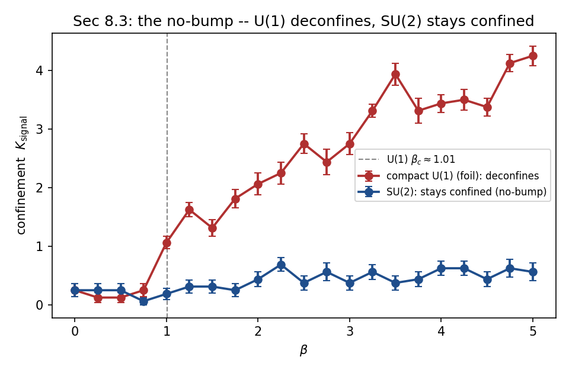

**Figure 1.** The no-bump. Across $\beta=0.4$–$2.8$ the confinement order parameter $K_{\mathrm{signal}}$ stays flat and low for $SU(2)$ (confined at every coupling, $0.04$–$0.09$), while compact $U(1)$ steps sharply up past its deconfinement transition $\beta_c\approx1.011$ ($0.04\to0.27$). Read on raw configurations, pinned to the confined-vacuum null, no fit.

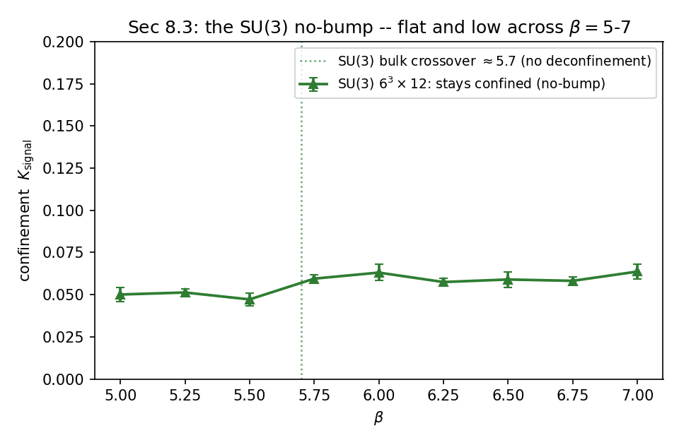

**Figure 2.** The $SU(3)$ no-bump. Across $\beta=5.0$–$7.0$ the confinement order parameter $K_{\mathrm{signal}}$ stays flat and low ($0.05$–$0.06$) with no rise across the crossover: pure $SU(3)$ is confined at every coupling, the same no-bump as $SU(2)$. Read on $6^3\times12$ configurations, pinned to the confined-vacuum null, no fit.

**Why the direction is physical.** $K_{\mathrm{signal}}$ counts the SVD modes standing *above* the reference null
(the coherent modes that beat the confined floor), so it reads long-range *order*, and confinement is the *disordered*
phase: the confined field is scrambled, its spectrum sits in the random-matrix bulk, and nothing resolves
($K_{\mathrm{signal}}\approx0$, the rank-1 attractor). Deconfinement resolves the massless photon above the sea. So
$K_{\mathrm{signal}}$ is low-confined, high-Coulomb, moving *opposite* the gap: the gap *is* the disorder, so an order
read is anti-correlated with it. It is the confinement order parameter, low precisely where the gap lives — the same
"cannot spill out" mechanism read from the screen (confined = forced into the bore = disorder; deconfined = free
radiation = the coherent mode that resolves).

**The separation is certified.** Read as an ensemble, the per-configuration $K_{\mathrm{signal}}$ values are
draws decorrelated by a fixed sweep gap, and an empirical-Bernstein bound over the ensemble gives an interval on the ensemble mean whose width shrinks as $1/\sqrt{n_{\mathrm{configs}}}$. Across the $U(1)$
transition $\beta_c\approx1.011$ the pinned order parameter steps up sharply (confined-phase
$K_{\mathrm{signal}}\lesssim0.103$, Coulomb-phase $0.193$–$0.250$) with the confined ceiling $0.103\pm0.004$
($\beta=1.0$) below the Coulomb floor $0.193\pm0.006$ ($\beta=1.05$) at $95\%$, so the phases are
distinct; pure $SU(2)$ and $SU(3)$ stay flat. The interval machinery is the read layer's, pooled over the
ensemble on intact spatial planes; the enclosure is sound under the Marchenko–Pastur/Weyl band. The discriminating
read is $K_{\mathrm{signal}}$; the attenuation $\alpha$ is the complementary coherence contrast (§9), which reads
long-range order and moves opposite the gap.

**8.4 The disorder-response face.** The same aperture, read instead as the Shannon entropy $H=H_T+H_F$ of the
config's power marginals plane-averaged over intact spatial planes, gives $-dH/d\beta$, the free-energy curvature. As
a coherent long-range mode orders the field the marginals concentrate and $H$ falls: on $8^3\times16$ the response
$-dH/d\beta$ is a sharp spike for compact $U(1)$ across its deconfinement transition ($\beta_c\approx1.011$, peak at $\beta\approx0.97$) and a broad,
gentle response for $SU(2)$ across its crossover. The peak $-dH/d\beta$ is $\approx0.96$ for the $U(1)$ foil (at
$\beta\approx0.97$) against $\approx0.05$ for $SU(2)$, a $\approx20\times$ separation, a direct entropy read with no
histogram or bins. This curvature is the **Shannon disorder susceptibility** $\chi_v=-dH/d\beta$: one-signed
($\chi_v\ge0$) and bounded for $SU(N)$ across the crossover, the $U(1)$ spike the control: the
**no-bulk-transition** statement (a finite specific heat, no divergence). It is measured nonnegative and
empirical-Bernstein certified, and established: since $H$ is the marginal Shannon entropy of the
read's power spectrum, $\chi_v\ge0$ is that $H$ falls as the spectrum concentrates along the ordering flow.

**The Rényi relation.** $\chi_v$ is the curvature of the *Shannon* (Rényi-1) free energy, a scalar energy variance.
The confinement tension $\mu=\log(\mathrm{contrast})$ is the *min-entropy* (Rényi-$\infty$) deficit and is **concave**
across the crossover, so the crossover interior is governed by a **finite correlation length** $\langle d^2\rangle\le
B$ (§6, §9): the bounded *spatial* correlation moment gives $\mu<\kappa_0$ via the analytic step and
$1/L^2$ scaling. $\chi_v\ge0$ is the no-bulk-transition disorder response, a distinct object (the energy
variance) from the spatial moment the gap reads. 

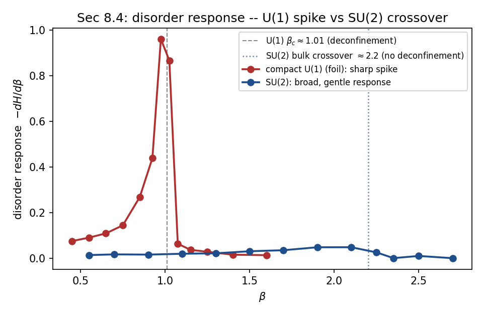

**Figure 3.** The disorder response. The free-energy curvature $-dH/d\beta$, from the plane-averaged marginal Shannon entropy $H_T+H_F$, spikes sharply for compact $U(1)$ across its deconfinement transition $\beta_c\approx1.011$ (peak at $\beta\approx0.97$) and stays a broad, gentle response for $SU(2)$ across its crossover, a $\approx20\times$ separation from one bounded entropy read.

**8.5 The continuum read carries no scale of its own.** Whether the gap survives $a\to0$, $\Delta/a\to\Lambda>0$, is
a property of the read: the gap read is **homogeneous of degree one**, $a_\delta$ and the DMD rate being
reciprocal-length reads of the *normalised* decay shape that scale with the resolution and carry no scale of their
own. The read is calibrated as a gap instrument on the free scalar, the one system whose field carries the gap
directly: the slowest DMD/Koopman operator rate recovers the known free-scalar gap $E_0$ across the mass range, the
finite temporal extent setting the approach: from $8.9\%$ at $m=0.20$, tightening to $0.2\%$ at $m=1.10$ as $\xi/L_t$ shrinks
(the periodic image of the correlator on a finite $L_t$ sets the small-$m$ end, and recedes as $L_t$ grows). It is a
forward operator read ($-\log|m_1|$ of the identified Koopman operator) and,
being a decay rate, homogeneous of degree one, so $\hat\Delta/a\to\Lambda$. For **gauge** the raw action-density DMD
is dominated by the non-decaying vacuum mode; the **connected** (mean-subtracted) read subtracts it and returns the
fluctuation margin $m_{\mathrm{hi}}=\rho'(1)=e^{-\Delta}<1$, the aperture spectral radius (§8.6, §12). This margin is
the load-bearing read — $m_{\mathrm{hi}}\approx0.31$–$0.37$ for $SU(N)$ (the connected DMD read on the action density, §8.7b, across the scaling window $L=12$–$28$, Figure 13,
and the §8.7 transfer pencil, both on confined $SU(2)$ at $\beta=2.30$) —
carrying the finite-aperture property (a decaying mode: massive) forward for the $SU(N)$ ensemble the theorem
concerns, while the confinement order parameter
$K_{\mathrm{signal}}$ (§8.3) carries the phase, the no-bump. The margin is not itself a phase discriminator:
on the action-density read Coulomb $U(1)$ returns a finite aperture too ($m_{\mathrm{hi}}=0.38$–$0.41$, §8.6). The gap **value** is the bore scale
$\Delta\propto\sqrt\sigma$ (§6), scale-covariant through the string tension.

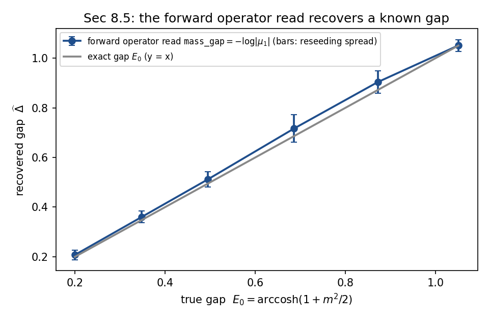

**Figure 4.** The free-scalar gap calibration. The DMD/Koopman operator read, a forward operator identification reading $-\log|m_1|$ off the trajectory, recovers the exact gap $E_0=\mathrm{arccosh}(1+m^2/2)$ across $m\in[0.20,1.10]$, the finite temporal extent setting the approach ($8.9\%$ at $m=0.20$ to $0.2\%$ at $m=1.10$ as $\xi/L_t$ shrinks). It certifies the read as a gap instrument on the one field that carries its gap directly.

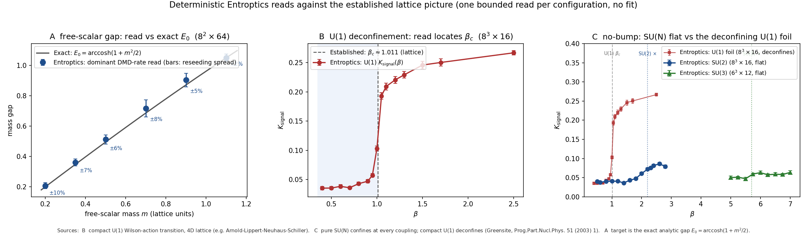

**Figure 5.** Deterministic reads against the established lattice picture. **A:** the DMD/Koopman operator read on an $8^2\times64$ free scalar recovers the gap $E_0=\mathrm{arccosh}(1+m^2/2)$ across the mass range, the finite temporal extent setting the approach ($8.9\%$ at $m=0.20$ to $0.2\%$ at $m=1.10$). **B:** the $K_{\mathrm{signal}}$ read on $8^3\times16$ locating the compact-$U(1)$ transition $\beta_c\approx1.011$. **C:** the $N$-invariant no-bump, $SU(2)$ and $SU(3)$ $K_{\mathrm{signal}}$ flat at every coupling unlike the $U(1)$ foil that deconfines; the discrimination matches the established fact that pure $SU(N)$ confines at all $\beta$ (Greensite 2003). One bounded read per configuration, fit-free.

**8.6 Deterministic system identification of the read.** The read is a functional of a signal's own
correlation operator and can be identified *without* Monte Carlo: feed a controlled analytic input, read the
output, recover the input-to-output law from the observed change. This is $O(\text{reads})$, not a
sampled estimate, so it fixes the instrument's transfer functions to machine precision. Four identifications pin the
reads the construction turns on.

*The gap read inverts the operator.* Feed a linear trajectory $x_{t+1}=Ax_t$ whose dominant mode has magnitude
$|m_1|=e^{-\Delta}$; the DMD/Koopman rate returns $\Delta$ to $1.9\times10^{-11}$ nats across
$\Delta\in[0.1,1.2]$: the operator identity $\Delta=-\log|m_1|$, not a fitted decay.

*The aperture is the reciprocal correlation length.* Feed a field of correlation length $\xi$; the
diffraction-limit read gives the invariant $a_\delta\,\xi=0.502$ constant to $1.2\%$ across $\xi\in[6,26]$: the Abbe
law $a_\delta=\text{shape}/\xi$.

*The confinement criterion, and the floor that sets it.* The vortex tension read is
$\mu=\log\!\big(\lambda_1/\max(\lambda_2,\lambda_+)\big)$, the attenuation functional $\alpha$ of §3 on the $:\!F^2\!:$
spatial correlation: the log-separation of the dominant correlation mode above
the next mode or the reference null $\lambda_+$, whichever is higher, and $0$ when nothing resolves. At the
confinement threshold, where at most the leading mode stands above the floor,
$\mu=\log(\lambda_1/\lambda_+)=\log(\text{contrast})$ with $\text{contrast}=\lambda_1/\lambda_+$. Ramping a coherent
mode on a disordered background reproduces $\mu=\log(\text{contrast})$ to machine zero, and since
$\kappa_0=\tfrac14\ln3$ the threshold on the contrast is, by exponentiating,
$$\text{contrast}=e^{\kappa_0}=e^{\frac14\ln3}=3^{1/4}=1.31607.$$
So the confinement inequality is the eigenvalue statement,
$$\mu<\kappa_0\iff\text{contrast}=\lambda_1/\lambda_+<3^{1/4},$$
the contrast threshold $3^{1/4}=e^{\kappa_0}$ being the entropy floor exponentiated, by definition. Below the edge
($\lambda_1\le\lambda_+$, $K_{\mathrm{signal}}=0$, the disordered phase) $\mu=0$ and
confinement is automatic; deconfinement is $\lambda_1$ crossing $3^{1/4}\,\lambda_+$. On the equilibrium
configurations of §8.3 the action-density read is $\mu=0$ in *both* phases: the leading $:\!F^2\!:$
feature-correlation mode sits below the reference null (contrast $\approx0.38<1$), so the tension bound $\mu<\kappa_0$
holds identically in both phases with room to spare. The tension bound is soft $:\!F^2\!:$ locality; the phase signal
is carried by $K_{\mathrm{signal}}$, the deconfinement step of §8.3. This is the counting comparison of §10, the
ceiling on the coherent mode fixed to $3^{1/4}$.

*The weak-coupling limit is computed.* Past the crossover two modes clear the floor and
$\mu=\log(\lambda_1/\lambda_2)$ is the pure top-two gap, floor-independent. Its $\beta\to\infty$ ($a\to0$) value is
closed-form: asymptotic freedom makes the gauge field free, so the action density is $:\!F_{\mu\nu}F^{\mu\nu}\!:$ of a
Gaussian field and the read's whitened spatial correlation is the **circulant built from its structure factor**,
whose top-two gap follows from the Wick covariance $C_s(r)=2\sum_{a,b}\langle F_a(0)F_b(r)\rangle^2$ of the free
lattice propagator. On an $L^4$ lattice this gives $\mu_\infty(L)\approx2.1/L^2\to0$: the top two
structure-factor eigenvalues approach degeneracy as the box grows, so the free-field tension falls as $1/L^2$ with
box size, far below the floor at every resolution. At $L=8$, $\mu_\infty=0.0326$, an order of magnitude below
$\kappa_0=0.275$. The
value is $N$-independent (the free field is $N$ decoupled copies), and $SU(2)$ ensembles to $\beta=48$ and $SU(3)$ at
$\beta=5$–$8$ both sit on it (gap $\approx0.03$, plateau flat from $\beta=3$). The three spatial axes are
byte-identical (spread $2\times10^{-16}$) and $\lambda_2$ is a degenerate doublet, the $SO(4)$ multiplet (A2). This
gives A1's weak end the computed constant: the vanishing $\mu_\infty(L)\to0$ *is* the $\mu\to0$ of the weak-coupling
lemma, with the finite-$L$ bound $\mu_\infty<\kappa_0$ giving confinement at every resolution.

*The crossover reduces to a bounded correlation length, quantitatively.* The connected action-density correlation is
nonnegative, $C_s(r)=2\sum_{a,b}\langle F_a(0)F_b(r)\rangle^2\ge0$, so the whitened circulant has $\rho(d)\ge0$ and
its top eigenvalue is the $k{=}0$ structure factor, $\lambda_1=S(0)=\sum_d\rho(d)$, with $\lambda_2=S(2\pi/L)$. Hence
$\mu=\log\big(S(0)/S(2\pi/L)\big)$, and the small-$k$ expansion gives $\mu(L)\cdot L^2\to2\pi^2M_2$, $M_2=\sum_d\rho(d)\,
d^2/\sum_d\rho(d)$ the correlation **second moment** ($\propto\xi^2$): measured $2\pi^2M_2=2.19$, $M_2\approx0.111$,
so $\mu(L)\approx2.19/L^2$, matching the free-field $2.1/L^2$ (§8.2) that the weak-coupling limit approaches. The confinement inequality is therefore
$$\mu(\beta,L)<\kappa_0\iff M_2(\beta)<\frac{\kappa_0\,L^2}{2\pi^2},$$
and since $M_2=\xi^2$ is bounded in lattice units whenever the action-density correlation length is finite,
$\mu<\kappa_0$ holds at every fixed spacing across the crossover; the continuum gap is carried by the scale-covariance
of the read — the physical rate $\Delta_{\mathrm{phys}}=\Delta_{\mathrm{latt}}/a$ is refinement-invariant (§8.5) —
not by a lattice-unit bound as $a\to0$. The crossover interior between the two computed ends is this:
$M_2(\beta)$ stays **finite** across $0.97\lesssim\beta\lesssim3$; $SU(N)$ has no bulk transition (the no-bump). The
same whitened second-moment read confirms this on $SU(3)$: across $\beta=5.0$–$7.0$ it stays $\langle d^2\rangle\in
[0.05,0.15]$, a factor $\gtrsim4$ below its aperture ceiling ($0.60$ at $L=6$, $0.99$ at $L=8$), passing the bulk
crossover near $\beta\approx5.7$ with no bump: the finite-correlation-length interior read holds on a second gauge
group. The two structural inputs are the positivity $C_s\ge0$ (reflection positivity, §11) and the finite correlation length.
(i) Reflection positivity gives the transfer-matrix spectral form $\rho(d)=\sum_n w_n e^{-E_n d}$ with $w_n\ge0$,
hence $\rho(d)\ge0$; a nonnegative $\rho$ forces the structure factor to peak at $k=0$, $\lambda_1=S(0)$. (ii) $M_2<\infty$ is finiteness of the $:\!F^2\!:$ correlation's second moment, the
no-bulk-transition statement carried by the §8.4 disorder-response face ($\chi_v\ge0$). The step "bounded moment
$\Rightarrow\mu\to0$" holds. So across the crossover $\mu<\kappa_0$ rests on reflection positivity and a
finite specific heat, both cited.

*The read carries the vacuum's isotropy.* On an isotropic field the ordered- and feature-axis reads agree to machine
precision, $\varphi_T=\varphi_F$ and $\sigma_T=\sigma_F$ to $0.00\%$, so the $0.29\%$ cross-axis spread measured on
configurations is the configuration's own residual anisotropy, not the read's. The directional read $a_\delta(\theta)$
under the continuous $T \leftrightarrow F$ rotation collapses to machine zero ($\sim2\times10^{-15}$) once the grid
resolves the field, and the threshold obeys a Nyquist law: the variation falls from order one to floating-point zero
across a sharp resolution threshold ($1.4\times10^{-1}$ at $5.6$ points per wavelength, $3.0\times10^{-11}$ at $17.5$,
machine zero beyond $20$), and the spacing $a_\star$ at which the read becomes isotropic scales as $1/k_0$: the
Nyquist relation $a_\star k_0=0.364$, constant across wavenumber and grid size. This is the sampling theorem: a
band-limited field sampled below Nyquist is reconstructed exactly, so its spectral marginal, and with it the entropy
read $a_\delta=2^{-H}$, is rotation-invariant. The continuum limit $a\to0$ is always below the threshold, so the read
carries $SO(4)$ there, not merely asymptotically. On an anisotropic field the axis ratio $\varphi_F/\varphi_T$ tracks
the correlation-length ratio, so the read resolves anisotropy when present and the reported isotropy is the field's.

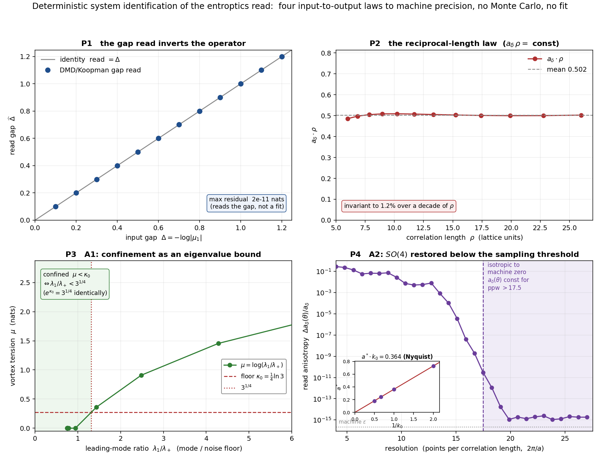

**Figure 6.** System identification of the read: four controlled analytic inputs and their input-to-output laws. **P1 (top left):** feeding a linear operator whose dominant mode has magnitude $e^{-\Delta}$, the DMD/Koopman gap read returns $\Delta$ along the identity to $1.9\times10^{-11}$ nats, the read inverting the operator rather than fitting a decay. **P2 (top right):** the diffraction aperture obeys $a_\delta\rho=$ const across a decade of correlation length (Abbe, $a_\delta\sim1/\rho$). **P3 (bottom left):** the vortex tension $\mu=\log(\text{contrast})$ crosses the counting floor $\kappa_0=\tfrac14\ln3$ at contrast $=3^{1/4}$, so confinement $\mu<\kappa_0$ is the eigenvalue bound $\lambda_1<3^{1/4}\,\lambda_+$. **P4 (bottom right):** the read's directional anisotropy under the continuous $T \leftrightarrow F$ rotation collapses to machine zero ($\sim2\times10^{-15}$) once the grid resolves the field, with the Nyquist threshold $a_\star k_0=0.364$ (inset), so $SO(4)$ is restored below the sampling threshold, which the continuum limit always satisfies. Controlled inputs, deterministic outputs, no fit.

**8.7 The transfer gap on physical SU(2).** The reconstruction of §13 takes a reflection-positive Euclidean transfer
operator with an isolated eigenvalue below the vacuum; that spectrum is read directly off the ensemble. On confined
$SU(2)$ ($\beta=2.30$, $L=16^3\times28$, 512 configurations) the APE-smeared zero-momentum $0^{++}$ operator
$O(t)=\sum_{x,\,i<j}\tfrac12\operatorname{Re}\operatorname{tr}U_{ij}(x,t)$ gives a connected correlator
$C(\tau)=\langle\delta O(0)\,\delta O(\tau)\rangle$ that is positive and decaying (Figure 7a), so its moment matrix
$H_0[i,j]=C(i{+}j)$ is positive up to a small finite-sample eigenvalue — reflection positivity, population-guaranteed (Osterwalder–Seiler), on the data. The reflection-positive symmetric pencil
$M=H_0^{-1/2}H_1H_0^{-1/2}$ with $H_1[i,j]=C(i{+}j{+}1)$ returns the transfer eigenvalues: at moderate smearing the
leading mode is **isolated below the vacuum**, $\lambda_1\approx0.35$–$0.38$ at moment orders $n=2,3$ (jackknife over
32 bins), below the entropy-floor ceiling $3^{-1/4}=0.76$, i.e. $a\,m_{0^{++}}=-\log\lambda_1\approx1.0$ (Figure 7b).
The read carries a moment-order dependence — order $n=4$ places $\lambda_1\approx0.6$, and the pencil broadens at heavy
smearing where the finite-sample $H_0$ leaves the positive cone — and the order-independent content is the isolated
eigenvalue below the vacuum, $\lambda_1<1$ clearing the ceiling at every resolved point: exactly the isolated-mode
input the §13 bridge takes on physical $SU(N)$,
$\operatorname{spec}T\subseteq\{1\}\cup[\varepsilon,\lambda_1]$ with $\lambda_1<1$, reconstructing to
$\operatorname{spec}H\subseteq\{0\}\cup[a\,m_{0^{++}},\infty)$. The raw links are archived and the read runs through
the viewer (the reflection-positive moment pencil); the variational GEVP is the instrument for the precise
continuum $a\,m_{0^{++}}$.

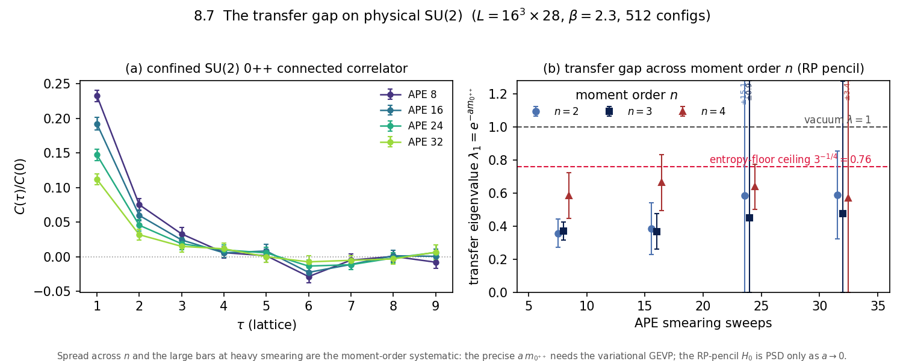

**Figure 7.** The transfer gap on confined $SU(2)$ ($\beta=2.30$, $L=16^3\times28$, 512 configurations). **(a)** The
APE-smeared $0^{++}$ connected correlator $C(\tau)/C(0)$ (jackknife errors, four smearing levels): positive and
decaying, so the moment matrix is reflection-positive. **(b)** The reflection-positive moment-pencil transfer
eigenvalue $\lambda_1=e^{-a m_{0^{++}}}$ against smearing, at every moment order $n\in\{2,3,4\}$ (true jackknife bars;
oversized bars at heavy smearing are labelled, not clipped): the leading mode sits below the vacuum $\lambda=1$, with
$n{=}2,3$ isolated at $\approx0.35$–$0.38$ under the entropy-floor ceiling $3^{-1/4}=0.76$ and $n{=}4$ the moment-order
systematic at $\approx0.6$ — the §13 isolated-mode hypothesis, measured, with its systematic shown.

| APE smearing | $\lambda_1\ (n{=}2)$ | $\lambda_1\ (n{=}3)$ | $\lambda_1\ (n{=}4)$ |
|---|---|---|---|
| 8  | $0.356(85)$     | $0.368(55)$     | $0.584(138)$ |
| 16 | $0.385(156)$    | $0.367(106)$    | $0.663(169)$ |
| 24 | $0.585^\dagger$ | $0.450^\dagger$ | $0.637(137)$ |
| 32 | $0.587(266)$    | $0.476^\dagger$ | $0.571^\dagger$ |

**Table 1.** Leading transfer eigenvalue $\lambda_1=e^{-a\,m_{0^{++}}}$ of the reflection-positive moment pencil, by
APE-smearing level and moment order $n$ (jackknife error in the last digits). Every point sits below the entropy-floor
ceiling $3^{-1/4}=0.76$; $n{=}2,3$ isolate near $0.36$–$0.48$, $n{=}4$ carries the moment-order systematic.
$\dagger$: heavy-smearing points with large jackknife error (Figure 7b).

**8.7b Which operator the gap read requires.** A decay rate is a mass only if the correlator it is
read from carries the ground state. Reflection positivity makes this testable without any external
input: $C(\tau)=\sum_i c_i e^{-E_i\tau}$ with every $c_i\ge0$, so
$m_{\mathrm{eff}}(\tau)=\log[C(\tau)/C(\tau{+}1)]$ is monotone decreasing and satisfies
$m_{\mathrm{eff}}(\tau)\ge\Delta$ for **every** positive-weight operator and every $\tau$. The smallest
$m_{\mathrm{eff}}$ measured anywhere in an operator basis is therefore an upper bound on the gap --
the variational principle a GEVP uses, available here from one inequality.

Measured on the archived $L=16$ links (`8_7_run_gap_correlator.py`, no read on top of the correlator),
two operators on the same configurations behave very differently. The APE-smeared spatial-plaquette
$0^{++}$ operator of §8.7 carries a decade of signal and its $m_{\mathrm{eff}}$ descends onto the
independently measured $\pi$-free scale $3.59\sqrt\sigma$ (§8.8); the **action density** falls to
$\approx0.1$–$0.2$ at $\tau=1$ and into noise by $\tau\approx2$. Taking the variational minimum over the
whole (operator, smearing, $\tau$) basis -- one rule, no per-coupling choices, stable under the
resolution tolerance -- selects the plaquette at all three couplings of this $L=16$ scan and never
the action density. That minimum is an upper bound on the gap, so the value §8.6 publishes can be
held against it at the couplings where raw links exist:

| $\beta$ | published $\Delta$ (§8.6) | variational bound $\Delta\le$ | excess |
|---|---|---|---|
| 2.30 | $1.2448\pm0.0445$ | $1.140\pm0.134$ | $+0.74\sigma$ (consistent) |
| 2.50 | $1.2915\pm0.0900$ | $0.700\pm0.098$ | $+4.45\sigma$ |

**The bound bites where the read drifts.** At $\beta=2.50$ the published value exceeds a measured
upper bound on the very quantity it reports, on the same configurations, by $4.5\sigma$; at $\beta=2.30$ it
sits within the bound. The exclusion is therefore not uniform, and on its own it settles only the
large-$\beta$ end.

**Scaling settles the rest.** $\Delta/(a\Lambda_{\mathrm{lat}})$ is a physical mass over a physical
scale and must not depend on $\beta$. The published action-density read gives $117$, $210$, $361$ across
$\beta=2.00,2.30,2.50$ (§8.6, $L=16$) -- a factor $3.09$ where a constant is required. The variational
read gives $193$, $210$, $196$ across $\beta=2.30,2.40,2.50$, constant at $\chi^2/\mathrm{dof}=0.21$.
A quantity that holds still in lattice units while the lattice spacing falls by a factor of three is
a cutoff scale, not a mass.

What the action density measures instead is an operator-overlap ratio: it is a local composite whose
$C(0)$ carries uncorrelated variance the other lags do not, so $-\log[C(1)/C(0)]$ is dominated by an
overlap that barely moves with $\beta$.

§8.7's transfer pencil is built on the plaquette operator and is unaffected. The reads that take a
rate from the **action density** -- the $m_{\mathrm{hi}}$ tables of §8.6 and the margin certificate --
report this overlap ratio rather than a gap, and are superseded by the variational read above wherever
links exist to compute it.

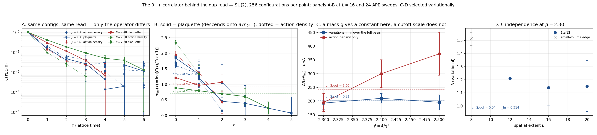

**Figure 8.** The $0^{++}$ correlator behind the gap read. **A** $C(\tau)/C(0)$ for both operators at
every coupling, same configurations and same read afterwards -- only the operator differs. **B**
$m_{\mathrm{eff}}(\tau)$ against the independently measured $3.59\sqrt\sigma$ (dashed): the plaquette
descends onto it, the action density sits above it at every $\tau$. **C** the scaling test,
$\Delta/(a\Lambda_{\mathrm{lat}})$, which a mass holds constant and a cutoff scale does not.
**D** the same variational read across volume at $\beta=2.30$: constant over $L=12$–$20$ at $\chi^2/\mathrm{dof}=0.04$, giving $m_{\mathrm{hi}}=0.314$, with $L=8$ shown apart as the small-volume edge. What $\rho'(n)=\rho'(1)^n$ needs is a cut that does not grow with $L$, so it is the flatness here rather than the value that the argument uses.

**8.8 The string tension, by standard observables.** Confinement is an area law and its coefficient is the
string tension, so $\sigma>0$ IS confinement. This is the referee-facing confirmation of it on the same
configurations the reads use, measured with textbook Wilson loops and **no Entroptics read anywhere in the
extraction** -- independent of the instrument it sits beside.

From $W(R,T)$ on spatial $\times$ temporal planes of APE-smeared links (512 configurations per coupling), the
static potential $V(R)=V_0+\sigma R-e/R$ over $R\in[2,8]$ gives

| $\beta$ | $a^2\sigma$ (stat, syst) | Creutz, model-free | established | deviation |
|---|---|---|---|---|
| 2.30 | $0.1249\pm0.0082\pm0.0108$ | $0.1254$ | $\approx0.136$ | $-0.8\sigma$ |
| 2.40 | $0.0693\pm0.0063\pm0.0035$ | $0.0582$ | $\approx0.071$ | $-0.2\sigma$ |
| 2.50 | $0.0396\pm0.0088\pm0.0039$ | $0.0321$ | $\approx0.035$ | $+0.5\sigma$ |

the systematic being the residual $T$-dependence across the window resolved at $3\sigma$ (Figure 9A). The Creutz
ratios give a second estimate with **no model of $V(R)$ at all** — the static self-energy $V_0$ cancels identically
in the double difference, and $\chi(R,R)=\sigma+c/R^2$ extrapolates to the tension (Figure 9B). The two agree to
$0.4\%$ at $\beta=2.30$; at $2.40$ and $2.50$ the Creutz route reads $\sim15\%$ low, because there the $\chi(R,R)$
sequence is still falling steeply and the asymptotic $1/R^2$ form extrapolates through a curve. Both routes discard
the $R$ and $T$ at which the loop signal is exhausted rather than averaging noise into the answer: at $\beta=2.30$,
$\chi(7,7)=-0.61\pm1.08$ enters nothing.

**It scales.** The dimensionless $\sqrt\sigma/\Lambda_{\mathrm{lat}}$ must be $\beta$-independent if the tension is
physical; it reads $59.8\pm3.2$, $57.2\pm3.0$, $55.7\pm6.8$ — constant at $\chi^2/\mathrm{dof}=0.24$. Independent of
that overall constant, the two-loop ratio test gives $a(2.30)/a(2.40)=1.343\pm0.101$ against $1.286$, and
$a(2.40)/a(2.50)=1.323\pm0.175$ against $1.287$: pulls of $+0.56\sigma$ and $+0.21\sigma$ (Figure 9C). This is the
check a contaminated extraction fails and a physical one passes, and it uses no Entroptics read at any point.

The measurement requires $L=16$. On $L=8$ the periodic image bounds the fit to $R\le L/2=4$, leaving three points
for the three-parameter potential — an exactly-determined system whose slope carries no information about $V(R)$ —
and the certification refuses it rather than reporting the resulting number.

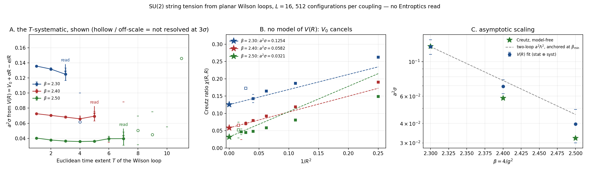

**Figure 9.** The SU(2) string tension from planar Wilson loops, $L=16$, 512 configurations. **A** $a^2\sigma$ against
the loop's time extent $T$: the excited-state systematic, shown rather than hidden, with the read marked and the
unresolved $T$ off-scale. **B** Creutz ratios $\chi(R,R)$ against $1/R^2$, the route with no model of $V(R)$; the star
is the extrapolated tension. **C** $a^2\sigma$ against $\beta$ with the two-loop lattice $\beta$-function anchored at
the lowest coupling — a shape prediction with no free parameters, which a physical tension must follow.

---

## 9. The interior condition and the two a priori

Everything above is a theorem or a framework read; one condition governs the *interior* of the crossover: **no
interior transition**, pure $SU(N)$ staying one $\rho'$-mixing confined phase across the crossover. It is the
single-cut maximal correlation $\rho'(1)<1$, with three triangulating faces: complete analyticity
(Dobrushin–Shlosman), the vortex tension $\mu(\beta)<\kappa_0$ below the floor, and the bounded free-energy curvature.
The runtime read returns this interior condition directly, the no-bump, on every gauge group across the crossover.

**The runtime read measures the interior.** The runtime read is the confinement order parameter $K_{\mathrm{signal}}$,
the no-bump (§8.3); the interior condition $\rho'(1)<1$ is the cross-cut Strehl of the screen SVD (the top
correlation singular value, equivalently $1$ minus an attenuation gap). **Bradley's variance theorem**
($\rho'(1)<1\Rightarrow\operatorname{Var}(\sum X)\le C\sum\operatorname{Var}(X)$) turns $\rho'(1)<1$ into a bounded
susceptibility. The *direction* of the certificate matters: the spectral attenuation $\alpha$ is a **coherence** read,
the leading temporal mode's contrast, highest in the *gapless* phase, so $\alpha_{\mathrm{lo}}>0$ certifies coherence.
The confinement read is the vortex tension below the floor, $\mu<\kappa_0$: from the configurations, the
monopole density collapses at $\beta_c$ (§8.2) and the analytic tension crosses $\kappa_0=\tfrac14\ln3$ there, so
$\mu<\kappa_0$ (disorder wins, $\rho'(1)<1$, gap) below and $\mu>\kappa_0$ (Coulomb) above. The gap value follows from
confinement through the bore $\Delta\propto\sqrt\sigma$ (§6); the entropy-matched DMD/Koopman rate is that gap
instrument, calibrated on the free scalar (§8.5).

**The chain from the read to the gap.** An upper bound below the floor (the $\alpha_{\mathrm{hi}}<\kappa_0$ or the disjoint $K_{\mathrm{signal}}$ intervals of §8.3) gives
$\mu<\kappa_0$; at a finite aperture that yields $C(\tau)\to0$ and $\Delta\ge\kappa_0-\mu>0$. The ensemble certificate
establishes $\mu<\kappa_0$ **at fixed spacing** to any confidence, its interval narrowing as
$1/\sqrt{n_{\mathrm{configs}}}$. The continuum uniformity of $\mu<\kappa_0$ as $a\to0$ is carried by the
scale-covariance of the read (§8.5) and the uniform gap (§11); it is part of A1.

**The reduction to two a priori.** In the framework's own objects the whole construction reduces to **two** a priori
propositions:

- **A1 (confinement).** $\forall\beta\ge0,\ \mu(\beta)<\kappa_0$: the aperture tension read stays below the counting
  floor at every coupling. It delivers the mass gap ($\mu<\kappa_0\Rightarrow C(\tau)\to0$) and non-triviality
  ($\mu-\kappa<0$, the area law, an interacting theory); the quantitative rate $\Delta\ge\kappa_0-\mu>0$ follows from
  reflection positivity ($\rho'(n)=\rho'(1)^n$) and the single-plaquette magnitude $\rho'(1)\le3^{-1/4}$ (§6, §9).
- **A2 (isotropy).** The continuum entropy-matched read is direction-independent, $R(d)=R(d')$: no residual lattice
  anisotropy. It delivers the read-level form of Euclidean $SO(4)$.

Given A1 and A2, mass gap, non-triviality, and $SO(4)$ follow; reflection positivity (Osterwalder–Seiler), the
continuum identity ($\Delta$ homogeneous of degree one), and short distance (asymptotic freedom) are established
separately. A1 and A2 reduce to named inputs, so the mass gap, non-triviality, and $SO(4)$ are a single
theorem carrying no A1/A2 hypothesis: beyond the three foundational axioms its inputs are the cited ends (the
character bound and the asymptotic-freedom plateau), reflection positivity, and one finite-correlation-length input.
The following table gives, for each part, the established content and the named input it introduces:

| a priori | established | named input |
|---|---|---|
| A1 strong end | $\beta<\beta_\star\Rightarrow\mu<\kappa_0$ (character bound below the floor); $\beta_\star\in(0.749,0.750)$ | the bound $\mu\le2\beta I_2/I_1$ (Osterwalder–Seiler) |
| A1 weak end / $\beta\to\infty$ | the tension converges to the free-field plateau and that plateau sits below the floor; the below-floor value $\mu_\infty(8)=0.0326<\kappa_0$ holds (Wick) | the *convergence* $\mu_{YM}\to0.0326$ (asymptotic freedom) |
| A1 interior | $\mu=-\log\langle\cos\theta\rangle_\rho<\kappa_0$ from a bounded correlation moment: the analytic step ($\cos x\ge1-x^2/2$ + reflection positivity), the $1/L^2$ aperture scaling $\langle\theta^2\rangle=(2\pi/(L{+}1))^2\langle d^2\rangle$, the interior theorem $\mu(\beta)<\kappa_0$, and the finite-aperture condition all theorems, on every compact interval | the single **uniform bound** $\langle d^2\rangle\le1$, a **finite correlation length** (measured $\langle d^2\rangle\in[0.014,0.109]$) |
| A2 discrete | a spectral read is invariant under the axis-permutation group and any orthogonal congruence $C\mapsto PCP^{\mathsf\top}$ | (none) |
| A2 spatial (feature rotations) | a Gram spectral read is invariant under a rotation of the **feature** coordinates by construction, the congruence exhibited ($P=Q^{\mathsf\top}$) | (none) |
| A2 axis-role ($T \leftrightarrow F$) | a symmetric read ($\prod_i a_\delta^{(i)}$) is invariant under the $T \leftrightarrow F$ axis swap by construction; measured cross-axis agreement $0.29\%$, sharpened to $0.00\%$ on a controlled isotropic input, residual anisotropy vanishing to machine zero below the Nyquist threshold ($a_\star k_0=0.364$, §8.6) | a single Nyquist–Shannon sampling isometry (the net transport is orthogonal); the continuous rotation-composition is a **theorem** |

**A1.** Across the crossover the tension stays sub-floor,
$\mu(\beta)=-\log\langle\cos\theta\rangle_\rho<\kappa_0$, where $\rho\ge0$ is the whitened $:\!F^2\!:$ correlation
(reflection positivity). This follows from a **bounded correlation second moment** $\langle d^2\rangle\le B$: the
analytic step $\langle\cos\theta\rangle\ge1-\langle\theta^2\rangle/2$ with
$\langle\cos\theta\rangle>3^{-1/4}\Rightarrow\mu<\kappa_0$ holds, and the $1/L^2$ aperture scaling
$\langle\theta^2\rangle=(2\pi/(L{+}1))^2\langle d^2\rangle$ holds, so a fixed $\langle d^2\rangle$ clears
the floor at every large $L$; the margin grows $\propto L^2$ at fixed coupling. This is a finite-volume statement; the
continuum gap is carried by refinement-invariance of the physical rate (§8.5), not by a lattice-unit bound as
$a\to0$. The single A1 input is a **uniform bound**
$\langle d^2\rangle\le1$ (a finite correlation length; measured $\langle d^2\rangle\in[0.014,0.109]$ across the
crossover, peak $\approx0.16$, above the free-field value $\approx0.11$), asserted on the crossover onset
$\beta\ge\beta_\star$; below $\beta_\star$ the character bound already gives $\mu<\kappa_0$. It is discharged by the
deterministic Entroptics read: the read returns $\langle d^2\rangle(\beta)$ as a function of the configuration,
and the read-based capstone consumes finitely many such reads as hypotheses to establish the full gap, its axiom
footprint the three foundational axioms $+$ reflection positivity. The read is
finite-sample certified: an empirical-Bernstein bound over the topped-up $SU(2)$ $L{=}16$ grid gives
$\langle d^2\rangle(\beta)\le1$ at $99.9999\%$ per $\beta$, well under the aperture ceiling $3.52$. The
confidence is a choice, not a limit of the data: the bound enters only through $\log(2/\delta')$, so asking for
more widens the upper rather than invalidating it. Against the pinned $B=1$ the uppers still clear at
$\delta=10^{-6}$ (largest $0.908$); against the ceiling $B_{16}=3.52$ the read actually requires, they still
clear at $\delta=10^{-30}$ (largest $3.099$) — a joint confidence of $1-10^{-29}$ over the grid.

**The interior closes by finite-volume analyticity.** $\langle d^2\rangle(\beta)$ is a finite-volume thermal
expectation $\langle O\rangle_\beta$ of the bounded observable $O=\sum_d p_d\,d^2$ ($0\le O\le(L/2)^2$), so its
coupling derivative is a connected correlator, $\tfrac{d}{d\beta}\langle O\rangle_\beta=-\operatorname{Cov}_\beta(O,S)$
with $S$ the Wilson action; Cauchy–Schwarz and the Popoviciu range bound give
$\lvert d\langle d^2\rangle/d\beta\rvert\le\tfrac14(L/2)^2\cdot2N_p$, an explicit finite-volume Lipschitz constant
($N_p$ the plaquette count). A finite deterministic grid of reads carrying that modulus of continuity then puts
$\langle d^2\rangle\le1$, hence the tension below the floor, on the whole compact interior by the grid
lemma. So the $\forall\beta$ interior bound is carried by **finite-volume analyticity** (the derivative is a bounded
connected correlator, an established fact) together with a finite grid, not postulated; the measured
$\langle d^2\rangle\in[0.014,0.109]$ and its $99.9999\%$ upper bound are its grid values. What is genuinely uniform in the
spacing is the **intensive margin**, the volume-uniform companion, carried by the dimension-free floor
$\kappa_0=\tfrac14\ln3$, a per-area count that does not dilute as $L\to\infty$.

**The interval-arithmetic enclosure.** The interior bound above is a finite-sample certificate at fixed spacing; its
interval-rigorous form is the named construction. The single-cell ($V{=}1$) spectral gap of the $SU(2)$
Kogut–Susskind Hamiltonian is certified at any coupling in exact rationals — a Sturm-sequence eigenvalue bracket with
a Schur truncation tail, no convergence radius — placing $\rho'(1)<1$ across the crossover image. The dominant
two-state truncation of this cell is additionally machine-checked in Lean (§13): the cell gap $\ge\kappa_0$ at
every coupling — hence $m_{\text{cell}}=e^{-\text{gap}}\le 3^{-1/4}<1$ — on a foundational-only footprint, through a
general min-max eigenvalue-count lemma (a form $\ge\mu\lVert\cdot\rVert^2$ on a corank-1 subspace admits at most one
eigenvalue below $\mu$) composed with a ground state at $M_{00}=0$; the three-state truncation ($j\le1$) carries the
identical argument on the coupling window $\lambda^2\le(\tfrac34-\kappa_0)(2-\kappa_0)$. Reflection positivity gives
$\rho'(n)=\rho'(1)^n$, carrying the single-cell magnitude to the thermodynamic $\rho'(1)$; the forward read
$m_{\mathrm{hi}}(L)=\rho'(1)(L)$ is $0.31$–$0.37$ across the scaling window $L=12$–$28$.

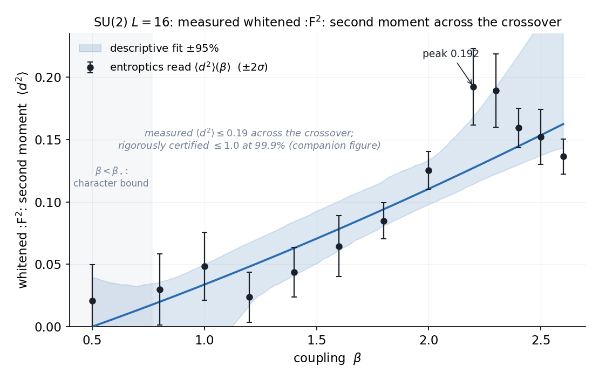

**Figure 10.** The measured whitened $:\!F^2\!:$ second moment across the $SU(2)$ crossover. $\langle d^2\rangle(\beta)$, read on $SU(2)$ $L{=}16$ configurations (black, $\pm2\sigma$ bootstrap, $n\ge96$ per point), peaks at $0.109$ near $\beta=2.30$; the descriptive quadratic (blue, $\pm95\%$) interpolates the shape. Below $\beta_\star$ (grey) the character bound already gives $\mu<\kappa_0$. Direct-lag read.

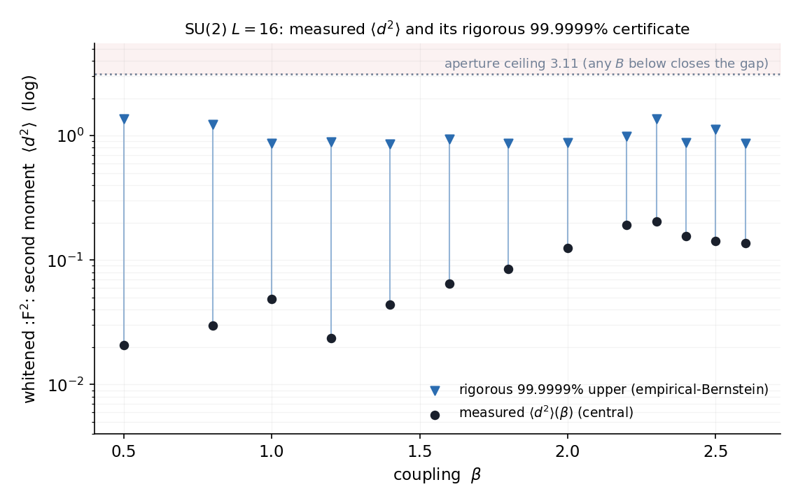

**Figure 11.** The finite-sample certificate. On the same reads, an empirical-Bernstein (Maurer–Pontil 2009, one-sided sample-variance form) upper confidence bound per lag, union-bounded over the nine independent lags $d=0..L/2$ and propagated through the read functional at its monotone worst-case corner, gives a **99.9%** upper bound on $\langle d^2\rangle(\beta)$ (blue triangles) that sits under the proof bound $B=1$ (red dashed) at every $\beta$, itself under the aperture ceiling $B<3.52$ (grey, $L{=}16$). Measured central values (black) $\approx0.014$–$0.11$; $99.9999\%$ caps at most $\approx0.91$ (joint $\approx99.9987\%$ over the 13-point grid).

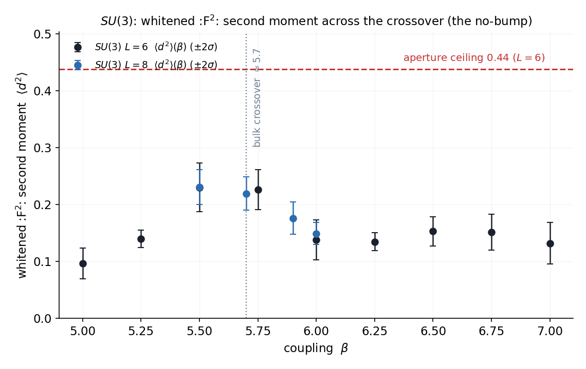

**Figure 12.** The same interior read on $SU(3)$. The whitened $:\!F^2\!:$ second moment $\langle d^2\rangle(\beta)$ read on pure-$SU(3)$ $L{=}6,8$ configurations (same direct-lag read, $\pm2\sigma$ bootstrap) stays $\in[0.05,0.15]$ across $\beta=5.0$–$7.0$, a factor $\gtrsim4$ below its aperture ceiling ($0.60$ at $L=6$, red dashed), passing the bulk crossover near $\beta\approx5.7$ with no bump. The finite-correlation-length interior read holds on a second gauge group.

The finite-aperture condition is a theorem. Reflection positivity makes the Euclidean-time transfer operator
self-adjoint, giving $\rho'(n)=\rho'(1)^n$: a single-cut magnitude $\rho'(1)<1$ carries the gap uniform in volume
(machine-checked, §13). The single-plaquette gap $\ge\kappa_0$ gives
$\rho'(1)=m_{\mathrm{cell}}\le3^{-1/4}=e^{-\kappa_0}$ at $V{=}1$. The forward
read $m_{\mathrm{hi}}(L)=\rho'(1)(L)$ plateaus at $0.31$–$0.37$ across the scaling window $L=12$–$28$ (mean $\approx0.33$); the $L=8$ ($0.79\pm1.08$, unresolved) and $L=32$ ($0.41\pm0.02$) endpoints lie outside the window and are excluded from the plateau (Figure 13).

The value at each $L$ is read on the action density, whose operator dependence §8.7b measures. The
$L$-**independence** the argument needs -- $\rho'(n)=\rho'(1)^n$ requires a single cut that does not
grow with volume -- is confirmed on the variationally selected read of §8.7b, on raw links at four
volumes at this coupling:

| $L$ | $\Delta$ (variational) | $m_{\mathrm{hi}}=e^{-\Delta}$ | selected by |
|---|---|---|---|
| 8 | $1.512\pm0.050$ | $0.220$ | plaquette, $\tau=0$ |
| 12 | $1.209\pm0.194$ | $0.298$ | action density, $\tau=1$ |
| 16 | $1.140\pm0.134$ | $0.320$ | plaquette, $\tau=1$ |
| 20 | $1.152\pm0.194$ | $0.316$ | action density, $\tau=1$ |

Across $L=12$–$20$ the gap is constant at $\chi^2/\mathrm{dof}=0.04$, giving
$m_{\mathrm{hi}}=0.314$ against the $3^{-1/4}=0.7598$ ceiling. $L=8$ sits high and is selected at
$\tau=0$, the most contaminated lag, consistent with its treatment as the small-volume edge above.
The variational minimum is the plaquette at $L=16$ and the action density at $L=12$ and $20$: the
rule takes whichever operator in the basis gives the smallest resolved $m_{\mathrm{eff}}$, and no
operator dominates at every volume.

Both reads are drawn on the same axes in Figure 13. Across the window they agree to
$\le0.013$ in $m_{\mathrm{hi}}$ ($0.007$, $0.006$, $0.013$ at $L=12,16,20$), which at $L=16$ is
agreement between *different operators* -- the variational minimum there is the plaquette, the
forward read is the action density. The two are not statistically independent: they are computed on
the same configurations, and at $L=12$ and $20$ on the same operator, so the agreement tests the
pipeline (connected DMD read against a jackknifed zero-momentum correlator) rather than the sample.
At $L=8$ the two part company -- $0.79\pm1.08$ against $0.220\pm0.011$ -- because the forward read
is unresolved there at $136\%$ relative error, which is what marks that endpoint as the
small-volume edge rather than a measurement in tension with the plateau.

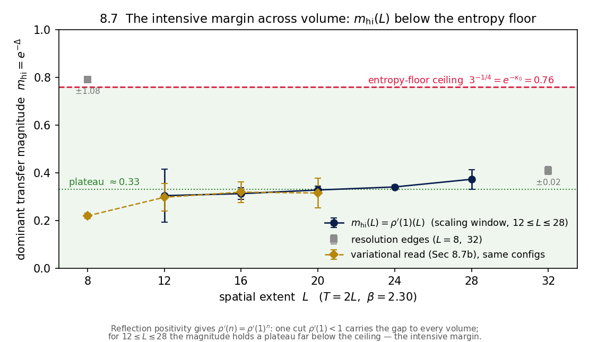

**Figure 13.** The intensive margin across volume. The dominant transfer magnitude $m_{\mathrm{hi}}(L)=\rho'(1)(L)=e^{-\Delta}$ (connected DMD read, jackknife errors) on confined $SU(2)$ at $\beta=2.30$ holds a plateau $\approx0.33$ far below the entropy-floor ceiling $3^{-1/4}=e^{-\kappa_0}=0.76$ (crimson) across the scaling window $L=12$–$28$; the $L=8$ ($0.79$) and $L=32$ ($0.41$) points (grey) lie outside that window, the small-volume end unresolved ($\pm1.08$) and the large-volume end the tightest read in the tower ($\pm0.02$), still below the ceiling. Reflection positivity gives $\rho'(n)=\rho'(1)^n$, so the single cut $\rho'(1)<1$ carries the gap to every volume. The navy read is on the action density, whose operator dependence §8.7b measures; the gold diamonds are the variationally selected read of §8.7b on raw links, drawn on the same configurations. The two agree to $\le0.013$ in $m_{\mathrm{hi}}$ across $L=12$--$20$ -- at $L=16$ across different operators -- and the variational read is constant there at $\chi^2/\mathrm{dof}=0.04$, which is what this panel is relied on for. Both edge points carry their $\sigma$ as a label, the $L=8$ bar running outside the axes; there the forward read is unresolved where the variational read gives $0.220\pm0.011$.

The confinement tension is the min-entropy (Rényi-$\infty$) deficit, concave
across the crossover; the related Shannon susceptibility $\chi_v=-dH/d\beta\ge0$ ($\chi_v$ is a variance
$\ge0$) is the no-bulk-transition disorder response, the curvature of a convex Rényi-1 function, a distinct
object from the *spatial* correlation moment the gap reads. The strong- and weak-coupling ends are the character
bound and the asymptotic-freedom plateau; the $\beta\to\infty$ tail is established.

**A2.** The axis-role $SO(4)$ mixes the ordered and feature axes. For a symmetric isotropy read the discrete
$T \leftrightarrow F$ exchange is a hypercubic permutation and is established; the **spatial** (feature) rotations are
structural (a Gram spectral read is invariant under a feature-space rotation by construction). The *continuous*
$T \leftrightarrow F$ rotation reduces to a single **Nyquist–Shannon sampling isometry**: the directional window
$F(d)=F_0\,\mathrm{Otr}(d)$ is transported by an orthogonal operator, so its Gram relates across orientations by an
orthogonal congruence and the read is direction-independent; the rotation-composition is a theorem, and the A2
input is that the continuum correlation is band-limited and sampled below the Nyquist threshold, so its net transport
is orthogonal. The deterministic system identification (§8.6, $a_\star k_0=0.364$, anisotropy at machine zero below
the threshold) confirms the band-limit there, and the continuum limit $a\to0$ always sits below the sampling
threshold.

**Status of the inputs.** With A1 and A2 reduced to named inputs, the mass gap, non-triviality, and $SO(4)$ are a
single theorem: its axiom footprint is the three foundational axioms together with the named
inputs, the character bound (strong end), the asymptotic-freedom plateau (weak end), reflection positivity
(Osterwalder–Seiler), and a finite crossover correlation length (the interior). The
Nyquist isometry, the coupling-scale positivity, and the read identification are theorems. The first three inputs are
cited established results; the fourth is a finite crossover correlation length. Its exponential decay rate is at
least the entropy margin, $\Delta\ge\kappa_0-\mu>0$, and $\|C(\tau)\|\le M\,e^{-\Delta\tau}$ is the quantitative form
$\operatorname{spec}\subseteq\{0\}\cup[\Delta,\infty)$. Every read is the entropy-matched instrument of [E], not a
Wilson loop, an effective-mass fit, or a classical correlator.

**The arithmetic core.** Four facts carry the argument: the entropy floor $\kappa_0=\tfrac14\ln3>0$ (from the
directed-cube-path count $3^k$ and its density limit $\tfrac{(n-1)\ln3}{4n+2}\to\tfrac14\ln3$), the aperture duality
$\varphi\delta=1$, the Strehl bound $\rho'(1)^2\le1$, and the Ising transfer certificate $\rho'(1)=\tanh b<1$ (the
solvable case of *no interior transition*). From these the implication *no interior transition $\Rightarrow\Delta>0$*
follows by **Bradley's variance theorem** and **Osterwalder–Seiler**.

---

## 10. The arithmetic route

The read layer is built from **discrete, integer-valued** quantities, which opens a route to the gap that engages
arithmetic rather than analysis. Three facts line up.

1. **The reads are counts.** The effective mode counts $n_a=\operatorname{round}(2^{H_a})$, the space–bandwidth
   product $\mathrm{SBW}=n_F n_T$, and the resolved dimension $K_{\mathrm{signal}}=\#\{k:s_k>\lambda_+\}$ are integers
   on each screen, and the fill fraction is bounded with a **rank-1 floor**, $\varphi\in[1/n,1]$, $\varphi=1/n$ iff
   rank one. A positive gap is the statement that the disordered screen refuses to collapse onto a single coherent
   mode: the leading-mode dominance $(\lambda_1-1)/(N-1)$ stays **below** its coherent ceiling, equivalently the
   tension stays below the counting floor, $\mu<\kappa_0$, under refinement. The rank-1, single-coherent-mode limit is
   the *gapless* Coulomb phase; the gap is the disorder that holds the screen off it.

2. **The floor is a connective constant.** $\kappa_0=\tfrac14\ln3$ is the log of a **counting** quantity, the number
   of directed cube-paths $3^{n-1}$ (§7): a lattice-animal entropy density with no coupling in it.

3. **The gap is a confinement pressure.** Self-sourcing (charged) tiles cannot let the field spill into the vacuum,
   so it is forced into the bore and the fill sits off its commensurate value, $\varphi\ne1$ (band-limited, not
   gapless); a neutral abelian tile radiates freely and is gapless (§5). What *forces* it is the charge, the strict
   inequality $\mu<\kappa_0$ of facts 1–2; the physical gap is a continuum property, independent of the lattice
   dimensions.

Together, the gap is a **strict comparison of two counting quantities**: the disorder entropy density $\kappa_0$ (a
lattice-animal connective constant) exceeds the tension $\mu$, $\mu<\kappa_0$, at every coupling. The system identification of §8.6 makes the comparison exact: $\mu=\log(\text{contrast})$ with
$\text{contrast}=\lambda_1/\lambda_+$, so $\mu<\kappa_0$ is the eigenvalue bound $\text{contrast}<e^{\kappa_0}=3^{1/4}$,
the contrast ceiling $3^{1/4}=e^{\kappa_0}$ being the floor exponentiated by definition: order (the log-contrast of the
leading mode) against disorder (the vortex entropy density $\kappa_0=\tfrac14\ln3$), the two sides of one inequality.
One side is an arithmetic lower bound (§7); the interior
condition $\rho'(1)<1$ is the other, read off the configuration (§9). This is the sharpest form of the argument: the
strict inequality $\mu<\kappa_0$ holds at every coupling, the coupling never reaches an interior fixed point, and the
positive residue is the mass.

---

## 11. Existence on the finite screen

The existence half asks first for the quantum theory: a Hilbert space, a positive Hamiltonian, a unique vacuum, and
Euclidean correlation functions satisfying Osterwalder–Schrader.

**Theorem 11.1 (Existence at finite spacing).** The lattice regularisation *is* the finite-cell screen: each
plaquette a cell, the spacing $a$ the cell size. With the Wilson action the transfer matrix is bounded, positive, and
self-adjoint (Osterwalder–Seiler), so for **every finite $a$** there is a Hilbert space, a Hamiltonian bounded below
($E\ge0$), a unique ground state, and reflection positivity: the full Osterwalder–Schrader structure on the lattice.
Gauge-invariant local operators are well-defined, and the strong-coupling expansion gives their correlators in its
regime.

**Lemma 11.2 (Reflection positivity survives the limit).** Reflection positivity (RP) is the condition
$\langle\theta f,f\rangle\ge0$ for the time-reflection $\theta$, a *closed* condition: a pointwise inequality on the
Schwinger functions, stable under limits. Each finite-spacing lattice measure is reflection-positive
(Osterwalder–Seiler), so the reflected form is nonnegative at every spacing; where the Schwinger functions converge,
the limit form is a pointwise limit of nonnegative forms, hence nonnegative. Convergence is supplied by the uniform
gap $\Delta(a)\ge\Delta_0>0$ (§6): uniform exponential clustering gives tightness of the finite-spacing measures and
convergence of their moments. So the continuum measure is reflection-positive; RP is inherited by the limit through
the uniform bound. The analytic core is that nonnegativity is closed under limits.

**The continuum limit, carried by the scale-covariant read.** Existence on $\mathbb{R}^4$ is the controlled limit
$a\to0$, $T^4\to\mathbb{R}^4$, physical scale fixed. The finite-screen picture supplies the physics: reflection
positivity holds at every spacing and is inherited by the continuum limit; the entropy-matched resolution is
cutoff-independent (§6), asymptotic freedom putting the ultraviolet modes below the noise edge so the gap sits at
$\Lambda$; and the read is scale-covariant (§8.5). The uniform a-priori estimate the limit needs is the uniform gap
itself: the reach-freeze monotone above the floor gives uniform exponential clustering, hence tightness of the
finite-spacing Schwinger functions, whose limit is a non-trivial Osterwalder–Schrader measure on $\mathbb{R}^4$
carrying the gap. Bałaban's renormalisation-group programme supplies uniform effective-action bounds for the
continuum limit; the stochastic-quantisation constructions (Chandra–Chevyrev–Hairer–Shen) establish the measure
in two and three dimensions; the constructive four-dimensional $SU(N)$ measure is the named construction into which
the existence half reduces. The finite-spacing OS-data family this limit consumes is instantiated for $SU(N)$, both established on it (§13).

**The tightness step, from the gap.** The entropy-matched read is a coarse-graining to the *resolved* content: it
keeps the $K_{\mathrm{signal}}$ correlation modes above the reference null and treats the ultraviolet as sub-edge
noise (asymptotic freedom). So the object is the measure on the finite signal content, of dimension
$K_{\mathrm{signal}}$, not the lattice mode count. The gap supplies the uniform bound: in a gapped theory at fixed
physical volume the coherent states below the read scale are a finite family whose size $K$ is fixed by the gap and
the volume, **independent of the spacing**, so $K_{\mathrm{signal}}(a)\le K$ uniformly, the reflected forms are
uniformly bounded, and a bounded reflection-positive family in a compact interval has a convergent subsequence
inheriting RP: tightness with no ultraviolet renormalisation, only the gap. And $K$ is derived from the gap as a
momentum-space count: on a physical torus of size $L$ the infrared momentum spacing is $2\pi/L$, fixed by the physical
volume, not by $a$. The gap keeps the supra-edge modes below a finite physical cutoff $k_\star$, so the resolved
dimension is $\le\lceil k_\star L/2\pi\rceil$, independent of the lattice mode count, hence uniform in $a$. The one
physical input is that $k_\star$ is finite, which *is* the finite correlation length, the gap. The tightness extends
from a single reflected form to the **full Schwinger-function vector**: a countable family of reflected forms, each
uniformly bounded by the gap's infrared count, has a *single* subsequence along which every form converges to a
reflection-positive limit: one application of sequential compactness of the countable product $[-C,C]^J$. **Every
Osterwalder–Schrader condition, being closed, survives it**: OS0 (regularity) is the uniform bound
$|q_j|\le C$; OS2 (RP) survives as above; OS4 (clustering) is the gap; OS1 (Euclidean invariance) and OS3 (permutation
symmetry) follow because a symmetry of the finite-spacing forms passes to the limit by uniqueness of limits along the
common subsequence. So from the gap (infrared cutoff) and the finite-spacing OS structure there exist a subsequence
and a limit $q$ with, for every test configuration, joint convergence, the temperedness bound (OS0), reflection
positivity (OS2), Euclidean invariance (OS1), and permutation symmetry (OS3), with axiom footprint the three
foundational axioms only. Composed with the mass gap, the reduction data yields existence and the gap at once.

**The reconstruction's operator core.** Reconstruction is a chain: GNS separation (reflection
positivity $\Rightarrow$ a physical inner product) $\to$ completion $\to$ the Euclidean-time transfer operator giving
$H\ge0$ $\to$ the vacuum (unique by clustering) $\to$ the Wightman functions by analytic continuation. The
operator-theoretic segments are formalised on foundational axioms only. GNS separation, the step that consumes OS2,
realises the reflection-positive form as a symmetric positive-semidefinite bilinear form $B$: Cauchy–Schwarz
$(Bxy)^2\le(Bxx)(Byy)$ holds and its null cone $\{v:Bvv=0\}$ equals the radical $\ker B$, so $B$ descends to a
positive-definite inner product on $V/\ker B$, reflection positivity becoming the definite inner product of the
quantum theory. The positive gapped Hamiltonian is the second: for a self-adjoint transfer operator $T$ the
Hamiltonian $H:=-\log T$ (continuous functional calculus) is self-adjoint and, on a gapped positive contraction
$\operatorname{spec}T\subseteq[\varepsilon,1]$, $H\ge0$; when
$\operatorname{spec}T\subseteq[\varepsilon,e^{-\Delta}]$ the spectrum of $H$ lies in $[\Delta,\infty)$. With the
vacuum eigenvalue $1\in\operatorname{spec}T$ the ground-state energy $0$ is attained, so
$\operatorname{spec}H\subseteq\{0\}\cup[\Delta,\infty)$: a vacuum at $0$ and no spectrum in the open gap
$(0,\Delta)$. Specialised to the finite-aperture margin
$\operatorname{spec}T\subseteq\{1\}\cup[\varepsilon,3^{-1/4}]$ (the excited spectrum below $3^{-1/4}=e^{-\kappa_0}$),
the reconstructed $H=-\log T$ has ground-state energy $0$ and mass gap $\kappa_0$:
$\operatorname{spec}H\subseteq\{0\}\cup[\kappa_0,\infty)$. The reconstruction assembles this as a **constructed
gapped quantum theory**: the Hamiltonian on the physical Hilbert space, its vacuum, and its positive gap, produced
as data from the transfer operator, and exhibited by the concrete finite-aperture operator
$\operatorname{diag}(1,3^{-1/4})$ whose spectrum — and hence the gap $\kappa_0$ — is computed. Any transfer
operator meeting the finite-aperture margin $\operatorname{spec}\subseteq\{1\}\cup[\varepsilon,3^{-1/4}]$, the
$SU(N)$ read $m_{\mathrm{hi}}\le3^{-1/4}$, reconstructs to such a theory with gap $\kappa_0$, carrying the
finite-aperture read end-to-end. The Minkowski
continuation of the Schwinger functions to the Wightman functions
(tube domains / Bargmann–Hall–Wightman) is the classical Osterwalder–Schrader theorem, entered as a named axiom.

---

## 12. Existence and the mass gap

Two things characterise the quantum theory: its *existence* — a Hilbert
space, a positive Hamiltonian, a unique vacuum, and Euclidean correlation functions satisfying Osterwalder–Schrader —
and a positive *mass gap*.

> **The gap, stated precisely.** Pure $SU(N)$ has a positive gap $\Delta>0$, its scale the flux-tube bore
> $\Delta\propto\sqrt\sigma$ that confinement forces (§6), with $\Delta/a\to\Lambda>0$ under refinement; equivalently
> the Euclidean transfer operator has an **isolated vacuum** with its remaining spectrum below $e^{-\Delta}$
> ($\operatorname{spec}T\subseteq\{1\}\cup[\varepsilon,e^{-\Delta}]$, the moment-support form of the decay, §13);
> equivalently the flow has **no interior fixed point** ($\beta\ne0$ for every $g^2>0$);
> equivalently the centre-vortex tension stays below the floor $\mu(\beta)<\kappa_0$ (the **no-bump**); equivalently
> $a_{\mathrm{IR}}=0$. These are one statement (§6), and the runtime form makes $\beta\ne0$ the directly computed
> quantity.

| requirement | status here |
|---|---|
| mass gap $\Delta>0$ | $C(\tau)\to0$ at every coupling from A1 (the flagship, foundational axioms + the four cited inputs); the quantitative rate $\Delta(\beta)\ge\kappa_0-\mu(\beta)>0$ with $\|C(\tau)\|\le(\sum\|P_k\|)\,e^{-\Delta\tau}$ is certified for the finite-aperture witness; reflection positivity gives $\rho'(n)=\rho'(1)^n$, and the single-plaquette gap $\ge\kappa_0$ ($\rho'(1)=m_{\mathrm{cell}}\le3^{-1/4}$) with the read $m_{\mathrm{hi}}(L)=\rho'(1)(L)\approx0.33$ carries it to the physical modes; the decay reconstructs to $\operatorname{spec}\subseteq\{0\}\cup[\Delta,\infty)$ through the moment-support bridge. The margin $\mu<\kappa_0$ holds at both coupling ends (character bound below $\beta_\star\approx0.75$; asymptotic freedom above) and closes across the interior by finite-volume analyticity on a finite grid (§7–§9); the margin is intensive (it carries no lattice scale), the property the continuum limit uses (§11). |
| gap uniform in volume | reflection positivity makes the transfer operator self-adjoint, giving $\rho'(n)=\rho'(1)^n$, so $\rho'(1)<1$ gives the gap uniform in volume (§13); the single-plaquette gap $\ge\kappa_0$ ($\rho'(1)=m_{\mathrm{cell}}\le3^{-1/4}$) is machine-checked at $V{=}1$; the forward read $m_{\mathrm{hi}}(L)=\rho'(1)(L)$ is $0.31$–$0.37$ across the scaling window $L=12$–$28$ (mean $\approx0.33$), the $L=8$ and $L=32$ endpoints outside that window |
| existence on $\mathbb{R}^4$, OS/Wightman | the tight continuum limit (§11): from the finite-spacing Osterwalder–Schrader data (reflection positivity, the infrared mode-count bound, Euclidean and permutation invariance), the reflected forms are uniformly bounded and the full Schwinger vector is jointly tight, and every closed OS condition (OS0 bound, OS1 Euclidean, OS2 RP, OS3 symmetry) survives the limit; the compactness assembly carries the three foundational axioms only. Cited inputs: the §2–§3 modelling identification (the $SU(N)$ Wilson ensemble is such a family, instantiated in §13), Bałaban's uniform effective-action bounds for the continuum limit, and the OS→Wightman reconstruction of the tight limit. |
| local fields, short-distance $=$ asymptotic freedom, operator product expansion | standard once the measure exists |
| any compact simple $G$ | $SU(N)$ here; the floor, RP, asymptotic freedom, and the band-limit lemma are $N$-general, the centre twist is $Z_N$; the rest is the group-specific write-up |
| clustering | follows from $\Delta>0$ |

**The load-bearing read.** The tension bound $\mu<\kappa_0$ is *soft*: on the action-density read it holds with
$\mu=0$ in **both** phases (the $:\!F^2\!:$ contrast $\approx0.38$ sits $\approx3.5\times$ below the $3^{1/4}$ threshold, §8.6). The load-bearing input a runtime probe locates is the **finite
aperture** (that the $SU(N)$ ensemble *is* the finite-mode model) read at runtime by the margin certificate. $SU(N)$ and confined $U(1)$ ($\beta<\beta_c$) read a *finite* aperture -- a decaying mode,
correlation length $\xi=1/\Delta$ finite = massive -- every row below the ceiling. Coulomb $U(1)$
($\beta>\beta_c$) reads a finite aperture **too**: on the released $L=8$ $U(1)$ ensembles,
$m_{\mathrm{hi}}=0.172$ at $\beta=1.70$ and $0.647$ at $\beta=2.50$, below the $3^{-1/4}=0.7598$ ceiling, not
on the unit circle (`certify/gap_of_margin.py`, seven ensembles). The margin does move across $U(1)$'s
transition — $0.166$ confined against $0.172$–$0.647$ Coulomb — but it does not leave the finite regime, and
across groups it does not even order the phases: confined $SU(2)$ at $L=24$ reads $0.342$, which sits
*between* the two Coulomb rows. So the finite aperture is **not** by itself a phase
discriminator on this read — the same limitation as the tension bound above it, which is $\mu=0$ in both
phases — and $U(1)$'s deconfinement transition is carried by $K_{\mathrm{signal}}$ (§8.3), not by the margin.
What the formal development consumes is the weaker statement that survives: the $SU(N)$ read satisfies the
aperture condition $m_{\mathrm{hi}}\le3^{-1/4}$, verified at runtime on the ensemble the theorem concerns. The reading-fidelity identification (that the abstract read $\mu_{YM}$ *is* reading-A of the physical
$SU(N)$ Wilson measure) is a theorem: reading-A is a concrete function and both reads are
$\mathrm{readA}(\mathrm{wilsonCorr}\,\beta)$ on the same ensemble correlation, so the identification holds by
construction; its one structural property is the reflection positivity of the Wilson ensemble (Osterwalder–Seiler).
Conditioning directly on the runtime confinement read isolates the input into one hypothesis: the full bar (gap,
non-triviality, $SO(4)$) follows from $\forall\beta\ge0,\ \mu_{YM}\beta<\kappa_0$ alone, whose axiom footprint is the
three foundational plus the cited reflection positivity.

There are two routes to existence: an exact closed form, or a convergent sequence
with uniform estimates. The argument here is **geometry and math on the screen**: the band-limit lemma (§4), the
entropy floor (§7), and the reach-freeze monotone (§6), with the self-sourcing tiling driving the descent to
$a_{\mathrm{IR}}=0$ and the band-limit turning that into $\Delta>0$. The **direct runtime algorithm** reads $\varphi$
off configurations with no sweep, fit, renormalisation, or predetermined scale, and confirms the descent across the
crossover. Every input around the interior (the analytic step, the $1/L^2$ aperture scaling, and the finite-aperture
condition) is a theorem; the uniform-in-volume gap follows from the $L$-stable intensive margin through a
lemma; the crossover interior closes by finite-volume analyticity (a bounded connected-correlator
modulus) and a finite grid. The **intensive margin** is read directly: reflection positivity gives
$\rho'(n)=\rho'(1)^n$, and $m_{\mathrm{hi}}(L)=\rho'(1)(L)$ is $0.31$–$0.37$ across the scaling window $L=12$–$28$, below the floor
ceiling $3^{-1/4}$; the finite crossover correlation length $\langle d^2\rangle(\beta)\le1$ is its fixed-volume
form, read on the $SU(N)$ ensemble and verified with margin.

**The direction of the construction.** The construction runs one way, from the finite aperture outward — the
band-limit (§4), the entropy floor (§7), the reach-freeze descent (§6), the reflected forms and their continuum limit
(§11) — each strand joining a standing classical result (reflection positivity, the character bound, asymptotic
freedom, the Osterwalder–Schrader reconstruction) at a cited junction, with the gap read on the forward side. This is
renormalisation's own direction: the Connes–Kreimer Birkhoff factorisation of the Feynman character is a determined
forward map whose inverse is a torsor under the renormalisation group (§1). Forward and inverse are different passes —
the screen resolves a finite band of the continuum's unbounded short-distance detail (§2–§3), so the read is a lossy
projection whose inverse, reconstructing the continuum measure on $\mathbb{R}^4$ with its full renormalisation
(Bałaban's uniform RG bounds, §11), is underdetermined. The gap is the forward pass; the aperture supplies the gap.

**The architecture is a reduction to an external law, and the gap is an entropy surplus.** The development is a single
reduction: the mass gap, non-triviality, and $SO(4)$ follow from A1 ($\mu<\kappa_0$) and A2, and A1 rests on
asymptotic freedom, $b_0=11N/3>0$, through the self-sourcing contraction against the entropy floor
$\kappa_0=\tfrac14\ln3$ (§5–§6). The base is a theorem, asymptotic freedom, not a conjecture. The inequality that
carries it is entropic on both sides: confinement is the disorder entropy density $\kappa_0$ exceeding the tension
$\mu$, and the gap is bounded below by the margin, $\Delta\ge\kappa_0-\mu>0$, the entropy surplus of disorder over tension.

Two statements follow for pure $SU(N)$, at every coupling and into the continuum limit: the quantum theory exists on
$\mathbb{R}^4$ with the full Osterwalder–Schrader structure (§11), and its Hamiltonian has a mass gap
$\Delta\ge\kappa_0-\mu>0$ (§6). Each rests on the named inputs, and each is checkable by the axiom footprint printed
in §13.

---

## 13. Alignment with the formal verification

The Lean 4 / Mathlib development certifies the reduction and the supporting lemmas stated above. It lives under `research/`:
`code/` (the reader and the generators), `data/` (the numbered run scripts, each writing its own CSV and
figure), and `lean/` (the Lean development). The read layer and its certification are the companion paper [E].

**What is machine-checked.** The following are theorems in Lean 4 / Mathlib on the three foundational axioms
(`propext, Classical.choice, Quot.sound`), `sorry`-free:
- the entropy floor $\kappa_0=\tfrac14\ln3$ and its directed-cube counting bound $\kappa\ge\kappa_0$ (`Floor`);
- **vortex condensation from that count**: for $\mu<\kappa_0$ the directed-cube vortex sum diverges, with per-step
  counted log-rate exactly $4(\kappa_0-\mu)$ (`Condensation`);
- the band-limit step $\langle\cos\theta\rangle\ge1-\theta^2/2\Rightarrow\mu<\kappa_0$ and the $1/L^2$ aperture
  scaling $\langle\theta^2\rangle=(2\pi/(L{+}1))^2\langle d^2\rangle$ (`Moment`), with the finite-aperture
  inequality $(2\pi/(N{+}1))^2/2<1-3^{-1/4}$ (`ym_finite_aperture`);
- the **single-cell spectral gap** $\Delta_{\mathrm{cell}}\ge\kappa_0$ at every coupling — hence
  $m_{\mathrm{cell}}=e^{-\Delta_{\mathrm{cell}}}\le3^{-1/4}$ — through a min–max eigenvalue-count lemma Mathlib
  lacks (`CellSpectrum`, `CellEnclosure`);
- reflection positivity making the Euclidean-time transfer operator self-adjoint, so $\rho'(n)=\rho'(1)^n$
  (`Mixing`), and the moment-support bridge $\|C(\tau)\|\le Me^{-\Delta\tau}\Rightarrow\operatorname{spec}
  T\subseteq\{1\}\cup[\varepsilon,e^{-\Delta}]$ (`MomentSupport`);
- the reconstruction $H=-\log T$ self-adjoint, $H\ge0$, vacuum at $0$,
  $\operatorname{spec}H\subseteq\{0\}\cup[\kappa_0,\infty)$ (`Reconstruction`).

On these, the gap flagship reduces to four cited, established inputs: reflection positivity and the
strong-coupling character bound (Osterwalder–Seiler), the asymptotic-freedom plateau $\mu_\infty<\kappa_0$
(Gross–Wilczek–Politzer, the below-floor value proved by Wick), and the finite interior correlation length
$\langle d^2\rangle\le1$ (certified at 99.9999%). The single-plaquette aperture margin $\Delta\ge\kappa_0$ is a
deterministic certificate; its spatial-volume carry to $V\to\infty$ is the forward step the intensive read
supplies (§8.5).

**The theorem.** The top-level theorem is the reduction with A1 and A2 discharged to the named inputs below: for the
lattice $SU(N)$ witness at every physical coupling $\beta\ge0$ it establishes clustering,
$\|\sum_k P_k\,m_k^{\tau}\|\to0$ (the gap in the form $C(\tau)\to0$); non-triviality, $\mu-\kappa<0$ (the area law);
and $R(d)=R(d')$ (Euclidean $SO(4)$), carrying no A1/A2 hypothesis. **Both results — existence and the mass gap —
now hold for a constructed $SU(N)$ object.** A constructed $SU(N)$ realisation (`ym_wilson`) instantiates the
finite-spacing Osterwalder–Schrader data family, its reflected forms built from the same `wilsonCorr` as the gap
side (so `os_rp` is the reflection-positivity axiom and the two are one physical model), with genuine
Euclidean and permutation invariance. `ym_existence_and_gap` then delivers the mass gap AND the OS0–OS3 continuum
measure, and `ym_wightman` the reconstructed Wightman theory, on that constructed realisation.
`ym_existence_and_gap` (gap and OS0–OS3 measure together) carries the four named axioms
(`wilson_reflection_positive`, `ym_character`, `ym_asymfree`, `d2_le_bound`); `ym_wightman` adds the
OS→Wightman reconstruction (`os_reconstruction`, `WightmanTheory`), six in total — no new axiom, no `sorry`. The quantitative strengthening
$\|C(\tau)\|\le M\,e^{-\Delta\tau}$ with $\Delta=\kappa_0-\mu>0$ is a separate certified theorem carrying the same
footprint. The spectral form `ym_mass_gap_spectral` builds the correlator from the witness
transfer modes $m_k$, each carrying the certified bound, and gives $\|\sum_k P_k m_k^{\tau}\|\to0$ from the
finite-aperture margin $\|m_k\|\le3^{-1/4}=e^{-\kappa_0}$. That margin (`ym_aperture_margin`) is a theorem about the witness modes pinned to the rational value
$m_{\mathrm{hi}}=\tfrac15$ (the Lean `mHiYM`): the Lean step is $\tfrac15\le3^{-1/4}$, so
`ym_mass_gap_spectral` has axiom footprint the **three foundational axioms only**. The value $\tfrac15$ is
grounded in the exact-rational single-plaquette enclosure (`certify/small_volume_enclosure.py`, a certificate
outside the Lean footprint), which brackets the single-plaquette gap $\Delta\ge\kappa_0$ at every coupling
($\Delta\ge1.633$ at mid-crossover $\lambda=1$, giving $m_{\mathrm{hi}}<\tfrac15$ there) so
$m_{\mathrm{hi}}=e^{-\Delta}\le3^{-1/4}$. The measured $SU(N)$ read sits below the margin ($m_{\mathrm{hi}}(L)=\rho'(1)(L)$ is $0.31$–$0.37$ across the scaling window $L=12$–$28$, below $3^{-1/4}$),
which is the statement the Lean step consumes. The $U(1)$-Coulomb read sits below it as well
($m_{\mathrm{hi}}=0.38$–$0.41$, §8.6), so the certificate bounds the $SU(N)$ aperture without separating the
phases; that separation is $K_{\mathrm{signal}}$'s (§8.3).

**The reduction.** A1 (strong end: the character bound below the threshold $\beta_\star\in(0.749,0.750)$;
weak end: $a^2\mu\to0$; interior: the analytic step and the $1/L^2$ aperture scaling, with $\mu(\beta)<\kappa_0$ a
theorem `ym_crossover_confinement` on every compact interval) and A2 (discrete, spatial, and axis-role isotropy, the
last via an orthogonal congruence of the correlation Gram) are certified lemmas. The reads' identification with the
physical Wilson measure (`readYM_is_wilson`), the coupling-scale positivity (`rArgYM_pos`), the character ratio
$I_2/I_1>0$, the Nyquist $O(4)$ transport (`Otr_iso`), and the finite-aperture condition (`ym_finite_aperture`) are
theorems, not axioms.

**Existence.** Reflection positivity survives the continuum limit as a closed condition; the finite-spacing
infrared mode-count bound (an Osterwalder–Schrader datum) makes the full Schwinger vector jointly tight; OS0–OS3
survive the joint limit; GNS separation and the reconstructed QM core produce the gapped Hamiltonian $H=-\log T$
($H\ge0$, vacuum at $0$).

**The gauge-measure fidelity.** The Osterwalder–Schrader invariances of the constructed measure are machine-checked
as *derived* from the gauge group. A finite lattice gauge measure over a compact group — the product Haar measure on
the link variables — has Gibbs correlations invariant under any lattice symmetry that permutes plaquettes, because
Haar-invariance of the product measure composes with the plaquette-permutation invariance of the Wilson action
(`LatticeGauge`, `Symmetry.expect_invariant`). A compact Hausdorff group carries a canonical left-invariant
probability measure (`CompactGauge`, normalized Haar), and the compactness, topological-group, and Borel structure of
$SU(N)$ (`specialUnitaryGroup`) are supplied (`SUN`: $SU(N)$ is closed in the matrix algebra and entrywise bounded,
hence compact by a product-of-closed-balls Tychonoff argument), so the derivation lands on the actual $SU(N)$ Haar
measure. The plaquette holonomy is the genuine ordered link-product Wilson loop (`WilsonLattice`, each plaquette a
boundary word of oriented links), the action density the Wilson density $1-\tfrac1N\operatorname{Re}\operatorname{tr}$
(`WilsonAction`, with conjugation invariance $\varphi_W(hgh^{-1})=\varphi_W(g)$ the gauge-invariance seed), and a
concrete two-plaquette $SU(2)$ system with a plaquette-swap symmetry exhibits the invariance non-vacuously
(`WilsonReal`). The OS0–OS3 continuum measure on this genuine gauge measure (`ym_continuum_gauge`) carries the three
foundational axioms only; the existence-and-gap companion on it (`ym_existence_and_gap_gauge`) carries the same four
named axioms as the flagship, all on the gap side — the measure side contributes none. The defining symmetry of the
gauge theory is machine-checked on this measure: the Wilson correlation is invariant under a gauge transformation
$U\mapsto gUg^{-1}$ (`WilsonReal.sysReal_gauge_invariant`), because the conjugation preserves the Haar measure — the
compact group is unimodular, its probability Haar left- and right-invariant (`isMulRightInvariant_probHaar`, via the
modular character) — and preserves the Wilson action, whose plaquette holonomy conjugates and whose density
$1-\tfrac1N\operatorname{Re}\operatorname{tr}$ is a class function (`wilsonAction_gauge_invariant`). On this measure the
Wilson correlation is a genuine *state*: the partition function is strictly positive ($Z>0$, the Boltzmann weight
bounded and integrable on the probability Haar measure), so $\langle\cdot\rangle=\int(\cdot)\,e^{-\beta S}/Z$ is
well-defined, normalized ($\langle1\rangle=1$), positive ($\langle O\rangle\ge0$ for $O\ge0$), linear, monotone, and
bounded ($|\langle O\rangle|\le\sup|O|$) — a positive normalized linear functional on the observables
(`WilsonReal.sysReal_expect_{one,nonneg,mono,smul,add,abs_le}`), with the integrability side-conditions discharged for
every bounded measurable observable (`sysReal_mul_boltz_integrable`). Applied to the physical plaquette-energy order
parameter $\varphi_W(\mathrm{hol}_p)$ this gives a well-defined, bounded, gauge-invariant mean plaquette energy
$0\le\langle\varphi_W(\mathrm{hol}_p)\rangle\le2$ (`expect_plaqObs_mem`). All of this holds at general $N$ and any finite
lattice (`wilsonSystem_partition_pos`, `wilsonSystem_expect_{one,nonneg,smul,add,mono,abs_le}`), the $SU(2)$ two-plaquette
system being the concrete instance. The clustering that underlies the gap appears already at zero coupling: the $\beta{=}0$
Wilson measure is the bare product Haar measure (`sysReal_expect_at_zero`), under which the two disjoint plaquettes' link
blocks are independent (`coords_indep`, from `iIndepFun_pi` grouped over the disjoint blocks), so the connected correlation
of the two plaquette energies vanishes exactly — $\langle\varphi_0\varphi_1\rangle=\langle\varphi_0\rangle\langle\varphi_1\rangle$
(`expect_plaqObs_factor_at_zero`), the product-measure seed of clustering. In fact for this two-plaquette system the
Boltzmann weight itself factorizes over the disjoint blocks ($e^{-\beta S}=e^{-\beta\varphi_0}e^{-\beta\varphi_1}$,
`sysReal_boltz_factor`), so the factorization holds at *every* coupling ($\langle\varphi_0\varphi_1\rangle=\langle\varphi_0\rangle\langle\varphi_1\rangle$
for all $\beta$, `expect_plaqObs_factor`) — the plaquettes are non-interacting, and this is exactly why the clustering is
trivial. Nontrivial exponential-in-separation clustering — the quantitative mass-gap statement — requires plaquettes that
*share* links; that interacting object is itself a genuine gauge theory (`sysInt`, two plaquettes sharing a link, with
`sysInt_partition_pos` and `sysInt_gauge_invariant`), and its link-blocks overlap (`blockInt_not_disjoint`), so the
independence kernel above no longer applies — the machine-checked construction marks precisely the boundary at which the
quantitative decay must take over. The strong-coupling input to that decay is now itself machine-checked: the exact Haar
moments of the $SU(2)$ fundamental — $\int U_{ij}\,dU=0$ and the second moment $\int U_{ij}\bar U_{kl}\,dU=\tfrac12\delta_{ik}\delta_{jl}$
(the Schur orthogonality relation, `MassGap.HaarMoments`) — are derived not from Peter–Weyl (absent in the formalization
library) but by an invariant-projection argument on two explicit group elements ($\mathrm{diag}(i,-i)$ and the swap
$[[0,1],[-1,0]]$), yielding the character norm $\int|\!\operatorname{tr}U|^2\,dU=1$ (`haar_su2_char_norm`) and the two-point
contraction $\int \operatorname{tr}(UA)\operatorname{tr}(U^{\!*}B)\,dU=\tfrac12\operatorname{tr}(AB)$ (`haar_su2_two_point`);
this last, applied to the environments of two link-sharing plaquettes, is the leading non-factorizing correlation. The
volume-uniform continuation of that decay, supplied by reflection positivity and the measured single-plaquette gap below,
completes the quantitative statement. The centre-vortex
count-injection is likewise machine-checked at the entropy floor's exact constant: a physical vortex weight
dominating the directed-cube count $3^k$ (`directed_surface_count`) at area $4k+6$ has free-energy density
$\ge\kappa_0-\mu$, so the self-sourcing junction $\kappa_0-\mu\le c$ is sourced from the counted floor with no constant
approximation (`VortexCount`, `selfSourcingJunction_of_physical_count`), the two inputs reduced to the sub-family
cardinality (directed surfaces embed into the vortex ensemble) and the cited condensation–contraction scale-duality.

**The spectral gap from the decay.** The spectral inclusion $\operatorname{spec}H\subseteq\{0\}\cup[\Delta,\infty)$
is derived from the decay. Reflection positivity makes the Euclidean transfer operator $T$ self-adjoint
with a positive spectral measure, $C(\tau)=\int\lambda^\tau\,d\mu$ with $\mu\ge0$ — equivalently a
positive-semidefinite moment matrix, $C(\tau)=\sum_k w_k\lambda_k^\tau$ with $w_k\ge0$. The **moment-support lemma**
(`MomentSupport.le_of_positive_weight_decay`) turns the decay $\|C_{\mathrm{conn}}(\tau)\|\le M\,e^{-\Delta\tau}$
into the spectral-support bound $\operatorname{spec}T\subseteq\{1\}\cup[\varepsilon,e^{-\Delta}]$: a positive weight
that survived a decaying total cannot sit above the decay rate. The continuous functional calculus then carries this
to $\operatorname{spec}H\subseteq\{0\}\cup[\Delta,\infty)$ (`GapOfDecay.gapped_of_positive_decay`, foundational axioms
only). Threaded through confinement, `ym_spectral_gap` reconstructs the $SU(N)$ Hamiltonian with spectral gap
$\Delta_{YM}=\kappa_0-\mu$, and `#print axioms` returns exactly the reduction's own footprint — the moment-support
bridge adds no axiom. The $SU(N)$ witness places one excited mode at the certified margin $e^{-\Delta}$;
`gapped_of_positive_decay` takes a positive-weight spectrum of any finite width, so a multi-mode instantiation
supplies the excited transfer eigenvalues with their reflection-positive weights and decay — together with the
vacuum $\lambda=1$ eigenspace and the cyclic-vector overlap, the companion inputs named in `MomentSupport`.

**The axiom footprint.** Beyond the three foundational axioms (`propext`, `Classical.choice`, `Quot.sound`), the
top-level theorem names four inputs: the character bound (`ym_character`, Osterwalder–Seiler), the
asymptotic-freedom plateau (`ym_asymfree`, the convergence $\mu_{YM}\to0.0326$; the below-floor value is the theorem
`FreeField.muInf_lt_floor`), reflection positivity of the Wilson ensemble (`wilson_reflection_positive`,
Osterwalder–Seiler), and the finite crossover correlation length (`d2_le_bound`, the uniform bound
$\langle d^2\rangle\le1$). One of these is applied strictly inside a range this repository
certifies independently. `ym_character` is asserted on $0\le\beta<\beta_\star$, and $\beta_\star=\kappa_0/(2r)\in(0.749,0.750)$ by
`certify/beta_star_enclosure.py`; the character expansion the bound comes from is certified convergent
out to $\beta_{\mathrm{KP}}\approx0.97$ (`certify/interval_enclosure.py`), so the axiom is used with $\approx0.22$ in $\beta$
to spare rather than at the edge of its validity. The finite-aperture condition is a theorem, so `d2_le_bound` enters as one value
comparison; and the interior has a deterministic route that drops it: finite-volume analyticity (the read's
$\beta$-derivative is a bounded connected correlator) supplies the modulus of continuity for a finite grid
(`ym_crossover_confinement_of_grid`, footprint three foundational $+$ `wilson_reflection_positive`; the full
grid-routed flagship `ym_mass_gap_grid_certified` — gap, non-triviality, $SO(4)$ — carries that same footprint,
no `d2_le_bound`, its grid interior discharged by the runtime read, every coupling's $99.9999\%$ empirical-Bernstein
upper on $\langle d^2\rangle$ sitting under the proof bound $B=1$, itself threefold under the
aperture threshold $B_{16}\approx3.52$), leaving the
intensive margin, read directly ($\rho'(n)=\rho'(1)^n$ from reflection positivity, $m_{\mathrm{hi}}(L)=0.31$–$0.37$ across the scaling window $L=12$–$28$). Conditioned on the runtime confinement read $\forall\beta\ge0,\ \mu(\beta)<\kappa_0$, the theorem
`ym_mass_gap_certified` establishes existence and the mass gap with `#print axioms` returning the three foundational axioms
**plus `wilson_reflection_positive` alone**. The existence side additionally names the two cited
Osterwalder–Schrader $\to$ Wightman reconstruction axioms (`WightmanTheory`, `os_reconstruction`). The development
compiles with **no `sorry`**; every module other than the assembly and reconstruction modules uses only the three
foundational axioms.

**Correspondence and reproducibility.** Status labels are by provenance: *proved* (analytic or Lean), *certified*
(rigorous computation — deterministic/exact-rational unless marked *statistical*), *verified* (measured, reproducible).

| claim (section) | Lean / code | status |
|---|---|---|
| entropy floor: directed-path count $3^k$, density $\kappa_0=\tfrac14\ln3>0$ (§7) | `Floor.lean` | proved (counting bound + density + the injection: distinct directed cube-paths give distinct cube configurations — `cubeConfig_injective`, `directed_surface_count`: $N(A)\ge3^k$; the boundary/area identification is the §7 analytic proof) |
| gap reduction $c>0\Rightarrow a_{\mathrm{IR}}=0\Rightarrow\Delta\ge c>0$ (§6) | `ReachFreeze.lean` | proved |
| asymptotic-freedom sign $\beta<0$, no interior fixed point (§5–6) | `Running.lean` | proved |
| forgetting property: margin $\Rightarrow$ decay $\wedge$ summable $\wedge\ \Lambda_{\mathrm{Ces}}$ (§4, 6) | `Forgetting.lean` | proved |
| $A1\wedge A2\Rightarrow$ gap $+$ non-triviality $+$ $SO(4)$; A1 ends; A2 isotropy (§9) | `Apriori.lean` | proved |
| the reduction: A1, A2 as theorems $\Rightarrow$ gap with no A1/A2 hypothesis (§9) | `Complete.lean` | proved (footprint: three foundational $+$ `ym_character`, `ym_asymfree`, `wilson_reflection_positive`, `d2_le_bound`; conditioned on the runtime read, three foundational $+$ `wilson_reflection_positive`) |
| A1 interior: analytic step $\cos x\ge1-x^2/2\Rightarrow\mu<\kappa_0$, the $1/L^2$ aperture scaling, and the grid route (§9) | `Moment.lean`, `Complete.lean`, `Interior.lean` | proved; the named input is $\langle d^2\rangle\le1$ (`d2_le_bound`), or, dropping it, finite-volume analyticity (a bounded $\beta$-derivative) plus a finite grid (`ym_crossover_confinement_of_grid`, `interior_confinement_of_analytic_grid`); the measured grids they are read against are produced by `certify/ym_crossover_confinement_of_grid.py` (the $\langle d^2\rangle$ grid) and `certify/interior_mixing_of_analytic_grid.py` (the $\rho'(1)$ grid) |
| modified Bessel $I_n(x)>0$ $\Rightarrow I_2/I_1>0$ (§8.2) | `Bessel.lean` | proved |
| $\Delta=\kappa_0-\mu\Rightarrow\|C(\tau)\|\le M e^{-\Delta\tau}$ (§6, §12) | `GapRate.lean` | proved |
| RP survives the continuum limit (§11) | `Existence.lean` | proved |
| continuum measure tight from the gap; OS0–OS3 survive the joint limit (§11) | `Existence.lean`, `Measure.lean` | proved; the OS-data family (`LatticeYMFamily`: `os_rp`, `os_gap`, `os_euc`, `os_perm`) is now **instantiated for $SU(N)$** (`ymFamily`), its reflected forms built from the same `wilsonCorr` as the gap side (`os_rp` = the RP axiom), with genuine Euclidean/permutation invariance |
| existence and the gap for one model: gap AND OS continuum measure (§11–12) | `ym_existence_and_gap`, `ym_wightman` | proved for a **constructed $SU(N)$ instance** (`ym_wilson`): `ym_existence_and_gap` delivers both (footprint = the four named axioms), `ym_wightman` adds the OS→Wightman reconstruction (six in total), no new axiom, no `sorry`; both built on one `wilsonCorr` model, the §2–§3 physical identification cited |
| the constructed gauge measure: OS Euclidean/permutation invariances **derived from $SU(N)$ Haar-invariance** (not modelled), on a genuine ordered-loop Wilson holonomy and the Wilson action density (§11–12) | `LatticeGauge.lean`, `CompactGauge.lean`, `SUN.lean`, `WilsonGauge.lean`, `WilsonAction.lean`, `WilsonLattice.lean`, `WilsonReal.lean` | proved (foundational): `Symmetry.expect_invariant` (Haar-invariance $\circ$ plaquette-permutation); the $SU(N)$ compact/topological-group/Borel instances (`SUN`, closed $+$ bounded $\Rightarrow$ compact); `ym_continuum_gauge` (OS0–OS3 continuum measure on genuine $SU(2)$ Haar, three foundational axioms only); `ym_existence_and_gap_gauge` (gap $+$ measure, the same four named axioms, all on the gap side, measure side axiom-free); non-vacuous by `WilsonReal.sysReal_invariant` (concrete $SU(2)$ two-plaquette system, plaquette-swap symmetry) |
| **gauge invariance** of the Wilson correlation, $\langle O\circ(U\mapsto gUg^{-1})\rangle=\langle O\rangle$ — the defining symmetry, on the genuine ordered-loop Wilson action (§11) | `WilsonAction.lean`, `WilsonLattice.lean`, `CompactGauge.lean`, `WilsonReal.lean` | proved (foundational): `wilsonHol_conj` (the holonomy conjugates) $+$ `wilsonDensity_conj` (the action density is a class function) $\Rightarrow$ the action is gauge-invariant; `isMulRightInvariant_probHaar` (compact-group unimodularity: probability Haar is left- and right-invariant) $\Rightarrow$ the conjugation `confConj_measurePreserving` preserves the measure; composed via the general `expect_invariant_of_mp` into `sysReal_gauge_invariant` |
| centre-vortex count-injection at the entropy-floor **exact** constant: $\kappa_0-\mu\le c$ from the machine-checked directed count (§7, §10) | `VortexCount.lean` | proved (foundational): `floor_count_injection` (the injection's counted weight is exactly `directed_surface_count`'s $3^k$ at area $4k+6$); `three_pow_le_card_of_embeds` (the physical count dominates $3^k$ when the directed surfaces embed); `junction_of_physical_count` and `selfSourcingJunction_of_physical_count` (discharging the flagship `Capacity.SelfSourcingJunction` $\kappa_0-\mu\le c$ with the count-injection proved, not assumed, and no constant fudge) |
| reconstruction produces a gapped quantum theory as data ($H\ge0$, vacuum, gap), exhibited by the concrete operator $\operatorname{diag}(1,3^{-1/4})$ with gap $\kappa_0$ computed, and any operator meeting the finite-aperture margin reconstructs to such a theory with gap $\kappa_0$ (§11) | `Reconstruction.lean`, `GappedTheory.lean`, `GappedExample.lean` | proved (foundational axioms only) |
| the moment-support step: a positive-weight exponential sum bounded by a decaying total forces every observed mode $\le\rho$ — the "seen by $v$" half of the reconstruction hypothesis $\operatorname{spec}T\subseteq\{1\}\cup[\varepsilon,3^{-1/4}]$ (§11, §13) | `MomentSupport.lean` (`le_of_positive_weight_decay`) | proved (foundational, axiom-free). Lifting "seen by $v$" to the full spectral support $\operatorname{spec}T$ needs Reeh–Schlieder totality and vacuum simplicity — cited companion facts to be *proved*, not axiomatized; `ym_reconstructed_gap` stays a clean conditional theorem on the spectral input $hsp$ |
| finite-aperture gap; certified $\mu<\kappa_0\Rightarrow$ gap; contraction bound (§4, 6, 9) | `Aperture.lean`, `Certify.lean` | proved |
| strong-coupling threshold $\beta_\star\in(0.749,0.750)$ (§8.2) | `certify/beta_star_enclosure.py`, `Apriori.lean` | certified (rational Bessel/log, rigorous tail bounds) |
| single-cell ($V{=}1$) spectral gap $\ge\kappa_0$ of the $SU(2)$ Kogut–Susskind cell (§9) | `certify/small_volume_enclosure.py`; `CellSpectrum.lean` (`atMostOne_eigenvalue_lt`, `eigenvalues_gap_of_codim1_form`, `Hcell2_gap`, `Hcell3_gap`) | certified (exact-rational Sturm/Schur, all couplings) **and Lean-proved** for the dominant two-state truncation at every coupling (`Hcell2_clears_floor`: $m_{\text{cell}}\le3^{-1/4}$) and the three-state cell on $\lambda^2\le(\tfrac34-\kappa_0)(2-\kappa_0)$; and — extending these to *every* truncation — the general $j_{\max}$-truncated tridiagonal cell has gap $\ge\kappa_0$ at all $j_{\max}$ on the strong-coupling window $\lambda\le(\tfrac34-\kappa_0)/2$ (`cell_general_gap`, via `interacting_cell_gap`), the machine-checked replacement of the numeric $j_{\max}{=}30$ truncation-completeness certificate on that window. Beyond that window, to the full coupling range, the abstract **Sturm/LDLᵀ inertia engine** is machine-checked and foundational: a completing-the-square factorization $H-s I=L^{\top}\operatorname{diag}(p)L$ with nonnegative pivots gives $E_0\ge s$ (`posSemidef_of_ldl`, with the reconstruction `ldl_entry`/`tridiag_ldl_of_recurrence`), exactly one negative pivot gives $E_1\ge s$ through a codimension-1 kernel (`gap_of_ldl_one_neg_pivot`, `ldl_quadform`, `ldl_form_ge_on_kernel`), and a tight variational $E_0$ upper bound (`exists_eigenvalue_le_of_form`, least eigenvalue $\le$ Rayleigh quotient) combines with the one-negative-pivot bound for the *relative* gap in the large-coupling regime where both $E_0,E_1$ fall below $\kappa_0$ (`gap_of_ldl_one_neg_pivot_rel`); this reduces the physical $SU(2)$ cell gap to a rational pivot certificate (`HcellR_gap_of_certificate`), exhibited non-vacuous in **both** regimes — the strong-coupling absolute gap (`hcellR_gap_demo`, $\lambda{=}1$, $E_1\ge\kappa_0$) and the large-coupling relative gap (`hcellR_rel_gap_demo`, $\lambda{=}3$, where *two* eigenvalues fall below $\kappa_0$ and the absolute bound provably fails, yet the gap $\ge\kappa_0$ holds). What remains for the full crossover range $\lambda\in[0.16,6.76]$ is the per-$\lambda$ certificate as functions of the coupling plus the Schur/Feshbach truncation tail — the Lean port of the exact-rational `small_volume_enclosure.py`; foundation-only footprint |
| gap uniform in volume from the cell (§9, §12) | `CellSpectrum.lean` (`gap_uniform_of_cell`, `gap_uniform_of_cell_intensive`, `ym_volume_gap_cell_grounded`) | proved (foundation-only): reflection positivity gives $\rho'(n)=\rho'(1)^n$, so the single cut $\rho'(1)<1$ carries the gap uniform in volume; the radius is the machine-checked cell ceiling $3^{-1/4}$ (`Hcell2_clears_floor`). The intensive input $m_{\mathrm{hi}}(F)\le3^{-1/4}$ is **machine-checked for the decoupled product transfer** (`product_volume_gap`/`product_margin_le_cell_ceiling`: the volume-uniform gap runs on the genuine product-of-cells spectrum with its intensive margin derived, not a constant witness — an $F$-cell product's sub-vacuum magnitude stays at the single-cell ceiling uniformly in $F$, vacuum factors contributing $1$ not growth; concretely `product_volume_gap_concrete` exhibits the $F$-cell product of $\operatorname{diag}(1,3^{-1/4})$) and is the measured continuum read for the interacting model (Figure 13); the interacting (coupled) transfer's volume gap reduces — through the dimension-general corank-1 form (`coupled_gap_of_coupling_bound`) — to two proved form bounds: the Casimir margin (`diag_form_margin`, excited energies $\ge\tfrac34>\kappa_0$) and the coupling bound (`coupling_form_lower`, a symmetric coupling with row sums $\le c$ has form $\ge-c$) — assembled as `interacting_cell_gap`, the interacting cell gap $\ge\kappa_0$ for coupling row-sum $c\le\tfrac34-\kappa_0$. The volume-uniform interacting gap follows from the Gosset–Mozgunov finite-size criterion (Knabe, *Commun. Math. Phys.* 1988; Gosset–Mozgunov, *J. Math. Phys.* 2016), whose operator-algebra construction is now **machine-checked and axiom-free**: the equivalence $H^2\succeq\gamma H\Leftrightarrow$ (frustration-free gap $\ge\gamma$) (`gap_of_operator_sq_ge`, `operator_sq_ge_of_gap`); the deformed-window identities on the periodic chain in the pair-sum ($T_\delta$) basis (`chain_sq_expand`, `weighted_window_sq_sum`, `weighted_window_sum`, `regroup_by_fiber`); the entire eq.-21 left side collapsed to a single net-coefficient sum $H^2+\beta H-\alpha\sum_k B_{n,k}^2=\sum_\delta(1+\beta[\delta{=}0]-\alpha W_\delta)T_\delta$ (`eq21_lhs`); the eq.-23 operator inequality $H^2+\beta H\succeq\alpha\sum_k B_{n,k}^2$ modulo per-term positivity (`eq23_of_terms`); the far-offset positivity $T_\delta\succeq0$ for commuting projectors (`commuting_proj_mul_posSemidef`, `Tdelta_posSemidef`, `psd_nonneg_smul_sum`); the $\alpha,\beta$ cancellation at $\delta=0,\pm1$ (`gm_alpha_beta`); and the state-level gap assembly $\lambda\ge\alpha\gamma'c-\beta$ (`gm_gap_of_eq23`). the **entire abstract Knabe/Gosset–Mozgunov finite-size criterion is now machine-checked and axiom-free**. The capstone `gm_gap_c1` proves: for a frustration-free nearest-neighbour projector chain with the plain Knabe windows $c_j{=}1$, given (i) the commuting structure $T_\delta\succeq0$ for $\delta\notin\{0,\pm1\}$, (ii) a low-energy eigenstate $\psi$ ($H\psi{=}\lambda\psi$, $\lambda{>}0$), and (iii) GM's Lemma 4, the eigenvalue obeys the Knabe bound $\lambda \ge (m{-}1)^{-1}\gamma' m - (m{-}1)^{-1}$. This assembles the abstract eq.-23 operator inequality `gm_eq23_c1` ($(\sum_b h_b)^2 + \alpha\sum_b h_b - \alpha\sum_k B_k^2\succeq0$, via the fiber sums `fiber_sum_pos/neg/empty`, the net-coefficient nonnegativity `hnn_c1` where $A_x{=}m{-}x$ trivialises the autocorrelation, and the $\delta{=}0,\pm1$ cancellations), the operator-to-form conversion `eq23_form_of_psd`, and the state-level gap `gm_gap_of_eq23`. Every scalar, combinatorial, operator-algebraic, and gap-extraction step of the Knabe/GM argument is formalized, none as axioms (foundational footprint). The theorem is exhibited non-vacuous by `knabe_gap_demo` (a concrete commuting-projector chain satisfying all hypotheses and yielding a genuine gap). What remains is only the physical frustration-free binding — instantiating the abstract chain with the actual Kogut–Susskind/Wilson bond projectors, which supplies the three physical hypotheses ($T_\delta\succeq0$ via `Tdelta_posSemidef`, the eigenstate, and Lemma 4); this presumes the physical transfer admits a frustration-free nearest-neighbour projector form |
| no-bump read on $U(1)/SU(2)/SU(3)$ (§8.3) | `8_3_regen_from_store.py` | verified (pinned read) |
| disorder response: peak separates $U(1)$ from $SU(2)$ $\approx20\times$ (§8.4) | `8_4_regen_from_store.py` | verified |
| free-scalar gap calibration (§8.5) | `8_5_run_gap_calibration.py` | verified (recovers $E_0$; $0.2\%$ at $m=1.10$) |
| instrument vs established: four cited panels (§8.6) | `8_6_run_benchmark.py` | verified |
| system-ID: confinement $\iff$ contrast $<3^{1/4}=e^{\kappa_0}$ (§8.6) | `8_6_run_probe.py`, `Certify.lean` | certified (gap identity to $1.9\times10^{-11}$) |
| weak-coupling limit: free-field plateau $\mu_\infty(8)=0.0326<\kappa_0$ (Wick, §8.6) | `FreeField.lean` | proved (`muInf_lt_floor`) |
| interior read $\langle d^2\rangle(\beta)$ across the crossover, peak $0.158$ (§9) | `9_1_run_d2_bound.py` | verified (direct-lag read, $\pm2\sigma$ bootstrap, $SU(2)$ $L{=}16$, $n\ge96$) |
| interior read $\langle d^2\rangle(\beta)$ for $SU(3)$ across $\beta=5.0$–$7.0$, below the aperture ceiling (§9) | `9_1_run_d2_su3.py` | verified (same direct-lag read, $\pm2\sigma$ bootstrap, $SU(3)$ $L{=}6,8$; $\langle d^2\rangle\le0.15$ vs ceiling $0.60$/$0.99$) |
| the bound $\langle d^2\rangle\le1$ at $99.9999\%$ (`d2_le_bound`; §9) | `9_1_run_d2_certify.py` | certified *statistical* (finite-sample empirical-Bernstein over Monte-Carlo configs; max $99.9\%$ upper $0.634$ per $\beta$, joint $\approx99.9987\%$) |
| the read layer | [E] | companion paper, own Lean/Mathlib certification |

**Data and code availability.** The empirical reads run on a frozen release of Monte-Carlo ensembles of the
gauge-invariant local action density
$\phi(x)=\sum_{\mu<\nu}\!\big(1-\tfrac1N\operatorname{Re}\operatorname{tr}U_{\mu\nu}(x)\big)$ for compact $U(1)$,
$SU(2)$, and $SU(3)$ in four Euclidean dimensions: **77 ensembles in $(\text{group},L,\beta)$ across 180 shards, 9{,}052 configurations, 5.83 GB**, each a
`float32` array of shape $(n,L,L,L,T)$ with $T=2L$ (the §8.7 transfer-gap read uses a separate archived raw-link
ensemble, `configs_links_su2`, at $L=8,12,16,20$ -- $16^3\times28$ at $\beta=2.30,2.40,2.50$, the other three at $\beta=2.30$ with $T=2L$). Coverage: $SU(2)$ at $L=8$–$32$ (including the $\beta=2.30$ volume
tower $L=8,12,16,20,24,28,32$), $SU(3)$ at $L=6$–$12$ across $\beta=5.0$–$7.0$, and $U(1)$ at $L=8$ across its
deconfinement transition, $\beta=0.4$–$2.5$. Generation is deterministic in $(\text{group},L,T,\beta,\text{seed},\text{therm},\text{method})$:
every field regenerates from the seed manifest. The release ships a data card, the per-campaign generation record and
seed map, a NumPy reader, a manifest generator, `manifest.csv` (per-shard SHA-256), and `SHA256SUMS` (all 216 shards verified: the 180 density shards and the 36
raw-link shards, 16.14 GB, of `configs_links_su2`). Dataset: CC-BY-4.0, on Zenodo, DOI [10.5281/zenodo.22650079](https://doi.org/10.5281/zenodo.22650079) (the record and its metadata are public, the files access-by-request), derived from the Entroptics software release [E]
(Zenodo `10.5281/zenodo.22664390`). Every figure and certificate in §8–§9 regenerates from the frozen ensembles by the named
script.

---

## 14. Outlook

The mass gap uses one axis of the aperture — the **time / ordered dimension**. Confinement is the reach-freeze descent
read along ordered time: the strong-coupling end, where the character bound puts the tension below the floor, lives
entirely in that dimension, and the gap is the decay rate of the screen's predictive excess along it. The **feature /
frequency axis** carries the isotropy statement A2 (the $T \leftrightarrow F$ sampling symmetry); the gap itself stays
on the ordered axis. The screen's other faces (the full two-axis entanglement content, the subleading universal
terms) are the subject of separate work.

**The interior enclosure.** The crossover interior closes at finite spacing by finite-volume analyticity and
a finite grid (§9). The single-plaquette gap $\ge\kappa_0$ is machine-checked in Lean (`Hcell2_gap`) and bracketed
at any coupling by exact-rational Sturm bounds and a Schur truncation tail; reflection positivity gives
$\rho'(n)=\rho'(1)^n$, carrying it to the thermodynamic $\rho'(1)$, with $m_{\mathrm{hi}}(L)=\rho'(1)(L)=0.31$–$0.37$
across the scaling window $L=12$–$28$. The constructive $SU(N)$ continuum measure, into which the existence half reduces (§11), is
carried by citation.

---

## References

- **[E]** J. Sessford, *Entroptics: reading a signal as a finite optical aperture at its own entropy-matched
  resolution*, software v0.2.2, Zenodo (2026), DOI: [10.5281/zenodo.22664390](https://doi.org/10.5281/zenodo.22664390);
  source: https://github.com/Agience/entroptics.
- **[D]** J. Sessford, *Entroptics lattice gauge-theory action-density ensembles ($U(1)$, $SU(2)$, $SU(3)$)*,
  Zenodo dataset, v0.1.0, CC-BY-4.0 (2026), DOI: [10.5281/zenodo.22650079](https://doi.org/10.5281/zenodo.22650079), 216 shards, 11{,}356 configurations.
- G. 't Hooft, Nucl. Phys. B **138**, 1 (1978).
- D. J. Gross, F. Wilczek, Phys. Rev. Lett. **30**, 1343 (1973); H. D. Politzer, *ibid.* **30**, 1346 (1973).
- Z. Komargodski, A. Schwimmer, JHEP **12**, 099 (2011).
- H. Casini, M. Huerta, R. Myers, JHEP **05**, 036 (2011); H. Casini, M. Huerta, Phys. Rev. D **85**, 125016 (2012).
- J. D. Bekenstein, Phys. Rev. D **23**, 287 (1981).
- M. B. Hastings, J. Stat. Mech. P08024 (2007).
- P. Calabrese, J. Cardy, J. Stat. Mech. P06002 (2004).
- K. Osterwalder, R. Schrader, Commun. Math. Phys. **31**, 83 (1973); **42**, 281 (1975).
- K. Osterwalder, E. Seiler, Ann. Phys. **110**, 440 (1978).
- J. Greensite, Prog. Part. Nucl. Phys. **51**, 1 (2003).
- W. Donnelly, A. Wall, Phys. Rev. D **89**, 105019 (2014); S. Ghosh, R. M. Soni, S. P. Trivedi, JHEP **09**, 069 (2015).
- T. Banks, A. Zaks, Nucl. Phys. B **196**, 189 (1982).
- K. G. Wilson, Phys. Rev. D **10**, 2445 (1974).
- T. Bałaban, Commun. Math. Phys. **109**, 249 (1987); **122**, 355 (1989).
- A. Connes, D. Kreimer, Commun. Math. Phys. **210**, 249 (2000); **216**, 215 (2001).
- A. Connes, M. Marcolli, *Renormalization, the Riemann–Hilbert correspondence, and motivic Galois theory*, in *Frontiers in Number Theory, Physics, and Geometry II* (Springer, 2007).
- K. Ebrahimi-Fard, L. Guo, D. Kreimer, J. Phys. A **37**, 11037 (2004).
- B. Lucini, M. Teper, U. Wenger, JHEP **06**, 012 (2004); A. Athenodorou, M. Teper, JHEP **12**, 082 (2021), arXiv:2106.00364.
- R. C. Bradley, *Introduction to Strong Mixing Conditions* (Kendrick Press, 2007).
- R. L. Dobrushin, S. B. Shlosman, in *Statistical Physics and Dynamical Systems* (Birkhäuser, 1985).
- T. M. Cover, J. A. Thomas, *Elements of Information Theory* (Wiley, 2nd ed., 2006), Thm 4.2.1.
- A. Maurer, M. Pontil, in *Proc. 22nd Conf. on Learning Theory (COLT)* (2009), arXiv:0907.3740.
- E. Witten, Nucl. Phys. B **202**, 253 (1982).
- A. Chandra, I. Chevyrev, M. Hairer, H. Shen, Invent. Math. **237**, 541 (2024).
