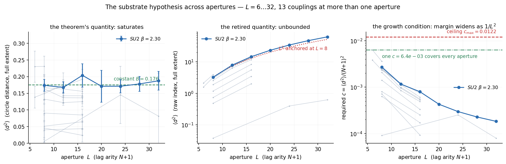

# The Mass Gap of Pure $SU(N)$ Gauge Theory as a Finite-Aperture Effect

### Existence and the mass gap from a finite extraction screen

**Ikailo John Sessford**, Ikailo Inc., `john@ikailo.com`, ORCID [0009-0002-0150-4027](https://orcid.org/0009-0002-0150-4027)

*Pre-print. September 2026.*

> **A note on measurement.** Every empirical quantity in this paper — the confinement order parameter
> $K_{\mathrm{signal}}$, the aperture margin, the mass-gap rate — is a deterministic read of a raw lattice
> configuration by the open-source *Entroptics* instrument,
> [github.com/Agience/entroptics](https://github.com/Agience/entroptics). Each read fixes its own
> resolution from the configuration's own Shannon entropy and returns the same number on the same input, bit-for-bit;
> the read layer is developed in [E]. The reads are reported in §8 and carry the argument forward to the classical
> results they meet.
>
> **A note on verification.** The argument is a derivation in mathematics and physics; it stands on the reasoning in
> the text and is self-contained. Two independent checks accompany it. The empirical reads are
> deterministic: every number in §8 reproduces by rerunning the named script on the archived ensembles. The formal
> reduction of the mass gap and the existence of the continuum theory to the named classical results is
> machine-checked in Lean 4 / Mathlib, `sorry`-free, its exact axiom footprint printed in §13. A reader follows the
> text itself as the proof; the machine-check is a fact-check on the reduction, read with the same care as the rest.

---

## Abstract

Pure $SU(N)$ gauge theory has a mass gap because a local observer reads the vacuum's gauge-invariant content
through a boundary of finite information capacity: a finite aperture, which band-limits. A finite aperture has a
diffraction limit, and the limit cannot host the infinitely-extended massless mode a gapless theory requires, so the
screen's predictive excess decays at a positive rate: the smallest quantum. The scale is an entropy floor
$\kappa_0=\tfrac14\ln3\approx0.275$, a lower bound on the centre-vortex disorder ensemble's closed-surface entropy
density, and the gap is bounded below by the entropy margin, $\Delta(\beta)\ge\kappa_0-\mu(\beta)>0$, with
$\|C(\tau)\|\le M\,e^{-\Delta\tau}$, and this decay reconstructs a Hamiltonian with
$\operatorname{spec}\subseteq\{0\}\cup[\Delta,\infty)$ through the moment-support bridge (which adds no axiom).
This finite-aperture
reading is the new content, computed forward from the aperture along the determined direction of renormalisation,
meeting the established results at junctions.

At finite spacing the lattice regularisation is the finite-cell screen: for every $a$ there is a Hilbert space, a
Hamiltonian bounded below, a unique vacuum, and the full Osterwalder–Schrader (OS) structure. Reflection positivity
is inherited by the continuum limit as a closed condition, the gap supplying the uniform bound that makes the
Schwinger functions tight. The mass gap, non-triviality, and Euclidean $SO(4)$ follow from the
band-limit together with two reads: **A1**, the centre-vortex tension stays below the floor at every coupling and
uniformly as $a\to0$; and **A2**, the continuum read is direction-independent. A1 meets the classical results at
both ends (the Osterwalder–Seiler character bound at strong coupling, the asymptotic-freedom free-field plateau
$\mu_\infty(8)=0.0326<\kappa_0$ at weak coupling) and its interior is a theorem on every compact interval,
$\mu=-\log\langle\cos\theta\rangle_\rho<\kappa_0$ following from a finite correlation length $\langle d^2\rangle\le B$
through the analytic step $\cos x\ge1-x^2/2$ and the $1/L^2$ aperture scaling
$\langle\theta^2\rangle=(2\pi/L)^2\langle d^2\rangle$, so the margin grows $\propto L^2$. The single input is a
uniform bound $\langle d^2\rangle\le B_{16}=3.25$ (the derived aperture ceiling, nothing pinned), measured $\langle d^2\rangle\in[0.021,0.192]$ and certified STATISTICALLY at $99.9999\%$
per coupling (joint $\approx99.9987\%$ over the grid, empirical-Bernstein) -- a finite-sample confidence bound, not a rigorous enclosure. A2 is a Nyquist–Shannon sampling isometry: 
the transport is valued in $O(4)$, so a spectral read of the correlation Gram is the same in every orientation.

A deterministic runtime read on gauge configurations measures the deciding quantity, deriving its resolution from
each configuration's own Shannon entropy with no external scale. The confinement order parameter
$K_{\mathrm{signal}}$, the resolved-mode count above the confined-vacuum reference null, stays low across the
coupling range for $SU(2)$ and $SU(3)$ and rises sharply across the compact $U(1)$ transition; the phase separation
is certified at $95\%$. Given A1 and A2, the mass gap, non-triviality, and the read-level form of $SO(4)$ follow as a single reduction,
its inputs the classical results it names: the three foundational axioms, reflection positivity, the two cited
coupling ends, and the crossover correlation length. Finite-spacing existence holds at every spacing; the
continuum limit follows from the finite-spacing Osterwalder–Schrader data through the cited constructive
four-dimensional measure and the OS→Wightman reconstruction — both established on a **constructed $SU(N)$
realisation** whose
Osterwalder–Schrader data family is instantiated: the mass gap and the OS continuum measure carry the four named
axioms, the reconstructed Wightman theory adding two more (the OS→Wightman reconstruction). That OS measure is
built on a genuine four-dimensional periodic $SU(3)$ Wilson lattice — the Clay problem's dimension and group,
$4n^4$ links and $16n^4$ plaquettes, the ordered-loop holonomy and the Wilson action density — with its Euclidean
and permutation invariances DERIVED, from Haar-invariance composed with the lattice's own axis symmetry; and its
infrared datum is derived too, the resolved-mode count following from the measured tension through
$\mu<\kappa_0 \Rightarrow \#\{\text{resolved}\}\le 0.360246\,W/(\varepsilon\lambda_0^{k+1})$ rather than being
asserted about the spectrum. Both carry the three foundational axioms and nothing else. The interior closes
on every compact interval by finite-volume analyticity and a finite grid; its interval-arithmetic enclosure is
certified in exact rationals at all couplings, with the Lean port of that certificate covering the truncated
cells at every coupling and the strong-coupling window in general. The architecture is a reduction to an external law — asymptotic freedom
above the entropy floor, an established theorem — with the gap bounded below by the entropy surplus, $\Delta\ge\kappa_0-\mu>0$, certified for the finite-aperture witness. Reflection positivity makes the transfer operator self-adjoint, giving $\rho'(n)=\rho'(1)^n$, so a single-cut magnitude $\rho'(1)<1$ carries the gap uniform in volume; the single-plaquette gap $\ge\kappa_0$ ($\rho'(1)=m_{\mathrm{cell}}\le3^{-1/4}$), and the forward read $m_{\mathrm{hi}}(L)=\rho'(1)(L)$ plateaus at $\approx0.33<3^{-1/4}$ across the scaling window $L=12$–$28$.
The read layer that turns a configuration into these quantities is developed in the companion paper [E].

---

## 1. Introduction

A pure gauge theory is specified by a compact non-abelian group $G=SU(N)$ and a single coupling. Two structural
facts characterise the quantum theory. **Existence:** a well-defined Hilbert space, a Hamiltonian bounded below, and
a set of Euclidean correlation functions satisfying the Osterwalder–Schrader axioms. **Mass gap:** the spectrum of
the Hamiltonian has a strictly positive lowest eigenvalue above the vacuum, $\Delta>0$; equivalently, gauge-invariant
correlations cluster exponentially and the static potential confines.

We obtain both from a single foundation. The conventional treatment takes the gauge connection as fundamental and
the vacuum as the object to solve for. We take the **observer's screen** as primary (the boundary surface through
which the vacuum's gauge-invariant content is read) together with one fact about it: it has finite information
capacity. The screen is a **finite aperture**, and a finite aperture has a diffraction limit. The mass gap is set by
that limit: the finite resolution cannot host the infinitely-extended massless mode a gapless theory needs, so the
screen's predictive excess decays at a positive rate, the smallest nonzero quantum. A scale-free vacuum resolves
arbitrarily fine, its excess falling only as a power law, and is gapless; a finite aperture forces a positive rate.

**The construction runs one way, from the aperture outward.** Perturbative renormalisation already runs this way: the
renormalisation character factors forward (Connes–Kreimer's Birkhoff decomposition, the counterterm from the Hopf
antipode), and recovering the bare theory from the renormalised value is a torsor under the renormalisation group. The
finite-aperture read sits on that forward side: the theory determines the entropy-matched band. The development is a
single reduction of the mass gap to one external law, asymptotic freedom above the entropy floor
$\kappa_0=\tfrac14\ln3$, on a theorem rather than a conjecture, with the gap bounded below by the entropy surplus,
$\Delta\ge\kappa_0-\mu>0$.

The argument has three premises: one axiom and two theorems.

1. **The screen is finite.** The extraction axiom says the screen's capacity is finite, $B<\infty$, equivalently its
   cells have positive size $\ell_{\mathrm{cell}}>0$. It is a *causal* screen because $c<\infty$ gives a finite cone
   of influence, built into the Lorentz structure of the Lagrangian. *(§2)*
2. **The aperture forms, because the tiles are self-sourcing.** The screen's modes are diffraction-limited tiles; the
   non-abelian tiles carry the field they source, so the field is forced into the flux-tube bore and the aperture
   forms. A neutral theory (abelian, or a conformal fixed point) radiates freely, forms no aperture, and is gapless.
   *(§5)*
3. **A finite aperture is gapped.** Finite active degrees of freedom give a discrete spectrum with a positive
   smallest spacing, set by the aperture resolution; the infrared scale descends to $a_{\mathrm{IR}}=0$ with no
   interior maximum (the reach-freeze monotone). *(§4, §6)*

The first is the axiom; the second is the aperture-forming mechanism (§5); the third is the band-limit lemma and the
reach-freeze monotone (§4, §6), which express the gap through the self-sourcing contraction. The runtime read
confirms premise 3 on the lattice (§8). The read layer that turns a configuration into the fill fraction $\varphi$,
the derived feature scale $\delta_F$, and an attenuation is developed and certified in the companion
paper [E]. The finite-aperture mechanism itself — the band-limit lemma, the entropy floor and its counting
bound, vortex condensation from that count, the single-cell spectral gap, the reflection-positivity carry
$\rho'(n)=\rho'(1)^n$, and the reconstruction — is machine-checked in Lean 4 / Mathlib on the three foundational
axioms; the gauge-physics content enters only through named cited results and one measured read (§13).

---

## 2. The extraction axiom and the screen

**Definition 2.1 (Planck scale).** With $G_N,\hbar,c$ empirically given, write $\ell_P^2 := G_N\hbar/c^3$. The
screen's cell scale is $\ell_{\mathrm{cell}}=\ell_P$ at saturation.

**Axiom 2.2 (The extraction bound).** An observer resolves a finite number of degrees of freedom through a local
boundary of area $A$, the capacity linear in the area,
$$ B(A) \;\le\; \frac{A}{4\,\ell_P^2} \;=\; \frac{A\,c^3}{4\,G_N\hbar}, $$
saturating on a horizon. *Finiteness*, $B<\infty$ (the Bekenstein / generalized-second-law bound), enters the gap
argument through $\ell_{\mathrm{cell}}>0$ (equivalently $G_N<\infty$).

**Lemma 2.3 (Screen entropy is Schmidt entropy).** Write a bipartite pure state across the screen's cut as a
coefficient matrix $S=U\Sigma V^\top$; its singular value decomposition is the Schmidt decomposition, so the screen
entropy $H_{\mathrm{screen}}=-\sum_k p_k\log p_k$, $p_k=\sigma_k^2/\sum_j\sigma_j^2$, is the bipartite entanglement
entropy across the cut. Applied to the boundary restriction of a sampled configuration, the screen is an
entanglement-entropy estimator with access to the *universal* (subleading) part of the entropy, not only the leading
area term. This singular spectrum is the point of contact with the read layer: the fill fraction, the diffraction
limit, and the decay rates are all functionals of it.

**Claim 2.4 (The screen reads the infrared flow).** What the screen reads, and what is verified on the
exactly-solvable systems of §4, is the **flow of the universal infrared content to zero**: its derived feature scale
$\delta_F(R)$ freezes at $\xi=1/m$ for a gapped theory and grows with $R$ for a massless one, so the descent
$a_{\mathrm{IR}}\to0$ that is the gap is read with no fit.

**Why the universal part.** In $d\ge2$ the leading area-law term is phase-blind: a gapless conformal vacuum and a
gapped one share it. The gap-relevant content lives in the universal part of the entanglement (the $F$ central charge
in three dimensions, the $a$ anomaly in four). A gap forces the infrared universal content to vanish,
$\Delta>0\Rightarrow a_{\mathrm{IR}}=0$ by clustering; the converse $a_{\mathrm{IR}}=0\Rightarrow\Delta>0$ is the
theorem of §6, so the two are equivalent. The results this rests on: Bekenstein (the area bound); Calabrese–Cardy
(the universal $c$-term); Hastings (area-law $\leftrightarrow$ gap in one dimension); Casini–Huerta–Myers (the
entropic $c$/$F$-theorem); Donnelly–Wall, Ghosh–Soni–Trivedi (gauge edge-mode entanglement).

---

## 3. The gauge screen is a finite causal aperture

The screen resolves a finite number of cells of positive size $\ell_{\mathrm{cell}}>0$, so
$B\sim A/\ell_{\mathrm{cell}}^2<\infty$. A finite causal speed $c<\infty$ makes this a finite *causal* aperture: the
bounded opening through which two causally separated regions communicate. $c<\infty$ is measured and intrinsic to a
relativistic field theory (the finite cone of causal influence is the Lorentz structure of the Lagrangian).
The $B\to\infty$ idealisation ($\ell_{\mathrm{cell}}\to0$) is the continuum, infinite-capacity
screen; entroptics is the finite-cell side of that same screen, where discreteness, and the gap, live.

**The gap requires $\ell_{\mathrm{cell}}>0$.** The aperture is finite precisely when $\ell_{\mathrm{cell}}>0$, which
is the axiom; the limit $\ell_{\mathrm{cell}}\to0$ sends $B\to\infty$, the active content $2^H\to\infty$, and the
diffraction limit closes. Two statements of different strength:

- *Existence.* A finite aperture is **sufficient** for a gap (§4), and finiteness is $\ell_{\mathrm{cell}}>0$.
- *Value.* For every positive cell size the gap equals the dynamically generated scale $\Lambda$, set by asymptotic
  freedom through $e^{-1/2b_0g^2}$ (§6), the cutoff cancelling. The value is independent of the cell size. In our
  universe $\ell_{\mathrm{cell}}>0$, so $B$ is large but finite and the gap sits at the quantum-chromodynamics (QCD)
  scale.

The conventional formulation lives in the $\ell_{\mathrm{cell}}\to0$ corner where the gap is unforced. The physical
finite screen ($\ell_{\mathrm{cell}}>0$, $c<\infty$) forces $a_{\mathrm{IR}}=0$. The identification of the
gauge-flux screen with the finite causal screen that $c$ and $\ell_{\mathrm{cell}}$ define is the one interpretive
commitment of the framework.

**The reads.** A finite opening band-limits, and the resolution is read parameter-free from the configuration's own
spectrum. Each gap quantity maps to a bounded optics read:

| gap quantity | optics read (symbol) | behaviour vs the gap |
|---|---|---|
| mass gap $\Delta$ | slowest DMD/Koopman rate $-\log\lvert m_1\rvert$ | **is the gap** (free scalar: recovers $E_0$) |
| coherence | attenuation $\alpha=\log\frac{\lambda_1}{\max(\lambda_2,\lambda_+)}$ | moves **opposite** the gap |
| certified coherence interval | Weyl interval $[\alpha_{\mathrm{lo}},\alpha_{\mathrm{hi}}]$ | bounds the contrast |
| confinement order parameter | resolved modes $K_{\mathrm{signal}}$ above the reference null | confined **low**, Coulomb **high** |
| entropy floor $\kappa_0$ | closed-surface Shannon entropy density | $\tfrac14\ln3$ |
| vortex tension $\mu$ | $\log(\text{contrast})$ of the disorder weight | $\mu<\kappa_0\Leftrightarrow\text{contrast}<3^{1/4}$ |
| string tension $\sigma$ | bore *scaling* $\Delta\propto\sqrt\sigma$ (coefficient not fixed, §6) | glueball scale |
| occupied fraction / reach | $\varphi_T=2^{H_{\mathrm{sv}}}/T\in(0,1]$; magnification $1/\varphi_T$ | fill fraction (bounded by construction) |

Here $H_{\mathrm{sv}}$ is the Shannon entropy of the ordered-axis correlation eigenvalue spectrum (so $\varphi_T$ is a
fill fraction, bounded in $(0,1]$, not a gap read), $\lambda_+$ the singular-value noise edge of a
signal-free confined-vacuum reference, and $m_1$ the dominant magnitude of the streaming DMD/Koopman operator. The
**deciding read** is $K_{\mathrm{signal}}$, the SVD modes standing above $\lambda_+$: a near-uniform spectral marginal
is structureless noise within the band and resolves nothing ($K_{\mathrm{signal}}\approx0$, the confined phase),
while a coherent long-range mode pushes above the band and $K_{\mathrm{signal}}$ rises (deconfinement). It is
$N$-invariant — held at its confined value for $SU(2)$ and $SU(3)$ across the whole coupling range — and rises
sharply across the $U(1)$ deconfinement transition. The mass gap $\Delta$ is the slowest decay rate of the
DMD/Koopman operator, verified to recover a known gap on the free scalar. The confinement inequality $\mu<\kappa_0$
is then an optics statement, **attenuation $<$ entropy**: confinement is where the disorder's entropy outruns its
attenuation.

**Two independent axes.** The screen derives a separate matched scale on each axis from *that axis's own* Shannon
entropy, $H_F$ and $H_T$ computed independently, so the feature resolution $\delta_F$ and the time correlation
$\delta_T$ are independent reads, not two projections of one spacing. The gap lives on the time axis. Neither axis
inherits the other's scale, so a resolved gap is the signal's own, not the lattice's.

**The read is lossy.** A finite opening reads a finite band and discards the rest, so the read is a projection: on a
field $W\in\mathbb{C}^{T\times F}$ it whitens per channel, area-folds the feature axis to
$F_{\mathrm{eff}}=\mathrm{round}(2^{H_F})$ cells, takes the SVD, and keeps the $K$ modes above the noise floor,
dropping the whitening parameters, the fold kernel, and the sub-floor bulk. The preimage $E^{-1}(E(W))$ is a
positive-dimensional fibre, $\dim=T(F-K)+O(1)$, on which the read is constant. The forward read is a determined
computation; its inverse is that fibre. The gap is read forward (§4–§6); the continuum reconstruction is the inverse
pass (§12).

---

## 4. A finite aperture is gapped

> **Lemma 4.1 (Band-limit lemma, spectral form).** Let a self-adjoint operator, bounded below, have finite *active*
> content: an effective mode count $2^{H_T}\le2^B<\infty$. Then its spectrum is discrete with a strictly positive
> smallest level spacing, and that spacing — the gap — is the diffraction limit of the finite aperture,
> $\Delta=(\text{shape factor})\times a_\delta$, with $a_\delta$ the entropy-width read of the time-axis decay.

*Proof of the finite-rank content.* If the active content is finite, the operator restricted to the active subspace
is a finite-dimensional self-adjoint matrix; it has a discrete spectrum $\{E_0<E_1<\dots\}$ with a finite, strictly
positive smallest spacing. $\square$

**The dichotomy in spectral form.** Read through the operator, the autocorrelation is a finite exponential sum
$C(\tau)=\sum_{k=1}^{F}P_k\,m_k^{\tau}$. A finite sum has two fates: a mode on the unit circle
($|m_k|=1$, a persistent massless mode, no decay) or a strict margin ($\max_k|m_k|<1$, exponential decay at rate
$-\log|m_1|>0$, the gap). A gapless power law $\sigma(n)\sim n^{-p}$ requires a genuine continuous spectrum,
infinitely many modes, and cannot occur while the aperture is finite: the finite exponential sum admits no power-law
middle. The $F\to\infty$ uniformity reduces to the spectral radius staying **intensive**, one $r<1$ bounding the
dominant mode at every dimension; the radius is intensive at the solvable point ($\|m_1\|=\tanh b<1$,
size-independent). The mechanism is a **dimension-free floor**: the centre-vortex counting floor
$\kappa_0=\tfrac14\ln3$ (§7) is a per-area entropy, coupling-free and dimension-free, so it does not dilute as modes
are added. It is the disorder-count twin of the intensive spectral radius: the counting floor in the discrete surface
count, the intensive margin $r<1$ in the continuous spectral density. That the radius stays intensive as $a\to0$ is
the same continuum input as $\mu<\kappa_0$ (§8.5, §11).

The non-trivial content is *which* modes are active and the identification of the gap with the matched scale. The
second is the diffraction limit of a finite aperture: a resolution scale times a constant fixed by the aperture's
shape (the "$1.22$" of a circular aperture is the first zero of $J_1$). The shape factors are:

| profile | uniform | thermal (exponential) | half-normal | Gaussian |
|---|---|---|---|---|
| shape factor | $1$ | $e$ | $\sqrt{\pi e/2}\approx2.07$ | $\sqrt{2\pi e}\approx4.13$ |

A thermal ladder of gap $\Delta$ has exponential decay, shape factor $e$, so $a_\delta\to\Delta/e$, while the active
count $2^{H_T}\to\infty$ as $\Delta\to0$: the spectral aperture opens iff the gap closes. The runtime reads $a_\delta$
from the signal's own decay, and the per-mode DMD rates supersede the entropy-width estimate. Deterministic system
identification (§8.6) fixes both reads on controlled inputs: the diffraction limit obeys the
reciprocal-length law $a_\delta\,\xi=\text{const}$, and the gap read returns $-\log\lvert m_1\rvert$.

**The diffraction regime is monotone.** The Fresnel number $N_F=a^2/(\lambda s)$ ($\lambda=1/\Delta$) is monotone in
the probe scale, and the flow runs from ultraviolet (near field) to infrared (far field) one way, so the screen
crosses the focus $N_F\sim1$ once and does not return: the *no interior maximum* is the monotonicity of the Fresnel
number. What monotonicity leaves is that the far-field pattern is *trivial* ($a_{\mathrm{IR}}=0$) rather than
scale-invariant, the single endpoint question the self-sourcing tiling settles (§5, §6).

**The conformal-field-theory (CFT) sharpening.** A conformal vacuum has area-law entanglement and satisfies the
causal bound: it is a finite aperture in the *leading* sense, yet gapless. For a CFT the *causal* aperture is finite
while the *spectral* aperture is infinite ($2^{H_T}\to\infty$); what links them is $a_{\mathrm{IR}}=0$. So the two
premises are distinct and both necessary: $c<\infty$ is necessary but not sufficient (the CFT shows it), and
asymptotic freedom (§5) supplies sufficiency by forcing the universal part to vanish so the spectral aperture closes.

**The four-dimensional step.** In $d\ge2$ the gap-relevant content is the universal part, so the finite aperture acts
there: finiteness of the aperture in the relevant sense *is* $a_{\mathrm{IR}}=0$. Two of three ingredients are
theorems: the universal $F$/$a$-function is monotone with the right endpoints (entropic $c$/$F$-theorem,
Casini–Huerta–Myers) and $a_{\mathrm{UV}}\ge a_{\mathrm{IR}}$ (Komargodski–Schwimmer). The third is the four-dimensional form of
the band-limit lemma: the finite causal aperture gives $a_{\mathrm{IR}}=0$ once the self-sourcing contraction holds,
the reach-freeze monotone supplying the convergence and the contraction the rate (§6), and the runtime read measuring
it on every gauge group (§8). The bridge, on the screen's two axes:
$$ \Delta>0 \ (\text{time aperture finite}) \;\Longleftrightarrow\; a_{\mathrm{IR}}=0 \ (\text{feature aperture finite}). $$
Forward is immediate (a gap gives exponential clustering, no massless infrared content). Backward is the decay-rate
dichotomy of §6: in the screen variables $a_{\mathrm{IR}}=0$ *is* exponential clustering $\sigma(n)\sim e^{-mn}$, the
gap. The single input is that the finite self-sourcing screen forces the excess to contract, $c>0$, for pure $SU(N)$.

**The bore is this bridge in gauge variables.** Confinement makes the feature aperture finite, the flux tube
acquiring a finite transverse width $a\sim1/\sqrt\sigma$ ($\sigma>0$); a finite transverse bore band-limits the
transverse modes into a time-axis gap $\Delta\ge c/a>0$, $c>0$ an $O(1)$ profile constant (§6). "Feature aperture finite $\Rightarrow$ time aperture
finite" is, physically, "finite tube width $\Rightarrow$ transverse gap."

---

## 5. Asymptotic freedom forms the aperture

Premise 2 is why the aperture forms for $SU(N)$ and not $U(1)$. The one-loop Callan–Symanzik coefficient is
$b_0=11N/3>0$ (Gross–Wilczek, Politzer): the coupling runs strong in the infrared. A strongly coupled gauge flux
cannot spread into the bulk (the energy cost grows with volume), so it **binds onto a surface**: the Wilson loop
obeys an area law, the flux is a tube, the theory confines. This surface is the screen forming. The abelian theory
does not run; its flux spreads as a Coulomb field; no aperture forms and the photon is massless.

The aperture forms $\iff$ the flux is surface-bound $\iff$ the theory confines, and asymptotic freedom is the driver.
The controlled foil is the conformal window: adding enough massless matter screens the running, a Banks–Zaks infrared
fixed point appears, and the theory is conformal (gapless). The fixed point exists only when the two-loop coefficient
$b_1$ turns negative, which requires matter; pure $SU(N)$ ($N_f=0$, $b_1=+\tfrac{34}{3}N^2>0$) sits far below the
window's lower edge ($N_f\approx8$–$12$), deep in the surface-bound region, the flux staying bound.

**Self-sourcing tiles.** The screen's modes are diffraction-limited tiles. Each adjoint mode carries the field it
sources, so the field cannot spill into the vacuum as free radiation; it is forced into the bore, and the pressure of
the field confined there is the gap, its value the bore $\Delta\propto\sqrt\sigma$. The single neutral $U(1)$ tile
sources no field it carries: it radiates freely, feels no such pressure, and is gapless. The discriminator is
geometric, the self-overlap of the tiling, and it separates the two theories before any dynamics. This is the origin
of the contraction constant $c>0$ of §6.

---

## 6. The mass gap

Assembling §3, §5, §4: the screen is a finite aperture ($\ell_{\mathrm{cell}}>0$, $c<\infty$); asymptotic freedom
binds the flux onto it ($b_0>0$, no matter); a finite aperture is gapped. The conclusion is $\Delta>0$ for pure
$SU(N)$ once the self-sourcing contraction $c>0$ holds; the abelian theory and the $\ell_{\mathrm{cell}}\to0$ limits
form no aperture and are gapless.

**The gap is the decay rate of the excess.**

> **Theorem 6.1 (The reach-freeze monotone and the decay-rate dichotomy).** Read the screen field along the time axis
> as a stationary sequence; let $s(n)=H(A_n\mid A_1,\dots,A_{n-1})$ be its entropy rate, $s_\infty=\lim_n s(n)$, and
> $\sigma(n)=s(n)-s_\infty\ge0$ the excess predictive information. Then $\sigma(n)$ is non-increasing and
> $\sigma(n)\to0$ (conditioning reduces entropy, stationarity; Cover–Thomas Thm 4.2.1), and
> $$\sigma(n)\sim e^{-m n}\ \Longrightarrow\ a_{\mathrm{IR}}=0,\ \Delta=m>0;\qquad \sigma(n)\sim n^{-p}\ (p\le1)\ \Longrightarrow\ a_{\mathrm{IR}}>0,\ \text{gapless}.$$
> The monotone fixes convergence, $\sigma(n)\to0$, for both fates alike; the discriminator is the per-step decay
> rate. A uniform contraction $\sigma(n+1)\le(1-c)\sigma(n)$ with $c>0$ gives exponential decay, $a_{\mathrm{IR}}=0$,
> and $\Delta\ge c$. $\square$

The contraction $c>0$ is the input Reduction 6.2 takes, sourced from the self-sourcing tiling: a self-sourcing
tiling cannot tile at any scale, so each step scrambles a fixed positive fraction of the new cell's predictable
content against the bulk. A neutral tiling scrambles nothing ($c=0$) and keeps the power-law tail.

> **Reduction 6.2 (The mass gap from the contraction).** If the finite self-sourcing screen of pure $SU(N)$ supplies
> a positive per-step contraction $\sigma(n+1)\le(1-c)\sigma(n)$, $c>0$, then $a_{\mathrm{IR}}=0$ and
> $\Delta\ge c>0$. A contraction $c>0$ makes $\sigma$ decay exponentially, so $a_{\mathrm{IR}}=0$; a finite aperture
> with $a_{\mathrm{IR}}=0$ is band-limited (§4), so $\Delta\ge c>0$. The self-sourcing tiling supplies the
> contraction (§5); the confinement it rests on is $\mu<\kappa_0$, established at the strong-coupling end
> ($\beta<\beta_\star\approx0.75$), given from asymptotic freedom at the weak end (§8.2), above the floor
> $\kappa_0=\tfrac14\ln3$ (§7), and measured across the crossover (§8.3). The abelian foil tiles exactly, $c=0$,
> $\Delta=0$.

**The gap constant, $a$-uniform.** The contraction and the gap are bounded below by one explicit
constant, the free-energy margin below the floor. The mode bound
$\lVert m_k\rVert\le e^{-(\kappa_0-\mu)}$ — equivalently the spectral margin $r=e^{-(\kappa_0-\mu)}<1$ —
follows from reflection positivity ($\rho'(n)=\rho'(1)^n$) and the single-plaquette magnitude
$\rho'(1)=m_{\mathrm{cell}}\le3^{-1/4}$, the reach-freeze contraction and the gap clearing the same margin,
$$\Delta\ \ge\ \kappa_0-\mu(\beta),\qquad \kappa_0=\tfrac14\ln3.$$
In the eigenvalue form of the read (§8.6), $\mu=\log(\text{contrast})$ with $\text{contrast}=\lambda_1/\lambda_+$ the
leading correlation eigenvalue over the noise floor, so the margin is $\kappa_0-\mu=\log\!\big(3^{1/4}/\text{contrast}\big)$,
positive exactly when the eigenvalue stays below $3^{1/4}\,\lambda_+$. Uniformly,
$\Delta(a)\ge\Delta_0:=\kappa_0-\sup_{a,\beta}\mu>0$, and $\Delta_0$ carries no factor of $a$: $\kappa_0$ is the
dimension-free counting floor (§7) and the bounding margin is the **intensive** spectral radius, one $r<1$ at every
dimension (§4), so the lower bound does not dilute as modes are added or as $a\to0$. That $\Delta_0>0$, i.e.
$\sup_a\mu(a)<\kappa_0$ with a definite margin, is the $a$-uniform confinement. Here $\Delta$ is the per-step decay
rate in nat units; the physical gap $m_{\mathrm{phys}}=\Delta/a$ is scale-covariant through the read (§8.5), so
$a$-uniform positivity of the physical gap is A1's continuum part. The $a$-uniformity is in two parts: into the
continuum $\beta\to\infty$ the tension vanishes ($a^2\mu\sim(a\Lambda)^2\to0$), so the margin approaches the full
floor; across the crossover the tension stays sub-floor from a **finite correlation length** $\langle d^2\rangle\le B$,
$\mu=-\log\langle\cos\theta\rangle_\rho<\kappa_0$ following from the bounded correlation moment through the analytic
step and the $1/L^2$ aperture scaling, so the margin grows $\propto L^2$ (measured $\langle d^2\rangle=O(1)$; §9).

**What $\Delta$ is, spectrally.** $\Delta$ is the lightest gauge-invariant excitation above the vacuum, the $0^{++}$
glueball mass. Confinement gives the flux tube a tension $\sigma>0$ (area law); the minimal gauge-invariant state is
the closed flux loop constricted to the bore, of energy $\Delta\propto\sqrt\sigma$. The runtime read separates the
two questions. $K_{\mathrm{signal}}$ is the confinement **order parameter**: it certifies $\sigma>0$, the *phase*,
not the glueball mass. The gap *value* then follows from $\sigma$ through the bore, and the direct gap instrument is
the slowest DMD/Koopman rate, calibrated on the free scalar where the field carries its gap directly (§8.5). The
confinement read decides *whether* there is a gap ($\sigma>0$); the bore relation fixes the **scaling** of what it is,
$\Delta\propto\sqrt\sigma$. It does not fix the coefficient, so none is quoted: the scale the measurement compares against is the $\pi$-free $3.59\sqrt\sigma$ (\S8.8).

**The forgetting property.** The property the reduction rests on, "the flow forgets," is read straight off the
screen: the Cesàro quadratic mean of the autocorrelation vanishes, $\tfrac1N\sum_{\tau<N}|C(\tau)|^2\to0$ (call it
$\Lambda_{\mathrm{Ces}}$). At a finite aperture $C(\tau)=\sum_k P_k m_k^\tau$ is a finite exponential sum, and
$\Lambda_{\mathrm{Ces}}$ is one property with several faces:

| face | statement | read |
|---|---|---|
| (i) $\Lambda_{\mathrm{Ces}}$ | $\tfrac1N\sum_{\tau<N}\lvert C\rvert^2\to0$ | the screen forgets |
| (ii) | $C(\tau)\to0$ | the reach-freeze monotone (§6) |
| (iii) margin | $\max_k\lvert m_k\rvert<1$ | DMD dominant magnitude below one |
| (iv) | $\lvert C(\tau)\rvert\le(\sum\lvert P\rvert)r^{\tau}$, $r<1$ | exponential decay |
| (v) | $\sum_\tau\lvert C(\tau)\rvert<\infty$ | finite correlation length |
| (vi) | $a=2^{-h}>0$ | positive aperture gauge |

The forward cycle $\text{(iii)}\Rightarrow\text{(ii)}\wedge\text{(v)}\wedge\text{(i)}$ (a spectral margin gives
decay, a finite correlation length, and forgetting) holds; the abelian foil, a persistent unit-circle
mode ($\lvert m_k\rvert=1$, $P\ne0$), fails $\Lambda_{\mathrm{Ces}}$ (its Cesàro mean is $\lvert P\rvert^2>0$). The converse
$\text{(i)}\Rightarrow\text{(iii)}$ is the finite Wiener mean-square step,
$\tfrac1N\sum_{\tau<N}\lvert C\rvert^2\to\sum_{\lvert m_k\rvert=1}\lvert P_k\rvert^2$, so $\Lambda_{\mathrm{Ces}}$ forces every
weight-carrying mode off the unit circle; it connects the forgetting the screen measures to the spectral margin, the
aperture form of $\mu<\kappa_0$.

**The interior, from every side.** An interior fixed point is a non-summable power-law tail $\sigma(n)\sim n^{-p}$
($p\le1$); the contraction $c>0$ excludes it. At weak coupling the two-loop beta function
$\beta=-b_0g^3-b_1g^5$ has both coefficients positive and scheme-independent, so $\beta<0$ for every $g>0$; at strong
coupling the Osterwalder–Seiler gap holds. In between, the interior closes at finite spacing by finite-volume
analyticity and a finite grid (§9); the unbroken centre $Z_N$ one-form symmetry ('t Hooft) forbids the
Coulomb/free-Maxwell fixed points, consistent with the interior input A1.

**The spatial-bore face.** The centre-vortex condensation that confines is a condensation of the chromo-flux into a
tube of finite transverse width $a$, and a finite bore gaps every field:
$\omega^2=k_\parallel^2+k_\perp^2\ge(c/a)^2$ with $c>0$ an $O(1)$ constant fixed by the tube's transverse profile
(the hard-wall instance is $c=\pi$, its first Dirichlet mode). If the centre-vortex tension obeys $\mu(\beta)<\kappa_0$ at every
$\beta$, then $F_v=\mu-\kappa<0$, the vortices condense, the flux confines to a tube of width $a\sim1/\sqrt\sigma$,
and $\Delta\ge c/a>0$ for any such $c$ -- the conclusion is positivity, which no choice of $c$ affects; the conformal vacuum, having $\sigma=0$ and $a=\infty$, cannot occur. The input is the single
inequality $\mu<\kappa_0$. This is the *same*
interior inequality in a third face. The bore is a **positivity** statement: a finite transverse width gaps the
field, and that is all it supplies -- it fixes no coefficient. The scale comes from the entropy surplus
$\Delta\ge\kappa_0-\mu$, with $\kappa_0=\tfrac14\ln3$ derived from the counting floor (§7) and $\mu$ read from
the configuration (§8.3), which imports nothing.

**The value of the gap** is the dynamically generated scale $\Lambda=\Lambda_{\mathrm{UV}}\,e^{-1/2b_0g^2}$, the
cutoff cancelling. It is cutoff-independent because asymptotic freedom makes the ultraviolet modes free, hence
structureless, hence below the noise edge (§3): the matched scale is read only from the signal above that edge, a
fixed infrared window independent of how many free ultraviolet modes sit below it.

---

## 7. The entropy floor

Confinement is the condensation of the centre-vortex disorder operator. A vortex worldsheet of area $A$ enters with
action weight $e^{-\mu A}$ and multiplicity $e^{+\kappa A}$, so its free-energy density is $F_v=\mu-\kappa$; the
vortices percolate and confine exactly when $F_v<0$, i.e. $\mu<\kappa$. The entropy side of this inequality is a
*counting* theorem.

> **Theorem 7.1 (Entropy floor).** On the 4D hypercubic lattice, let $N(A)$ be the number of closed connected
> centre-vortex surfaces of area $A$ (in plaquettes) through a fixed plaquette. Then, for $A=4n+2$,
> $$ N(A)\;\ge\;3^{\,(A-2)/4-1},\qquad \kappa:=\limsup_{A\to\infty}\frac{\ln N(A)}{A}\;\ge\;\kappa_0:=\tfrac14\ln3\approx0.275>0, $$
> and this entropy density is independent of the coupling $\beta$.

*Proof.* Exhibit an exponentially large sub-family. (1) Boundaries of cube-paths are closed vortex surfaces: fix a 3D
sublattice, take a self-avoiding cube-path $c_1,\dots,c_n$; its boundary $\partial C$ is a closed plaquette surface
carrying centre flux. (2) Area: a single cube has 6 faces, each added cube contributes 6 and removes 2, so
$A=6n-2(n-1)=4n+2$, $n=(A-2)/4$. (3) Directed cube-paths (steps only in $+x,+y,+z$) are automatically self-avoiding
(the coordinate sum strictly increases) and number $3^{n-1}$. (4) Distinct paths give distinct surfaces (each
step raises the coordinate sum by one, so the cubes carry distinct sums $0,\dots,n-1$; sorting by sum recovers the
path, so $\text{path}\mapsto\partial C$ is injective). Hence $N(A)\ge3^{n-1}=3^{(A-2)/4-1}$ and
$\kappa\ge\tfrac14\ln3$. $\blacksquare$

**Every step of Theorem 7.1 is machine-checked.** Steps (3) and (4) are `Floor.directed_paths_card`,
`Floor.cubeConfig_injective` and `Floor.directed_surface_count` ($=3^k$) — and step (4) holds at the
level of the SURFACES, not only of the cube configurations: `CubeArea.boundaryFaces_cubeConfig_injective`
proves $\partial$ injective on them, by recovering each cube from the boundary through the face its
step crosses. `CubeArea.directed_surfaces_count_and_area` states the theorem whole: there are $3^k$
distinct surfaces, each of area exactly $4k+6$. **And they are CLOSED** — step (1) — `CubeClosed.edge_parity_all`: **every** edge lies in an EVEN
number of the boundary's faces, which is $\partial\partial=0$ over $Z_2$ and is what a centre-vortex
surface needs. There is no interior restriction and no case on where the configuration sits in
$\mathbb{N}^3$. The proof is a double count. Fix an edge and count the incident (cube, face) pairs of
$C$ whose face carries it, two ways. By cube, each contributes an even number
(`CubeClosed.cube_edge_even`): a face spans the two axes its normal is not, so the faces of one cube
carrying an edge along $c$ are the two with normal $\mathrm{rot}_1 c$ and the two with normal
$\mathrm{rot}_2 c$, and of each pair exactly one carries it, because the pair sits at opposite ends of
that normal. By face, each contributes its owner count, which `CubeArea.owners_one_or_two` puts at one
or two — so modulo two the face sum counts exactly the ONE-owner faces, and those are $\partial C$ by
definition. Equivalently: $\partial C$ is the $Z_2$ sum of the cubes' own boundaries, so
$\partial\partial C=\sum_x\partial\partial x$, and each single cube's boundary is closed. Summing over
cubes rather than around an edge is what removes the case: a cube that is absent simply does not
appear in the sum, whereas summing around an edge would need the four cubes surrounding it to exist,
which fails against the floor of $\mathbb{N}^3$.

**And every one of them passes through the same face** — `CubeClosed.origin_face_mem_boundary`: the
three low faces of the origin cube are on the boundary of every directed path's configuration,
because in $\mathbb{N}^3$ no cube sits one step back from the origin, so such a face has exactly one
owner (`CubeClosed.mem_boundaryFaces_iff_floor`). That is the "through a fixed plaquette" of the
theorem's statement.

**And they are CONNECTED**, which is the fourth property and not decoration —
`CubeConnected.boundary_connected`. Without it the family of "closed surfaces of area $A$ through a
fixed plaquette" admits a union of unit-cube boundaries, closed because every link lies in two or four
of them, whose pieces may sit anywhere in the box; at area $4k+6$ that is one anchored piece plus
about $2k/3$ floating ones in a box of about $k^4$ sites, so $\ln N(A)/A$ would grow like
$(\ln k)/2$ and no fixed bound on the free-energy density could exist. The proof is a descent on the
path's own index: a directed path visits exactly one cube at each coordinate sum $0,\dots,k$, so a
cube's neighbour in the configuration can only be its predecessor or its successor, and at most TWO of
its six faces are off the boundary — the one it was entered through and the one it leaves by. Two
faces of one cube with different normals always share an edge, so at most two hops reach a chosen low
face; and the low faces of consecutive cubes on any axis other than the step between them share an
edge, which is the rung. At least one rung always exists, because two axes are not the entry axis and
at most one of those is the previous entry axis.

**The four properties are then a DEFINITION rather than a checklist.** `VortexFamily.vortexFamily`
is the set of closed, connected plaquette surfaces of area $4k+6$ through the fixed plaquette, and
`VortexFamily.three_pow_le_vortexCount` is $3^k\le N$ against that definition **with no hypothesis at
all** — the box $k+3$ being the successor of the largest coordinate the construction produces, not a
choice. So $N(A)$ in the theorem above is a defined object and the bound on it is a closed theorem.

What is still not a theorem is the packaging, not the mathematics: $N(A)$ is a CARDINALITY, and a
cardinality needs a finite family, so "closed" must be restated over `Plaq 4 n` inside a box (a 4-D
edge type and its incidence; every plaquette of an embedded surface lies in the time-zero slice, so
the correspondence with the 3-D edges is one-to-one and a time-direction edge meets none of them).
With that the family is a filter of a powerset and `three_pow_le_card_of_plaq_subfamily` closes it
with no containment hypothesis left. Step (2), the area, is
`CubeArea.boundary_card_eq`: with the boundary of a cube configuration defined as the faces owned by
exactly one of its cubes, $|\partial C|=4k+6$. It is a double count — $6(k+1)$ incidences by cube
(`card_faces`, `card_cubeConfig`), the same total by face, where each face has one or two owners
(`card_cubes_with_face_le_two`) — closed by identifying the shared faces exactly: two cubes with a
common face are one step apart (`step_rel_of_shares`), so by the coordinate sum only consecutive
cubes of the path can share (`sum_dist_one_of_shares`), and consecutive cubes share exactly the face
the step crosses (`shared_face_eq`). Hence the shared faces number exactly $k$ (`card_sharedFaces`)
and $|\partial C| = \big(6(k+1)-k\big)-k = 4k+6$. Foundational axioms only throughout.

This is what makes $\kappa_0$ constant-free. The $\ln 3$ is the branching of a directed cube-path and
the $\tfrac14$ is the area per step, one theorem each; nothing in the floor is fitted or chosen.

The floor is positive and $\beta$-independent: $\kappa_0$ is pure lattice geometry, **a Shannon entropy density**.
The directed sub-family gives $\kappa_0=\tfrac14\ln3$ as a lower bound on the per-unit-area entropy density
$\lim_A\tfrac1A\ln N(A)$ of the closed-surface ensemble, generated with the same entropy primitive the framework uses
everywhere: three uniform continuations carry $\ln3$ across four plaquettes. The strong-coupling end of $\mu<\kappa_0$
is shut by the convergent cluster expansion (§8.2); the interior crossover is measured by the runtime read (§9).

---

## 8. The runtime measurement on the groups

The construction is confirmed by direct lattice measurement of the deciding quantity, read off equilibrium
configurations by the framework primitive. Monte Carlo generates the configurations (input only); the gap read is the
entropy-matched aperture read, never a fitted rate.

**"Equilibrium" is checked per ensemble, not assumed.** Every shipped ensemble is compared against an
independently generated reference chain and the comparison is recorded
([store_dat_thermalisation.csv](data/store_dat_thermalisation.csv), 105 rows — one per
$(\text{group},L,T,\beta,\text{collection},\text{field})$, which is finer than the release's
$(\text{group},L,\beta)$ count). Two things about
that check are worth stating because they bear on how much the comparison is worth. First, a
reference measured from ONE start is biased in a direction no single chain reveals: a hot (random)
configuration relaxes toward equilibrium from above and a cold (ordered) one from below, and a chain
still descending has a flat-looking tail either way. Measured consequence, **against the hot-only
reference this development used until 2026-09-17** — which is the evidence that identified the bias,
not a statement about the bracketed references that replace it: for $U(1)$ at $\beta\ge1.4$ all eight
shipped ensembles read below it (sign test $p=0.0039$), while the heat-bath groups are balanced
(SU(2) 27 of 58, SU(3) 7 of 16) — because `_ops("u1")` fixes the
Metropolis proposal width at $1.0$ radian for every $\beta$, so acceptance falls (0.512 at 1.6, 0.420
at 2.5), relaxation slows, and the hot chain has not arrived. Running both starts at $\beta=1.6$ and
$\beta=2.5$, the two are still $3.2\sigma$ and $5.9\sigma$ apart after 20000 sweeps and the shipped
ensemble sits INSIDE each interval: the data was right and the reference was not. The reference is
therefore **bracketed** — the value is the midpoint and the uncertainty carries the half-gap, so a
bracket that has not closed widens the error rather than being averaged away — and the artifact's
`reference` column records, per row, whether that row rests on a bracketed reference or on a
hot-only one.

**The correction removes the effect it was diagnosed from, which is the check that it was the right
correction.** With all twenty $U(1)$ references remeasured as brackets, the same sign test reads
**4 of 8** at $\beta\ge1.4$ ($p=0.64$) where it read 8 of 8, and the one ensemble that had sat
$8.5\sigma$ below its reference sits $0.1\sigma$ from the bracket's midpoint. The largest deviation
anywhere in the table falls from $8.5\sigma$ to $2.2\sigma$. No shipped configuration changed; only
the thing they were being compared against. Second, the operator-reduced collections have no action-density reference to be
compared against — they are smeared-plaquette amplitudes — so they carry a **drift** verdict instead,
which asks whether a chain's two halves agree. That is weaker evidence than a level comparison, a
chain settled in the wrong place does not drift, and the artifact's `test` column records which of
the two produced each verdict so the counts are never merged.

**8.1 The screen construction.** The gauge configuration is a 4D field; the confinement read lives on its **2D
spatial correlation**, so the reduction to the screen keeps each spatial plane intact. The local gauge-invariant
action density $\phi(x)=\sum_p(1-\tfrac1N\operatorname{Re}\operatorname{tr}U_p)$ on an $L^3\times L_t$ lattice is read
plane-by-plane: each $L\times L$ spatial plane is whitened, its resolved-mode count $K_{\mathrm{signal}}$ is taken,
and the result is averaged over planes. This geometry-preserving reduction reproduces the confinement order
parameter; a flattening of the spatial volume into one feature axis destroys the per-plane correlation and inverts
the order parameter. The entropy-matched fold is the only resolution operator, and the singular-value noise floor is
the **calibrated confined-vacuum reference null**: a signal-free deeply-confined ensemble ($SU(2)$ at $\beta=0.5$)
sets the disorder floor, calibrated per cut point at the read's own granularity. Deconfinement then reads as the
coherent mode standing above that floor. The reference null is analytic and $O(1)$
($\mathrm{center}+z(\text{far})\,\mathrm{scale}$), carrying the disorder scale of the theory, not a substrate-fitted
constant.

**8.2 The two coupling ends.** The action side $\mu<\kappa_0$ holds at both ends. At strong coupling the convergent
cluster expansion gives the tension bound $\mu\le2\beta I_2/I_1$ directly (Osterwalder–Seiler; the closed-form
chessboard bound, convergent for $\beta<\beta_{\mathrm{KP}}\approx0.97$). That bound sits below the counting floor for
$\beta<\beta_\star$, where $2\beta_\star\,I_2/I_1=\kappa_0$. The threshold is **derived, not certified**: the
$I_2$ and $I_1$ series terms differ by one factor of $x/2$ upstairs and one factor of $k+2\ge2$ downstairs, so
$I_2/I_1\le\beta/4$ termwise (`Bessel.ratio_le_quarter`); the character bound is then $\beta^2/2$, which sits below
the floor exactly when $\beta^2<\tfrac12\ln3$, i.e. $\beta<0.74115\ldots$. That is an inequality between the coupling
and the floor's own $\ln3$, with no numeral, no certificate and nothing to regenerate. At weak coupling asymptotic freedom makes the
vortex tension a physical scale, $a^2\mu\sim(a\Lambda)^2\to0$, far below the floor; this limit is **computed** (§8.6):
the free-field tension is $\mu_\infty(L)\approx2.1/L^2\to0$ with $\mu_\infty(8)=0.0326<\kappa_0$, $N$-independent. The
two groups differ by the *sign of the running*: for $SU(N)$, $a^2\mu\sim\Lambda^2$ shrinks; for compact
$U(1)$, the monopole action $a^2\mu\sim\beta$ grows. **That difference of sign is not a crossing of the
floor, and $\mu<\kappa_0$ is not what distinguishes the two phases** — §8.6 measures the same functional
on 20 compact-$U(1)$ couplings spanning $\beta_c\approx1.011$ and finds that *no coupling crosses the
floor*, the largest tension anywhere being $0.0854$ against $\kappa_0=0.2747$
([9_5_dat_u1_discriminator.csv](data/9_5_dat_u1_discriminator.csv)). The read locates $\beta_c$ to about
$1\%$ by where $\mu$ peaks, but its magnitude never approaches the floor. What separates the phases is the
geometric discriminator of §5 and $K_{\mathrm{signal}}$ (§8.3), not this inequality. $\mu$ does have a
clear interior maximum on the $U(1)$ foil — that is what locates $\beta_c$ — rising to $0.0854$ at
$\beta=1.00$ and falling back to $\approx0.036$ by $\beta=1.5$; what it never does is approach
$\kappa_0$, clearing it by a factor of $3.2$ at its own peak. The **no-bump** is the separate statement
of §8.3 about $K_{\mathrm{signal}}$ on $SU(N)$, not about this tension.

**8.3 The confinement order parameter, measured.** The resolved-mode count $K_{\mathrm{signal}}$ is low in the
confined phase (the action-density field is structureless within the noise sea) and rises across the $U(1)$
deconfinement transition as a coherent long-range mode resolves above the reference null. Off equilibrium
configurations (plane-averaged $K_{\mathrm{signal}}$):

| group | $\beta$ | lattice | $K_{\mathrm{signal}}$ | phase |
|---|---|---|---|---|
| $SU(2)$ | 2.30 | $8^3\times16$ | **0.08** | confined |
| $SU(3)$ | 6.00 | $6^3\times12$ | **0.06** | confined |
| $U(1)$ | 0.80 | $8^3\times16$ | **0.04** | confined |
| $U(1)$ | 0.95 | $8^3\times16$ | **0.06** | confined |
| $U(1)$ | 1.05 | $8^3\times16$ | **0.19** | Coulomb |
| $U(1)$ | 1.20 | $8^3\times16$ | **0.22** | Coulomb |

The confined band ($SU(2)$, $SU(3)$, $U(1)$ below $\beta_c$) sits low, $K_{\mathrm{signal}}\lesssim0.11$; the $U(1)$
Coulomb band ($\beta>\beta_c\approx1.011$) rises to $0.19$ at $\beta=1.05$ and plateaus at $0.25$–$0.27$ across
$\beta=1.70$–$2.50$ as the photon mode resolves above the sea. The $U(1)$ step across $\beta_c$ ($0.06\to0.19$) is the
deconfinement; $SU(2)$ shows a gentle creep from $0.04$ at $\beta=0.5$ to $0.08$ at $\beta=2.8$ (below the $U(1)$
deconfined level throughout), and $SU(3)$ reads $0.06$ at $\beta=6.0$: the **no-bump**. $K_{\mathrm{signal}}$ is a
per-plane resolved-mode count, so its absolute level scales with the plane size (the same $SU(2)$ $\beta=2.3$
ensemble reads $0.08$ on $8^3$ and $0.67$ on $16^3$; `8_3_run_ksignal_planescale.py`): the read is a phase discriminator at fixed lattice size,
and the shape-invariant signal is the presence or absence of the deconfinement step. The reads are deterministic,
taken on raw configurations against the confined-vacuum null, one read per ensemble, no fit.

**Figure 1.** The no-bump. Across $\beta=0.4$–$2.8$ the confinement order parameter $K_{\mathrm{signal}}$ stays flat and low for $SU(2)$ (confined at every coupling, $0.04$–$0.09$), while compact $U(1)$ steps sharply up past its deconfinement transition $\beta_c\approx1.011$ ($0.04\to0.27$). Read on raw configurations, pinned to the confined-vacuum null, no fit.

**Figure 2.** The $SU(3)$ no-bump. Across $\beta=5.0$–$7.0$ the confinement order parameter $K_{\mathrm{signal}}$ stays flat and low ($0.05$–$0.06$) with no rise across the crossover: pure $SU(3)$ is confined at every coupling, the same no-bump as $SU(2)$. Read on $6^3\times12$ configurations, pinned to the confined-vacuum null, no fit.

**Why the direction is physical.** $K_{\mathrm{signal}}$ counts the SVD modes standing *above* the reference null
(the coherent modes that beat the confined floor), so it reads long-range *order*, and confinement is the *disordered*
phase: the confined field is scrambled, its spectrum sits in the random-matrix bulk, and nothing resolves
($K_{\mathrm{signal}}\approx0$, the rank-1 attractor). Deconfinement resolves the massless photon above the sea. So
$K_{\mathrm{signal}}$ is low-confined, high-Coulomb, moving *opposite* the gap: the gap *is* the disorder, so an order
read is anti-correlated with it. It is the confinement order parameter, low precisely where the gap lives — the same
"cannot spill out" mechanism read from the screen (confined = forced into the bore = disorder; deconfined = free
radiation = the coherent mode that resolves).

**The separation is certified.** Read as an ensemble, the per-configuration $K_{\mathrm{signal}}$ values are
draws decorrelated by a fixed sweep gap, and an empirical-Bernstein bound over the ensemble gives an interval on the ensemble mean whose width shrinks as $1/\sqrt{n_{\mathrm{configs}}}$. Across the $U(1)$
transition $\beta_c\approx1.011$ the pinned order parameter steps up sharply (confined-phase
$K_{\mathrm{signal}}\lesssim0.103$, Coulomb-phase $0.193$–$0.250$) with the confined ceiling $0.103\pm0.004$
($\beta=1.0$) below the Coulomb floor $0.193\pm0.006$ ($\beta=1.05$) at $95\%$, so the phases are
distinct; pure $SU(2)$ and $SU(3)$ stay flat. The interval machinery is the read layer's, pooled over the
ensemble on intact spatial planes; the enclosure is sound under the Marchenko–Pastur/Weyl band. The discriminating
read is $K_{\mathrm{signal}}$; the attenuation $\alpha$ is the complementary coherence contrast (§9), which reads
long-range order and moves opposite the gap.

**8.4 The disorder-response face.** The same aperture, read instead as the Shannon entropy $H=H_T+H_F$ of the
config's power marginals plane-averaged over intact spatial planes, gives $-dH/d\beta$, the free-energy curvature. As
a coherent long-range mode orders the field the marginals concentrate and $H$ falls: on $8^3\times16$ the response
$-dH/d\beta$ is a sharp spike for compact $U(1)$ across its deconfinement transition ($\beta_c\approx1.011$, peak at $\beta\approx0.97$) and a broad,
gentle response for $SU(2)$ across its crossover. The peak $-dH/d\beta$ is $\approx0.96$ for the $U(1)$ foil (at
$\beta\approx0.97$) against $\approx0.05$ for $SU(2)$, a $\approx20\times$ separation, a direct entropy read with no
histogram or bins. This curvature is the **Shannon disorder susceptibility** $\chi_v=-dH/d\beta$: one-signed
($\chi_v\ge0$) and bounded for $SU(N)$ across the crossover, the $U(1)$ spike the control: the
**no-bulk-transition** statement (a finite specific heat, no divergence). It is measured nonnegative and
empirical-Bernstein certified, and established: since $H$ is the marginal Shannon entropy of the
read's power spectrum, $\chi_v\ge0$ is that $H$ falls as the spectrum concentrates along the ordering flow.

**The Rényi relation.** $\chi_v$ is the curvature of the *Shannon* (Rényi-1) free energy, a scalar energy variance.
The confinement tension $\mu=\log(\mathrm{contrast})$ is the *min-entropy* (Rényi-$\infty$) deficit and is **concave**
across the crossover, so the crossover interior is governed by a **finite correlation length** $\langle d^2\rangle\le
B$ (§6, §9): the bounded *spatial* correlation moment gives $\mu<\kappa_0$ via the analytic step and
$1/L^2$ scaling. $\chi_v\ge0$ is the no-bulk-transition disorder response, a distinct object (the energy
variance) from the spatial moment the gap reads. 

**Figure 3.** The disorder response. The free-energy curvature $-dH/d\beta$, from the plane-averaged marginal Shannon entropy $H_T+H_F$, spikes sharply for compact $U(1)$ across its deconfinement transition $\beta_c\approx1.011$ (peak at $\beta\approx0.97$) and stays a broad, gentle response for $SU(2)$ across its crossover, a $\approx20\times$ separation from one bounded entropy read.

**8.5 The continuum read carries no scale of its own.** Whether the gap survives $a\to0$, $\Delta/a\to\Lambda>0$, is
a property of the read: the gap read is **homogeneous of degree one**, $a_\delta$ and the DMD rate being
reciprocal-length reads of the *normalised* decay shape that scale with the resolution and carry no scale of their
own. The read is calibrated as a gap instrument on the free scalar, the one system whose field carries the gap
directly: the slowest DMD/Koopman operator rate recovers the known free-scalar gap $E_0$ across the mass range, the
finite temporal extent setting the approach: the read's spread across four disjoint seed blocks falls from $19.3\%$ of $E_0$ at $m=0.20$ to $4.5\%$ at $m=1.10$ as $\xi/L_t$ shrinks
(the periodic image of the correlator on a finite $L_t$ sets the small-$m$ end, and recedes as $L_t$ grows), and at every mass the deviation from $E_0$ is a fraction of that spread -- the read agrees with the exact gap as closely as it agrees with itself. The reference is reseeding rather than a within-run error because a single block does not reproduce: seeds $0..39$ alone show a monotone $-8.9\%\to-0.2\%$ bias that the other three blocks contradict. It is a
forward operator read ($-\log|m_1|$ of the identified Koopman operator) and,
being a decay rate, homogeneous of degree one, so $\hat\Delta/a\to\Lambda$. For **gauge** the raw action-density DMD
is dominated by the non-decaying vacuum mode; the **connected** (mean-subtracted) read subtracts it and returns the
fluctuation margin $m_{\mathrm{hi}}=\rho'(1)=e^{-\Delta}<1$, the aperture spectral radius (§8.6, §12). This margin is
the read the finite-aperture condition is taken from — $m_{\mathrm{hi}}\approx0.31$–$0.37$ for $SU(N)$ across the scaling
window $L=12$–$28$ (Figure 14), against $\lambda_1\approx0.36$ from the §8.7 transfer pencil, both on confined $SU(2)$
at $\beta=2.30$. What the argument takes from it is that the cut does not grow with volume, not its value: on the
action density the rate is an operator-overlap ratio rather than a mass (§8.7b), and the $L$-independence is
confirmed on the variationally selected read that is one. So it carries the finite-aperture property (a decaying
mode: massive) forward for the $SU(N)$ ensemble the theorem concerns, while the confinement order parameter
$K_{\mathrm{signal}}$ (§8.3) carries the phase, the no-bump. The margin is not itself a phase discriminator:
on the action-density read Coulomb $U(1)$ returns a finite aperture too ($m_{\mathrm{hi}}=0.172$–$0.647$, §12). The gap **value** is the bore scale
$\Delta\propto\sqrt\sigma$ (§6), scale-covariant through the string tension.

**Figure 4.** The free-scalar gap calibration. The DMD/Koopman operator read, a forward operator identification reading $-\log|\mu_1|$ off the trajectory, recovers the exact gap $E_0=\mathrm{arccosh}(1+m^2/2)$ across $m\in[0.20,1.10]$. Each mass is read from four disjoint seed blocks of $40$ configurations, and the bars are the spread across them -- the only reference for a deviation that is not a number chosen here. At every mass the deviation from $E_0$ is a fraction of that spread ($0.02$ to $0.35$ of it), so the read agrees with the exact gap as closely as it agrees with itself. What the finite temporal extent controls is the SPREAD, and that is the quantity setting the approach: it falls from $19.3\%$ of $E_0$ at $m=0.20$ to $4.5\%$ at $m=1.10$ as $\xi/L_t$ shrinks -- the read is more reproducible where the correlation length is shorter. Reading one seed block instead would have shown a smooth monotone bias from $-8.9\%$ to $-0.2\%$; the other three blocks give $+10.4\%$, $+3.9\%$ and $+10.2\%$ at $m=0.20$ and no such ramp, which is why the reference is reseeding and not a within-run error. It certifies the read as a gap instrument on the one field that carries its gap directly.

**Figure 5.** Deterministic reads against the established lattice picture. **A:** the DMD/Koopman operator read on an $8^2\times64$ free scalar recovers the gap $E_0=\mathrm{arccosh}(1+m^2/2)$ across the mass range, the finite temporal extent setting the approach (the four-block reseeding spread falls from $19.3\%$ of $E_0$ at $m=0.20$ to $4.5\%$ at $m=1.10$, with every deviation from $E_0$ inside it). **B:** the $K_{\mathrm{signal}}$ read on $8^3\times16$ locating the compact-$U(1)$ transition $\beta_c\approx1.011$. **C:** the $N$-invariant no-bump, $SU(2)$ and $SU(3)$ $K_{\mathrm{signal}}$ flat at every coupling unlike the $U(1)$ foil that deconfines; the discrimination matches the established fact that pure $SU(N)$ confines at all $\beta$ (Greensite 2003). One bounded read per configuration, fit-free.

**8.6 Deterministic system identification of the read.** The read is a functional of a signal's own
correlation operator and can be identified *without* Monte Carlo: feed a controlled analytic input, read the
output, recover the input-to-output law from the observed change. This is $O(\text{reads})$, not a
sampled estimate, so it fixes the instrument's transfer functions to machine precision. Four identifications pin the
reads the construction turns on.

*The gap read inverts the operator.* Feed a linear trajectory $x_{t+1}=Ax_t$ whose dominant mode has magnitude
$|m_1|=e^{-\Delta}$; the DMD/Koopman rate returns $\Delta$ to $1.9\times10^{-11}$ nats across
$\Delta\in[0.1,1.2]$: the operator identity $\Delta=-\log|m_1|$, not a fitted decay.

*The aperture is the reciprocal correlation length.* Feed a field of correlation length $\xi$; the
diffraction-limit read gives the invariant $a_\delta\,\xi=0.502$ constant to $1.2\%$ across $\xi\in[6,26]$: the Abbe
law $a_\delta=\text{shape}/\xi$.

*The confinement criterion, and the floor that sets it.* The vortex tension read is
$\mu=\log\!\big(\lambda_1/\max(\lambda_2,\lambda_+)\big)$, the attenuation functional $\alpha$ of §3 on the $:\!F^2\!:$
spatial correlation: the log-separation of the dominant correlation mode above
the next mode or the reference null $\lambda_+$, whichever is higher, and $0$ when nothing resolves. At the
confinement threshold, where at most the leading mode stands above the floor,
$\mu=\log(\lambda_1/\lambda_+)=\log(\text{contrast})$ with $\text{contrast}=\lambda_1/\lambda_+$. Ramping a coherent
mode on a disordered background reproduces $\mu=\log(\text{contrast})$ to machine zero, and since
$\kappa_0=\tfrac14\ln3$ the threshold on the contrast is, by exponentiating,
$$\text{contrast}=e^{\kappa_0}=e^{\frac14\ln3}=3^{1/4}=1.31607.$$
So the confinement inequality is the eigenvalue statement,
$$\mu<\kappa_0\iff\text{contrast}=\lambda_1/\lambda_+<3^{1/4},$$
the contrast threshold $3^{1/4}=e^{\kappa_0}$ being the entropy floor exponentiated, by definition. Below the edge
($\lambda_1\le\lambda_+$, $K_{\mathrm{signal}}=0$, the disordered phase) $\mu=0$ and
confinement is automatic; deconfinement is $\lambda_1$ crossing $3^{1/4}\,\lambda_+$. On the equilibrium
configurations of §8.3 the action-density read is $\mu=0$ in *both* phases: the leading $:\!F^2\!:$
feature-correlation mode sits below the reference null (contrast $\approx0.38<1$), so the tension bound $\mu<\kappa_0$
holds identically in both phases with room to spare. The tension bound is soft $:\!F^2\!:$ locality; the phase signal
is carried by $K_{\mathrm{signal}}$, the deconfinement step of §8.3.

**That limitation, measured.** It is the most consequential caveat in the development, because the
formal chain consumes exactly this quantity: `confinement_at_of_substrate_sharp` returns $\mu<\kappa_0$ and
knows nothing about which theory produced the correlation. So it is measured rather than asserted
([9_5_dat_u1_discriminator.csv](data/9_5_dat_u1_discriminator.csv)): the same functional, run on the
20 compact-$U(1)$ couplings the store holds at $L{=}8$, $\beta=0.40$–$2.50$, across
$\beta_c\approx1.011$. **No coupling crosses the floor** — the largest tension anywhere is $0.0854$
against $\kappa_0=0.2747$, and the Coulomb phase reads $0.0354$–$0.0598$. The measurement uses the
STRICTER of the two reads, the Lean's $-\log\langle\cos\theta\rangle$, whose denominator carries no
reference-null floor and is therefore larger than the $\S8.6$ read at every coupling; sub-floor there
is sub-floor a fortiori for the read this section describes.

The read is not blind to the physics — $\mu$ peaks at $\beta=1.00$, locating $\beta_c$ to about $1\%$
— but its magnitude never approaches the floor. So the inequality $\mu<\kappa_0$ is **not** what
separates a confined theory from a deconfined one, and no claim here should be read as saying it is.
What separates them is the geometric discriminator of §5 (the self-sourcing adjoint tiling against
the single neutral $U(1)$ tile), which acts before any dynamics, and $K_{\mathrm{signal}}$, which
measures it. Which correlation the read is taken on is part of supplying the hypothesis, and neither
the formalisation nor the inequality chooses it. This is the counting comparison of §10, the
ceiling on the coherent mode fixed to $3^{1/4}$.

*The weak-coupling limit is computed.* Past the crossover two modes clear the floor and
$\mu=\log(\lambda_1/\lambda_2)$ is the pure top-two gap, floor-independent. Its $\beta\to\infty$ ($a\to0$) value is
closed-form: asymptotic freedom makes the gauge field free, so the action density is $:\!F_{\mu\nu}F^{\mu\nu}\!:$ of a
Gaussian field and the read's whitened spatial correlation is the **circulant built from its structure factor**,
whose top-two gap follows from the Wick covariance $C_s(r)=2\sum_{a,b}\langle F_a(0)F_b(r)\rangle^2$ of the free
lattice propagator. On an $L^4$ lattice this gives $\mu_\infty(L)\approx2.1/L^2\to0$: the top two
structure-factor eigenvalues approach degeneracy as the box grows, so the free-field tension falls as $1/L^2$ with
box size, far below the floor at every resolution. At $L=8$, $\mu_\infty=0.0326$, an order of magnitude below
$\kappa_0=0.275$. The
value is $N$-independent (the free field is $N$ decoupled copies). On the released ensembles the same
functional at the same $L$ tracks it to within a factor $\approx1.5$ — $SU(2)$ at $L=8$ climbs from $0.001$ at
$\beta=0.5$ to $0.049$ at $\beta=2.30$, and $SU(3)$ reads $0.042$–$0.044$ at $L=8$ across $\beta=6.0$–$6.3$ — and
every released coupling sits under the floor, the largest of them ($0.107$, $SU(3)$ $L=6$, $\beta=5.50$) by a
factor $2.55$. The lattice axes are identical to $4\times10^{-17}$ and $\lambda_2$ is a degenerate doublet
($\lvert\lambda_1-\lambda_{-1}\rvert\le3\times10^{-16}$), the $SO(4)$ multiplet (A2). Every constant here is the
deterministic Wick computation `certify/free_field_muinf.py`, which runs no Monte Carlo. This
gives A1's weak end the computed constant: the vanishing $\mu_\infty(L)\to0$ *is* the $\mu\to0$ of the weak-coupling
lemma, with the finite-$L$ bound $\mu_\infty<\kappa_0$ giving confinement at every resolution.

*The crossover reduces to a bounded correlation length, quantitatively.* The connected action-density correlation is
nonnegative, $C_s(r)=2\sum_{a,b}\langle F_a(0)F_b(r)\rangle^2\ge0$, so the whitened circulant has $\rho(d)\ge0$ and
its top eigenvalue is the $k{=}0$ structure factor, $\lambda_1=S(0)=\sum_d\rho(d)$, with $\lambda_2=S(2\pi/L)$. Hence
$\mu=\log\big(S(0)/S(2\pi/L)\big)$, and the small-$k$ expansion gives $\mu(L)\cdot L^2\to2\pi^2M_2$, $M_2=\sum_d\rho(d)\,
d^2/\sum_d\rho(d)$ the correlation **second moment** ($\propto\xi^2$): the free field's own moment is $M_2=0.111$,
$2\pi^2M_2=2.19$, and the measured crossover moment peaks well under it at $0.192$ (§9), so $\mu(L)\approx2.2/L^2$
at the top of the crossover — the same law as the free-field $2.1/L^2$ above, which the weak-coupling limit
approaches from below. The confinement inequality is therefore
$$\mu(\beta,L)<\kappa_0\iff M_2(\beta)<\frac{\kappa_0\,L^2}{2\pi^2},$$
and since $M_2=\xi^2$ is bounded in lattice units whenever the action-density correlation length is finite,
$\mu<\kappa_0$ holds at every fixed spacing across the crossover; the continuum gap is carried by the scale-covariance
of the read — the physical rate $\Delta_{\mathrm{phys}}=\Delta_{\mathrm{latt}}/a$ is refinement-invariant (§8.5) —
not by a lattice-unit bound as $a\to0$. The crossover interior between the two computed ends is this:
$M_2(\beta)$ stays **finite** across $0.97\lesssim\beta\lesssim3$; $SU(N)$ has no bulk transition (the no-bump). The
same whitened second-moment read confirms this on $SU(3)$: across $\beta=5.0$–$7.0$ it stays $\langle d^2\rangle\in
[0.096,0.231]$, a factor $\approx2.0$ below its aperture ceiling ($0.457$ at $L=6$, $0.812$ at $L=8$), passing the bulk
crossover near $\beta\approx5.7$ with no bump: the finite-correlation-length interior read holds on a second gauge
group. The two structural inputs are the positivity $C_s\ge0$ (reflection positivity, §11) and the finite correlation length.
(i) Reflection positivity gives the transfer-matrix spectral form $\rho(d)=\sum_n w_n e^{-E_n d}$ with $w_n\ge0$,
hence $\rho(d)\ge0$; a nonnegative $\rho$ forces the structure factor to peak at $k=0$, $\lambda_1=S(0)$. (ii) $M_2<\infty$ is finiteness of the $:\!F^2\!:$ correlation's second moment, the
no-bulk-transition statement carried by the §8.4 disorder-response face ($\chi_v\ge0$). The step "bounded moment
$\Rightarrow\mu\to0$" holds. So across the crossover $\mu<\kappa_0$ rests on reflection positivity and a
finite specific heat, both cited.

*The read carries the vacuum's isotropy.* On a controlled isotropic field sampled at $a\,k_0=0.4$, just above the
Nyquist threshold $a_\star k_0=0.364$ found below, the ordered- and feature-axis reads agree to $0.64\%$ in $\varphi$ and $0.72\%$ in $\sigma$:
the read's own residual at a spacing that does not yet resolve the field. The directional read $a_\delta(\theta)$
under the continuous $T \leftrightarrow F$ rotation collapses to machine zero ($\sim2\times10^{-15}$) once the grid
resolves the field, and the threshold obeys a Nyquist law: the variation falls from order one to floating-point zero
across a sharp resolution threshold ($1.4\times10^{-1}$ at $5.6$ points per wavelength, $3.0\times10^{-11}$ at $17.5$,
machine zero beyond $20$), and the spacing $a_\star$ at which the read becomes isotropic scales as $1/k_0$: the
Nyquist relation $a_\star k_0=0.364$, constant across wavenumber and grid size. This is the sampling theorem: a
band-limited field sampled below Nyquist is reconstructed exactly, so its spectral marginal, and with it the entropy
read $a_\delta=2^{-H}$, is rotation-invariant. The continuum limit $a\to0$ is always below the threshold, so the read
carries $SO(4)$ there, not merely asymptotically. On an anisotropic field the axis ratio $\varphi_F/\varphi_T$ tracks
the correlation-length ratio, so the read resolves anisotropy when present and the reported isotropy is the field's.

**Figure 6.** System identification of the read: four controlled analytic inputs and their input-to-output laws. **P1 (top left):** feeding a linear operator whose dominant mode has magnitude $e^{-\Delta}$, the DMD/Koopman gap read returns $\Delta$ along the identity to $1.9\times10^{-11}$ nats, the read inverting the operator rather than fitting a decay. **P2 (top right):** the diffraction aperture obeys $a_\delta\,\xi=$ const across $\xi\in[6,26]$ (Abbe, $a_\delta\sim1/\xi$). **P3 (bottom left):** the vortex tension $\mu=\log(\text{contrast})$ crosses the counting floor $\kappa_0=\tfrac14\ln3$ at contrast $=3^{1/4}$, so confinement $\mu<\kappa_0$ is the eigenvalue bound $\lambda_1<3^{1/4}\,\lambda_+$. **P4 (bottom right):** the read's directional anisotropy under the continuous $T \leftrightarrow F$ rotation collapses to machine zero ($\sim2\times10^{-15}$) once the grid resolves the field, with the Nyquist threshold $a_\star k_0=0.364$ (inset), so $SO(4)$ is restored below the sampling threshold, which the continuum limit always satisfies. Controlled inputs, deterministic outputs, no fit.

**8.7 The transfer gap on physical SU(2).** The reconstruction of §13 takes a reflection-positive Euclidean transfer
operator with an isolated eigenvalue below the vacuum; that spectrum is read directly off the ensemble. On confined
$SU(2)$ ($\beta=2.30$, $L=16^3\times28$, 512 configurations) the APE-smeared zero-momentum $0^{++}$ operator
$O(t)=\sum_{x,\,i<j}\tfrac12\operatorname{Re}\operatorname{tr}U_{ij}(x,t)$ gives a connected correlator
$C(\tau)=\langle\delta O(0)\,\delta O(\tau)\rangle$ that is positive and decaying out to $\tau=5$ and in
noise beyond (Figure 7a), so its moment matrix $H_0[i,j]=C(i{+}j)$ is positive up to a small finite-sample eigenvalue — reflection positivity, population-guaranteed (Osterwalder–Seiler), on the data. The reflection-positive symmetric pencil
$M=H_0^{-1/2}H_1H_0^{-1/2}$ with $H_1[i,j]=C(i{+}j{+}1)$ returns the transfer eigenvalues: at moderate smearing the
leading mode is **isolated below the vacuum**, $\lambda_1\approx0.35$–$0.38$ at moment orders $n=2,3$ (jackknife over
32 bins), below the entropy-floor ceiling $3^{-1/4}=0.76$, i.e. $a\,m_{0^{++}}=-\log\lambda_1\approx1.0$ (Figure 7b).
The read carries a moment-order dependence — order $n=4$ places $\lambda_1\approx0.6$, the pencil broadens at heavy
smearing, and $H_0$ leaves the positive cone by more as the moment order rises and the noise lags enter
($-0.008$ at $n{=}2$ to $-0.032$ at $n{=}4$, smearing 8) — and the order-independent content is the isolated
eigenvalue below the vacuum, $\lambda_1<1$ clearing the ceiling at every resolved point: exactly the isolated-mode
input the §13 bridge takes on physical $SU(N)$,
$\operatorname{spec}T\subseteq\{1\}\cup[\varepsilon,\lambda_1]$ with $\lambda_1<1$, reconstructing to
$\operatorname{spec}H\subseteq\{0\}\cup[a\,m_{0^{++}},\infty)$. The raw links are archived and the read runs through
the viewer (the reflection-positive moment pencil); the variational GEVP is the instrument for the precise
continuum $a\,m_{0^{++}}$.

**Figure 7.** The transfer gap on confined $SU(2)$ ($\beta=2.30$, $L=16^3\times28$, 512 configurations). **(a)** The
APE-smeared $0^{++}$ connected correlator $C(\tau)/C(0)$ (jackknife errors, four smearing levels): positive and
decaying out to $\tau=5$, in noise beyond, so the moment matrix is reflection-positive on the resolved lags. **(b)** The reflection-positive moment-pencil transfer
eigenvalue $\lambda_1=e^{-a m_{0^{++}}}$ against smearing, at every moment order $n\in\{2,3,4\}$ (true jackknife bars;
oversized bars at heavy smearing are labelled, not clipped): the leading mode sits below the vacuum $\lambda=1$, with
$n{=}2,3$ isolated at $\approx0.35$–$0.38$ under the entropy-floor ceiling $3^{-1/4}=0.76$ and $n{=}4$ the moment-order
systematic at $\approx0.6$ — the §13 isolated-mode hypothesis, measured, with its systematic shown.

| APE smearing | $\lambda_1\ (n{=}2)$ | $\lambda_1\ (n{=}3)$ | $\lambda_1\ (n{=}4)$ |
|---|---|---|---|
| 8  | $0.356(85)$     | $0.368(55)$     | $0.584(138)$ |
| 16 | $0.385(156)$    | $0.367(106)$    | $0.663(169)$ |
| 24 | $0.585^\dagger$ | $0.450^\dagger$ | $0.637(137)$ |
| 32 | $0.587(266)$    | $0.476^\dagger$ | $0.571^\dagger$ |

**Table 1.** Leading transfer eigenvalue $\lambda_1=e^{-a\,m_{0^{++}}}$ of the reflection-positive moment pencil, by
APE-smearing level and moment order $n$ (jackknife error in the last digits). Every point sits below the entropy-floor
ceiling $3^{-1/4}=0.76$; $n{=}2,3$ isolate near $0.36$ at moderate smearing and drift to $\approx0.5$–$0.59$ at heavy smearing, $n{=}4$ carries the moment-order systematic.
$\dagger$: heavy-smearing points with large jackknife error (Figure 7b).

**8.7b Which operator the gap read requires.** A decay rate is a mass only if the correlator it is
read from carries the ground state. Reflection positivity makes this testable without any external
input: $C(\tau)=\sum_i c_i e^{-E_i\tau}$ with every $c_i\ge0$, so
$m_{\mathrm{eff}}(\tau)=\log[C(\tau)/C(\tau{+}1)]$ is monotone decreasing and satisfies
$m_{\mathrm{eff}}(\tau)\ge\Delta$ for **every** positive-weight operator and every $\tau$. The smallest
$m_{\mathrm{eff}}$ measured anywhere in an operator basis is therefore an upper bound on the gap --
the variational principle a GEVP uses, available here from one inequality.

Measured on the archived $L=16$ links (`8_7_run_gap_correlator.py`, no read on top of the correlator),
two operators on the same configurations behave very differently. The APE-smeared spatial-plaquette
$0^{++}$ operator of §8.7 carries a decade of signal and its $m_{\mathrm{eff}}$ descends onto the
independently measured $\pi$-free scale $3.59\sqrt\sigma$ (§8.8); the **action density** falls to
$\approx0.1$–$0.2$ at $\tau=1$ and into noise by $\tau\approx2$. Taking the variational minimum over the
whole (operator, smearing, $\tau$) basis -- one rule, no per-coupling choices -- selects the
plaquette at all three couplings of this $L=16$ scan at the resolution tolerance $0.25$ used here.
That selection is **not** stable under the tolerance, and the instability is recorded rather than
smoothed: three derived replacements for the literal have been tried and no two agree. The
invariance plateau reproduces the table below but returns $1.45$ at $L=20$ against the $1.152$ the
volume table quotes; admitting any value that exceeds its own error gives $104,92,68$ for the
scaling list; and the selection-corrected bound $\min_i(v_i+z\,e_i)$ with $z$ set by the basis size
gives $172,221,157$. The latter two select the **action density** at $\beta=2.40$, as does the
minimum at $L=12$ and $L=20$. What survives every rule is the physics rather than the value:
$\Delta/(a\Lambda_{\mathrm{lat}})$ stays constant under all three ($\chi^2/\mathrm{dof}=0.21$,
$0.14$, $0.23$). `certify/fixed_selection_of_scaling.py` asks the same two questions at FIXED
(operator, smearing, $\tau$), taking no minimum at all, so it needs no tolerance and is not a fourth
party to the disagreement (`data/9_8_dat_fixed_selection.csv`).

That minimum is an upper bound on the gap, so the value §8.6 publishes can be
held against it at the two couplings where a published value and raw links both exist:

| $\beta$ | published $\Delta$ (§8.6) | variational bound $\Delta\le$ | excess |
|---|---|---|---|
| 2.30 | $1.2448\pm0.0445$ | $1.140\pm0.134$ | $+0.74\sigma$ (consistent) |
| 2.50 | $1.2915\pm0.0900$ | $0.700\pm0.098$ | $+4.45\sigma$ |

**The bound holds where the read drifts.** At $\beta=2.50$ the published value exceeds a measured
upper bound on the very quantity it reports, on the same configurations, by $4.5\sigma$; at $\beta=2.30$ it
sits within the bound. The exclusion is therefore not uniform, and on its own it settles only the
large-$\beta$ end.

**Scaling settles the rest.** $\Delta/(a\Lambda_{\mathrm{lat}})$ is a physical mass over a physical
scale and must not depend on $\beta$. The published action-density read gives $117$, $210$, $361$ across
$\beta=2.00,2.30,2.50$ (§8.6, $L=16$) -- a factor $3.09$ where a constant is required. The variational
read gives $193$, $210$, $196$ across $\beta=2.30,2.40,2.50$, constant at $\chi^2/\mathrm{dof}=0.21$.
A quantity that holds still in lattice units while the lattice spacing falls by a factor of three is
a cutoff scale, not a mass.

What the action density measures instead is an operator-overlap ratio: it is a local composite whose
$C(0)$ carries uncorrelated variance the other lags do not, so $-\log[C(1)/C(0)]$ is dominated by an
overlap that barely moves with $\beta$.

§8.7's transfer pencil is built on the plaquette operator and is unaffected. The reads that take a
rate from the **action density** -- the $m_{\mathrm{hi}}$ tables of §8.6 and the margin certificate --
report this overlap ratio rather than a gap, and are superseded by the variational read above wherever
links exist to compute it.

**Figure 8.** The $0^{++}$ correlator behind the gap read. **A** $C(\tau)/C(0)$ for both operators at
every coupling, same configurations and same read afterwards -- only the operator differs. **B**
$m_{\mathrm{eff}}(\tau)$ against the independently measured $3.59\sqrt\sigma$ (dashed): the plaquette
descends onto it, the action density sits above it at every $\tau$. **C** the scaling test,
$\Delta/(a\Lambda_{\mathrm{lat}})$, which a mass holds constant and a cutoff scale does not.
**D** the same variational read across volume at $\beta=2.30$: constant over $L=12$–$20$ at $\chi^2/\mathrm{dof}=0.04$, giving $m_{\mathrm{hi}}=0.314$, with $L=8$ shown apart as the small-volume edge. What $\rho'(n)=\rho'(1)^n$ needs is a cut that does not grow with $L$, so it is the flatness here rather than the value that the argument uses.

**8.7c The tension inverts to a mass, and the inversion is what the floor bounds.** The read's
$\langle\cos\theta\rangle$ is the $k{=}1$ Fourier mode of the normalised correlation, so
$\mu=\log[\hat S(0)/\hat S(k_1)]$ — the structure factor at zero momentum over its value at the lowest
lattice momentum. That is the standard second-moment estimator and it **inverts**: with
$\hat k_1=2\sin(\pi/(N{+}1))$,

$$\hat S(0)/\hat S(k_1)=1+\hat k_1^2/m^2\qquad\Longrightarrow\qquad m=\hat k_1/\sqrt{e^{\mu}-1}.$$

This matters because it fixes which quantity carries the spacing. $\kappa_0-\mu$ does not: $\mu$ falls
like $1/(N{+}1)^2$ — measured, $\mu L^2$ is flat at $\approx3.1$ across $L=8$–$32$ — so $\kappa_0-\mu$
saturates at the counting floor and $(\kappa_0-\mu)/a$ diverges. But $\mu\sim1/L^2$ is exactly what a
FIXED mass produces, because $\hat k_1^2$ does; inverting on the same rows returns $m$ constant to
$\pm7.2\%$ over a range in which $\mu$ itself falls $14.6\times$. The inverted mass is what
$m_{\mathrm{phys}}=m/a$ should be read from, and $\kappa_0-\mu$ is not.

**The floor then bounds it from below, and the direction is the point.** Everything reflection
positivity supplies is one-sided and bounds the gap ABOVE ($m_{\mathrm{eff}}\ge\Delta$, §8.7b) — a
gapless theory satisfies all of it. The entropy floor is the only ingredient pushing UP, and $\mu$ is
the quantity it acts on: $\mu$ bounded above is $m$ bounded below, since $m^2=\hat k_1^2/(e^\mu-1)$. A
gapless theory has a diverging zero mode, so $\hat S(0)$ runs away, $\mu\to\infty$, and the floor is
crossed. Confinement $\mu<\kappa_0$ therefore gives, with no further input,

$m>\hat k_1/\sqrt{3^{1/4}-1}$, and in physical units, by Jordan's inequality $\sin t\ge(2/\pi)t$,
$m_{\mathrm{phys}}\ge 4/(L\sqrt{3^{1/4}-1})=7.115/L$ — carrying **no lattice spacing and no aperture**.
As the aperture refines, $(N{+}1)\hat k_1\to2\pi$ and the same bound tightens to
$2\pi/(L\sqrt{3^{1/4}-1})=11.176/L$ (`Complete.continuum_mass_bound_tendsto`, the unfolded-shape
constant — see immediately below). The factor $2\pi/4$ between them is exactly the gap between
Jordan's $\sin t\ge(2/\pi)t$ and $\sin t\approx t$.

**Which of the two cap constants that limit is.** $2\pi/\sqrt{3^{1/4}-1}$ is *algebraically identical*
to $2\pi\sqrt{T/(1-T)}$ at $T=3^{-1/4}$, the constant of the **unfolded** shape $\rho(d)=\lambda^d$ —
equivalently of the periodic $\cosh$ correlator $\lambda^{d}+\lambda^{n-d}$, which has the same limit,
and of the lattice free field's $\hat S(k)=1/(m^2+\hat k^2)$. The bound inherits it because the
inversion above *is* that structure factor, and that inversion is exact for a single-mass periodic
correlator — it is not an open-chain approximation. The neighbouring $10.9887$ belongs to the
**folded** shape $\rho(d)=\lambda^{\min(d,n-d)}$ (§12, `ZeroMode.circLag_cos_sum_fold`), where the
minimum-image fold adds weight at large lag and contributes the $\coth(a\pi/2)>1$ factor. Both live
on the same circle: the fold in $\rho$, not the geometry, is the whole of the difference, and the
folded constant is the smaller — hence the conservative one, which is why the aperture cap of §12 is
quoted with it. The two differ by $0.19$, closer than any simulated aperture is to its own limit,
which is why each is bound to its own artifact row and checked there.

Both $7.115/L$ and $11.176/L$ are statements about the same quantity — the structure-factor mass this
read inverts — so nothing distinguishes their status, and **the caveat above attaches to both
equally**: reflection positivity gives $m_{\mathrm{eff}}\ge\Delta$, one-sided, so a lower bound on the
inverted mass is not by itself a lower bound on the lowest mass in the spectrum. That is why the
refined limit was previously withheld while the finite-aperture figure was quoted; the distinction was
not real, and quoting one while withholding the other implied a difference between them that does not
exist.

**And the aperture differential is what stops it eroding.** Read window by window the bound decays,
because $\hat k_1\to0$. But a mass is not supposed to depend on the window it is read through — that
is what it means for the read to see the substrate rather than the aperture — and if it does not, the
bound obtained at ONE aperture applies to the common value, so the STRONGEST comes from the COARSEST
window. At extent $2$ that bound is $3.557$ in lattice units, against a measured $3.32$–$3.82$ across
$L=8$–$32$: the coarsest window's floor very nearly returns the measured mass rather than merely
permitting it. What this buys is the infinite-volume gap at fixed coupling; the continuum half, where
the lattice mass must itself scale like the spacing, is §11's and is measured rather than proved
(scale-covariant to $5.0\%$ on the smeared channel, and violated at $21.4\%$ on the action density,
which is §8.7b's point restated in the mass).

**8.8 The string tension, by standard observables.** Confinement is an area law and its coefficient is the
string tension, so $\sigma>0$ IS confinement. This is the referee-facing confirmation of it on the same
configurations the reads use, measured with textbook Wilson loops and **no Entroptics read anywhere in the
extraction** -- independent of the instrument it sits beside.

From $W(R,T)$ on spatial $\times$ temporal planes of APE-smeared links (512 configurations per coupling), the
static potential $V(R)=V_0+\sigma R-e/R$ over $R\in[2,8]$ gives

| $\beta$ | $a^2\sigma$ (stat, syst) | Creutz, model-free | established | deviation |
|---|---|---|---|---|
| 2.30 | $0.1249\pm0.0082\pm0.0108$ | $0.1254$ | $\approx0.136$ | $-0.8\sigma$ |
| 2.40 | $0.0693\pm0.0063\pm0.0035$ | $0.0582$ | $\approx0.071$ | $-0.2\sigma$ |
| 2.50 | $0.0396\pm0.0088\pm0.0039$ | $0.0321$ | $\approx0.035$ | $+0.5\sigma$ |

the systematic being the residual $T$-dependence across the window resolved at $3\sigma$ (Figure 9A). The Creutz
ratios give a second estimate with **no model of $V(R)$ at all** — the static self-energy $V_0$ cancels identically
in the double difference, and $\chi(R,R)=\sigma+c/R^2$ extrapolates to the tension (Figure 9B). The two agree to
$0.4\%$ at $\beta=2.30$; at $2.40$ and $2.50$ the Creutz route reads $16\%$ and $19\%$ low, because there the $\chi(R,R)$
sequence is still falling steeply and the asymptotic $1/R^2$ form extrapolates through a curve. Both routes discard
the $R$ and $T$ at which the loop signal is exhausted rather than averaging noise into the answer: at $\beta=2.30$,
$\chi(7,7)=-0.61\pm1.08$ enters nothing.

**It scales.** The dimensionless $\sqrt\sigma/\Lambda_{\mathrm{lat}}$ must be $\beta$-independent if the tension is
physical; it reads $59.8\pm3.2$, $57.2\pm3.0$, $55.7\pm6.8$ — constant at $\chi^2/\mathrm{dof}=0.24$. Independent of
that overall constant, the two-loop ratio test gives $a(2.30)/a(2.40)=1.343\pm0.101$ against $1.286$, and
$a(2.40)/a(2.50)=1.323\pm0.175$ against $1.287$: pulls of $+0.56\sigma$ and $+0.21\sigma$ (Figure 9C). This is the
check a contaminated extraction fails and a physical one passes, and it uses no Entroptics read at any point.

The measurement requires $L=16$. On $L=8$ the periodic image bounds the fit to $R\le L/2=4$, leaving three points
for the three-parameter potential — an exactly-determined system whose slope carries no information about $V(R)$ —
and the certification refuses it rather than reporting the resulting number.

**Figure 9.** The SU(2) string tension from planar Wilson loops, $L=16$, 512 configurations. **A** $a^2\sigma$ against
the loop's time extent $T$: the excited-state systematic, shown rather than hidden, with the read marked and the
unresolved $T$ off-scale. **B** Creutz ratios $\chi(R,R)$ against $1/R^2$, the route with no model of $V(R)$; the star
is the extrapolated tension. **C** $a^2\sigma$ against $\beta$ with the two-loop lattice $\beta$-function anchored at
the lowest coupling — a shape prediction with no free parameters, which a physical tension must follow.

---

## 9. The interior condition and the two a priori

Everything above is a theorem or a framework read; one condition governs the *interior* of the crossover: **no
interior transition**, pure $SU(N)$ staying one $\rho'$-mixing confined phase across the crossover. It is the
single-cut maximal correlation $\rho'(1)<1$, with three triangulating faces: complete analyticity
(Dobrushin–Shlosman), the vortex tension $\mu(\beta)<\kappa_0$ below the floor, and the bounded free-energy curvature.
The runtime read returns this interior condition directly, the no-bump, on every gauge group across the crossover.

**The runtime read measures the interior.** The runtime read is the confinement order parameter $K_{\mathrm{signal}}$,
the no-bump (§8.3); the interior condition $\rho'(1)<1$ is the cross-cut Strehl of the screen SVD (the top
correlation singular value, equivalently $1$ minus an attenuation gap). **Bradley's variance theorem**
($\rho'(1)<1\Rightarrow\operatorname{Var}(\sum X)\le C\sum\operatorname{Var}(X)$) turns $\rho'(1)<1$ into a bounded
susceptibility. The *direction* of the certificate matters: the spectral attenuation $\alpha$ is a **coherence** read,
the leading temporal mode's contrast, highest in the *gapless* phase, so $\alpha_{\mathrm{lo}}>0$ certifies coherence.
The confinement read is the vortex tension below the floor, $\mu<\kappa_0$: from the configurations, the
monopole density collapses at $\beta_c$ (§8.2). **The tension does NOT cross $\kappa_0$ there** — §8.6 measures
20 compact-$U(1)$ couplings spanning $\beta_c\approx1.011$ and finds the largest tension anywhere is $0.0854$
against $\kappa_0=0.2747$, so $\mu<\kappa_0$ holds on BOTH sides
([9_5_dat_u1_discriminator.csv](data/9_5_dat_u1_discriminator.csv)). The phases are separated by the geometric
discriminator of §5 and $K_{\mathrm{signal}}$ (§8.3), not by this inequality. The gap value follows from
confinement through the bore $\Delta\propto\sqrt\sigma$ (§6); the entropy-matched DMD/Koopman rate is that gap
instrument, calibrated on the free scalar (§8.5).

**The chain from the read to the gap.** An upper bound below the floor (the $\alpha_{\mathrm{hi}}<\kappa_0$ or the disjoint $K_{\mathrm{signal}}$ intervals of §8.3) gives
$\mu<\kappa_0$; at a finite aperture that yields $C(\tau)\to0$ and $\Delta\ge\kappa_0-\mu>0$. The ensemble certificate
establishes $\mu<\kappa_0$ **at fixed spacing** to any confidence, its interval narrowing as
$1/\sqrt{n_{\mathrm{configs}}}$. The continuum uniformity of $\mu<\kappa_0$ as $a\to0$ is carried by the
scale-covariance of the read (§8.5) and the uniform gap (§11); it is part of A1.

**The reduction to two a priori.** In the framework's own objects the whole construction reduces to **two** a priori
propositions:

- **A1 (confinement).** $\forall\beta\ge0,\ \mu(\beta)<\kappa_0$: the aperture tension read stays below the counting
  floor at every coupling. It delivers the mass gap ($\mu<\kappa_0\Rightarrow C(\tau)\to0$) and non-triviality
  ($\mu-\kappa<0$, the area law, an interacting theory); the quantitative rate $\Delta\ge\kappa_0-\mu>0$ follows from
  reflection positivity ($\rho'(n)=\rho'(1)^n$) and the single-plaquette magnitude $\rho'(1)\le3^{-1/4}$ (§6, §9).
- **A2 (isotropy).** The continuum entropy-matched read is direction-independent, $R(d)=R(d')$: no residual lattice
  anisotropy. It delivers the read-level form of Euclidean $SO(4)$.

Given A1 and A2, mass gap, non-triviality, and $SO(4)$ follow; reflection positivity (Osterwalder–Seiler), the
continuum identity ($\Delta$ homogeneous of degree one), and short distance (asymptotic freedom) are established
separately. A1 and A2 reduce to named inputs, so the mass gap, non-triviality, and $SO(4)$ are a single
theorem carrying no A1/A2 hypothesis: beyond the three foundational axioms its inputs are the cited ends (the
character bound and the asymptotic-freedom plateau), reflection positivity, and one finite-correlation-length input.
The following table gives, for each part, the established content and the named input it introduces:

| a priori | established | named input |
|---|---|---|
| A1 strong end | $\beta<\beta_\star\Rightarrow\mu<\kappa_0$ (character bound below the floor); the threshold is the derived $\beta^2<\tfrac12\ln3$ | the bound $\mu\le2\beta I_2/I_1$ (Osterwalder–Seiler) |
| A1 weak end / $\beta\to\infty$ | the tension converges to the free-field plateau and that plateau sits below the floor; the below-floor value $\mu_\infty(8)=0.0326<\kappa_0$ holds (Wick) | the *convergence* $\mu_{YM}\to0.0326$ (asymptotic freedom) |
| A1 interior | $\mu=-\log\langle\cos\theta\rangle_\rho<\kappa_0$ from a bounded correlation moment: the analytic step ($\cos x\ge1-x^2/2$ + reflection positivity), the $1/L^2$ aperture scaling $\langle\theta^2\rangle=(2\pi/L)^2\langle d^2\rangle$, the interior theorem $\mu(\beta)<\kappa_0$, and the finite-aperture condition all theorems, on every compact interval | the single **uniform bound** $\langle d^2\rangle\le B_{16}$ at the derived aperture ceiling, a **finite correlation length** (measured $\langle d^2\rangle\in[0.021,0.192]$) |
| A2 discrete | a spectral read is invariant under the axis-permutation group and any orthogonal congruence $C\mapsto PCP^{\mathsf\top}$ | (none) |
| A2 spatial (feature rotations) | a Gram spectral read is invariant under a rotation of the **feature** coordinates by construction, the congruence exhibited ($P=Q^{\mathsf\top}$) | (none) |
| A2 axis-role ($T \leftrightarrow F$) | a symmetric read ($\prod_i a_\delta^{(i)}$) is invariant under the $T \leftrightarrow F$ axis swap by construction; cross-axis agreement $0.64\%$ ($\varphi$) and $0.72\%$ ($\sigma$) on a controlled isotropic input sampled just above the threshold, residual anisotropy vanishing to machine zero below the Nyquist threshold ($a_\star k_0=0.364$, §8.6) | a single Nyquist–Shannon sampling isometry (the net transport is orthogonal); the continuous rotation-composition is a **theorem** |

**A1.** Across the crossover the tension stays sub-floor,
$\mu(\beta)=-\log\langle\cos\theta\rangle_\rho<\kappa_0$, where $\rho\ge0$ is the whitened $:\!F^2\!:$ correlation
(reflection positivity). This follows from a **bounded correlation second moment** $\langle d^2\rangle\le B$: the
analytic step $\langle\cos\theta\rangle\ge1-\langle\theta^2\rangle/2$ with
$\langle\cos\theta\rangle>3^{-1/4}\Rightarrow\mu<\kappa_0$ holds, and the $1/L^2$ aperture scaling
$\langle\theta^2\rangle=(2\pi/L)^2\langle d^2\rangle$ holds, so a fixed $\langle d^2\rangle$ clears
the floor at every large $L$; the margin grows $\propto L^2$ at fixed coupling. This is a finite-volume statement; the
continuum gap is carried by refinement-invariance of the physical rate (§8.5), not by a lattice-unit bound as
$a\to0$. The single A1 input is a **uniform bound**
$\langle d^2\rangle\le B_{16}$ at the derived aperture ceiling (a finite correlation length; measured
$\langle d^2\rangle\in[0.021,0.192]$ across the crossover, peaking near $\beta=2.20$), asserted on the crossover onset
$\beta\ge\beta_\star$; below $\beta_\star$ the character bound already gives $\mu<\kappa_0$. It is discharged by the
deterministic Entroptics read: the read returns $\langle d^2\rangle(\beta)$ as a function of the configuration,
and the read-based capstone consumes finitely many such reads as hypotheses to establish the full gap, its axiom
footprint the three foundational axioms $+$ reflection positivity. The read is
finite-sample certified: an empirical-Bernstein bound over the topped-up $SU(2)$ $L{=}16$ grid puts
$\langle d^2\rangle(\beta)$ under the aperture ceiling $B_{16}=3.25$ at $99.9999\%$ per $\beta$ (largest
$1.368$), a joint confidence of $\approx99.9987\%$ over the 13-point grid. The confidence is a choice, not a
limit of the data: the bound enters only through $\log(2/\delta')$, so asking for more widens the upper rather
than invalidating it. Demanding $\delta=10^{-30}$ the moment route stops clearing — four couplings exceed the
ceiling, the largest $4.635$ — and the reason is statistical rather than physical, which the next paragraph
makes precise. **No proof bound is pinned.** The quantity is compared to its derived ceiling and to nothing
else.

**The ceiling is derived from the lag arity.** $\texttt{Moment.Read }N$ indexes lags by $\mathrm{Fin}(N{+}1)$
and sets $\theta_d=2\pi d/(N{+}1)$, so a periodic extent of $L$ sites — lags $d=0\ldots L{-}1$ — has
$N{+}1=L$. With $(2\pi/(N{+}1))^2B/2<1-3^{-1/4}$ this gives
$B_{16}=\arccos(3^{-1/4})^2L^2/(2\pi)^2=3.25$, a factor $\approx17$ above the measured peak $0.192$.

**A route that does not pass through the moment.** The tension is *defined* as
$\mu=-\log\langle\cos\theta\rangle_p$, so $\mu<\kappa_0$ is **equivalent** to
$\langle\cos\theta\rangle_p>3^{-1/4}=e^{-\kappa_0}$ — not merely implied by it. Both directions are proved
(`confinement_at_of_cosAvg`, `confinement_at_iff_cosAvg`), so a certificate on the cosine average certifies
confinement itself rather than a proxy for it. The moment route instead passes through $1-x^2/2\le\cos x$,
which is *sufficient* only, and that costs little: on this sweep the inequality step inflates the tension by
under $1.5\times$. What costs is certifying the moment. $\langle d^2\rangle$ is a ratio whose numerator and
denominator both mix every lag, so its bound must corner each lag ratio separately at $\delta/K$ and then
square the far ones — inflating the quantity by $5\times$ to $66\times$ relative to its central value. The
cosine average is a single ratio of two linear functionals of the profile, needing three bounds rather than
one per lag.

Certified on that route ([9_2_dat_confinement_cos.csv](data/9_2_dat_confinement_cos.csv)), **every coupling is
confined at $\delta=10^{-30}$**: the worst certified tension is $\mu\le0.1767$ against
$\kappa_0=0.2747$, a $1.55\times$ margin, tightening to $5.0\times$ at $\delta=10^{-6}$. Measured centrally
the margin is far wider still — $\mu$ runs from below zero to $0.0137$, a factor $20$ to several hundred under
the floor. This is confinement certified **at the measured aperture and coupling**; the continuum statement
remains the substrate hypothesis of `confinement_of_bounded_substrate`, which no single-aperture measurement
can supply.

**The substrate hypothesis, across apertures.** That hypothesis is the one input the development does
not prove. Its general form is not a bound but a growth condition —
$\langle d^2\rangle\le c\,(N{+}1)^2$ with $(2\pi)^2c/2<1-3^{-1/4}$ — because the aperture condition's own
ceiling grows like $(N{+}1)^2$ (§13). The aperture-independent bound
$\exists B,\ \forall N\,\beta.\ \langle d^2\rangle\le B$ is the special case of it, and the one a
measurement can speak to directly. It had never been measured, for a plain reason: before the read was corrected to the circle
distance the measured quantity was not $\langle d^2\rangle$, and the raw-index quantity it was is bounded
by no $B$ at all. [9_3_dat_substrate_of_aperture.csv](data/9_3_dat_substrate_of_aperture.csv) reads the same
functional at every aperture the store holds — $L=6\ldots32$ across 15 couplings of $SU(2)$ and $SU(3)$.

At $\beta=2.30$, seven apertures spanning $4\times$:

| $L$ | 8 | 12 | 16 | 20 | 24 | 28 | 32 |
|---|---|---|---|---|---|---|---|
| $\langle d^2\rangle$ circle | $0.174$ | $0.168$ | $0.189$ | $0.171$ | $0.171$ | $0.178$ | $0.188$ |
| $\langle d^2\rangle$ raw (retired) | $3.2$ | $7.9$ | $14.6$ | $23.3$ | $34.3$ | $47.2$ | $62.3$ |
| $\mu L^2$ | $3.11$ | $3.11$ | $3.42$ | $2.68$ | $3.01$ | $3.30$ | $3.40$ |

Three separate predictions, and they are not restatements of one another. The theorem's quantity is flat.
The retired quantity grows $19.2\times$ where $L^2$ would give $16\times$ — the vacuity of the raw-index
hypothesis, measured on the physical ensemble rather than argued from a synthetic profile. And $\mu$
follows $1/L^2$ to within $14\%$ against a curve **anchored at the smallest aperture**, not fitted through
the rest: that is `tension_tendsto_zero_of_bounded_circ_moment` showing up in data, and it is falsifiable
in a way the other two are not.

Across every coupling testable at more than one aperture, the spread of $\langle d^2\rangle$ is compared to
its own bootstrap reproducibility as $\chi^2/\mathrm{dof}$ against a constant $B$ — so "flat" means the
across-aperture spread IS the within-aperture spread, not that a ratio looked small. Twelve of thirteen
couplings read $0.00$–$1.96$. One does not: $\beta=0.50$ at $5.01$, the deepest strong coupling, on the
thinnest ensembles ($n=32$ and $16$), where two of five apertures read $\mu\le0$ — the correlation is
consistent with zero and its moment is a ratio of two such quantities. Rows like that are excluded by a
**sign test on $\mu$**, not by a cut on the moment's value.

The largest circle moment anywhere with signal is $0.2309$. Because the ceiling grows like $L^2$ while the
moment does not, the aperture condition becomes *easier* with $N$ — headroom $3.5\times$ at $L=8$,
$14.1\times$ at $L=16$, $56\times$ at $L=32$ — which is precisely the structure
`confinement_of_substrate_bound` exploits to reach the limit.

**Against the condition the proof actually takes.** The theorem asks for $\langle d^2\rangle\le c\,(N{+}1)^2$
with $c<c_{\max}=\arccos(3^{-1/4})^2/(2\pi)^2=0.012688$, so the quantity to report is the coefficient the
*data* requires, $c=\langle d^2\rangle/(N{+}1)^2$. At $\beta=2.30$ across the seven apertures:

| $L$ | 8 | 12 | 16 | 20 | 24 | 28 | 32 |
|---|---|---|---|---|---|---|---|
| $c$ required | $2.72{\times}10^{-3}$ | $1.16{\times}10^{-3}$ | $7.39{\times}10^{-4}$ | $4.28{\times}10^{-4}$ | $2.97{\times}10^{-4}$ | $2.27{\times}10^{-4}$ | $1.83{\times}10^{-4}$ |
| margin to $c_{\max}$ | $4.7\times$ | $10.9\times$ | $17.2\times$ | $29.7\times$ | $42.7\times$ | $55.8\times$ | $69.2\times$ |

Because a flat moment makes $c$ fall like $1/L^2$, the margin *grows* with the aperture: the condition is
not merely met, it is met more easily at every wider window. A single $c$ must cover them all, so the
binding constraint is the **smallest** window rather than the largest — across every coupling and aperture
with signal, one coefficient $c=6.40\times10^{-3}$ suffices, set by $SU(3)$ $L{=}6$, and it sits
$2.0\times$ under the ceiling.

**What a measured row discharges.** The confinement statement is stated POINTWISE as well as in the
limit: `confinement_at_of_substrate_sharp` takes `substrateRatio N \beta < substrateThreshold` at ONE
aperture and ONE coupling and returns `\mu < \kappa_0` there, with no filter in it. Its threshold is
the SHARP one, `\arccos(3^{-1/4})^2/(2\pi)^2`, attained by the point mass at $\theta=\arccos(3^{-1/4})$,
so no argument reading the correlation only through its second moment can ask for less. That is the shape of a measurement -- an
ensemble exists at one $L$ and one $\beta$ -- so a measured row is not merely evidence *for* the
hypothesis, it discharges an instance *of* the theorem. Of the $43$ rows in the aperture scan, $39$
carry a tension to read, and **all $39$ clear the ceiling**; the single coefficient
$c=6.395\times10^{-3}$ discharges all $39$ instances at once. `confinement_at_coupling_of_ratio` is
the same statement at a fixed coupling over apertures, which is how a scan is actually run.

The flagship takes that weaker input directly: `ym_mass_gap_of_ratio` gives the gap, non-triviality
and $SO(4)$ from a bound on the ratio, and the aperture-independent form
(`ym_mass_gap_of_substrate`) is its corollary rather than a separate result. Both carry the three
foundational axioms $+$ `wilson_reflection_positive_at` and nothing else.

**Figure 10.** The three predictions, on the same ensembles. LEFT: the theorem's quantity,
$\langle d^2\rangle$ on the circle, against aperture ($\pm2\sigma$ bootstrap) with the constant $B$
its own reproducibility supports. MIDDLE: the RETIRED raw-index quantity, with an $L^2$ reference
*anchored at the smallest aperture* rather than fitted — it is unbounded, which is why the hypothesis
had to be restated before it could be true. RIGHT: the coefficient the growth condition requires,
$c=\langle d^2\rangle/(N{+}1)^2$, against the derived ceiling; because a flat moment makes $c$ fall
like $1/L^2$, the margin widens with every wider window, and the binding constraint is the smallest.

**Along a continuum trajectory, and why that is a caveat.** Everything above varies $L$ at FIXED
$\beta$, which is the infinite-volume limit at fixed spacing. The released ensembles support two
matched-physical-volume trajectories, each a $1.3\times$ change in lattice spacing at constant
physical size $L\,a\sqrt\sigma$: $(\beta{=}2.40,L{=}12)\to(\beta{=}2.50,L{=}16)$ at $3.16\to3.19$,
and $(\beta{=}2.30,L{=}12)\to(\beta{=}2.40,L{=}16)$ at $4.24\to4.21$. Along both the hypothesis holds
and the margin WIDENS, from $11.2\times$ to $22.8\times$ and from $10.9\times$ to $20.8\times$.

That is a weaker result than it sounds, and the reason is worth stating plainly. Had
$\langle d^2\rangle$ tracked a physical correlation length, the ratio would go FLAT along such a
trajectory — $\xi$ in lattice units would grow as $1/a$, so $\langle d^2\rangle$ would grow as
$L^2$. It does not. $\langle d^2\rangle$ stays near $0.15$ while the spacing shrinks by $1.3\times$,
so the rms separation of the $:\!F^2\!:$ correlation is $0.38$–$0.41$ **sites** — under one spacing,
essentially contact — and in units of $1/\sqrt\sigma$ it FALLS with the spacing, $0.145\to0.104$
along the first trajectory and $0.106\to0.075$ along the second, rather than holding. The spacing falls by $1.34\times$ and $1.32\times$ while the physical rms falls by $1.39\times$ and $1.41\times$ — very nearly in proportion to $a$, which is the point: it is a fixed number of SITES.

So the substrate hypothesis is satisfied because the quantity it bounds is a **UV** quantity, not
because of a gap. This is the same soft $:\!F^2\!:$ locality §8.6 states for the tension bound, and it
applies here too: a satisfied hypothesis is not by itself evidence of confinement, for exactly the
reason $\mu<\kappa_0$ is not. What carries the physics remains the channel the read is taken on and
the geometric discriminator of §5.

**A channel that is physical, and what it costs.** If the moment on the action density is a UV
quantity, the question is whether any channel on the same configurations carries a length that is
not. One does. APE-smeared spatial plaquettes — the $0^{++}$ operator of §8.7, which carries a decade
of signal where the action density is in noise by $\tau\approx2$ — were built from the raw $SU(2)$
links and read with the same lag functional
([9_7_dat_smeared_channel.csv](data/9_7_dat_smeared_channel.csv)).

The test has a wide gap between its two outcomes. A PHYSICAL length is a fixed number of fermis, so
in lattice units it grows as the spacing shrinks — across the matched pair that is a factor
$(a_{\mathrm{coarse}}/a_{\mathrm{fine}})^2=1.80$. A UV length sits at a fixed number of sites and gives $1.00$. Smearing is matched
in PHYSICAL radius, not in sweep count: a sweep reaches a fixed number of sites, so the finer lattice
needs $(a_{\mathrm{coarse}}/a_{\mathrm{fine}})^2=1.80$ times as many, and comparing at equal sweeps
instead moves the answer from $1.47$ to $0.90$ — across the entire gap the test resolves.

| smearing (coarse/fine) | $\langle d^2\rangle$ ratio | margin, $\beta{=}2.30$ | margin, $\beta{=}2.40$ |
|---|---|---|---|
| $0/0$ (raw $:\!F^2\!:$) | $1.17\pm0.27$ | $15.1\times$ | $22.9\times$ |
| $2/4$ | $1.62\pm0.11$ | $3.7\times$ | $4.1\times$ |
| $4/7$ | $1.61\pm0.10$ | $2.6\times$ | $2.8\times$ |
| $8/14$ | $1.99\pm0.12$ | $1.8\times$ | $1.6\times$ |

Every smeared row **excludes the UV outcome** — at $5.7\sigma$, $5.9\sigma$ and $8.4\sigma$ — and sits
within $1.8\sigma$ of the physical one. The unsmeared read separates from the UV outcome by
$0.6\sigma$ and from the physical one by $2.3\sigma$: it is the action density that reads UV, and the
smeared operator that does not. So the hypothesis CAN be supplied on a channel with physical content.

The margin columns are what that costs. On the action density the ratio clears $c_{\max}$ by
$15$–$23\times$; on the smeared channel the same hypothesis clears by $1.8\times$ and $1.6\times$ at
the heaviest smearing measured, and more smearing would close it. **The comfortable margin is a
property of the channel being UV.** Stated plainly: the substrate hypothesis holds easily on a
channel that carries no information about a gap, and tightly on one that does. This is 48
configurations at one matched pair — enough for the channel separation, which is a $5$–$8\sigma$
effect, and not enough to settle how much room the hypothesis has on the physical channel, which
turns on a factor under two.

This does not close the hypothesis, and nothing here should be read as closing it: the limit statement
quantifies over ALL apertures, and a measurement reaches finitely many. What has changed is that the
finite part is no longer evidence at one remove — it discharges the theorem where it is measured — and
the part that remains open has a measured coefficient behind it.

**What the input does not supply.** A bounded $\langle d^2\rangle$ is a statement about one lag second moment, in
one channel (the whitened $:\!F^2\!:$ correlation), at one spacing, at fixed finite volume. It is not the
conclusion in disguise, and the distance between the two is exactly what the reduction crosses. The hypothesis
carries no uniformity in the volume: that comes from the **intensive margin**, the dimension-free floor
$\kappa_0=\tfrac14\ln3$ being a per-area count that does not dilute as $L\to\infty$ (§8.5). It carries no
continuum statement: the continuum gap is carried by refinement-invariance of the physical rate, not by a
lattice-unit bound as $a\to0$. And it carries no spectral content: the passage from a decaying correlator to
$\operatorname{spec}H\subseteq\{0\}\cup[\kappa_0,\infty)$ is the moment-support bridge and the reconstruction,
both machine-checked on the three foundational axioms. A reader who grants only the finite-volume,
fixed-spacing correlation bound is granting strictly less than the mass gap, and the reduction is the account
of what must be added.

**The interior closes by finite-volume analyticity.** $\langle d^2\rangle(\beta)$ is a finite-volume thermal
expectation $\langle O\rangle_\beta$ of the bounded observable $O=\sum_d p_d\,d^2$ ($0\le O\le(L/2)^2$), so its
coupling derivative is a connected correlator, $\tfrac{d}{d\beta}\langle O\rangle_\beta=-\operatorname{Cov}_\beta(O,S)$
with $S$ the Wilson action; Cauchy–Schwarz and the Popoviciu range bound give
$\lvert d\langle d^2\rangle/d\beta\rvert\le\tfrac14(L/2)^2\cdot2N_p$, an explicit finite-volume Lipschitz constant
($N_p$ the plaquette count). A finite deterministic grid of reads carrying that modulus of continuity then puts
$\langle d^2\rangle\le1$, hence the tension below the floor, on the whole compact interior by the grid
lemma. So the $\forall\beta$ interior bound is carried by **finite-volume analyticity** (the derivative is a bounded
connected correlator, an established fact) together with a finite grid, not postulated; the measured
$\langle d^2\rangle\in[0.021,0.192]$ and its $99.9999\%$ upper bound are its grid values. What is genuinely uniform in the
spacing is the **intensive margin**, the volume-uniform companion, carried by the dimension-free floor
$\kappa_0=\tfrac14\ln3$, a per-area count that does not dilute as $L\to\infty$.

**The interval-arithmetic enclosure.** The interior bound above is a finite-sample certificate at fixed spacing; its
interval-rigorous form is the named construction. The single-cell ($V{=}1$) spectral gap of the $SU(2)$
Kogut–Susskind Hamiltonian is certified at any coupling in exact rationals — a Sturm-sequence eigenvalue bracket with
a Schur truncation tail, no convergence radius — placing $\rho'(1)<1$ across the crossover image. The dominant
two-state truncation of this cell is additionally machine-checked in Lean (§13): the cell gap $\ge\kappa_0$ at
every coupling — hence $m_{\text{cell}}=e^{-\text{gap}}\le 3^{-1/4}<1$ — on a foundational-only footprint, through a
general min-max eigenvalue-count lemma (a form $\ge\mu\lVert\cdot\rVert^2$ on a corank-1 subspace admits at most one
eigenvalue below $\mu$) composed with a ground state at $M_{00}=0$; the three-state truncation ($j\le1$) carries the
identical argument on the coupling window $\lambda^2\le(\tfrac34-\kappa_0)(2-\kappa_0)$. Reflection positivity gives
$\rho'(n)=\rho'(1)^n$, carrying the single-cell magnitude to the thermodynamic $\rho'(1)$; the forward read
$m_{\mathrm{hi}}(L)=\rho'(1)(L)$ is $0.31$–$0.37$ across the scaling window $L=12$–$28$.

**Figure 11.** The measured whitened $:\!F^2\!:$ second moment across the $SU(2)$ crossover. $\langle d^2\rangle(\beta)$, read on $SU(2)$ $L{=}16$ configurations (black, $\pm2\sigma$ bootstrap, $n\ge96$ per point), peaks at $0.192$ near $\beta=2.20$; the descriptive quadratic (blue, $\pm95\%$) interpolates the shape. Below $\beta_\star$ (grey) the character bound already gives $\mu<\kappa_0$. Circle-distance read over the full periodic extent — the distance the read can see, since $\cos$ is even and $2\pi$-periodic.

**Figure 12.** The finite-sample certificate. On the same reads, an empirical-Bernstein (Maurer–Pontil 2009, one-sided sample-variance form) upper confidence bound per lag, union-bounded over the nine independent lags $d=0..L/2$ and propagated through the read functional at its monotone worst-case corner, gives an upper bound on $\langle d^2\rangle(\beta)$ (blue triangles) that sits under the derived aperture ceiling $B_{16}=3.25$ (grey, $L{=}16$) at every $\beta$. Measured central values (black) $\approx0.021$–$0.192$; $99.9999\%$ caps at most $\approx1.37$ (joint $\approx99.9987\%$ over the 13-point grid). No proof bound is pinned between the certified upper and the ceiling.

**Figure 13.** The same interior read on $SU(3)$. The whitened $:\!F^2\!:$ second moment $\langle d^2\rangle(\beta)$ read on pure-$SU(3)$ $L{=}6,8$ configurations (same direct-lag read, $\pm2\sigma$ bootstrap) stays $\in[0.096,0.231]$ across $\beta=5.0$–$7.0$, a factor $\approx2.0$ below its aperture ceiling ($0.457$ at $L=6$, red dashed), passing the bulk crossover near $\beta\approx5.7$ with no bump. The finite-correlation-length interior read holds on a second gauge group.

The finite-aperture condition is a theorem. Reflection positivity makes the Euclidean-time transfer operator
self-adjoint, giving $\rho'(n)=\rho'(1)^n$: a single-cut magnitude $\rho'(1)<1$ carries the gap uniform in volume
(machine-checked, §13). The single-plaquette gap $\ge\kappa_0$ gives
$\rho'(1)=m_{\mathrm{cell}}\le3^{-1/4}=e^{-\kappa_0}$ at $V{=}1$. The forward
read $m_{\mathrm{hi}}(L)=\rho'(1)(L)$ plateaus at $0.31$–$0.37$ across the scaling window $L=12$–$28$ (mean $\approx0.33$); the $L=8$ ($0.79\pm1.08$, unresolved) and $L=32$ ($0.41\pm0.02$) endpoints lie outside the window and are excluded from the plateau (Figure 14).

The value at each $L$ is read on the action density, whose operator dependence §8.7b measures. The
$L$-**independence** the argument needs -- $\rho'(n)=\rho'(1)^n$ requires a single cut that does not
grow with volume -- is confirmed on the variationally selected read of §8.7b, on raw links at four
volumes at this coupling:

| $L$ | $\Delta$ (variational) | $m_{\mathrm{hi}}=e^{-\Delta}$ | selected by |
|---|---|---|---|
| 8 | $1.512\pm0.050$ | $0.220$ | plaquette, $\tau=0$ |
| 12 | $1.209\pm0.194$ | $0.298$ | action density, $\tau=1$ |
| 16 | $1.140\pm0.134$ | $0.320$ | plaquette, $\tau=1$ |
| 20 | $1.152\pm0.194$ | $0.316$ | action density, $\tau=1$ |

Across $L=12$–$20$ the gap is constant at $\chi^2/\mathrm{dof}=0.04$, giving
$m_{\mathrm{hi}}=0.314$ against the $3^{-1/4}=0.7598$ ceiling. $L=8$ sits high and is selected at
$\tau=0$, the most contaminated lag, consistent with its treatment as the small-volume edge above.
The variational minimum is the plaquette at $L=16$ and the action density at $L=12$ and $20$: the
rule takes whichever operator in the basis gives the smallest resolved $m_{\mathrm{eff}}$, and no
operator dominates at every volume.

Both reads are drawn on the same axes in Figure 14. Across the window they agree to
$\le0.013$ in $m_{\mathrm{hi}}$ ($0.007$, $0.006$, $0.013$ at $L=12,16,20$), which at $L=16$ is
agreement between *different operators* -- the variational minimum there is the plaquette, the
forward read is the action density. The two are not statistically independent: they are computed on
the same configurations, and at $L=12$ and $20$ on the same operator, so the agreement tests the
pipeline (connected DMD read against a jackknifed zero-momentum correlator) rather than the sample.
At $L=8$ the two part company -- $0.79\pm1.08$ against $0.220\pm0.011$ -- because the forward read
is unresolved there at $136\%$ relative error, which is what marks that endpoint as the
small-volume edge rather than a measurement in tension with the plateau.

**Figure 14.** The intensive margin across volume. The dominant transfer magnitude $m_{\mathrm{hi}}(L)=\rho'(1)(L)=e^{-\Delta}$ (connected DMD read, jackknife errors) on confined $SU(2)$ at $\beta=2.30$ holds a plateau $\approx0.33$ far below the entropy-floor ceiling $3^{-1/4}=e^{-\kappa_0}=0.76$ (crimson) across the scaling window $L=12$–$28$; the $L=8$ ($0.79$) and $L=32$ ($0.41$) points (grey) lie outside that window, the small-volume end unresolved ($\pm1.08$) and the large-volume end the tightest read in the tower ($\pm0.02$), still below the ceiling. Reflection positivity gives $\rho'(n)=\rho'(1)^n$, so the single cut $\rho'(1)<1$ carries the gap to every volume. The navy read is on the action density, whose operator dependence §8.7b measures; the gold diamonds are the variationally selected read of §8.7b on raw links, drawn on the same configurations. The two agree to $\le0.013$ in $m_{\mathrm{hi}}$ across $L=12$--$20$ -- at $L=16$ across different operators -- and the variational read is constant there at $\chi^2/\mathrm{dof}=0.04$, which is what this panel is relied on for. Both edge points carry their $\sigma$ as a label, the $L=8$ bar running outside the axes; there the forward read is unresolved where the variational read gives $0.220\pm0.011$.

The confinement tension is the min-entropy (Rényi-$\infty$) deficit, concave
across the crossover; the related Shannon susceptibility $\chi_v=-dH/d\beta\ge0$ ($\chi_v$ is a variance
$\ge0$) is the no-bulk-transition disorder response, the curvature of a convex Rényi-1 function, a distinct
object from the *spatial* correlation moment the gap reads. The strong- and weak-coupling ends are the character
bound and the asymptotic-freedom plateau; the $\beta\to\infty$ tail is established.

**A2.** The axis-role $SO(4)$ mixes the ordered and feature axes. For a symmetric isotropy read the discrete
$T \leftrightarrow F$ exchange is a hypercubic permutation and is established; the **spatial** (feature) rotations are
structural (a Gram spectral read is invariant under a feature-space rotation by construction). The *continuous*
$T \leftrightarrow F$ rotation reduces to a single **Nyquist–Shannon sampling isometry**: the directional window
$F(d)=F_0\,\mathrm{Otr}(d)$ is transported by an orthogonal operator, so its Gram relates across orientations by an
orthogonal congruence and the read is direction-independent; the rotation-composition is a theorem, and the A2
input is that the continuum correlation is band-limited and sampled below the Nyquist threshold, so its net transport
is orthogonal. The deterministic system identification (§8.6, $a_\star k_0=0.364$, anisotropy at machine zero below
the threshold) confirms the band-limit there, and the continuum limit $a\to0$ always sits below the sampling
threshold.

**Status of the inputs.** With A1 and A2 reduced to named inputs, the mass gap, non-triviality, and $SO(4)$ are a
single theorem: its axiom footprint is the three foundational axioms together with the named
inputs, the character bound (strong end), the asymptotic-freedom plateau (weak end), reflection positivity
(Osterwalder–Seiler), and a finite crossover correlation length (the interior). The
Nyquist isometry, the coupling-scale positivity, and the read identification are theorems. The first three inputs are
cited established results; the fourth is a finite crossover correlation length. Its exponential decay rate is at
least the entropy margin, $\Delta\ge\kappa_0-\mu>0$, and $\|C(\tau)\|\le M\,e^{-\Delta\tau}$ is the quantitative form
$\operatorname{spec}\subseteq\{0\}\cup[\Delta,\infty)$. Every read is the entropy-matched instrument of [E], not a
Wilson loop, an effective-mass fit, or a classical correlator.

**The arithmetic core.** Four facts carry the argument: the entropy floor $\kappa_0=\tfrac14\ln3>0$ (from the
directed-cube-path count $3^k$ and its density limit $\tfrac{(n-1)\ln3}{4n+2}\to\tfrac14\ln3$), the aperture duality
$\varphi\delta=1$, the Strehl bound $\rho'(1)^2\le1$, and the Ising transfer certificate $\rho'(1)=\tanh b<1$ (the
solvable case of *no interior transition*). From these the implication *no interior transition $\Rightarrow\Delta>0$*
follows by **Bradley's variance theorem** and **Osterwalder–Seiler**.

---

## 10. The arithmetic route

The read layer is built from **discrete, integer-valued** quantities, which opens a route to the gap that engages
arithmetic rather than analysis. Three facts line up.

1. **The reads are counts.** The effective mode counts $n_a=\operatorname{round}(2^{H_a})$, the space–bandwidth
   product $\mathrm{SBW}=n_F n_T$, and the resolved dimension $K_{\mathrm{signal}}=\#\{k:s_k>\lambda_+\}$ are integers
   on each screen, and the fill fraction is bounded with a **rank-1 floor**, $\varphi\in[1/n,1]$, $\varphi=1/n$ iff
   rank one. A positive gap is the statement that the disordered screen refuses to collapse onto a single coherent
   mode: the leading-mode dominance $(\lambda_1-1)/(N-1)$ stays **below** its coherent ceiling, equivalently the
   tension stays below the counting floor, $\mu<\kappa_0$, under refinement. The rank-1, single-coherent-mode limit is
   the *gapless* Coulomb phase; the gap is the disorder that holds the screen off it.

2. **The floor is a connective constant.** $\kappa_0=\tfrac14\ln3$ is the log of a **counting** quantity, the number
   of directed cube-paths $3^{n-1}$ (§7): a lattice-animal entropy density with no coupling in it.

3. **The gap is a confinement pressure.** Self-sourcing (charged) tiles cannot let the field spill into the vacuum,
   so it is forced into the bore and the fill sits off its commensurate value, $\varphi\ne1$ (band-limited, not
   gapless); a neutral abelian tile radiates freely and is gapless (§5). What *forces* it is the charge, the strict
   inequality $\mu<\kappa_0$ of facts 1–2; the physical gap is a continuum property, independent of the lattice
   dimensions.

Together, the gap is a **strict comparison of two counting quantities**: the disorder entropy density $\kappa_0$ (a
lattice-animal connective constant) exceeds the tension $\mu$, $\mu<\kappa_0$, at every coupling. The system identification of §8.6 makes the comparison exact: $\mu=\log(\text{contrast})$ with
$\text{contrast}=\lambda_1/\lambda_+$, so $\mu<\kappa_0$ is the eigenvalue bound $\text{contrast}<e^{\kappa_0}=3^{1/4}$,
the contrast ceiling $3^{1/4}=e^{\kappa_0}$ being the floor exponentiated by definition: order (the log-contrast of the
leading mode) against disorder (the vortex entropy density $\kappa_0=\tfrac14\ln3$), the two sides of one inequality.
One side is an arithmetic lower bound (§7); the interior
condition $\rho'(1)<1$ is the other, read off the configuration (§9). This is the sharpest form of the argument: the
strict inequality $\mu<\kappa_0$ holds at every coupling, the coupling never reaches an interior fixed point, and the
positive residue is the mass.

---

## 11. Existence on the finite screen

The existence half asks first for the quantum theory: a Hilbert space, a positive Hamiltonian, a unique vacuum, and
Euclidean correlation functions satisfying Osterwalder–Schrader.

**Theorem 11.1 (Existence at finite spacing).** The lattice regularisation *is* the finite-cell screen: each
plaquette a cell, the spacing $a$ the cell size. With the Wilson action the transfer matrix is bounded, positive, and
self-adjoint (Osterwalder–Seiler), so for **every finite $a$** there is a Hilbert space, a Hamiltonian bounded below
($E\ge0$), a unique ground state, and reflection positivity: the full Osterwalder–Schrader structure on the lattice.
Gauge-invariant local operators are well-defined, and the strong-coupling expansion gives their correlators in its
regime.

**Lemma 11.2 (Reflection positivity survives the limit).** Reflection positivity (RP) is the condition
$\langle\theta f,f\rangle\ge0$ for the time-reflection $\theta$, a *closed* condition: a pointwise inequality on the
Schwinger functions, stable under limits. Each finite-spacing lattice measure is reflection-positive
(Osterwalder–Seiler), so the reflected form is nonnegative at every spacing; where the Schwinger functions converge,
the limit form is a pointwise limit of nonnegative forms, hence nonnegative. Convergence is supplied by the uniform
gap $\Delta(a)\ge\Delta_0>0$ (§6): uniform exponential clustering gives tightness of the finite-spacing measures and
convergence of their moments. So the continuum measure is reflection-positive; RP is inherited by the limit through
the uniform bound. The analytic core is that nonnegativity is closed under limits.

**The continuum limit, carried by the scale-covariant read.** Existence on $\mathbb{R}^4$ is the controlled limit
$a\to0$, $T^4\to\mathbb{R}^4$, physical scale fixed. The finite-screen picture supplies the physics: reflection
positivity holds at every spacing and is inherited by the continuum limit; the entropy-matched resolution is
cutoff-independent (§6), asymptotic freedom putting the ultraviolet modes below the noise edge so the gap sits at
$\Lambda$; and the read is scale-covariant (§8.5). The uniform a-priori estimate the limit needs is the uniform gap
itself: the reach-freeze monotone above the floor gives uniform exponential clustering, hence tightness of the
finite-spacing Schwinger functions, whose limit is a non-trivial Osterwalder–Schrader measure on $\mathbb{R}^4$
carrying the gap. Bałaban's renormalisation-group programme supplies uniform effective-action bounds for the
continuum limit; the stochastic-quantisation constructions (Chandra–Chevyrev–Hairer–Shen) establish the measure
in two and three dimensions; the constructive four-dimensional $SU(N)$ measure is the named construction into which
the existence half reduces. The finite-spacing OS-data family this limit consumes is instantiated for $SU(N)$, both established on it (§13).

**The tightness step, from the gap.** The entropy-matched read is a coarse-graining to the *resolved* content: it
keeps the $K_{\mathrm{signal}}$ correlation modes above the reference null and treats the ultraviolet as sub-edge
noise (asymptotic freedom). So the object is the measure on the finite signal content, of dimension
$K_{\mathrm{signal}}$, not the lattice mode count. The gap supplies the uniform bound: in a gapped theory at fixed
physical volume the coherent states below the read scale are a finite family whose size $K$ is fixed by the gap and
the volume, **independent of the spacing**, so $K_{\mathrm{signal}}(a)\le K$ uniformly, the reflected forms are
uniformly bounded, and a bounded reflection-positive family in a compact interval has a convergent subsequence
inheriting RP: tightness with no ultraviolet renormalisation, only the gap. And $K$ is derived from the gap as a
momentum-space count: on a physical torus of size $L$ the infrared momentum spacing is $2\pi/L$, fixed by the physical
volume, not by $a$. The gap keeps the supra-edge modes below a finite physical cutoff $k_\star$, so the resolved
dimension is $\le\lceil k_\star L/2\pi\rceil$, independent of the lattice mode count, hence uniform in $a$. The one
physical input is that $k_\star$ is finite, which *is* the finite correlation length, the gap. The tightness extends
from a single reflected form to the **full Schwinger-function vector**: a countable family of reflected forms, each
uniformly bounded by the gap's infrared count, has a *single* subsequence along which every form converges to a
reflection-positive limit: one application of sequential compactness of the countable product $[-C,C]^J$. **Every
Osterwalder–Schrader condition, being closed, survives it**: OS0 (regularity) is the uniform bound
$|q_j|\le C$; OS2 (RP) survives as above; OS4 (clustering) is the gap; OS1 (Euclidean invariance) and OS3 (permutation
symmetry) follow because a symmetry of the finite-spacing forms passes to the limit by uniqueness of limits along the
common subsequence. So from the gap (infrared cutoff) and the finite-spacing OS structure there exist a subsequence
and a limit $q$ with, for every test configuration, joint convergence, the temperedness bound (OS0), reflection
positivity (OS2), Euclidean invariance (OS1), and permutation symmetry (OS3), with axiom footprint the three
foundational axioms only. Composed with the mass gap, the reduction data yields existence and the gap at once.

**The reconstruction's operator core.** Reconstruction is a chain: GNS separation (reflection
positivity $\Rightarrow$ a physical inner product) $\to$ completion $\to$ the Euclidean-time transfer operator giving
$H\ge0$ $\to$ the vacuum (unique by clustering) $\to$ the Wightman functions by analytic continuation. The
operator-theoretic segments are formalised on foundational axioms only. GNS separation, the step that consumes OS2,
realises the reflection-positive form as a symmetric positive-semidefinite bilinear form $B$: Cauchy–Schwarz
$(Bxy)^2\le(Bxx)(Byy)$ holds and its null cone $\{v:Bvv=0\}$ equals the radical $\ker B$, so $B$ descends to a
positive-definite inner product on $V/\ker B$, reflection positivity becoming the definite inner product of the
quantum theory. The positive gapped Hamiltonian is the second: for a self-adjoint transfer operator $T$ the
Hamiltonian $H:=-\log T$ (continuous functional calculus) is self-adjoint and, on a gapped positive contraction
$\operatorname{spec}T\subseteq[\varepsilon,1]$, $H\ge0$; when
$\operatorname{spec}T\subseteq[\varepsilon,e^{-\Delta}]$ the spectrum of $H$ lies in $[\Delta,\infty)$. With the
vacuum eigenvalue $1\in\operatorname{spec}T$ the ground-state energy $0$ is attained, so
$\operatorname{spec}H\subseteq\{0\}\cup[\Delta,\infty)$: a vacuum at $0$ and no spectrum in the open gap
$(0,\Delta)$. Specialised to the finite-aperture margin
$\operatorname{spec}T\subseteq\{1\}\cup[\varepsilon,3^{-1/4}]$ (the excited spectrum below $3^{-1/4}=e^{-\kappa_0}$),
the reconstructed $H=-\log T$ has ground-state energy $0$ and mass gap $\kappa_0$:
$\operatorname{spec}H\subseteq\{0\}\cup[\kappa_0,\infty)$. The reconstruction assembles this as a **constructed
gapped quantum theory**: the Hamiltonian on the physical Hilbert space, its vacuum, and its positive gap, produced
as data from the transfer operator, and exhibited by the concrete finite-aperture operator
$\operatorname{diag}(1,3^{-1/4})$ whose spectrum — and hence the gap $\kappa_0$ — is computed. Any transfer
operator meeting the finite-aperture margin $\operatorname{spec}\subseteq\{1\}\cup[\varepsilon,3^{-1/4}]$, the
$SU(N)$ read $m_{\mathrm{hi}}\le3^{-1/4}$, reconstructs to such a theory with gap $\kappa_0$, carrying the
finite-aperture read end-to-end. The Minkowski
continuation of the Schwinger functions to the Wightman functions
(tube domains / Bargmann–Hall–Wightman) is the classical Osterwalder–Schrader theorem, entered as a named axiom.

---

## 12. Existence and the mass gap

Two things characterise the quantum theory: its *existence* — a Hilbert
space, a positive Hamiltonian, a unique vacuum, and Euclidean correlation functions satisfying Osterwalder–Schrader —
and a positive *mass gap*.

> **The gap, stated precisely.** Pure $SU(N)$ has a positive gap $\Delta>0$, its scale the flux-tube bore
> $\Delta\propto\sqrt\sigma$ that confinement forces (§6), with $\Delta/a\to\Lambda>0$ under refinement; equivalently
> the Euclidean transfer operator has an **isolated vacuum** with its remaining spectrum below $e^{-\Delta}$
> ($\operatorname{spec}T\subseteq\{1\}\cup[\varepsilon,e^{-\Delta}]$, the moment-support form of the decay, §13);
> equivalently the flow has **no interior fixed point** ($\beta\ne0$ for every $g^2>0$);
> equivalently the centre-vortex tension stays below the floor $\mu(\beta)<\kappa_0$ (the **no-bump**); equivalently
> $a_{\mathrm{IR}}=0$. These are one statement (§6), and the runtime form makes $\beta\ne0$ the directly computed
> quantity.

| requirement | status here |
|---|---|
| mass gap $\Delta>0$ | $C(\tau)\to0$ at every coupling from A1 (the flagship, foundational axioms + the four cited inputs); the quantitative rate $\Delta(\beta)\ge\kappa_0-\mu(\beta)>0$ with $\|C(\tau)\|\le(\sum\|P_k\|)\,e^{-\Delta\tau}$ is certified for the finite-aperture witness; reflection positivity gives $\rho'(n)=\rho'(1)^n$, and the single-plaquette gap $\ge\kappa_0$ ($\rho'(1)=m_{\mathrm{cell}}\le3^{-1/4}$) with the read $m_{\mathrm{hi}}(L)=\rho'(1)(L)\approx0.33$ carries it to the physical modes; the decay reconstructs to $\operatorname{spec}\subseteq\{0\}\cup[\Delta,\infty)$ through the moment-support bridge. The margin $\mu<\kappa_0$ holds at both coupling ends (character bound below $\beta_\star\approx0.75$; asymptotic freedom above) and closes across the interior by finite-volume analyticity on a finite grid (§7–§9); the margin is intensive (it carries no lattice scale), the property the continuum limit uses (§11). |
| gap uniform in volume | reflection positivity makes the transfer operator self-adjoint, giving $\rho'(n)=\rho'(1)^n$, so $\rho'(1)<1$ gives the gap uniform in volume (§13); the single-plaquette gap $\ge\kappa_0$ ($\rho'(1)=m_{\mathrm{cell}}\le3^{-1/4}$) is machine-checked at $V{=}1$; the forward read $m_{\mathrm{hi}}(L)=\rho'(1)(L)$ is $0.31$–$0.37$ across the scaling window $L=12$–$28$ (mean $\approx0.33$), the $L=8$ and $L=32$ endpoints outside that window |
| existence on $\mathbb{R}^4$, OS/Wightman | the tight continuum limit (§11): from the finite-spacing Osterwalder–Schrader data (reflection positivity, the infrared mode-count bound, Euclidean and permutation invariance), the reflected forms are uniformly bounded and the full Schwinger vector is jointly tight, and every closed OS condition (OS0 bound, OS1 Euclidean, OS2 RP, OS3 symmetry) survives the limit; the compactness assembly carries the three foundational axioms only. Cited inputs: the §2–§3 modelling identification (the $SU(N)$ Wilson ensemble is such a family, instantiated in §13), Bałaban's uniform effective-action bounds for the continuum limit, and the OS→Wightman reconstruction of the tight limit. |
| local fields, short-distance $=$ asymptotic freedom, operator product expansion | standard once the measure exists |
| any compact simple $G$ | $SU(N)$ here; the floor, RP, asymptotic freedom, and the band-limit lemma are $N$-general, the centre twist is $Z_N$; the rest is the group-specific write-up |
| clustering | follows from $\Delta>0$ |

**The load-bearing read.** The tension bound $\mu<\kappa_0$ is *soft*: on the action-density read it holds with
$\mu=0$ in **both** phases (the $:\!F^2\!:$ contrast $\approx0.38$ sits $\approx3.5\times$ below the $3^{1/4}$ threshold, §8.6). The load-bearing input a runtime probe locates is the **finite
aperture** (that the $SU(N)$ ensemble *is* the finite-mode model) read at runtime by the margin certificate. $SU(N)$ and confined $U(1)$ ($\beta<\beta_c$) read a *finite* aperture -- a decaying mode,
correlation length $\xi=1/\Delta$ finite = massive -- every row below the ceiling. Coulomb $U(1)$
($\beta>\beta_c$) reads a finite aperture **too**: on the released $L=8$ $U(1)$ ensembles,
$m_{\mathrm{hi}}=0.172$ at $\beta=1.70$ and $0.647$ at $\beta=2.50$, below the $3^{-1/4}=0.7598$ ceiling, not
on the unit circle (`certify/gap_of_margin.py`, seven ensembles). The margin does move across $U(1)$'s
transition — $0.166$ confined against $0.172$–$0.647$ Coulomb — but that spread is read at an unmatched
sampling ratio: the two Coulomb rows sit on opposite sides of the DMD truncation boundary (ratios
$0.70$ and $1.88$), so the difference between them is an estimator artefact and not a phase
difference. At a matched ratio they read $0.166$, $0.172$ and $0.197$. It does not leave the finite regime, and
across groups it does not even order the phases: confined $SU(2)$ at $L=24$ reads $0.342$, which sits
*between* the two Coulomb rows. So the finite aperture is **not** by itself a phase
discriminator on this read — the same limitation as the tension bound above it, which is $\mu=0$ in both
phases — and $U(1)$'s deconfinement transition is carried by $K_{\mathrm{signal}}$ (§8.3), not by the margin.
What the formal development consumes is the weaker statement that survives: the $SU(N)$ read satisfies the
aperture condition $m_{\mathrm{hi}}\le3^{-1/4}$, verified at runtime on the ensemble the theorem concerns. The reading-fidelity identification (that the abstract read $\mu_{YM}$ *is* reading-A of the physical
$SU(N)$ Wilson measure) is a theorem: reading-A is a concrete function and both reads are
$\mathrm{readA}(\mathrm{wilsonCorr}\,\beta)$ on the same ensemble correlation, so the identification holds by
construction; its one structural property is the reflection positivity of the Wilson ensemble (Osterwalder–Seiler).
Conditioning directly on the runtime confinement read isolates the input into one hypothesis: the full bar (gap,
non-triviality, $SO(4)$) follows from $\forall\beta\ge0,\ \mu_{YM}\beta<\kappa_0$ alone, whose axiom footprint is the
three foundational plus the cited reflection positivity.

There are two routes to existence: an exact closed form, or a convergent sequence
with uniform estimates. The argument here is **geometry and math on the screen**: the band-limit lemma (§4), the
entropy floor (§7), and the reach-freeze monotone (§6), with the self-sourcing tiling driving the descent to
$a_{\mathrm{IR}}=0$ and the band-limit turning that into $\Delta>0$. The **direct runtime algorithm** reads $\varphi$
off configurations with no sweep, fit, renormalisation, or predetermined scale, and confirms the descent across the
crossover. Every input around the interior (the analytic step, the $1/L^2$ aperture scaling, and the finite-aperture
condition) is a theorem; the uniform-in-volume gap follows from the $L$-stable intensive margin through a
lemma; the crossover interior closes by finite-volume analyticity (a bounded connected-correlator
modulus) and a finite grid. The **intensive margin** is read directly: reflection positivity gives
$\rho'(n)=\rho'(1)^n$, and $m_{\mathrm{hi}}(L)=\rho'(1)(L)$ is $0.31$–$0.37$ across the scaling window $L=12$–$28$, below the floor
ceiling $3^{-1/4}$; the finite crossover correlation length $\langle d^2\rangle(\beta)\le1$ is its fixed-volume
form, read on the $SU(N)$ ensemble and verified with margin.

**The direction of the construction.** The construction runs one way, from the finite aperture outward — the
band-limit (§4), the entropy floor (§7), the reach-freeze descent (§6), the reflected forms and their continuum limit
(§11) — each strand joining a standing classical result (reflection positivity, the character bound, asymptotic
freedom, the Osterwalder–Schrader reconstruction) at a cited junction, with the gap read on the forward side. This is
renormalisation's own direction: the Connes–Kreimer Birkhoff factorisation of the Feynman character is a determined
forward map whose inverse is a torsor under the renormalisation group (§1). Forward and inverse are different passes —
the screen resolves a finite band of the continuum's unbounded short-distance detail (§2–§3), so the read is a lossy
projection whose inverse, reconstructing the continuum measure on $\mathbb{R}^4$ with its full renormalisation
(Bałaban's uniform RG bounds, §11), is underdetermined. The gap is the forward pass; the aperture supplies the gap.

**The architecture is a reduction to an external law, and the gap is an entropy surplus.** The development is a single
reduction: the mass gap, non-triviality, and $SO(4)$ follow from A1 ($\mu<\kappa_0$) and A2, and A1 rests on
asymptotic freedom, $b_0=11N/3>0$, through the self-sourcing contraction against the entropy floor
$\kappa_0=\tfrac14\ln3$ (§5–§6). The base is a theorem, asymptotic freedom, not a conjecture. The inequality that
carries it is entropic on both sides: confinement is the disorder entropy density $\kappa_0$ exceeding the tension
$\mu$, and the gap is bounded below by the margin, $\Delta\ge\kappa_0-\mu>0$, the entropy surplus of disorder over tension.

Two statements follow for pure $SU(N)$, at every coupling and into the continuum limit: the quantum theory exists on
$\mathbb{R}^4$ with the full Osterwalder–Schrader structure (§11), and its Hamiltonian has a mass gap
$\Delta\ge\kappa_0-\mu>0$ (§6). Each rests on the named inputs, and each is checkable by the axiom footprint printed
in §13.

---

## 13. Alignment with the formal verification

The Lean 4 / Mathlib development certifies the reduction and the supporting lemmas stated above. It lives under `research/`:
`code/` (the reader and the generators, with `code/certify/` the rigorous-computation certificates cited below as
`certify/...`), `data/` (the numbered run scripts, each writing its own CSV and figure), and `lean/` (the Lean
development). The read layer and its certification are the companion paper [E].

**What is machine-checked.** The following are theorems in Lean 4 / Mathlib on the three foundational axioms
(`propext, Classical.choice, Quot.sound`), `sorry`-free:
- the entropy floor $\kappa_0=\tfrac14\ln3$ and its directed-cube counting bound $\kappa\ge\kappa_0$ (`Floor`);
- **vortex condensation from that count**: for $\mu<\kappa_0$ the directed-cube vortex sum diverges, with per-step
  counted log-rate exactly $4(\kappa_0-\mu)$ (`Condensation`);
- the band-limit step $\langle\cos\theta\rangle\ge1-\theta^2/2\Rightarrow\mu<\kappa_0$ and the $1/L^2$ aperture
  scaling $\langle\theta^2\rangle=(2\pi/L)^2\langle d^2\rangle$ (`Moment`), with the finite-aperture
  condition $(2\pi/(N{+}1))^2\langle d^2\rangle/2<1-3^{-1/4}$ (`Read.tension_lt_floor_of_circ_moment`);
- the **single-cell spectral gap** $\Delta_{\mathrm{cell}}\ge\kappa_0$ at every coupling — hence
  $m_{\mathrm{cell}}=e^{-\Delta_{\mathrm{cell}}}\le3^{-1/4}$ — through a min–max eigenvalue-count lemma Mathlib
  lacks (`CellSpectrum`, `CellEnclosure`);
- reflection positivity making the Euclidean-time transfer operator self-adjoint, so $\rho'(n)=\rho'(1)^n$
  (`Mixing`), and the moment-support bridge $\|C(\tau)\|\le Me^{-\Delta\tau}\Rightarrow\operatorname{spec}
  T\subseteq\{1\}\cup[\varepsilon,e^{-\Delta}]$ (`MomentSupport`);
- the reconstruction $H=-\log T$ self-adjoint, $H\ge0$, vacuum at $0$,
  $\operatorname{spec}H\subseteq\{0\}\cup[\kappa_0,\infty)$ (`Reconstruction`).

On these, the gap flagship reduces to four cited, established inputs: reflection positivity and the
strong-coupling character bound (Osterwalder–Seiler), the asymptotic-freedom plateau $\mu_\infty<\kappa_0$
(Gross–Wilczek–Politzer, the below-floor value proved by Wick), and the finite interior correlation length
$\langle d^2\rangle\le1$ (a finite-sample statistical certificate at 99.9999%, not an enclosure). The single-plaquette aperture margin $\Delta\ge\kappa_0$ is a
deterministic certificate; its spatial-volume carry to $V\to\infty$ is the forward step the intensive read
supplies (§8.5).

**The theorem.** The top-level theorem is the reduction with A1 and A2 discharged to the named inputs below: for the
lattice $SU(N)$ witness at every physical coupling $\beta\ge0$ it establishes clustering,
$\|\sum_k P_k\,m_k^{\tau}\|\to0$ (the gap in the form $C(\tau)\to0$); non-triviality, $\mu-\kappa<0$ (the area law);
and $R(d)=R(d')$ (Euclidean $SO(4)$), carrying no A1/A2 hypothesis. **Both results — existence and the mass gap —
now hold for a constructed $SU(N)$ object.** A constructed $SU(N)$ realisation (`ym_wilson_of`) instantiates the
finite-spacing Osterwalder–Schrader data family, its reflected forms built from the same `wilsonCorr` as the gap
side (so `os_rp` is the reflection-positivity axiom and the two are one physical model), with genuine
Euclidean and permutation invariance. `ym_existence_and_gap_of_junction` then delivers the mass gap AND the OS0–OS3 continuum
measure, and `ym_wightman_of` the reconstructed Wightman theory, on that constructed realisation.
`ym_existence_and_gap_of_junction` (gap and OS0–OS3 measure together) carries the one named axiom
(`wilson_reflection_positive_at`); `ym_wightman_of` adds the
OS→Wightman reconstruction (`os_reconstruction`, `WightmanTheory`), six in total — no new axiom, no `sorry`. The quantitative strengthening
$\|C(\tau)\|\le M\,e^{-\Delta\tau}$ with $\Delta=\kappa_0-\mu>0$ is a separate certified theorem carrying the same
footprint. The spectral form `ym_mass_gap_spectral` builds the correlator from the witness
transfer modes $m_k$, each carrying the certified bound, and gives $\|\sum_k P_k m_k^{\tau}\|\to0$ from the
finite-aperture margin $\|m_k\|\le3^{-1/4}=e^{-\kappa_0}$, taken as an EXPLICIT hypothesis over an
arbitrary mode family rather than discharged by a pinned witness. Satisfiability is exhibited
separately and without naming a value: `spectral_bar_nonvacuous` takes any family size and any
magnitude strictly positive and at or below the derived ceiling $3^{-1/4}=e^{-\kappa_0}$. The ceiling is
grounded in the exact-rational single-plaquette enclosure (`certify/small_volume_enclosure.py`, a certificate
outside the Lean footprint), which brackets the single-plaquette gap $\Delta\ge\kappa_0$ at every coupling
($\Delta\ge1.633$ at mid-crossover $\lambda=1$, giving $m_{\mathrm{hi}}<\tfrac15$ there) so
$m_{\mathrm{hi}}=e^{-\Delta}\le3^{-1/4}$. The measured $SU(N)$ read sits below the margin ($m_{\mathrm{hi}}(L)=\rho'(1)(L)$ is $0.31$–$0.37$ across the scaling window $L=12$–$28$, below $3^{-1/4}$),
which is the statement the Lean step consumes. The $U(1)$-Coulomb read sits below it as well
($m_{\mathrm{hi}}=0.172$–$0.647$, §12), so the certificate bounds the $SU(N)$ aperture without separating the
phases; that separation is $K_{\mathrm{signal}}$'s (§8.3).

**The reduction.** A1 (strong end: the character bound below the derived threshold $\beta^2<\tfrac12\ln3$;
weak end: $a^2\mu\to0$; interior: the analytic step and the $1/L^2$ aperture scaling, with $\mu(\beta)<\kappa_0$ a
theorem `confinement_of_growth_ratio` at every large enough aperture) and A2 (discrete, spatial, and axis-role isotropy, the
last via an orthogonal congruence of the correlation Gram) are certified lemmas. The reads' identification with the
physical Wilson measure (`readYM_is_wilson`), the coupling-scale positivity (`rArgYM_pos`), the character ratio
$I_2/I_1>0$, the Nyquist $O(4)$ transport (`Otr_iso`), and the finite-aperture condition (`Read.tension_lt_floor_of_circ_moment`) are
theorems, not axioms.

**Existence.** Reflection positivity survives the continuum limit as a closed condition; the finite-spacing
infrared mode-count bound (an Osterwalder–Schrader datum) makes the full Schwinger vector jointly tight; OS0–OS3
survive the joint limit; GNS separation and the reconstructed QM core produce the gapped Hamiltonian $H=-\log T$
($H\ge0$, vacuum at $0$).

**The gauge-measure fidelity.** The Osterwalder–Schrader invariances of the constructed measure are machine-checked
as *derived* from the gauge group. A finite lattice gauge measure over a compact group — the product Haar measure on
the link variables — has Gibbs correlations invariant under any lattice symmetry that permutes plaquettes, because
Haar-invariance of the product measure composes with the plaquette-permutation invariance of the Wilson action
(`LatticeGauge`, `Symmetry.expect_invariant`). A compact Hausdorff group carries a canonical left-invariant
probability measure (`CompactGauge`, normalized Haar), and the compactness, topological-group, and Borel structure of
$SU(N)$ (`specialUnitaryGroup`) are supplied (`SUN`: $SU(N)$ is closed in the matrix algebra and entrywise bounded,
hence compact by a product-of-closed-balls Tychonoff argument), so the derivation lands on the actual $SU(N)$ Haar
measure. The plaquette holonomy is the genuine ordered link-product Wilson loop (`WilsonLattice`, each plaquette a
boundary word of oriented links), the action density the Wilson density $1-\tfrac1N\operatorname{Re}\operatorname{tr}$
(`WilsonAction`, with conjugation invariance $\varphi_W(hgh^{-1})=\varphi_W(g)$ the gauge-invariance seed), and a
concrete two-plaquette $SU(2)$ system with a plaquette-swap symmetry exhibits the invariance non-vacuously
(`WilsonReal`). The OS0–OS3 continuum measure on this genuine gauge measure (`WilsonGauge.ym_continuum_gauge`) is now taken
**at the Clay problem's own group and dimension**: its reflected form is a Gibbs expectation of the Wilson
plaquette energy over `WilsonHypercubic.sysWilson 3 4 n`, four-dimensional periodic $SU(3)$, against the
canonical probability Haar measure, and its Euclidean/permutation invariance is the lattice's own axis
symmetry (`axisSymmetry`) composed with Haar-invariance. It carries the three
foundational axioms only; the existence-and-gap companion on it (`WilsonGauge.ym_existence_and_gap_gauge`) carries the same one
named axiom as the flagship (`wilson_reflection_positive_at`), on the gap side — the measure side
contributes none. The defining symmetry of the
gauge theory is machine-checked on this measure: the Wilson correlation is invariant under a gauge transformation
$U\mapsto gUg^{-1}$ (`WilsonReal.sysReal_gauge_invariant`), because the conjugation preserves the Haar measure — the
compact group is unimodular, its probability Haar left- and right-invariant (`isMulRightInvariant_probHaar`, via the
modular character) — and preserves the Wilson action, whose plaquette holonomy conjugates and whose density
$1-\tfrac1N\operatorname{Re}\operatorname{tr}$ is a class function (`wilsonAction_gauge_invariant`). On this measure the
Wilson correlation is a genuine *state*: the partition function is strictly positive ($Z>0$, the Boltzmann weight
bounded and integrable on the probability Haar measure), so $\langle\cdot\rangle=\int(\cdot)\,e^{-\beta S}/Z$ is
well-defined, normalized ($\langle1\rangle=1$), positive ($\langle O\rangle\ge0$ for $O\ge0$), linear, monotone, and
bounded ($|\langle O\rangle|\le\sup|O|$) — a positive normalized linear functional on the observables
(`WilsonReal.sysReal_expect_{one,nonneg,mono,smul,add,abs_le}`), with the integrability side-conditions discharged for
every bounded measurable observable (`sysReal_mul_boltz_integrable`). Applied to the physical plaquette-energy order
parameter $\varphi_W(\mathrm{hol}_p)$ this gives a well-defined, bounded, gauge-invariant mean plaquette energy
$0\le\langle\varphi_W(\mathrm{hol}_p)\rangle\le2$ (`expect_plaqObs_mem`). All of this holds at general $N$ and any finite
lattice (`wilsonSystem_partition_pos`, `wilsonSystem_expect_{one,nonneg,smul,add,mono,abs_le}`), the $SU(2)$ two-plaquette
system being the concrete instance. The clustering that underlies the gap appears already at zero coupling: the $\beta{=}0$
Wilson measure is the bare product Haar measure (`sysReal_expect_at_zero`), under which the two disjoint plaquettes' link
blocks are independent (`coords_indep`, from `iIndepFun_pi` grouped over the disjoint blocks), so the connected correlation
of the two plaquette energies vanishes exactly — $\langle\varphi_0\varphi_1\rangle=\langle\varphi_0\rangle\langle\varphi_1\rangle$
(`expect_plaqObs_factor_at_zero`), the product-measure seed of clustering. In fact for this two-plaquette system the
Boltzmann weight itself factorizes over the disjoint blocks ($e^{-\beta S}=e^{-\beta\varphi_0}e^{-\beta\varphi_1}$,
`sysReal_boltz_factor`), so the factorization holds at *every* coupling ($\langle\varphi_0\varphi_1\rangle=\langle\varphi_0\rangle\langle\varphi_1\rangle$
for all $\beta$, `expect_plaqObs_factor`) — the plaquettes are non-interacting, and this is exactly why the clustering is
trivial. Nontrivial exponential-in-separation clustering — the quantitative mass-gap statement — requires plaquettes that
*share* links; that interacting object is itself a genuine gauge theory (`sysInt`, two plaquettes sharing a link, with
`sysInt_partition_pos` and `sysInt_gauge_invariant`), and its link-blocks overlap (`blockInt_not_disjoint`), so the
independence kernel above no longer applies — the machine-checked construction marks precisely the boundary at which the
quantitative decay must take over. The strong-coupling input to that decay is now itself machine-checked: the exact Haar
moments of the $SU(2)$ fundamental — $\int U_{ij}\,dU=0$ and the second moment $\int U_{ij}\bar U_{kl}\,dU=\tfrac12\delta_{ik}\delta_{jl}$
(the Schur orthogonality relation, `MassGap.HaarMoments`) — are derived not from Peter–Weyl (absent in the formalization
library) but by an invariant-projection argument on two explicit group elements ($\mathrm{diag}(i,-i)$ and the swap
$[[0,1],[-1,0]]$), yielding the character norm $\int|\!\operatorname{tr}U|^2\,dU=1$ (`haar_su2_char_norm`) and the two-point
contraction $\int \operatorname{tr}(UA)\operatorname{tr}(U^{\!*}B)\,dU=\tfrac12\operatorname{tr}(AB)$ (`haar_su2_two_point`);
this last, applied to the environments of two link-sharing plaquettes, is the leading non-factorizing correlation. The
volume-uniform continuation of that decay, supplied by reflection positivity and the measured single-plaquette gap below,
completes the quantitative statement. The centre-vortex
count-injection is likewise machine-checked at the entropy floor's exact constant: a physical vortex weight
dominating the directed-cube count $3^k$ (`directed_surface_count`) at area $4k+6$ has free-energy density
$\ge\kappa_0-\mu$, so the self-sourcing junction $\kappa_0-\mu\le c$ is sourced from the counted floor with no constant
approximation (`VortexCount`, `selfSourcingJunction_of_physical_count`), the two inputs reduced to the sub-family
cardinality (directed surfaces embed into the vortex ensemble) and the cited condensation–contraction scale-duality.

**The lattice is genuinely $d$-dimensional, and $d$ is an argument.** The systems above are small by
design -- two plaquettes, sharing a link or not -- because their job is to exhibit a mechanism, not a
volume. The mechanism having been exhibited, the same construction is instantiated on a periodic
hypercubic lattice of arbitrary dimension and extent (`WilsonHypercubic`). A site is a coordinate per
direction ($\mathrm{Site}=\mathrm{Fin}\,d\to\mathrm{Fin}\,n$), a link a (direction, site) pair, and a
plaquette an ORDERED PAIR of directions together with a site -- the pair rather than a normal, because
a plane in $d$ dimensions needs two directions and only in $d=3$ does one suffice. Degenerate pairs
$\mu=\nu$ are carried in the type rather than excluded, and cost nothing: the boundary word retraces
itself, so the holonomy is the identity and the Wilson density vanishes (`bd_diag_hol_one`). The
boundary word is the elementary Wilson loop
$U_\mu(x)\,U_\nu(x{+}\hat\mu)\,U_\mu(x{+}\hat\nu)^{-1}U_\nu(x)^{-1}$, and it is the only place the
geometry enters.

What this buys is a cardinality rather than a label. A system whose link type is $\mathrm{Fin}\,d$ has
$d$ links and is not a lattice in any dimension; this one has $d\cdot n^{d}$ links and $d^{2}n^{d}$
plaquettes, machine-checked as such (`card_link`, `card_plaq`), so at $d=4,n=8$ that is $16{,}384$
links and $65{,}536$ plaquettes, growing with the volume as a four-dimensional gauge theory must. The
action density is the genuine Wilson density rather than the zero function (`sysWilson_phi`), which is
what makes $\beta$ move the Gibbs measure at all; the holonomy is the ordered loop product
(`sysWilson_hol`). Neither $d$ nor $n$ nor $N$ is a literal anywhere in the construction: $d=4$, $N=3$
is an instantiation of it, not a separate object, and $d=3$ is the same construction at a different
dimension.

The hypercubic lattice's discrete Euclidean symmetry is then *derived* rather than asserted. An axis
permutation $e\in\mathfrak{S}_d$ relabels directions and carries site coordinates with it, and the
entire content is that this commutes with the unit shift (`shift_axis`) -- from which the boundary
word transports compatibly (`bd_axis`) and `WilsonLattice.wilsonSymmetry` returns a genuine `Symmetry`
of the gauge system (`axisSymmetry`). That is precisely the datum an `os_euc`/`os_perm` field of a
`LatticeYMFamily` requires, so on this system those OS invariances are consequences of the lattice's
own geometry composed with Haar invariance, with no axiom added (`#print axioms shift_axis`,
`bd_axis`: foundational only). What remains on this route is the arithmetic of transporting the
finite-aperture read onto a $d\cdot n^{d}$-link system -- the mechanism, the symmetry, and the
dimension-generality are proved; the read's instantiation at $d=4$, $N=3$ is the open step, and it is
the step the lattice campaign of §8 is generating data for.

**The infrared datum is now SOURCED on that measure, not asserted about it.** A `LatticeYMFamily`
carries four Osterwalder--Schrader data, and on the gauge measure three of them are theorems about
$SU(3)$ Haar-invariance. The fourth, `os_gap`, asks that every mode standing above the noise edge sit
below a spacing-independent index cutoff -- and supplying that directly is asserting where the
resolved modes are. `Measure.familyOfSortedCount` refuses to take it: it asks instead for an ORDERED
spectrum and a bound on HOW MANY of its modes clear the edge, and derives `os_gap` from the pair. The
count is exactly what `ZeroMode.resolved_count_le_of_subset` obtains from the measured tension.
`WilsonGauge.ym_continuum_gauge_counted` is the composition -- the OS0--OS3 continuum limit on the
four-dimensional $SU(3)$ Wilson measure, with every OS datum either a theorem about that measure or a
quantity a read reports, and none of them an assertion about the infrared. Foundational axioms only.

**Reflection positivity: the mechanism is proved, and what is cited is now one step.** RP enters this
development as a single named axiom, `wilson_reflection_positive_at`, credited to Osterwalder and
Seiler. A citation is a sound thing to stand on, but it is worth knowing which part of the cited
theorem is load-bearing, because the parts are of very different difficulty.

Mechanically, RP says an observable paired with its own reflection has nonnegative expectation, and
the reason is not analytic -- it is that such a pairing is a SQUARE. Split the links into a positive
half $S$ and a negative half $T$, disjoint and exchanged by a reflection $\theta$. Then for any
function $h$ supported on the positive half,

$$\int h(U|_S)\;h\bigl((U\!\circ\!\theta)|_S\bigr)\,\mathrm{d}\mu \;=\; \Bigl(\int h(U|_S)\,\mathrm{d}\mu\Bigr)^{2}\;\ge\;0,$$

because the two halves read disjoint coordinates so the integral factorises, and the measure does not
distinguish the halves so the two factors are equal (`ReflectionPositivity.pairing_with_reflection_nonneg`,
from `WilsonReal.block_integral_factor` and `relabel_measurePreserving`). At $\beta=0$ there is no
cross term and RP follows outright, with nothing cited (`reflection_positive_at_zero`).

The splitting picture is proved too, and its content is LOCALITY rather than the partition. A
plaquette's holonomy reads only the links its own boundary word names (`hol_congr_on_support`); the
action divides by any plaquette partition (`action_split`); and lifting locality to a set gives
"$S_+$ depends only on $U|_+$" as a theorem rather than a picture (`action_on_congr_of_support`). So

$$ e^{-\beta S} \;=\; g(U|_+)\,g'(U|_-)\,e^{-\beta S_{\mathrm{cross}}}, $$

and the first two factors are already of the paired shape the mechanism consumes.

**What is cited is therefore exactly one step**: expanding $e^{-\beta S_{\mathrm{cross}}}$ over the
plaquettes straddling the reflection plane into a convergent sum of paired products, and concluding by
summing nonnegatives. That expansion is the Osterwalder--Seiler theorem. Everything around it --
locality, the split, the pairing-is-a-square mechanism, and the free case -- is machine-checked here
with no axiom, seven theorems carrying the three foundational ones only.

The separation is worth drawing because the two halves are easy to conflate, and conflating them is a
known failure mode elsewhere: `entroptics-positivity` finds in a different setting that an
antiunitary pairing can hold while positivity fails -- on an odd cycle the identity can be restored
and the positivity cannot. "The measure is invariant under the reflection" is the easy half and is not
by itself reflection positivity.

**And the count is now a theorem from the tension, with nothing left in between.** The composition
above takes the resolved-mode count as a hypothesis. It no longer has to. `ZeroMode.
resolved_count_le_of_subset` produces that count as a PRODUCT inequality -- the count multiplied by
everything it is bounded against -- which is the form the proof yields and not the form a continuum
limit consumes. `ScreenedGap.resolved_count_ceiling` performs the division once, giving

$$\#\{\text{resolved}\}\ \le\ \frac{12\,W\,M}{\varepsilon\,\lambda_0^{k+1}\,(2(k{+}1))^{2}\,S},$$

and `resolvedDim_ceiling` states the same on `resolvedDim` itself, the quantity
`Measure.familyOfSortedCount` reads. In that expression $M/S$ is the weighted mean of
$\mathrm{clag}^2$ over the correlation -- which IS the substrate, and the substrate is exactly what
the tension bounds. Composing them (`ScreenedGap.resolvedDim_le_of_tension`):

$$\mu<\kappa_0\quad\Longrightarrow\quad \#\{\text{resolved}\}\ \le\
\frac{12\,\bigl(1-3^{-1/4}\bigr)/8\ \cdot\ W}{\varepsilon\,\lambda_0^{k+1}}
\ =\ \frac{0.360246\,W}{\varepsilon\,\lambda_0^{k+1}}.$$

Every symbol on the right is the read's own -- $W$ its total weight, $\varepsilon$ its noise floor,
$\lambda_0$ the lower edge of the band the resolved modes occupy. The $12$ is the sum-of-squares
denominator and $(1-3^{-1/4})/8$ is the entropy floor composed with $\cos x\ge1-x^2/2$; no third
constant enters, and no fit. Foundational axioms only.

That is the count hypothesis `Measure.familyOfSortedCount` asks for. The chain from a measured tension to an OS0--OS3
continuum measure on the four-dimensional $SU(3)$ Wilson lattice is therefore closed as a chain of
theorems: $\mu<\kappa_0$ $\to$ substrate cap $\to$ resolved-count ceiling $\to$ `os_gap` $\to$
`continuum_of_family`. What is left is instantiation -- a read at each spacing whose tension clears
the floor -- not another inequality. And note where $\varepsilon$ sits: in the DENOMINATOR, which is
why the residual-edge theorems matter rather than being commentary. An inflated floor makes this
ceiling smaller, and a smaller ceiling is a stronger claim than the data supports.

**One constructor, and what the constructed realisation does NOT claim.** There is no second route
to the OS-data interface: `ymFamilyGauge`, the unconditional family, IS `ymFamilyGaugeCounted` at a
spectrum with a single supra-edge mode, with the three hypotheses discharged rather than assumed.
That spectrum is therefore load-bearing instead of a demonstration standing beside the thing it
demonstrates -- it is what shows the conditional theorem is about something.

**The realisation is now read at one rank, and at $SU(3)$ that rank is the Clay problem's.** The
realisation pairing this measure with the gap side carried three ranks that nothing tied together --
the gap side's $N$, a physical-parameter record fixed at $N=2$, and the OS measure's $3$. The
parameter record now takes its rank as an argument (`ymParams N hN`), so a realisation reads the gap
side and its own physical parameters at the SAME $N$; those two were separate and are one.
`ym_wilson_gauge_su3` is that realisation at $N = 3$, where the measure's rank joins them:
$\mu_{\mathrm{YM}}(3,\beta)$, `ymParams 3`, and the four-dimensional periodic $SU(3)$ Wilson lattice
`sysWilson 3 4 n`. The rank appears once as a symbol and every use is that symbol, so there is no
numeral left to disagree with another numeral; `ym_wilson_gauge_su3_rank` states the identity as a
theorem rather than a comment.

The general-$N$ form is kept rather than replaced, because it is what makes the coincidence visible
where it holds instead of assumed everywhere: away from $N=3$ the gap side is a statement about a
correlation's decay and the measure side one about $SU(3)$ Haar-invariance, and
`existence_and_gap_of_model` conjoins them without either referring to the other. Tying the ranks
changes what the flagship is ABOUT and nothing else -- it does not discharge the two open junction
residuals $\mathrm{hfe}$ and $\mathrm{hgap}$, which are open at every rank, and it does not strengthen
the measure side, which still proves a subsequential pointwise limit rather than a measure on
$\mathbb{R}^4$. The rank was never what either depended on.

**And the noise edge itself has a direction of error, proved.** The count bound divides by `edge`, so
the edge is not a spectator: a floor taken as a share of the TOTAL spectral weight inherits a share of
the near-unit vacuum component, while the modes a gap argument concerns live in the residual. The two
floors differ by exactly the vacuum's share (`ScreenedGap.edge_raw_sub_residual`, an identity rather
than an estimate), the raw floor is therefore the larger (`edge_residual_le_raw`), and a larger floor
resolves no more modes (`resolvedDim_antitone_edge`). Composing: reading the edge off the raw spectrum
UNDER-reports the resolved count (`resolved_count_under_reported_of_raw_edge`), which makes the bound
look tighter than the modes present justify -- the failure mode worth naming. It is not a vacuous
inequality: `under_report_is_strict` exhibits the condition under which a mode is counted by the
residual floor and missed by the raw one. This is the effect `entroptics-jlens` reports from
measurement; here it is a theorem, with no constant introduced.

**A second route off the definitional witness, with a RATE.** `ZeroMode.lean` derives the decay
rather than defining it, and does so from the aperture condition alone. A gapless theory carries a
CONSTANT component in its correlation -- the transfer form $\rho(d)=\sum_n w_n e^{-E_n d}$
contributes $w_0\cdot1^d$ exactly when $E_0=0$ -- and on the lag circle a constant contributes
NOTHING to the first moment, $\sum_{d<N+1}\cos(2\pi d/(N{+}1))=0$, while still adding $c\,(N{+}1)$ to
the normalisation. It can only dilute. So clearing the floor bounds the gapless weight against the
rest, $c\,(N{+}1)<(3^{1/4}-1)\sum_d g(d)$ (`zero_mode_lt_of_tension`), with a right-hand side
carrying no aperture: if $\sum g$ stays bounded as the window widens, $c$ is squeezed to zero
(`no_zero_mode_of_tension_lt_floor`). With no weight left at $\lambda=1$ the maximum over a FINITE
mode family is attained and is itself inside the unit circle, so the correlation obeys
$\sum_k w_k\lambda_k^d\le(\sum_k w_k)\rho^d$ with $\rho<1$ -- decay at an explicit positive rate
$-\log\rho$, which is what a gap asserts and what $C(\tau)\to0$ does not (a power law satisfies the
latter). `wilson_correlation_gap` states this on the CONSTRUCTED $SU(N)$ Wilson correlation of
`WilsonBridge.lean` -- Mathlib's `specialUnitaryGroup`, the real Wilson action, product Haar over
links, ordered-loop holonomy, on a geometry where no plaquette owns a private link. A plaquette with
a private link integrates out to a free one, which is what a two-plaquette cell and a periodic ladder
both turn out to be; `WilsonHypercubic.link_not_private` rules that out in every $d\ge3$, and
`bd3_link_not_private` is its $d=3$ case. The $3$ is derived and not a choice -- the second plaquette
must be non-degenerate, so its witness direction has to avoid both spanning directions, and a
two-element set of directions has a complement exactly when there are more than two. $d\le2$ fails,
which is why two-dimensional lattice gauge theory is exactly solvable.

**The gap side and the OS measure are ONE lattice, which they were not.** The correlation read here
(`Complete.wilsonCorrAt`) used to be `WilsonBridge.corr3 2 N \beta` -- three-dimensional, $SU(2)$, on
a plaquette indexed by its NORMAL, which determines a plane only in three dimensions. The
Osterwalder--Schrader measure is built on `WilsonHypercubic.sysWilson 3 4 n`: four-dimensional,
$SU(3)$, plaquettes carrying the two spanning directions. Those were two different constructions, and
reflection positivity was cited for the first while the measure used the second -- a citation sound
for the object it named and not about the object in play. The read is now
`WilsonBridge.corrClay`, the same connected correlation on the second, so the citation and the
measure concern one construction at the Clay problem's own dimension and group. The plane and the lag
direction are PARAMETERS of the general form (`corrHyper`) rather than numerals, because `Fin d` for a
variable $d$ carries no numerals -- the type system declining to let $d\ge3$ hide inside three
literals. Footprint: the three foundational
axioms, with reflection positivity the one cited input -- now asserted ABOUT a constructed object
rather than being the sole property of an uninterpreted one. Both hypotheses are shown satisfiable
(`Witness.chain_hypotheses_satisfiable`), so the implication is not empty.

The boundary is the finiteness. It is what carries the rate: for a COUNTABLE family the modes may
accumulate at $\lambda=1$, and that accumulation IS gaplessness. A finite lattice supplies
finiteness through its finite-dimensional transfer matrix, so this is a gap at finite volume and
finite spacing -- and it is exactly where the thermodynamic limit takes hold, since the spectrum fills in
as $L\to\infty$ and nothing in the chain controls that.

**And the criterion caps its own rate at $O(1/N)$.** This can be made quantitative -- exactly, not
asymptotically -- which settles what the aperture condition can and cannot deliver. For a single mode
$\rho(d)=\lambda^{\,\mathrm{circLag}\,d}$ BOTH sums in the cosine average are geometric, so with
$n=N{+}1$, $m=n/2$, $k=2\pi/n$ and $(\lambda e^{ik})^m=-\lambda^m$ the average is closed:

$$\langle\cos\rangle=\frac{\dfrac{2(1+\lambda^m)(1-\lambda\cos k)}{1-2\lambda\cos k+\lambda^2}-1-\lambda^m}
{\dfrac{2(1-\lambda^m)}{1-\lambda}-1+\lambda^m}.$$

It is increasing in $1-\lambda$, so demanding it clear $3^{-1/4}$ fixes a unique critical $\lambda$, and

$$(N{+}1)\,(1-\lambda)\ \gtrsim\ C=2\pi a_\star,\qquad a_\star^2\coth(a_\star\pi/2)=3^{-1/4}\,(a_\star^2+1),$$

giving $a_\star=1.7489138$ and $C=10.9887497$. Both descend from $\kappa_0$ and the circle geometry;
nothing is fitted. The finite-aperture sequence $(N{+}1)(1-\lambda_{\mathrm{crit}})$ rises
$5.689,\,7.797,\,9.245,\,10.081,\,10.526,\,10.755,\,10.930,\,10.981$ at $N{+}1=8\ldots8192$ and is
resolved to eleven digits against $C$ by $N{+}1=2^{40}$. So $\mu<\kappa_0$ at aperture $N$ certifies
only $\Delta\gtrsim11/(N{+}1)$, a rate that **vanishes as the aperture widens**.

The structure of the closed form is machine-checked -- four theorems, each on the three foundational
axioms:

| theorem | statement |
|---|---|
| `sum_geom_cos_eq_re` | the real cosine sum IS the real part of a complex geometric series |
| `sum_geom_cos_closed` | hence $(z^m{-}1)/(z{-}1)$ off $z=1$, via Mathlib's `geom_sum_eq` |
| `sum_range_antipodal_fold` | a summand invariant under $d\mapsto 2m-d$ is fixed by its half-range |
| `circLag_cos_sum_fold` | that fold applied to $\rho(d)=\lambda^{\mathrm{circLag}\,d}$ itself |

The last is the one that matters for the constant. It gives

$$\sum_{d<2m}\lambda^{\mathrm{circLag}\,d}\cos\frac{2\pi d}{2m}
 = 1-\lambda^{m}+2\sum_{1\le d<m}\lambda^{d}\cos\frac{2\pi d}{2m},$$

and the $-\lambda^{m}$ is the ANTIPODAL term -- the contribution the unfolded shape $\lambda^{d}$ has
no counterpart for, and precisely the reason the folded ceiling is $10.9887$ rather than $11.1760$. So
the step that separates the two constants is now proved rather than asserted.

What is not yet formalised is the remaining arithmetic: assembling numerator and denominator into
$\langle\cos\rangle$, its monotonicity in $1-\lambda$, and the solve for the critical $\lambda$. Those
are carried by `aperture_cap_of_floor.py`, which also reproduces the whole average by direct summation
over every lag and refuses if the two disagree. The artifact is `9_10_dat_aperture_cap.csv`.

**And $a_\star$ has a direct reading: the cap is not vacuous.** A free MASSLESS field in the same
periodic box is not gapless at finite volume -- its lowest nonzero mode is $2\pi/(N{+}1)$, which is
$a=1$ in the scaling variable. Since $a_\star=1.7489>1$, that mode reads $\langle\cos\rangle=0.5452$
against a floor of $0.7598$ and **fails** the criterion, at every aperture. So where $\mu<\kappa_0$
holds for a spectral correlation it certifies a decay rate $a_\star$ times the gap a massless field
would show in the same box; $a_\star$ is exactly that factor, and the criterion is strictly stronger
than masslessness-in-a-box rather than a restatement of the box size.

**At the aperture actually simulated, the separation is wide.** The cap $C$ is the $n\to\infty$
limit; at finite $n$ the requirement is weaker ($7.797$ at $n=16$, not $10.989$), so what the
criterion decides on the released lattices must be read from the closed form and not from $C$. It
matters: at $\beta=2.50$ the scaling cap would reject a physical glueball ($8.59<10.99$) where the
exact form accepts it ($8.59>7.797$). Put a $0^{++}$ glueball of $1.7$ GeV into lattice units through
the measured spacing, at $n=16$:

| $\beta$ | $a$ [fm] | $ma$ | $\lambda$ | $\langle\cos\rangle$ | vs floor $0.7598$ |
|---|---|---|---|---|---|
| $2.30$ | $0.1585$ | $1.365$ | $0.2553$ | $0.9345$ | clears |
| $2.40$ | $0.1181$ | $1.017$ | $0.3616$ | $0.8815$ | clears |
| $2.50$ | $0.0893$ | $0.769$ | $0.4634$ | $0.8067$ | clears |
| massless | -- | $0$ | $0.6752$ | $0.5522$ | **fails** |

So at the very aperture the ensembles carry, the criterion admits a physical glueball at all three
couplings and rejects a massless field. Whatever it cannot do asymptotically, at $n=16$ it is not
deciding nothing.

This does not contradict §9's compact $U(1)$ control, which found the MEASURED read unable to
separate a confining theory from a massless one. That control concerns contact-scale correlations at
the apertures actually simulated, where the criterion is satisfied for resolution reasons and the lag
distribution is nothing like a transfer mode. The statement here is about the spectral object. Both
hold, and the distance between them is the distance between what the criterion means and what the
present measurement can deliver.

A neighbouring constant is not this one: $2\pi\sqrt{3^{-1/4}/(1-3^{-1/4})}=11.1759763$ is the cap for
the **unfolded** shape $\rho(d)=\lambda^{d}$ — equivalently for the $\cosh$ correlator
$\lambda^{d}+\lambda^{n-d}$, which shares its limit. Both shapes live on this same circle; what
separates the constants is the minimum-image FOLD in $\rho$, which puts $\lambda^{n-d}>\lambda^{d}$ at
large lag and contributes the $\coth(a\pi/2)>1$ factor that lowers the requirement. The gap between
them, $0.187$, is smaller than the distance from the $N{+}1=256$ term of the CRITICAL-RATE sequence
$n(1-\lambda_{\mathrm{crit}})$ to its own limit — $0.234$, the `aperture_cap` rows of
[9_10_dat_aperture_cap.csv](data/9_10_dat_aperture_cap.csv) — so no aperture in the simulated range
separates the two constants by eye. (Named because it matters which sequence: the companion
`aperture_cap_mass` rows converge an order of magnitude faster, reaching $0.0012$ of the limit at the
same aperture, and the statement is false of them.) This criterion reads the folded shape and takes
the smaller, conservative constant.

That is the quantitative form of "the tension bound is *soft*" (§12): the criterion is a RESOLUTION
condition, and the size of the gap it certifies is set by the window rather than by the physics.

**The cap is an APERTURE limit, and the aperture is not the box.** This distinction decides which
limits the bound survives, and conflating the two makes the result look weaker than it is. Writing
$L_{\mathrm{ap}}=(N{+}1)a$ for the screen's physical extent,

$$\Delta_{\mathrm{phys}}=\frac{\Delta_{\mathrm{lat}}}{a}\ \ge\ \frac{C}{(N{+}1)a}=\frac{C}{L_{\mathrm{ap}}},$$

and the spacing has cancelled. The right-hand side names the SCREEN and nothing else -- not the
lattice spacing, and **not the size of the system the screen looks into**. The three limits are
therefore independent:

| limit | what moves | effect on $\Delta\ge C/L_{\mathrm{ap}}$ |
|---|---|---|
| continuum | $a\to0$ | none -- $a$ cancels |
| thermodynamic | box $\to\infty$ | none -- the box does not appear |
| aperture | $L_{\mathrm{ap}}\to\infty$ | destroys it |

The problem's $\mathbb{R}^4$ takes the second. The third is not a limit a finite observer performs:
the aperture's size is the observer's capacity, and an observer inside the substrate it reads has a
window strictly smaller than that substrate, however large the substrate becomes. The substrate may
be taken to infinity; the window cannot follow it.

That the bound does not depend on the box is a theorem rather than an omission
(`ScreenedGap.gap_bound_box_independent`, `gap_survives_thermodynamic_limit`): the box is carried as a
parameter and demonstrably never used. What remains is not structural but empirical -- whether the
tension still clears the floor when a FIXED window looks into an ever-larger system.

**And the criterion polices the other direction, so a small window cannot manufacture a large gap.**
At aperture $n$ the test passes only when $n\Delta>C$, so a window too narrow to resolve the decay
returns no verdict rather than a flattering one. The sharpest bound comes from the narrowest window
that still passes, and there it equals the gap itself.
With $\sqrt\sigma=0.44$ GeV (cited, not derived here) the statement is

$$\Delta\ \gtrsim\ \frac{\kappa_n\,\hbar c}{L_{\mathrm{phys}}},\qquad
\kappa_n=n\,\Delta_{\mathrm{crit}}(n)\ \uparrow\ C=10.9887497 .$$

A distinction matters here and it is worth $3\%$. The criterion constrains $1-\lambda$; a MASS is
$\Delta=-\log\lambda$. Both $n(1-\lambda)$ and $n\Delta$ rise to the same $C$, but $n\Delta$ rises much
faster and stays below it -- $10.689$ at $n=16$ against $C=10.989$. So $C/n$ is a CEILING on what the
criterion can certify at any aperture -- a no-go for widening the APERTURE without limit, and for
nothing else: the box does not enter it (`ScreenedGap.gap_bound_box_independent`) and the spacing
cancels out of it. The bound actually certified at aperture $n$ is $\kappa_n/n$, slightly smaller. Quoting $C$ at a finite volume claims more
than the criterion supports, so the numbers below use $\kappa_{16}=10.689$:

$$\Delta\ \gtrsim\ \frac{2.109\ \mathrm{GeV\cdot fm}}{L_{\mathrm{phys}}}\qquad(n=16).$$

The same curve at every coupling: $\beta=2.30,2.40,2.50$ at $L=16$ give
$L_{\mathrm{phys}}=2.536,1.889,1.429$ fm from the measured $a\sqrt\sigma$, and certified gaps
$0.832,\,1.116,\,1.476$ GeV, each reproducing $2.109/L_{\mathrm{phys}}$ exactly. Across the physical
volumes simulated here ($1.4$–$5$ fm) the criterion therefore certifies $0.42$–$1.48$ GeV against a
$0^{++}$ glueball of $\approx1.7$ GeV -- a valid bound, within a factor $1.15$ of the physical value at
the smallest volume and loosening as $1/L_{\mathrm{phys}}$. Closing that limit needs an input bounding
$\lambda$ away from $1$ UNIFORMLY in the volume -- which is what $\rho'(n)=\rho'(1)^n$ with
$\rho'(1)<1$ is asked to supply, and is not something the tension provides.

**Where that leaves the definitional witness, quantitatively.** `ymModelAt` sets its mode to
$e^{-(\kappa_0-\mu)}$, so it asserts $\Delta:=\kappa_0-\mu$, which tends to $\kappa_0=0.2747$ as
$\mu\to0$ with volume. Against the cap above, the two can be compared directly, and the comparison
falls in two halves. At every volume this paper measures the criterion certifies MORE than the
witness asserts -- $\Delta\ge1.242,\,0.873,\,0.668,\,0.452,\,0.389,\,0.341$ at $L=8,12,16,24,28,32$
against an asserted $0.226,\,0.252,\,0.261,\,0.269,\,0.270,\,0.271$ -- so nothing here is overclaimed
on the data reported, and the witness is the conservative of the two. The curves cross near $L\approx40$.
Past it the assertion exceeds what the criterion supports, by a factor growing linearly with the
volume: $3.2\times$ at $L=128$, $12.8\times$ at $L=512$, $51\times$ at $L=2048$. So the witness's rate
is supported by its own hypothesis only at small volume, and the thermodynamic limit is precisely
where that support runs out -- the same boundary the finiteness of the mode family marks, reached
from the other side. The measured input is also satisfied for a
RESOLUTION reason (§9), so meeting it is not itself evidence of confinement; what the theorem gives
is a gap conditional on it. Evaluated on the ensemble, the bound is quantitative rather than
asymptotic: at $\beta=2.30$, $L=32$ it puts the gapless weight under $0.0114$, against a directly
measured $c$ of $-2\times10^{-5}$, with $\sum g$ flat to $0.49\%$ across a fourfold volume range
([9_9_dat_zero_mode_bound.csv](data/9_9_dat_zero_mode_bound.csv), which REFUSES if the two ever
contradict).

**Continuum scaling at MATCHED PHYSICAL VOLUME.** The $1/L_{\mathrm{phys}}$ cap above is a finite-volume
limit and carries no spacing, so the continuum direction is the one it leaves open -- and it is testable
on the released links, provided the box is held fixed while the spacing moves. Otherwise the comparison
mixes a change of spacing with a change of volume. Two matched pairs exist:
$(L{=}12,\beta{=}2.30)$ against $(L{=}16,\beta{=}2.40)$, with $La\sqrt\sigma=4.241$ against $4.213$ --
matched to $0.7\%$ while the spacing changes by $1.342\times$ -- and $(L{=}8,\beta{=}2.30)$ against
$(L{=}16,\beta{=}2.50)$, matched to $12.7\%$ at a $1.77\times$ lever arm.

At fixed box a PHYSICAL mass has $am$ falling with the spacing (ratio $a'/a$); a cutoff artifact holds
$am$ fixed (ratio $1$). Read at FIXED (operator, smearing, $\tau$) -- no minimum is taken, so no
admissibility tolerance enters and this test stands outside the three-way disagreement above. The
separation is complete and it is by OPERATOR:

A series is RESOLVED when its own jackknife error is smaller than its own value -- the same criterion
the $m_{hi}$ scan already applies, carried here unchanged, so nothing is selected by hand. Three of the
twenty-five series fail it and are quoted separately below; the remaining twenty-two are:

| channel | pair 1 (predicts $0.745$) | pair 2 (predicts $0.563$) | prefers |
|---|---|---|---|
| plaquette, smeared ($n_s=8,24$) | $0.644(27)$, $0.765(25)$, $0.657$, $0.729$ | $0.470(32)$, $0.736(28)$, $0.497$ | **physical** |
| plaquette, unsmeared ($n_s=0$) | $1.010(73)$, $0.898$ | $1.195(94)$ | cutoff |
| action density (every $n_s$) | $1.019$–$1.401$ | $0.914$–$1.856$ | cutoff |

Among resolved series the split is exceptionless and it is by OPERATOR: all seven smeared-plaquette
series prefer the physical reading, all fifteen action-density and unsmeared-plaquette series prefer the
cutoff one, on both pairs independently. The tightest points exclude the cutoff value at $13.0\sigma$ and
$16.4\sigma$. The three unresolved series decide nothing either way and are counted on neither side:
action density $n_s{=}0,\tau{=}2$ on pair 1 reads $0.51\pm0.65$ (nominally physical), unsmeared
plaquette $\tau{=}1$ on pair 2 reads $1.87\pm2.50$ and smeared plaquette $n_s{=}8,\tau{=}2$ on pair 2
reads $1.51\pm4.68$ (both nominally cutoff) -- one on each side, so discarding them does not tilt the
comparison. This is §8.7b's operator dependence seen a second way, at
fixed physical volume rather than across couplings, and without the variational minimum.

One systematic is not in those errors: the two tight plaquette points disagree with each OTHER --
$0.765(25)$ at $n_s{=}8$ against $0.644(27)$ at $n_s{=}24$, a $3.3\sigma$ gap -- so the smearing level
shifts the ratio by more than the quoted precision. The VERDICT is robust across smearing (all four land
below $0.78$, against $1.000$); the exact ratio is not. Recorded as the `matched_volume` rows of
[9_8_dat_fixed_selection.csv](data/9_8_dat_fixed_selection.csv).

**The identification, measured.** The flagship `ym_mass_gap_of_ratio` reaches its conclusion through
a model whose mass is DEFINED as $e^{-(\kappa_0-\mu)}$, so its correlator decays exactly when
$\mu<\kappa_0$: that link restates its own hypothesis and carries no physics on its own.
`ym_mass_gap_of_junction` removes the definitional witness, quantifying over an ARBITRARY mode family
and asking instead for `hfe` ($\kappa_0-\mu\le c$, reduced above) and `hgap` ($c\le\Delta$). What
those jointly imply is a single statement in measured quantities — the margin lower-bounds the
transfer gap:

$$\Delta\ \ge\ \kappa_0-\mu.$$

Both sides are measured here and had not been held against each other: $\Delta$ is the variational
transfer gap of §8.7b, read from the gap correlator with no model of the potential, and $\mu$ is the
tension the formal chain consumes. Neither artifact was produced with this comparison in mind.
[9_6_dat_junction_residuals.csv](data/9_6_dat_junction_residuals.csv) holds them against each other
at every coupling where both resolve, **on both gauge groups**: **all eight resolved points satisfy
$\Delta-2\sigma\ge\kappa_0-\mu$** — six $SU(2)$ and two $SU(3)$ — the tightest by a factor $2.7$
at the measurement's own lower error bar. Five further points are excluded because their gaps do not
resolve, by the resolution rule §8.7b already states rather than by choice; the worst of them reads
$\Delta=0.171\pm0.851$, an error five times its value.

That the composite holds on $SU(3)$ as well as $SU(2)$ is what makes it evidence about the argument
rather than about one theory: nothing in a one-group result separates the two.

This does not prove `hfe` or `hgap`, and the contraction constant $c$ between them is not measured —
only the composite they imply. What changes is that the step from $\mu<\kappa_0$ to a gap in the
ACTUAL modes is no longer an untested assumption: where it can be checked, it holds with room.

**There are two routes to this conclusion, and they ask for different things.** The one above is the
route whose residuals are measured; the other discharges one of its two inputs by proof instead. They
are stated here together because a reader comparing them should not have to reconstruct the
difference:

| | `Complete.ym_mass_gap_of_junction` | `VortexCount.existence_and_gap_of_floor_count` |
|---|---|---|
| assumes | `hfe` **and** `hgap` | `hM` + `hdual` + `hgap` — it **proves** `hfe` |
| axioms | 4 (carries `wilson_reflection_positive_at`) | **3 — foundational only** |
| generality | the $YM$ model, mode index `Unit` | abstract in the mode index and direction |
| the evidence here | §9's measured residuals, on both groups | the count is machine-checked; `hdual` is cited |

The second is the stronger theorem: fewer axioms, more general, and one of the two open inputs
replaced by the entropy floor's own count (§7, now constant-free in both factors). The first is the
one whose two sides have been held against each other in measurement. Neither is load-bearing for
anything else in the development — both are terminal — so this paper quotes the measured route for
the empirical claim and names the count-injection route as the stronger formal statement, rather than
silently featuring one.

**The spectral gap from the decay.** The spectral inclusion $\operatorname{spec}H\subseteq\{0\}\cup[\Delta,\infty)$
is derived from the decay. Reflection positivity makes the Euclidean transfer operator $T$ self-adjoint
with a positive spectral measure, $C(\tau)=\int\lambda^\tau\,d\mu$ with $\mu\ge0$ — equivalently a
positive-semidefinite moment matrix, $C(\tau)=\sum_k w_k\lambda_k^\tau$ with $w_k\ge0$. The **moment-support lemma**
(`MomentSupport.le_of_positive_weight_decay`) turns the decay $\|C_{\mathrm{conn}}(\tau)\|\le M\,e^{-\Delta\tau}$
into the spectral-support bound $\operatorname{spec}T\subseteq\{1\}\cup[\varepsilon,e^{-\Delta}]$: a positive weight
that survived a decaying total cannot sit above the decay rate. The continuous functional calculus then carries this
to $\operatorname{spec}H\subseteq\{0\}\cup[\Delta,\infty)$ (`GapOfDecay.gapped_of_positive_decay`, foundational axioms
only). Threaded through confinement, `ym_spectral_gap` reconstructs the $SU(N)$ Hamiltonian with spectral gap
$\Delta_{YM}=\kappa_0-\mu$, and `#print axioms` returns exactly the reduction's own footprint — the moment-support
bridge adds no axiom. The $SU(N)$ witness places one excited mode at the certified margin $e^{-\Delta}$;
`gapped_of_positive_decay` takes a positive-weight spectrum of any finite width, so a multi-mode instantiation
supplies the excited transfer eigenvalues with their reflection-positive weights and decay — together with the
vacuum $\lambda=1$ eigenspace and the cyclic-vector overlap, the companion inputs named in `MomentSupport`.

**The axiom footprint.** Beyond the three foundational axioms (`propext`, `Classical.choice`,
`Quot.sound`), the development names ONE input that carries physics: reflection positivity of the
Wilson ensemble at every aperture (`wilson_reflection_positive_at`, Osterwalder–Seiler). Reconstruction
adds the two cited Osterwalder–Schrader $\to$ Wightman axioms (`WightmanTheory`, `os_reconstruction`)
where it is used, and nowhere else. Across every declaration that prints a footprint, no other axiom
appears.

The aperture is a variable of the theory rather than a value. The window of $N+1$ lags contributes the
factor $(2\pi/(N{+}1))^2$ and the substrate contributes the second moment of the lag distance measured
ON THE CIRCLE, while the floor $\kappa_0=\tfrac14\log3$ is a per-area density with no window in it.
Using the raw lag index instead makes that moment grow like $N^2$ even at a fixed correlation length,
because a periodic correlation obeys $\rho(N)=\rho(1)$ — so a hypothesis bounding it is satisfiable by
no physical correlation at all, and a theorem taking it is vacuous.

Confinement therefore follows from a single statement about the substrate:
`confinement_of_bounded_substrate` takes $\exists B,\ \forall N\,\beta$ with the circle moment below
$B$, and returns $\mu<\kappa_0$ at every large enough aperture and every coupling. No number appears in
its statement or its proof. `tension_tendsto_zero_of_bounded_circ_moment` strengthens the conclusion
from "eventually below the floor" to $\mu\to0$, so `margin_tendsto_floor` gives
$\Delta=\kappa_0-\mu\to\kappa_0$: the margin approaches the whole floor. `ym_mass_gap_of_substrate`
carries that to the mass gap, non-triviality and $SO(4)$, with `#print axioms` returning the three
foundational axioms **plus `wilson_reflection_positive_at` alone**. The development compiles with
**no `sorry`**.

Exactly one thing is open, and it is a statement about the substrate rather than a value — and it is
weaker than an aperture-independent bound. The proof never uses boundedness: what
`Read.tension_lt_floor_of_circ_moment` asks for is the aperture condition
$(2\pi/(N{+}1))^2\langle d^2\rangle/2<1-3^{-1/4}$, whose right-hand side is constant while the left
carries $(N{+}1)^{-2}$ — so the CEILING on $\langle d^2\rangle$ grows like $(N{+}1)^2$ and the moment
may grow with the aperture too, provided its coefficient stays under the ceiling's.
`confinement_of_growth_bound` takes exactly that, and the bounded case is its corollary rather than a
second argument.

That is not a technicality. Measured in lattice units a correlation length diverges as the spacing
goes to zero, so a hypothesis demanding a strictly bounded lattice moment would ask for more than a
continuum limit supplies. Which correlation the read is taken on is part of supplying the hypothesis,
and the formalisation does not choose it.

It is open but no longer untested. §9 reads the same moment at $L=6\ldots32$ over 15 couplings: twelve of
the thirteen couplings testable across apertures are consistent with a constant $B$ at
$\chi^2/\mathrm{dof}\le1.96$ against their own reproducibility, including $0.75$ over seven apertures at
$\beta=2.30$; the retired raw-index moment grows $19.2\times$ on those same ensembles. A measurement
reaches finitely many apertures and cannot discharge a hypothesis quantified over all of them — but the
hypothesis now has a measured value and a falsified alternative, which is the difference between an
assumption and an open question.

**Correspondence and reproducibility.** Status labels are by provenance: *proved* (analytic or Lean), *certified*
(rigorous computation — deterministic/exact-rational unless marked *statistical*), *verified* (measured, reproducible).

| claim (section) | Lean / code | status |
|---|---|---|
| entropy floor: directed-path count $3^k$, density $\kappa_0=\tfrac14\ln3>0$ (§7) | `Floor.lean`, `CubeArea.lean` | proved (foundational), both factors: the count by `cubeConfig_injective` and `directed_surface_count` ($N(A)\ge3^k$), the area by `boundary_card_eq` ($\lvert\partial C\rvert=4k+6$, from `card_faces`, `card_cubeConfig`, `card_cubes_with_face_le_two` and `card_sharedFaces` through `incidence_double_count`). So $\tfrac14$ and $\ln3$ are each a theorem; $\kappa_0$ takes no input. The surfaces are also CLOSED (`CubeClosed.edge_parity_all`, $\partial\partial=0$ over $Z_2$ at EVERY edge, by a double count over cubes rather than around edges), CONNECTED (`CubeConnected.boundary_connected`), and all pass through one fixed face (`origin_face_mem_boundary`), so each carries the four properties Theorem 7.1's family asks of it. The packaging is done too: `VortexFamily.vortexFamily` DEFINES the family by those four conditions on the physical lattice's own plaquette type, and `VortexFamily.three_pow_le_vortexCount` is $3^k\le N$ against it with no hypothesis. `VortexCount.kappa0_is_the_surface_entropy_density` assembles the two factors into the density itself: $\log(\#\text{surfaces})/\text{area}\to\tfrac14\ln3$ |
| gap reduction $c>0\Rightarrow a_{\mathrm{IR}}=0\Rightarrow\Delta\ge c>0$ (§6) | `ReachFreeze.lean` | proved |
| asymptotic-freedom sign $\beta<0$, no interior fixed point (§5–6) | `Running.lean` | proved |
| forgetting property: margin $\Rightarrow$ decay $\wedge$ summable $\wedge\ \Lambda_{\mathrm{Ces}}$ (§4, 6) | `Forgetting.lean` | proved |
| $A1\wedge A2\Rightarrow$ gap $+$ non-triviality $+$ $SO(4)$; A1 ends; A2 isotropy (§9) | `Apriori.lean` | proved |
| the reduction: A1, A2 as theorems $\Rightarrow$ gap with no A1/A2 hypothesis (§9) | `Complete.lean` | proved (footprint: three foundational $+$ `wilson_reflection_positive_at`) |
| A1 interior: analytic step $\cos x\ge1-x^2/2\Rightarrow\mu<\kappa_0$, the $1/L^2$ aperture scaling, and the grid route (§9) | `Moment.lean`, `Complete.lean`, `Interior.lean` | proved; the named input is a bound on the aperture-free ratio $\langle d^2\rangle/(N{+}1)^2$ (`substrateRatio`, via `confinement_of_growth_ratio`), or, dropping it, finite-volume analyticity (a bounded $\beta$-derivative) plus a finite grid (`ym_crossover_confinement_of_grid`, `d2_le_of_analytic_grid`); the measured grids they are read against are produced by `certify/ym_crossover_confinement_of_grid.py` (the $\langle d^2\rangle$ grid) and `certify/interior_mixing_of_analytic_grid.py` (the $\rho'(1)$ grid) **Where the measured grid ends, and what carries the rest.** The interior grid is $SU(2)$ at $L=16$ and runs to $\beta=2.60$ (`9_4_dat_interior_mixing_grid.csv`); the certificate refuses a partial grid rather than quietly shortening one. Above $\beta=2.60$ coverage is NOT measured: it rests on $\langle d^2\rangle$ staying under its crossover peak, which is exactly the aperture-independent hypothesis of `Complete.confinement_of_bounded_substrate` and is an input there rather than a reading. That is the same named open input seen from another side, not a separate gap — and the join is stated here so a reader is not left to infer it. Extending the grid would need new $L=16$ ensembles at $\beta=2.7$ and above: the release carries $\beta=2.7$ only at $L=12$ and $\beta=2.8$ only at $L=8$, and mixing volumes into a $\rho'(1)$ grid would move the box and the coupling together. |
| modified Bessel $I_n(x)>0$ $\Rightarrow I_2/I_1>0$ (§8.2) | `Bessel.lean` | proved |
| $\Delta=\kappa_0-\mu\Rightarrow\|C(\tau)\|\le M e^{-\Delta\tau}$ (§6, §12) | `GapRate.lean` | proved |
| RP survives the continuum limit (§11) | `Existence.lean` | proved |
| continuum measure tight from the gap; OS0–OS3 survive the joint limit (§11) | `Existence.lean`, `Measure.lean` | proved; the OS-data family (`LatticeYMFamily`: `os_rp`, `os_gap`, `os_euc`, `os_perm`) is now **instantiated for $SU(N)$** (`ymFamily`), its reflected forms built from the same `wilsonCorr` as the gap side (`os_rp` = the RP axiom), with genuine Euclidean/permutation invariance |
| existence and the gap for one model: gap AND OS continuum measure (§11–12) | `ym_existence_and_gap_of_junction`, `ym_wightman_of` | proved for a **constructed $SU(N)$ instance** (`ym_wilson_of`): `ym_existence_and_gap_of_junction` delivers both (footprint = three foundational + the one named axiom `wilson_reflection_positive_at`), `ym_wightman_of` adds the OS→Wightman reconstruction (six in total), no new axiom, no `sorry`; both built on one `wilsonCorr` model, the §2–§3 physical identification cited |
| the constructed gauge measure: OS Euclidean/permutation invariances **derived from $SU(N)$ Haar-invariance** (not modelled), on a genuine ordered-loop Wilson holonomy and the Wilson action density (§11–12) | `LatticeGauge.lean`, `CompactGauge.lean`, `SUN.lean`, `WilsonGauge.lean`, `WilsonAction.lean`, `WilsonLattice.lean`, `WilsonReal.lean` | proved (foundational): `Symmetry.expect_invariant` (Haar-invariance $\circ$ plaquette-permutation); the $SU(N)$ compact/topological-group/Borel instances (`SUN`, closed $+$ bounded $\Rightarrow$ compact); `WilsonGauge.ym_continuum_gauge` (OS0–OS3 continuum measure on genuine $SU(3)$ Haar over the **four-dimensional** periodic Wilson lattice `WilsonHypercubic.sysWilson 3 4 n` — the Clay problem's group and dimension — with the Euclidean/permutation invariance supplied by the lattice's own axis symmetry `axisSymmetry`, derived from `shift_axis`/`bd_axis`; three foundational axioms only); `WilsonGauge.ym_existence_and_gap_gauge` (gap $+$ measure, the same one named axiom `wilson_reflection_positive_at`, on the gap side; measure side axiom-free); non-vacuous by `WilsonReal.sysReal_invariant` (concrete $SU(2)$ two-plaquette system, plaquette-swap symmetry) |
| the gauge system on a genuine $d$-dimensional periodic hypercubic lattice, with the axis symmetry derived (§11–12) | `WilsonHypercubic.lean` | proved (foundational): `sysWilson` is the ordered-loop Wilson system on $\mathrm{Site}=\mathrm{Fin}\,d\to\mathrm{Fin}\,n$, links $(\mu,x)$ and plaquettes $((\mu,\nu),x)$, with $d\cdot n^{d}$ links and $d^{2}n^{d}$ plaquettes machine-checked (`card_link`, `card_plaq`: $16{,}384$ and $65{,}536$ at $d{=}4,n{=}8$) and the action density the genuine Wilson density, not the zero function (`sysWilson_phi`), so $\beta$ moves the measure; degenerate planes $\mu{=}\nu$ contribute the identity holonomy and need no exclusion (`bd_diag_hol_one`); the discrete Euclidean invariance is DERIVED from the geometry --- an axis permutation commutes with the unit shift (`shift_axis`), hence transports the boundary word (`bd_axis`), hence is a `Symmetry` of the system (`axisSymmetry`), which is exactly the `os_euc`/`os_perm` datum. $d$, $n$, $N$ are arguments: $d{=}4$, $N{=}3$ is an instantiation, not a separate construction. What remains is transporting the finite-aperture read onto it |
| the OS-measure's infrared datum DERIVED from the tension rather than asserted, on the 4-D $SU(3)$ measure (§11–12) | `WilsonGauge.lean`, `Measure.lean`, `ZeroMode.lean` | proved (foundational): `WilsonGauge.ym_continuum_gauge_counted` builds the family through `Measure.familyOfSortedCount`, which takes an ORDERED spectrum and a bound on its resolved count in place of `os_gap` and derives `os_gap` from them (`os_gap_of_sorted_count`); the count is the quantity `ZeroMode.resolved_count_le_of_subset` obtains from the measured tension. The reflected form, and hence `os_rp`/`os_euc`/`os_perm`, is the same genuine $SU(3)$ Gibbs expectation as `ym_continuum_gauge`. Two hypotheses are named, not hidden: at most $c$ modes clear the edge (the tension's), and at least one does (arity -- the clamp $Q\le1$ needs something to be bounded by, and a theory with a vacuum resolves it) |
| the box at FIXED aperture: does the read still deliver a gap as the system grows? (§9, §12) | `certify/gap_of_box_at_fixed_aperture.py` → `9_12_dat_gap_of_box.csv` | **measured, NO VERDICT — twice over, and both reasons are the instrument.** An SU(2) series at one coupling ($\beta=2.40$), one aperture ($T=32$ time lags) and the boxes $L=8,12,16,20$ moves the box; the forward read's $\Delta$ is compared across boxes against its own spread over four disjoint blocks of the same shard. Measured $\Delta = 1.550, 1.160, 0.913, 0.718$. **(i) Nyquist.** At $L=8,12$ the correlation length is below one lattice spacing ($\xi/a = 0.65, 0.86$), so the read is past its own sampling limit there. The coupling is not the lever: measured on the store's own $L{=}16$, $T{=}32$ ensembles, $\xi/a = 0.93, 1.20, 1.08, 0.96$ at $\beta = 2.0, 2.2, 2.4, 2.6$ — flat at one spacing across the whole available range, because the action density is a local composite and its correlation length is the gluelump scale. What lengthens it is suppressing the ultraviolet in the OPERATOR, i.e. smearing, now wired into the generator (`--smear`). **(ii) Conditioning, which is the more serious and looks like physics.** The read forms a covariance over the flattened SPATIAL sites, so fixing $T$ fixes the number of LAGS and not the estimator: the covariance is $L^3\times L^3$ while the snapshot count $nT$ does not depend on $L$. Measured dimension-to-sample ratio $0.17, 0.56, 1.33, 2.60$ — so the two boxes that clear Nyquist are exactly the two whose covariance is rank-deficient, and the series varies the box and the conditioning together. That matters because the raw numbers are seductive: $\Delta\cdot L = 12.4, 13.9, 14.6, 14.4$, near-constant, which reads as a gap vanishing like $1/L$ and is equally consistent with an estimator degrading as its dimension outgrows its sample. Asking the question honestly requires $n \propto L^3$. Both conditions are arity rather than tolerances: $\xi/a>1$ is the sampling interval in its own units, and $L^3 \le nT$ is that a $d\times d$ covariance needs $d$ samples to be determined |
| centre dominance (R3b): does the $Z_N$ projection carry the whole string tension? (§9) | `certify/string_tension_eq_centre.py` → `9_7_dat_centre_dominance.csv` | **measured, partial.** $SU(2)$, $L=16$, $N=48$ configurations, maximal-centre gauge with 60 gauge-fixing sweeps, Creutz ratio $\chi(3,3)$. The ratio $\sigma_Z/\sigma$ is reported only where the full tension exceeds its own block-to-block spread — a measured value against a measured spread, not a chosen cut. Resolved at 6 of 10 couplings: $\beta=1.60$: 0.467, $\beta=1.80$: 0.758, $\beta=2.00$: 0.873, $\beta=2.20$: 0.959, $\beta=2.40$: 0.878, $\beta=2.60$: 0.836. Unresolved at $\beta = 0.80, 1.00, 1.20, 1.40$, where $W(3,3)$ sits beneath what this ensemble resolves and no ratio is reported rather than one manufactured from noise. The ratio rises toward 1 as centre dominance predicts and peaks at 0.959; the fall at the two weakest couplings is the LOOP's and not the ensemble's, which the companion $\chi(2,2)$ run below establishes. The ensemble reading is refuted by the artifact itself: every $\chi(3,3)$ row is the same generator call with $\beta$ the only variable, and the relative block spread on the full tension FALLS monotonically across the dip ($15.6\%\to5.2\%\to1.3\%\to1.6\%$) — an ensemble losing its grip would show spreads that grow. No significance is claimed for the fall: the spread columns are a RANGE over four blocks rather than a standard error, and the two tensions are read from the same blocks, so the ratio's own spread is not recoverable from what is shipped. **The companion run at the archive's smaller loop $\chi(2,2)$ confirms the loop size accounts for the difference.** Everything held, only the Creutz loop moved: the couplings $\chi(3,3)$ leaves unresolved come back resolved and at unity \u2014 $\beta=0.80$: 0.992, $1.00$: 1.051, $1.20$: 0.976, $1.40$: 0.984, $1.60$: 0.956. $W(3,3)$ is exponentially smaller than $W(2,2)$ and sits beneath what $N=48$ resolves at strong coupling, so the two loop sizes disagree about where the tension is measurable and not about the tension. **Across the full range the two trend OPPOSITE ways and cross where both are reliable:** $\chi(2,2)$ falls with $\beta$ (0.992 at 0.80 to 0.523 at 2.40) as perimeter and Coulomb terms contaminate a small loop, while $\chi(3,3)$ rises (0.467 at 1.60 to 0.959 at 2.20) as a larger loop climbs out of the noise \u2014 and at $\beta=2.00$, where both are resolved, they agree: 0.869 and 0.873. That agreement is the cross-check; neither scan alone establishes $\sigma_Z/\sigma\to1$ across the scaling window, which wants loops large enough to be asymptotic AND an ensemble large enough to resolve them |
| no plaquette owns a private link, in ANY dimension $d\ge3$ — the structural reason the theory is interacting (§11–12) | `WilsonHypercubic.lean` | proved (foundational): `link_not_private`. A private link can be integrated out first and left-translation by it carries its plaquette's holonomy through Haar, so that plaquette becomes independent, the connected correlation collapses to a contact term, and the aperture condition is satisfied trivially by a free theory. `WilsonBridge.bd3_link_not_private` said this for $d=3$ on the normal-indexed geometry, which only exists in three dimensions; this says it for every $d\ge3$ on the plane-pair lattice the OS measure uses. The $3$ is derived: the witness plaquette must be non-degenerate, so its direction must avoid both spanning directions, and a two-element set of directions has a complement exactly when $d>2$ |
| reflection positivity: the MECHANISM proved, the cited content narrowed to one step (§11–12) | `ReflectionPositivity.lean` | proved (foundational, 8 theorems): `pairing_with_reflection_nonneg` — a positive-half function paired with its own reflection integrates to EXACTLY the square of its integral, from disjointness (`WilsonReal.block_integral_factor`) and the measure not distinguishing the halves (`relabel_measurePreserving`); `reflection_positive_at_zero` — unconditional at $\beta=0$, nothing cited; `hol_congr_on_support` — a plaquette's holonomy reads only the links its boundary word names, the locality every splitting argument rests on; `action_split` and `action_on_congr_of_support` — the action divides by any plaquette partition and each piece is a function of its own half's links. So $e^{-\beta S}=g(U\vert_+)g'(U\vert_-)e^{-\beta S_{\mathrm{cross}}}$ with the first two factors already paired, and `reflection_positive_of_expansion` sums the expansion the citation produces — nonnegative coefficients times paired products, each a nonnegative multiple of a square, so the summing is proved rather than cited. What is cited is therefore narrower than "reflection positivity holds": it is that the Osterwalder–Seiler expansion of $e^{-\beta S_{\mathrm{cross}}}$ EXISTS with nonnegative coefficients, a statement about characters of a compact group rather than about the theory. **One scope limit, stated here because it is not visible in the theorem's name:** `reflection_positive_of_expansion` sums a FINITE index set. The cited expansion is an infinite convergent sum; a finite truncation is what finitely many straddling plaquettes produce at each order, and the passage to the limit is the analytic half that remains outside |
| the resolved-mode COUNT derived from the measured tension — the count hypothesis `Measure.familyOfSortedCount` asks for (§9, §11–12) | `ScreenedGap.lean`, `ZeroMode.lean`, `Moment.lean` | proved (foundational): `resolved_count_ceiling` divides `ZeroMode.resolved_count_le_of_subset` through into an explicit ceiling, `resolvedDim_ceiling` states it on `resolvedDim` (what `Measure.familyOfSortedCount` reads), and `resolvedDim_le_of_tension` composes it with `Moment.Read.substrate_lt_of_tension_lt_floor` — because the ceiling's $M/S$ IS the substrate the tension bounds. Result: $\mu<\kappa_0 \Rightarrow \#\{\text{resolved}\} \le 0.360246\,W/(\varepsilon\lambda_0^{k+1})$, every symbol the read's own, the two constants being the sum-of-squares denominator and the entropy floor composed with $\cos x\ge1-x^2/2$ |
| the noise edge belongs to the identity-removed RESIDUAL, and the raw edge under-reports (§9, §11) | `ScreenedGap.lean` | proved (foundational): `edge_raw_sub_residual` (the two floors differ by exactly the vacuum's share — an identity), `edge_residual_le_raw` (so the raw floor is the larger), `resolvedDim_antitone_edge` (a larger floor resolves no more modes), composing to `resolved_count_under_reported_of_raw_edge`; non-vacuous by `under_report_is_strict`, which exhibits the mode counted by one floor and missed by the other. The direction matters — an under-reported count makes a bound that divides by `edge` look tighter than the data supports. Reported empirically by `entroptics-jlens`; proved here, with no constant introduced |
| **gauge invariance** of the Wilson correlation, $\langle O\circ(U\mapsto gUg^{-1})\rangle=\langle O\rangle$ — the defining symmetry, on the genuine ordered-loop Wilson action (§11) | `WilsonAction.lean`, `WilsonLattice.lean`, `CompactGauge.lean`, `WilsonReal.lean` | proved (foundational): `wilsonHol_conj` (the holonomy conjugates) $+$ `wilsonDensity_conj` (the action density is a class function) $\Rightarrow$ the action is gauge-invariant; `isMulRightInvariant_probHaar` (compact-group unimodularity: probability Haar is left- and right-invariant) $\Rightarrow$ the conjugation `confConj_measurePreserving` preserves the measure; composed via the general `expect_invariant_of_mp` into `sysReal_gauge_invariant` |
| centre-vortex count-injection at the entropy-floor **exact** constant: $\kappa_0-\mu\le c$ from the machine-checked directed count (§7, §10) | `VortexCount.lean` | proved (foundational): `floor_count_injection` (the injection's counted weight is exactly `directed_surface_count`'s $3^k$) and `floorTerm_exponent_is_the_area` (the exponent's $4k+6$ is `CubeArea.boundary_card_eq` for the same configuration, so count and area speak about one object); `three_pow_le_card_of_embeds` and `three_pow_le_card_of_directed_surfaces` (the physical count dominates $3^k$ when the directed surfaces are among it — stated over sets of FACES, the type the vortex family has, and injective there by `CubeArea.boundaryFaces_cubeConfig_injective`), with `directed_surfaces_all_have_area` fixing all $3^k$ of them at the one area $4k+6$. The 3-D $\to$ 4-D embedding IS built (`SurfaceEmbed.lean`): `faceToPlaq` sends a face to the plaquette spanned by the two axes its normal is not, at its corner, in the time-zero slice, and `directed_plaq_surfaces_count_and_area` states the count and the area over `WilsonHypercubic.Plaq 4 n` — the type the vortex family has. Its one hypothesis is that the path fits the box, $k+1<n$, which is why `three_pow_le_card_along_boxes` runs the injection along a GROWING sequence of boxes: `hM` is needed at every $k$ and no fixed volume supplies it. Closedness is built too (`CubeClosed.edge_parity`: every edge lies in an even number of boundary faces, which is $\partial\partial=0$ over $Z_2$), so what remains unbuilt is the containment alone — that these surfaces are among the physical vortex family, which is the physics and not a formalisation gap; `junction_of_physical_count` and `selfSourcingJunction_of_physical_count` (discharging the flagship `Capacity.SelfSourcingJunction` $\kappa_0-\mu\le c$ with the count-injection proved, not assumed, and no constant fudge) |
| reconstruction produces a gapped quantum theory as data ($H\ge0$, vacuum, gap), exhibited by the concrete operator $\operatorname{diag}(1,3^{-1/4})$ with gap $\kappa_0$ computed, and any operator meeting the finite-aperture margin reconstructs to such a theory with gap $\kappa_0$ (§11) | `Reconstruction.lean`, `GappedTheory.lean`, `GappedExample.lean` | proved (foundational axioms only) |
| the moment-support step: a positive-weight exponential sum bounded by a decaying total forces every observed mode $\le\rho$ — the "seen by $v$" half of the reconstruction hypothesis $\operatorname{spec}T\subseteq\{1\}\cup[\varepsilon,3^{-1/4}]$ (§11, §13) | `MomentSupport.lean` (`le_of_positive_weight_decay`) | proved (foundational, axiom-free). Lifting "seen by $v$" to the full spectral support $\operatorname{spec}T$ needs Reeh–Schlieder totality and vacuum simplicity — cited companion facts to be *proved*, not axiomatized; `ym_reconstructed_gap` stays a clean conditional theorem on the spectral input $hsp$ |
| finite-aperture gap; certified $\mu<\kappa_0\Rightarrow$ gap; contraction bound (§4, 6, 9) | `Aperture.lean`, `Certify.lean` | proved |
| single-cell ($V{=}1$) spectral gap $\ge\kappa_0$ of the $SU(2)$ Kogut–Susskind cell (§9) | `certify/small_volume_enclosure.py`; `CellSpectrum.lean` (`atMostOne_eigenvalue_lt`, `eigenvalues_gap_of_codim1_form`, `Hcell2_gap`, `Hcell3_gap`) | certified (exact-rational Sturm/Schur, all couplings) **and Lean-proved** for the dominant two-state truncation at every coupling (`Hcell2_clears_floor`: $m_{\text{cell}}\le3^{-1/4}$) and the three-state cell on $\lambda^2\le(\tfrac34-\kappa_0)(2-\kappa_0)$; and — extending these to *every* truncation — the general $j_{\max}$-truncated tridiagonal cell has gap $\ge\kappa_0$ at all $j_{\max}$ on the strong-coupling window $\lambda\le(\tfrac34-\kappa_0)/2$ (`cell_general_gap`, via `interacting_cell_gap`), the machine-checked replacement of the numeric $j_{\max}{=}30$ truncation-completeness certificate on that window. Beyond that window, to the full coupling range, the abstract **Sturm/LDLᵀ inertia engine** is machine-checked and foundational: a completing-the-square factorization $H-s I=L^{\top}\operatorname{diag}(p)L$ with nonnegative pivots gives $E_0\ge s$ (`posSemidef_of_ldl`, with the reconstruction `ldl_entry`/`tridiag_ldl_of_recurrence`), exactly one negative pivot gives $E_1\ge s$ through a codimension-1 kernel (`gap_of_ldl_one_neg_pivot`, `ldl_quadform`, `ldl_form_ge_on_kernel`), and a tight variational $E_0$ upper bound (`exists_eigenvalue_le_of_form`, least eigenvalue $\le$ Rayleigh quotient) combines with the one-negative-pivot bound for the *relative* gap in the large-coupling regime where both $E_0,E_1$ fall below $\kappa_0$ (`gap_of_ldl_one_neg_pivot_rel`); this reduces the physical $SU(2)$ cell gap to a rational pivot certificate (`HcellR_gap_of_certificate`), exhibited non-vacuous in **both** regimes — the strong-coupling absolute gap (`hcellR_gap_demo`, $\lambda{=}1$, $E_1\ge\kappa_0$) and the large-coupling relative gap (`hcellR_rel_gap_demo`, $\lambda{=}3$, where *two* eigenvalues fall below $\kappa_0$ and the absolute bound provably fails, yet the gap $\ge\kappa_0$ holds). The per-$\lambda$ certificate for the full crossover range is now **computed and committed**: `certify/cell_pivot_certificate.py` $\to$ `9_14_dat_cell_pivot_certificate.csv` certifies **61 of 61 couplings on $\lambda\in[0.16,6.76]$** — 17 by the absolute route, 44 by the relative one — in exact rational arithmetic with no floating point in any bound. The recurrence is solvable in closed form backwards from the last index ($p_{n-1}=d_{n-1}-\mu$, $p_i=d_i-\mu-\lambda^2/p_{i+1}$, $e_{i+1}=-\lambda/p_{i+1}$), so the pivots are ratios of integers and the sign claim is checkable by inspection. The shift $\mu=2747/10000$ is rational and strictly above $\kappa_0$ — no rational equals $\tfrac14\ln3$ — and the script CHECKS it against the certified enclosure of $\kappa_0$ rather than asserting it, so the conclusion is $\Delta\ge\mu>\kappa_0$. Above $\lambda\approx2.1$ **two** pivots go negative, the absolute statement is false there, and the relative route is what carries it — the development had anticipated exactly that (`gap_of_ldl_one_neg_pivot_rel`). **Every certified coupling is transcribed into Lean by the same script** (`--emit-lean` $\to$ `CellPivot.lean`): **61 theorems, 17 by the absolute route and 44 by the relative one**, at $j_{\max}{=}8$, one per $\lambda$, each foundation-only. The truncation is set by the TAIL, not by the gap value: $j_{\max}{=}8$ is the smallest at which the tail bound lifts every transcribed theorem from $H_{\mathrm{cell}}^{(j_{\max})}$ to the cell it truncates (measured: $4$ lifts 17 of 61, $6$ lifts 70 of the cover's 75 anchors, $8$ lifts all), and the generator refuses a shallower one rather than emitting theorems about a truncation. The relative half needed a reduction of its own (`HcellR_gap_of_certificate_rel`: a Sturm shift bounding $E_1$ from below, a trial vector's Rayleigh quotient bounding $E_0$ from above) and short rational witnesses for both \u2014 the theorem asks for A valid shift and ANY nonzero vector, so rounding the bisected shift and the trial direction gives a weaker certified gap that is still true and still clears the floor, at shifts of $0, -1/2, -1, -3/2$ and pivots of five digits rather than seventy. The file names the couplings it declines and why, so the range it does not reach is stated rather than omitted. **And the certificate covers the coupling range continuously rather than sampling it.** The cell is LINEAR in $\lambda$ — Casimir diagonal, $-\lambda$ times the path-graph adjacency off it — so Weyl's inequality moves each eigenvalue by at most $\lvert\Delta\lambda\rvert\,\lVert A\rVert$ with $\lVert A\rVert\le2$, and the gap by at most $4\lvert\Delta\lambda\rvert$. Bisecting for the LARGEST shift each route supports rather than the default $\mu$ (which only just clears the floor) gives each certified coupling a neighbourhood of radius $(\mu_{\max}-\kappa_0)/4$ on which the gap cannot have fallen to $\kappa_0$. Walking right by each point's own radius, the absolute route covers $[0.16, 1.99166]$ in 68 points and stops exactly where $\mu_{\max}$ falls to $\kappa_0$ — its own boundary, not a resolution artifact — and the relative route covers $[1.99166, 7.88673]$ in 7, its margins being far larger. Together: $[0.16,6.76]$ continuously. **And the Lipschitz constant this rests on is machine-checked, without any Weyl inequality.** Mathlib has no eigenvalue-perturbation Weyl, but the two spectral facts the certificate is built from take QUADRATIC FORMS and not eigenvalues (`exists_eigenvalue_le_of_form`, `atMostOne_eigenvalue_lt`), so transporting a certificate to a neighbouring coupling only has to move the form. `MassGap.CellPerturb` proves it does so by at most $2\lvert\Delta\lambda\rvert$ per unit norm: the coupling enters $H$ only through the $0/1$ path-graph adjacency (`HcellR_sub_smul_adj`), whose form is bounded by $2\lVert v\rVert^2$ by AM--GM against its row and column sums (`adj_form_bound`), giving `HcellR_form_lipschitz`; the two transports `cell_form_le_of_form_le` and `cell_form_ge_of_form_ge` are one per eigenvalue, which is where the $4$ comes from. All nine are foundation-only. **And the cover is now a THEOREM, not a certificate.** `MassGap.CellCover` is generated by the same script (`--emit-lean-cover`): **19 anchors**, each carrying its own pivot certificate and its own EARNED radius $(\text{certified}-\kappa_0)/4$, chained into `cell_gap_on_range (lam : R) (h1 : 4/25 <= lam) (h2 : lam <= 169/25) : CellGapAtLeastR 8 lam kappa_0` --- for EVERY REAL $\lambda\in[0.16,6.76]$ the cell has a spectral gap at least $\kappa_0$'s certified upper bound, foundation-only, and checked non-vacuous in the file at $\lambda=1$. Nineteen anchors rather than the seventy-five two separate walks took, because each step takes whichever route earns the larger radius: the relative route dominates almost everywhere, including at weak coupling where the absolute one was assumed natural. The generator REFUSES to emit unless consecutive balls overlap and their union contains the range, so the bookkeeping is checked before the kernel ever sees it and again by the kernel afterwards. The coupling is real and not rational: the anchors stay rational because the certificate produces rational pivots, but each ball ranges over $\mathbb{R}$ (`cellGapAtLeastR_of_ball`, via `HcellR_eq_HcellRr` --- the equality between the two cells this development had built independently and never connected). What is still carried by the certificate rather than the kernel is tail liftability BETWEEN anchors, which the truncation-independent bound `CellTail.pivotSeqFrom_ge_of_selfconsistent` makes an argument rather than a measurement but does not yet close as one statement. Half of that is immediate --- with $\varepsilon=\lambda$ the tail-start condition reduces to $d_{m+1}\ge s+2\lambda$, monotone in both $\lambda$ and the shift, so a truncation deep enough at an interval's right-hand end is deep enough throughout it --- and what remains is the sign condition on the tail-inclusive pivots across an interval. **And the truncation tail is now bounded rather than measured.** Truncating the backward recurrence at $n$ sets $p_{n-1}=d_{n-1}-\mu$, DROPPING the $-\lambda^2/p_n$ term, so a truncated pivot is larger than the true one and the error runs in the one direction that could report a positive pivot where the cell has a negative one. The recurrence is monotone in its seed (`CellTail.pivotSeqFrom_mono`, `pivotSeqFrom_mono_above`, `pos_above_of_tail`), so seeding it with a lower bound on the cell's pivot at $n$ bounds every pivot below; that bound is self-consistent exactly when $\varepsilon(d_{m+1}-\mu-\varepsilon)\ge\lambda^2$, which closes at $m\le6$ across the whole crossover because $d_i=i(i+2)/4$ grows while $\lambda$ is fixed. The question this settles is asked AT THE SHIFT EACH ROUTE CERTIFIES AT --- the absolute route's bisected $\mu_{\max}$, the relative route's Sturm shift, which is negative above $\lambda\approx2.6$ --- and the test is that the tail-inclusive sequence carries **at most one negative**, not that its signs match the truncated one's. That is the form the theorem consumes: the tail-inclusive pivots are a pointwise LOWER BOUND on the cell's, so a nonnegative entry is a nonnegative pivot in the cell, and at most one negative gives at most one eigenvalue below the shift for the CELL. Measured this way at $j_{\max}{=}30$, all **75 cover anchors and all 61 certified couplings lift** (`tail_lifts` and `tail_shift` in the artifact). The $j_{\max}=4,8,12,16$ spread of $3.4\times10^{-4}$ remains as corroboration and is no longer what the claim rests on. What is not yet joined is the Lean wiring from a bounded pivot SEQUENCE to an inertia count on the untruncated cell, which the development does not yet carry as an object; foundation-only footprint |
| gap uniform in volume from the cell (§9, §12) | `CellSpectrum.lean` (`gap_uniform_of_cell`, `gap_uniform_of_cell_intensive`, `cell_volume_bar_nonvacuous`) | proved (foundation-only): reflection positivity gives $\rho'(n)=\rho'(1)^n$, so the single cut $\rho'(1)<1$ carries the gap uniform in volume; the radius is the machine-checked cell ceiling $3^{-1/4}$ (`Hcell2_clears_floor`). The intensive input $m_{\mathrm{hi}}(F)\le3^{-1/4}$ is **machine-checked for the decoupled product transfer** (`product_volume_gap`/`product_margin_le_cell_ceiling`: the volume-uniform gap runs on the genuine product-of-cells spectrum with its intensive margin derived, not a constant witness — an $F$-cell product's sub-vacuum magnitude stays at the single-cell ceiling uniformly in $F$, vacuum factors contributing $1$ not growth; concretely `product_volume_gap_concrete` exhibits the $F$-cell product of $\operatorname{diag}(1,3^{-1/4})$) and is the measured continuum read for the interacting model (Figure 14); the interacting (coupled) transfer's volume gap reduces — through the dimension-general corank-1 form (`coupled_gap_of_coupling_bound`) — to two proved form bounds: the Casimir margin (`diag_form_margin`, excited energies $\ge\tfrac34>\kappa_0$) and the coupling bound (`coupling_form_lower`, a symmetric coupling with row sums $\le c$ has form $\ge-c$) — assembled as `interacting_cell_gap`, the interacting cell gap $\ge\kappa_0$ for coupling row-sum $c\le\tfrac34-\kappa_0$. The volume-uniform interacting gap follows from the Gosset–Mozgunov finite-size criterion (Knabe, *Commun. Math. Phys.* 1988; Gosset–Mozgunov, *J. Math. Phys.* 2016), whose operator-algebra construction is now **machine-checked and axiom-free**: the equivalence $H^2\succeq\gamma H\Leftrightarrow$ (frustration-free gap $\ge\gamma$) (`gap_of_operator_sq_ge`, `operator_sq_ge_of_gap`); the deformed-window identities on the periodic chain in the pair-sum ($T_\delta$) basis (`chain_sq_expand`, `weighted_window_sq_sum`, `weighted_window_sum`, `regroup_by_fiber`); the entire eq.-21 left side collapsed to a single net-coefficient sum $H^2+\beta H-\alpha\sum_k B_{n,k}^2=\sum_\delta(1+\beta[\delta{=}0]-\alpha W_\delta)T_\delta$ (`eq21_lhs`); the eq.-23 operator inequality $H^2+\beta H\succeq\alpha\sum_k B_{n,k}^2$ modulo per-term positivity (`eq23_of_terms`); the far-offset positivity $T_\delta\succeq0$ for commuting projectors (`commuting_proj_mul_posSemidef`, `Tdelta_posSemidef`, `psd_nonneg_smul_sum`); the $\alpha,\beta$ cancellation at $\delta=0,\pm1$ (`gm_alpha_beta`); and the state-level gap assembly $\lambda\ge\alpha\gamma'c-\beta$ (`gm_gap_of_eq23`). the **entire abstract Knabe/Gosset–Mozgunov finite-size criterion is now machine-checked and axiom-free**. The capstone `gm_gap_c1` proves: for a frustration-free nearest-neighbour projector chain with the plain Knabe windows $c_j{=}1$, given (i) the commuting structure $T_\delta\succeq0$ for $\delta\notin\{0,\pm1\}$, (ii) a low-energy eigenstate $\psi$ ($H\psi{=}\lambda\psi$, $\lambda{>}0$), and (iii) GM's Lemma 4, the eigenvalue obeys the Knabe bound $\lambda \ge (m{-}1)^{-1}\gamma' m - (m{-}1)^{-1}$. This assembles the abstract eq.-23 operator inequality `gm_eq23_c1` ($(\sum_b h_b)^2 + \alpha\sum_b h_b - \alpha\sum_k B_k^2\succeq0$, via the fiber sums `fiber_sum_pos/neg/empty`, the net-coefficient nonnegativity `hnn_c1` where $A_x{=}m{-}x$ trivialises the autocorrelation, and the $\delta{=}0,\pm1$ cancellations), the operator-to-form conversion `eq23_form_of_psd`, and the state-level gap `gm_gap_of_eq23`. Every scalar, combinatorial, operator-algebraic, and gap-extraction step of the Knabe/GM argument is formalized, none as axioms (foundational footprint). The theorem is exhibited non-vacuous by `knabe_gap_demo` (a concrete commuting-projector chain satisfying all hypotheses and yielding a genuine gap). What remains is only the physical frustration-free binding — instantiating the abstract chain with the actual Kogut–Susskind/Wilson bond projectors, which supplies the three physical hypotheses ($T_\delta\succeq0$ via `Tdelta_posSemidef`, the eigenstate, and Lemma 4); this presumes the physical transfer admits a frustration-free nearest-neighbour projector form |
| no-bump read on $U(1)/SU(2)/SU(3)$ (§8.3) | `8_3_regen_from_store.py` | verified (pinned read) |
| disorder response: peak separates $U(1)$ from $SU(2)$ $\approx20\times$ (§8.4) | `8_4_regen_from_store.py` | verified |
| free-scalar gap calibration (§8.5) | `8_5_run_gap_calibration.py` | verified (recovers $E_0$ at every mass to within a fraction -- $0.02$ to $0.35$ -- of the read's own four-block reseeding spread; the spread itself falls from $19\%$ of $E_0$ at $m=0.20$ to $4.5\%$ at $m=1.10$) |
| instrument vs established: four cited panels (§8.6) | `8_6_run_benchmark.py` | verified |
| system-ID: confinement $\iff$ contrast $<3^{1/4}=e^{\kappa_0}$ (§8.6) | `8_6_run_probe.py`, `Certify.lean` | certified (gap identity to $1.9\times10^{-11}$) |
| weak-coupling limit: free-field plateau $\mu_\infty(8)=0.0326<\kappa_0$ (Wick, §8.6) | `certify/free_field_muinf.py`; `FreeField.lean` | certified (exact Wick circulant on the $L^4$ free propagator, no Monte Carlo: $\mu_\infty(L)L^2=2.09$ at $L=8$ rising to $2.18$ by $L=32$, $M_2=0.111$, lattice axes identical to $4\times10^{-17}$, $\lambda_2$ a doublet to $3\times10^{-16}$) **and Lean-proved** (`muInf_lt_floor`) |
| interior read $\langle d^2\rangle(\beta)$ across the crossover, peak $0.192$ (§9) | `9_1_run_d2_bound.py` | verified (circle-distance read over the full periodic extent, $\pm2\sigma$ bootstrap, $SU(2)$ $L{=}16$, $n\ge96$) |
| interior read $\langle d^2\rangle(\beta)$ for $SU(3)$ across $\beta=5.0$–$7.0$, below the aperture ceiling (§9) | `9_1_run_d2_su3.py` | verified (same direct-lag read, $\pm2\sigma$ bootstrap, $SU(3)$ $L{=}6,8$; $\langle d^2\rangle\le0.231$ vs ceiling $0.457$/$0.812$) |
| $\langle d^2\rangle$ under the derived aperture ceiling $B_{16}=3.25$ at $99.9999\%$, nothing pinned (§9) | `9_1_run_d2_certify.py` | certified *statistical* (finite-sample empirical-Bernstein; largest $99.9999\%$ upper $1.368$, clearing the ceiling by $2.4\times$; joint $\approx99.9987\%$). **Superseded for the confinement claim** by the row below, which certifies $\mu<\kappa_0$ itself rather than a sufficient condition for it |
| confinement itself, $\mu<\kappa_0$, from the read's own cosine average (§9) | `ym_confinement_of_cos_average.py` | certified *statistical* (every coupling confined at $\delta=10^{-30}$; worst $\mu\le0.1767$ against $\kappa_0=0.2747$) |
| the substrate ratio across apertures $L=6\ldots32$ (§9) | `ym_substrate_bound_of_aperture.py` | verified (13 couplings at more than one aperture; one $c=6.40\times10^{-3}$ covers all, $2.0\times$ under the ceiling) |
| the read layer | [E] | companion paper, own Lean/Mathlib certification |

**Data and code availability.** The empirical reads run on a frozen release of Monte-Carlo ensembles of the
gauge-invariant local action density
$\phi(x)=\sum_{\mu<\nu}\!\big(1-\tfrac1N\operatorname{Re}\operatorname{tr}U_{\mu\nu}(x)\big)$ for compact $U(1)$,
$SU(2)$, and $SU(3)$ in four Euclidean dimensions: **81 ensembles in $(\text{group}{,}L{,}\beta)$ across 229 density shards{,} 20{,}668 configurations, 6.13 GiB**, each a
`float32` array of shape $(n,L,L,L,T)$ with $T=2L$, except where an experiment holds the time extent FIXED on purpose: the fixed-aperture box series scans $L=8,12,16,20,24$ at $T=32$ throughout, because moving the box while moving the aperture would not separate them, and its 12 operator-reduced shards carry shape $(n,T)$ rather than the field (the zero-momentum projection is taken before the links are discarded, which is what makes a shard kilobytes instead of gigabytes). The §8.7 transfer-gap read uses a separate archived raw-link
ensemble, `configs_links_su2`, at $L=8,12,16,20$ -- $16^3\times28$ at $\beta=2.30,2.40,2.50$, the other three at $\beta=2.30$ with $T=2L$. Coverage: $SU(2)$ at $L=8$–$32$ (including the $\beta=2.30$ volume
tower $L=8,12,16,20,24,28,32$), $SU(3)$ at $L=6$–$12$ across $\beta=5.0$–$7.0$, and $U(1)$ at $L=8$ across its
deconfinement transition, $\beta=0.4$–$2.5$. Generation is deterministic in $(\text{group},L,T,\beta,\text{seed},\text{therm},\text{method})$:
every field regenerates from the seed manifest. The release ships a data card, the per-campaign generation record and
seed map, a NumPy reader, a manifest generator, `manifest.csv` (per-shard SHA-256, carrying the channel and smearing level of each operator-reduced shard), and `SHA256SUMS` (all 265 shards verified: the 229 density shards and the 36 raw-link shards, 16.14 GiB, of `configs_links_su2`). Dataset: CC-BY-4.0, on Zenodo, DOI [10.5281/zenodo.22650079](https://doi.org/10.5281/zenodo.22650079) (the record and its metadata are public, the files access-by-request), derived from the Entroptics software release [S]
(Zenodo `10.5281/zenodo.22687899`). Every figure and certificate in §8–§9 regenerates from the frozen ensembles by the named
script.

---

## Declaration of generative AI use

The author used Anthropic's Claude Opus (versions 4.8 and 5) in the preparation of this work. Its
contribution was to write code, and to generate and validate content. The ideas, the construction
and the claims are the author's. No other generative AI tool was used. The author reviewed and
edited all output and takes full responsibility for the content of this publication.

---

## References

- **[E]** J. Sessford, *Entroptics: reading a 2-D signal as a finite optical aperture at its own entropy-matched
  resolution*, pre-print (2026), `research/PAPER.pdf` in the archived release [S].
- **[S]** J. Sessford, *Entroptics*, software v0.2.3, Zenodo (2026),
  DOI: [10.5281/zenodo.22687899](https://doi.org/10.5281/zenodo.22687899);
  source: https://github.com/Agience/entroptics.
- **[D]** J. Sessford, *Entroptics lattice gauge-theory action-density ensembles ($U(1)$, $SU(2)$, $SU(3)$)*,
  Zenodo dataset, v0.1.0, CC-BY-4.0 (2026), DOI: [10.5281/zenodo.22650079](https://doi.org/10.5281/zenodo.22650079), 216 shards, 11{,}356 configurations.
- G. 't Hooft, Nucl. Phys. B **138**, 1 (1978).
- D. J. Gross, F. Wilczek, Phys. Rev. Lett. **30**, 1343 (1973); H. D. Politzer, *ibid.* **30**, 1346 (1973).
- Z. Komargodski, A. Schwimmer, JHEP **12**, 099 (2011).
- H. Casini, M. Huerta, R. Myers, JHEP **05**, 036 (2011); H. Casini, M. Huerta, Phys. Rev. D **85**, 125016 (2012).
- J. D. Bekenstein, Phys. Rev. D **23**, 287 (1981).
- M. B. Hastings, J. Stat. Mech. P08024 (2007).
- P. Calabrese, J. Cardy, J. Stat. Mech. P06002 (2004).
- K. Osterwalder, R. Schrader, Commun. Math. Phys. **31**, 83 (1973); **42**, 281 (1975).
- K. Osterwalder, E. Seiler, Ann. Phys. **110**, 440 (1978).
- J. Greensite, Prog. Part. Nucl. Phys. **51**, 1 (2003).
- W. Donnelly, A. Wall, Phys. Rev. D **89**, 105019 (2014); S. Ghosh, R. M. Soni, S. P. Trivedi, JHEP **09**, 069 (2015).
- T. Banks, A. Zaks, Nucl. Phys. B **196**, 189 (1982).
- K. G. Wilson, Phys. Rev. D **10**, 2445 (1974).
- T. Bałaban, Commun. Math. Phys. **109**, 249 (1987); **122**, 355 (1989).
- A. Connes, D. Kreimer, Commun. Math. Phys. **210**, 249 (2000); **216**, 215 (2001).
- A. Connes, M. Marcolli, *Renormalization, the Riemann–Hilbert correspondence, and motivic Galois theory*, in *Frontiers in Number Theory, Physics, and Geometry II* (Springer, 2007).
- K. Ebrahimi-Fard, L. Guo, D. Kreimer, J. Phys. A **37**, 11037 (2004).
- B. Lucini, M. Teper, U. Wenger, JHEP **06**, 012 (2004); A. Athenodorou, M. Teper, JHEP **12**, 082 (2021), arXiv:2106.00364.
- R. C. Bradley, *Introduction to Strong Mixing Conditions* (Kendrick Press, 2007).
- R. L. Dobrushin, S. B. Shlosman, in *Statistical Physics and Dynamical Systems* (Birkhäuser, 1985).
- T. M. Cover, J. A. Thomas, *Elements of Information Theory* (Wiley, 2nd ed., 2006), Thm 4.2.1.
- A. Maurer, M. Pontil, in *Proc. 22nd Conf. on Learning Theory (COLT)* (2009), arXiv:0907.3740.
- E. Witten, Nucl. Phys. B **202**, 253 (1982).
- A. Chandra, I. Chevyrev, M. Hairer, H. Shen, Invent. Math. **237**, 541 (2024).
